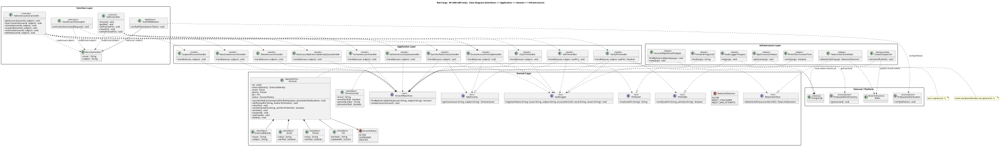

# 
Project Report

    <strong>Universidad Peruana de Ciencias Aplicadas</strong> 
    </img> 
    <strong>Ingeniería de Software - 2025-20</strong> 
    <strong>Aplicaciones para Dispositivos Móviles - 1807</strong> 
    <strong>Profesor: Jorge Luis Mayta Guillermo</strong> 
     <strong>Informe del Trabajo Final</strong>

    <strong>Startup: 
        Wapps</strong> 
    <strong>Producto: Red Carga</strong>

    <h3 align="center">Team Members:</h3>
    <table align="center">
        <tr>
            <th style="text-align:center;">Member</th>
            <th style="text-align:center;">Code</th>
        </tr>
        <tr>
            <td>Ariana Cecilia Agreda Sobrino</td>
            <td>u202315044</td>
        </tr>
        <tr>
            <td>Claudia Valeria Belledonne Espinoza</td>
            <td>u202210259</td>
        </tr>
        <tr>
            <td>Mauricio Daniel Elera Rodríguez</td>
            <td>u202313702</td>
        </tr>
        <tr>
            <td>María Patricia Hernández Uchuya</td>
            <td>u202311258</td>
        </tr>
        <tr>
            <td>Fabiola Del Rocio Saldaña Ayala</td>
            <td>u202313773</td>
        </tr>
    </table>

    <strong>Septiembre, 2025</strong>

 

    <h1 align="center">Registro de versiones del Informe</h1>
     
    <table align="center">
        <tr>
            <th>Versión</th>
            <th>Fecha</th>
            <th>Autor</th>
            <th>Descripción de modificaciones</th>
        </tr>
        <tr>
            <td>0</td>
            <td>3/09/2025</td>
            <td>Ariana Agreda</td>
            <td>Creación del reporte.</td>
        </tr>
    </table>

 

# Project Report Collaboration Insights
Link del repositorio del reporte: https://github.com/Wapps1/Project-Report

## TB1

 

# Contenido
[Student Outcome](#student-outcome)

- [Project Report](#project-report)
- [Project Report Collaboration Insights](#project-report-collaboration-insights)
  - [TB1](#tb1)
- [Contenido](#contenido)
- [Student Outcome](#student-outcome)
- [Objetivos SMART](#objetivos-smart)
- [Capítulo I: Presentación](#capítulo-i-presentación)
  - [1.1. Startup Profile](#11-startup-profile)
    - [1.1.1. Descripción de la Startup](#111-descripción-de-la-startup)
    - [1.1.2. Perfiles de integrantes del equipo](#112-perfiles-de-integrantes-del-equipo)
  - [1.2. Solution Profile](#12-solution-profile)
    - [1.2.1. Antecedentes y problemática](#121-antecedentes-y-problemática)
    - [1.2.2. Lean UX Process](#122-lean-ux-process)
      - [1.2.2.1. Lean UX Problem Statements](#1221-lean-ux-problem-statements)
      - [1.2.2.2. Lean UX Assumptions](#1222-lean-ux-assumptions)
      - [1.2.2.3. Lean UX Hypothesis Statements](#1223-lean-ux-hypothesis-statements)
      - [1.2.2.4. Lean UX Canvas](#1224-lean-ux-canvas)
  - [1.3. Segmentos objetivo](#13-segmentos-objetivo)
    - [🎯 Segmento Objetivo #1: Personas o empresas que quieren transportar carga de forma interprovincial](#-segmento-objetivo-1-personas-o-empresas-que-quieren-transportar-carga-de-forma-interprovincial)
      - [📊 Aspectos Demográficos](#-aspectos-demográficos)
      - [🌍 Aspectos Geográficos](#-aspectos-geográficos)
      - [🧠 Aspectos Psicográficos](#-aspectos-psicográficos)
    - [🚛 Segmento Objetivo #2: Administradores de empresas que se encargan del transporte interprovincial de carga](#-segmento-objetivo-2-administradores-de-empresas-que-se-encargan-del-transporte-interprovincial-de-carga)
      - [📊 Aspectos Demográficos](#-aspectos-demográficos-1)
      - [🌍 Aspectos Geográficos](#-aspectos-geográficos-1)
      - [🧠 Aspectos Psicográficos](#-aspectos-psicográficos-1)
- [Capítulo II: Requirements Elicitation \& Analysis](#capítulo-ii-requirements-elicitation--analysis)
  - [2.1. Competidores](#21-competidores)
    - [2.1.1. Análisis competitivo](#211-análisis-competitivo)
    - [2.1.2. Estrategias y tácticas frente a competidores](#212-estrategias-y-tácticas-frente-a-competidores)
  - [2.2. Entrevistas](#22-entrevistas)
    - [2.2.1. Diseño de entrevistas](#221-diseño-de-entrevistas)
      - [**Segmento 1: Personas o empresas que quieren transportar carga de forma interprovincial**](#segmento-1-personas-o-empresas-que-quieren-transportar-carga-de-forma-interprovincial)
      - [**Segmento 2: Administradores de empresas que se encargan del transporte interprovincial de carga**](#segmento-2-administradores-de-empresas-que-se-encargan-del-transporte-interprovincial-de-carga)
    - [2.2.2. Registro de entrevistas](#222-registro-de-entrevistas)
    - [2.2.3. Análisis de entrevistas](#223-análisis-de-entrevistas)
  - [2.3. Needfinding](#23-needfinding)
    - [2.3.1. User Personas](#231-user-personas)
    - [2.3.2. User Task Matrix](#232-user-task-matrix)
    - [2.3.3. User Journey Mapping](#233-user-journey-mapping)
    - [2.3.4. Empathy Mapping](#234-empathy-mapping)
    - [2.3.5. Ubiquitous Language](#235-ubiquitous-language)
  - [2.4. Requirements Specification](#24-requirements-specification)
    - [2.4.1. User Stories](#241-user-stories)
    - [2.4.2. Impact Mapping](#242-impact-mapping)
    - [2.4.3. Product Backlog](#243-product-backlog)
  - [2.5. Strategic-Level Domain-Driven Design](#25-strategic-level-domain-driven-design)
    - [2.5.1. EventStorming](#251-eventstorming)
      - [2.5.1.1. Candidate Context Discovery](#2511-candidate-context-discovery)
      - [2.5.1.2. Domain Message Flows Modeling](#2512-domain-message-flows-modeling)
      - [2.5.1.3. Bounded Context Canvases](#2513-bounded-context-canvases)
    - [2.5.2. Context Mapping](#252-context-mapping)
    - [2.5.3. Software Architecture](#253-software-architecture)
      - [2.5.3.1. Software Architecture Context Level Diagrams](#2531-software-architecture-context-level-diagrams)
      - [2.5.3.2. Software Architecture Container Level Diagrams](#2532-software-architecture-container-level-diagrams)
      - [2.5.3.3. Software Architecture Deployment Diagrams](#2533-software-architecture-deployment-diagrams)
  - [2.6. Tactical-Level Domain-Driven Design](#26-tactical-level-domain-driven-design)
    - [2.6.X. Bounded Context: Nombre](#26x-bounded-context-nombre)
      - [2.6.X.1. Domain Layer](#26x1-domain-layer)
      - [2.6.X.2. Interface Layer](#26x2-interface-layer)
      - [2.6.X.3. Application Layer](#26x3-application-layer)
      - [2.6.X.4. Infrastructure Layer](#26x4-infrastructure-layer)
      - [2.6.X.5. Bounded Context Software Architecture Component Level Diagrams](#26x5-bounded-context-software-architecture-component-level-diagrams)
      - [2.6.X.6. Bounded Context Software Architecture Code Level Diagrams](#26x6-bounded-context-software-architecture-code-level-diagrams)
        - [2.6.X.6.1. Bounded Context Domain Layer Class Diagrams](#26x61-bounded-context-domain-layer-class-diagrams)
        - [2.6.X.6.2. Bounded Context Database Design Diagram](#26x62-bounded-context-database-design-diagram)
- [Conclusiones](#conclusiones)
  - [Conclusiones y recomendaciones](#conclusiones-y-recomendaciones)
- [Bibliografía](#bibliografía)
- [Anexos](#anexos)

  
 
 

# Student Outcome

 
 

# Objetivos SMART

# Capítulo I: Presentación

## 1.1. Startup Profile
### 1.1.1. Descripción de la Startup
### 1.1.2. Perfiles de integrantes del equipo

<table align="center" border="1" cellspacing="0" cellpadding="8" style="width: 90%; border-collapse: collapse;">
  <tr>
    <td style="width: 150px; text-align: center;">
      </img>
    </td>
      <td>
          
<strong>Ariana Agreda - u202315044</strong>

          

            Mi nombre es Ariana Agreda, tengo 19 años y soy estudiante del 6to ciclo de Ingeniería de Software en la UPC. Me considero una persona creativa, responsable y comprometida con cada tarea. Por ello, estoy dispuesta a dedicar un gran esfuerzo y apoyo para que logremos los mejores resultados para el proyecto.
          

    </td>
  </tr>
</table>

<table align="center" border="1" cellspacing="0" cellpadding="8" style="width: 90%; border-collapse: collapse;">
  <tr>
    <td style="width: 150px; text-align: center;">
      </img>
    </td>
      <td>
          
<strong>Claudia Belledonne - u202210259</strong>

          

            Mi nombre es Claudia Belledonne, tengo 20 años y me encuentro en mi tercer año de Ingeniería de Software en la UPC.
            En general, soy alguien creativa, responsable, dedicada y manejo bien el hacer muchas tareas a la vez.
            Para este trabajo, me comprometo a brindar mi máximo esfuerzo y dedicación.
          

    </td>
  </tr>
</table>

<table align="center" border="1" cellspacing="0" cellpadding="8" style="width: 90%; border-collapse: collapse;">
  <tr>
    <td style="width: 150px; text-align: center;">
      </img>
    </td>
      <td>
          
<strong>Mauricio Elera - u202313702</strong>

          

            Mi nombre es Mauricio Elera, tengo 19 años y soy estudiante del 6to ciclo de Ingeniería de Software en la UPC. Me considero una persona proactiva, organizada y con muchas ganas de aprender. Estoy comprometido con el trabajo en equipo y dispuesto a aportar todo lo necesario para que nuestro proyecto sea exitoso.
          

    </td>
  </tr>
</table>

<table align="center" border="1" cellspacing="0" cellpadding="8" style="width: 90%; border-collapse: collapse;">
  <tr>
    <td style="width: 150px; text-align: center;">
      </img>
    </td>
      <td>
          
<strong>María Hernández - u202311258</strong>

          

             Estudio la carrera de Ingeniería de Software, tengo 19 años y actualmente me encuentro cursando el sexto ciclo de dicha carrera. Tengo conocimientos en C++, C#, Python, Java, HTML, CSS, JavaScript y Vue. Me considero una persona con responsabilidad, optimismo y honestidad, cualidades que considero fundamentales para una colaboración efectiva en equipo y un buen desarrollo en este proyecto.
          

    </td>
  </tr>
</table>
<table align="center" border="1" cellspacing="0" cellpadding="8" style="width: 90%; border-collapse: collapse;">
  <tr>
    <td style="width: 150px; text-align: center;">
      </img>
    </td>
      <td>
          
<strong>Fabiola Saldaña - u202313773</strong>

          

             Mi nombre es Fabiola Saldaña, tengo 19 años y actualmente curso el 6to ciclo de la carrera de Ingeniería de Software. En lo personal busco aprender constantemente y me considero alguien responsable, proactiva y dedicada con mis trabajos. Es por ello que me comprometo apoyar al equipo con mis habilidades y conocimientos para alcanzar los mejores resultados.
          

    </td>
  </tr>
</table>

## 1.2. Solution Profile
### 1.2.1. Antecedentes y problemática

**What (Qué)**

- ¿Cuál es el problema? 
Los clientes que necesitan transportar carga entre provincias enfrentan procesos informales, poco transparentes y fragmentados para cotizar, pagar, documentar y rastrear sus envíos. En muchos casos, esto conlleva demoras, malos entendidos, falta de confianza, o pagos fuera de lo pactado.

- ¿Cuál es la relación con la persona en cuestión? 
El producto busca facilitar la vida de dos perfiles; el cliente que requiere enviar carga (sea empresa o persona natural), y el proveedor de transporte que quiere ofrecer su servicio de forma formal, eficiente, y con garantías de pago y cumplimiento.

**When (Cuándo)**

- ¿Cuándo sucede el problema? 
Sucede cuando un cliente necesita enviar carga interprovincial, al momento de solicitar cotizaciones, coordinar rutas, verificar medidas y/o peso, asegurarse de la documentación, negociar cambios de último momento, hacer seguimiento del envío, etc.

- ¿Cuándo utiliza el cliente el producto? 
Al crear su cuenta, configurar sus datos, querer realizar una solicitud de envío, comparar cotizaciones, aceptar un trato y realiza el pago. Durante el transporte, para ver trazabilidad. Luego de la entrega, para calificar al proveedor.

**Where (Dónde)**

- ¿Dónde está el cliente cuando usa el producto? 
Normalmente desde su teléfono móvil, desde donde se encuentre, como en casa, oficina, almacén, o mientras organiza logística. No necesariamente en los puntos de carga o descarga, aunque puede estar allí para revisar la carga o coordinar los detalles.

- ¿A dónde se dirige? 
Se dirige a completar el flujo que va desde solicitar envío hasta la entrega final de la carga, con todas las etapas intermedias funcionando bien: cotizaciones, aceptación, pago, documentación, seguimiento, entrega.

- ¿Dónde surge el problema? 
Surge en los momentos de coordinación, al enviar fotos y medidas, al negociar precio y ruta, al momento del pago, y sobre todo la falta de trazabilidad y documentación cuando el envio ya está en curso.

**Who (Quién)**

- ¿Quiénes están involucrados? 
EL cliente (empresa o persona natural) que envía la carga, el proveedor de transporte, el personal de logística del proveedor (los que materialmente transportan).

- ¿A quiénes les sucede el problema? 
Clientes sin experiencia en transporte formal, que dependen de cotizaciones informales y proveedores que no tienen un sistema digital para gestionar rutas, pagos, documentación, seguimiento.

- ¿Quién lo utilizará? 
Clientes quienes necesitan transporte interprovincial y proveedores de transporte con flotas.

**Why (Por qué)**

- ¿Cuál es la causa del problema? 
Falta de formalización en muchos servicios de transporte interprovincial, las cuales en su mayoría se coordinan por teléfono, WhatsApp, sin garantía de pagos y documentación. Además de la dificultad para estimar costos reales cuando datos de peso, volumen, rutas, puntos intermedios no están estandarizados. También la falta de transparencia sobre el estado del envío "¿dónde está mi carga?" o "¿cuándo llegará?.

**How (Cómo)**

- ¿En qué condiciones los clientes usan nuestro producto? 
Los clientes usan el aplicativo cuando necesitan enviar carga de forma segura y rápida, desde oficina o móvil. Buscan trazabilidad, pagos documentados y coordinación confiable, evitando la informalidad en envíos puntuales o recurrentes.

- ¿Cómo nos conocieron los compradores? 
Los compradores llegan por recomendaciones, búsquedas en internet y redes sociales. También descubren la solución a través de transportistas asociados, asociaciones comerciales o campañas de publicidad que destacan seguridad, trazabilidad y pagos confiables.

- ¿Cómo prefieren los lectores acceder a nuestro contenido? 
Prefieren un aplicativo móvil fácil de usar, con notificaciones, formularios simples y chat integrado.

- ¿Qué llevó a la persona a llegar a esta situación? 
Necesitan resolver envíos urgentes y seguros tras experiencias negativas con fraudes o retrasos. La falta de alternativas digitales transparentes los empuja a buscar un canal formal que garantice seguridad y eficiencia.

**How much (cuánto)**

Según el Anuario Estadístico del MTC (2024), el número de empresas autorizadas para el transporte terrestre de carga por carretera registró una disminución del 1.5% respecto al 2023, equivalente a 1 907 unidades menos. Si bien esta reducción parece moderada, evidencia la inestabilidad en el sector, marcado por ciclos anuales de aumentos y descensos. Este comportamiento irregular refleja los desafíos de sostenibilidad en el transporte formal, especialmente para pequeñas empresas que enfrentan costos elevados y competencia con servicios informales.

Asimismo, en el año 2024 se realizaron 1 109 510 intervenciones a vehículos de carga. De estas, el 98.4% cumplió con los reglamentos vigentes, mientras que el 1.6% fue calificado como "No conforme". Aunque la cifra de incumplimiento parece mínima, representa 18 298 casos que ponen en riesgo la seguridad y la confianza en el sector. Cabe destacar que, en el período 2020–2024, estos incumplimientos descendieron significativamente, pasando de 41 476 a 18 298 casos, lo que indica un avance en fiscalización, pero también la persistencia de brechas que requieren soluciones tecnológicas y de control más efectivas.

### 1.2.2. Lean UX Process
#### 1.2.2.1. Lean UX Problem Statements

Nuestro servicio ofrece un aplicativo móvil que conecta a clientes que desean transportar carga interprovincial con proveedores que cuentan con flotas disponibles para realizar dicho servicio. La aplicación busca centralizar solicitudes, cotizaciones, pagos y trazabilidad en un solo espacio confiable.

Hemos observado un factor crítico que afecta la confianza y satisfacción de los usuarios: actualmente, el proceso de solicitar transporte y coordinar con proveedores es informal, fragmentado y poco transparente. Los clientes enfrentan dificultades para obtener cotizaciones rápidas y confiables, mientras que los proveedores carecen de herramientas para gestionar sus flotas, pagos y documentación de manera eficiente. Esto genera demoras, desconfianza en los pagos y problemas en la trazabilidad de la carga.

¿Cómo podemos mejorar la confianza, rapidez y transparencia en la gestión del transporte interprovincial, asegurando que tanto clientes como proveedores cumplan sus objetivos con una experiencia clara, segura y satisfactoria dentro del aplicativo móvil?

#### 1.2.2.2. Lean UX Assumptions

**Business Assumptions**

- Creo que mis clientes necesitan una forma rápida, segura y confiable de coordinar el transporte de carga interprovincial con proveedores verificados.
- Estas necesidades se pueden resolver con un aplicativo móvil que centralice solicitudes, cotizaciones en tiempo real, pagos seguros y trazabilidad mediante geolocalización.
- Mis clientes iniciales serán pequeñas y medianas empresas, comerciantes y personas naturales que requieren enviar carga entre provincias.
- El valor #1 que un cliente quiere de mi servicio es confianza y transparencia en el proceso de contratación y transporte.
- El cliente también puede obtener beneficios adicionales como rapidez en recibir cotizaciones, facilidad de pago, gestión automatizada de documentos de transporte y soporte en disputas.
- Voy a adquirir la mayoría de mis clientes a través de campañas digitales, asociaciones con cámaras de comercio, y marketing de boca a boca de los primeros usuarios satisfechos.
- Haré dinero a través de una comisión del 1% sobre cada transacción pagada dentro de la app.
- Mi competencia principal en el mercado serán servicios tradicionales de transporte y marketplaces informales de transporte.
- Los venceremos debido a la seguridad en pagos, la trazabilidad de la carga, la facilidad de uso y la formalidad al emitir documentos automáticamente.
- Mi mayor riesgo de producto es que los usuarios intenten realizar el pago fuera de la app para evitar la comisión.
- Resolveremos esto a través de beneficios exclusivos solo disponibles con el pago en la app.

**User Assumptions**

- ¿Quién es el usuario? 
Clientes que necesitan transportar carga interprovincial y proveedores.
- ¿Dónde encaja nuestro producto en su trabajo o vida? 
En la organización de sus envíos y operaciones logísticas, reemplazando la informalidad actual por un sistema digital confiable.
- ¿Qué problemas tiene nuestro producto que resolver? 
Falta de transparencia en precios, informalidad en la documentación, inseguridad en pagos y dificultad en el seguimiento de la carga.
- ¿Cuándo y cómo es nuestro producto usado? 
Los clientes lo usan al generar solicitudes de transporte y pagar servicios; los proveedores al responder cotizaciones, gestionar flotas y coordinar envíos. Ambos lo usan en tiempo real para chatear y dar seguimiento a cargas en tránsito.
- ¿Qué características son importantes? 
Cotizaciones en tiempo real, chat seguro, pasarela de pagos integrada, emisión automática de documentos, trazabilidad por geolocalización, calificaciones y reputación.
- ¿Cómo debe verse nuestro producto y cómo comportarse? 
Debe tener una interfaz móvil intuitiva, clara y confiable, con notificaciones oportunas, navegación sencilla y elementos visuales que transmitan seguridad y formalidad.

**Feature Assumptions**

- Creemos que la aplicación debe incluir una pasarela de pagos segura que incentive a los clientes a realizar transacciones dentro de la app, garantizando que se cobre la comisión.
- Creemos que la aplicación debe contar con un sistema de geolocalización en tiempo real para que los clientes puedan seguir la trazabilidad de sus envíos.
- Creemos que la aplicación debe generar documentos automáticos (guía de remisión y guía de transportista) tras el pago, lo que dará formalidad y confianza al servicio.
- Creemos que la aplicación debe permitir chat en tiempo real entre cliente y proveedor para coordinar ajustes de última hora en sus envíos.
- Creemos que la aplicación debe ofrecer un sistema de calificaciones y comentarios para aumentar la confianza entre usuarios.

#### 1.2.2.3. Lean UX Hypothesis Statements

- Creemos que los clientes usarán la pasarela de pagos dentro del aplicativo móvil cuando vean que al hacerlo obtienen automáticamente sus documentos de transporte. 
Sabremos que hemos tenido éxito 
Cuando al menos el 80% de los pagos de tratos formales se realicen dentro de la app y recibamos comentarios positivos sobre la facilidad del trámite de documentos.
- Creemos que los clientes valorarán la trazabilidad en tiempo real de su carga a través de geolocalización. 
Sabremos que hemos tenido éxito 
Cuando al menos el 70% de los clientes consulte la vista de trazabilidad en cada envío y un 60% de ellos la califique como “muy útil”.
- Creemos que el sistema de calificaciones aumentará la confianza entre clientes y proveedores. 
Sabremos que hemos tenido éxito 
Cuando al menos el 50% de los usuarios califiquen después de un trato formal y observemos un incremento en la cantidad de solicitudes aceptadas sin necesidad de negociación extensa.
- Creemos que el chat en tiempo real entre cliente y proveedor facilitará la coordinación y reducirá disputas. 
Sabremos que hemos tenido éxito 
Cuando la tasa de disputas disminuya en al menos un 20% respecto a tratos sin uso de chat activo y los usuarios lo reporten como una herramienta clave para coordinar detalles.

#### 1.2.2.4. Lean UX Canvas

## 1.3. Segmentos objetivo

### 🎯 Segmento Objetivo #1: Personas o empresas que quieren transportar carga de forma interprovincial

#### 📊 Aspectos Demográficos
- **Sexo:** Masculino y Femenino
- **Edades:** 18 a 65+ años (personas naturales) y responsables de logística/administración en empresas
- **Nivel socioeconómico:** Clases A, B, C, D y E

#### 🌍 Aspectos Geográficos
- **Nacionalidad:** Peruana
- **Zona geográfica:** Urbana y rural
- **Departamento:** Todos los departamentos del Perú (incluida Lima Metropolitana y Callao)

#### 🧠 Aspectos Psicográficos
- Valoran comparar precios y tiempos de entrega para optimizar costo/beneficio
- Buscan formalidad (emisión de guía de remisión cuando corresponda) y trazabilidad en tiempo real
- Prefieren procesos simples desde el móvil: solicitud → cotización → trato → pago en la app
- Confían en proveedores con buena reputación, soporte en chat y políticas claras de cambios
- **Perfil de uso:** envíos puntuales (personas) y recurrentes (pymes/empresas), con necesidades de plantilla para ítems frecuentes

---

### 🚛 Segmento Objetivo #2: Administradores de empresas que se encargan del transporte interprovincial de carga

#### 📊 Aspectos Demográficos
- **Sexo:** Masculino y Femenino
- **Edades:** 21 a 65+ años (conductores y administradores/operadores de flota)
- **Nivel socioeconómico:** Clases A, B, C, D y E (predominio de micro, pequeñas y medianas empresas; compatible con grandes flotas)

#### 🌍 Aspectos Geográficos
- **Nacionalidad:** Peruana
- **Zona geográfica:** Urbana y rural
- **Departamento:** Todos los departamentos del Perú (incluida Lima Metropolitana y Callao)

#### 🧠 Aspectos Psicográficos
- Quieren captar demanda formal y estable para mejorar ocupación y flujo de caja
- Valoran una app que facilite cotizar rápido, chatear con el cliente y gestionar documentos (guía de transportista)
- Necesitan activar geolocalización para generar confianza y cumplir con hitos operativos (recogido/en ruta/entregado)
- Prefieren liquidaciones claras en la plataforma (99% al proveedor, 1% fee) y visibilidad de pagos
- **Perfil operativo:** flotas pequeñas y medianas como núcleo, con soporte para grandes operadores y subcontratación controlada

 
 

<!-- Capítulo II: Requirements Elicitation & Analysis -->
<h1>2.1. Competidores</h1>
<h2>2.1.1. Análisis competitivo</h2>

<table border="1" cellspacing="0" cellpadding="6" width="100%">
  <tr>
    <th colspan="6">Competitive Analysis Landscape</th>
  </tr>

  <tr>
    <td align="center"><b>¿Por qué llevar a cabo este análisis?</b></td>
    <td colspan="5" align="center">
      Identificar cómo <b>RedCarga</b> puede diferenciarse en el mercado peruano de carga interprovincial frente a jugadores existentes,
      qué funcionalidades y tácticas priorizar, y qué riesgos/amenazas debemos mitigar.
    </td>
  </tr>

  <tr>
    <th colspan="2" align="center">Nombre y logo</th>
    <th align="center">Su startup: <b>RedCarga</b></th>
    <th align="center">Competidor 1: <b>Efletex (Perú)</b></th>
    <th align="center">Competidor 2: <b>DeltaX (LatAm)</b></th>
    <th align="center">Competidor 3: <b>MiCarga (Tracklink, Perú)</b></th>
  </tr>

  <!-- PERFIL -->
  <tr>
    <th rowspan="2" align="center">Perfil</th>
    <td align="center"><b>Overview</b></td>
    <td>
      

        <b>RedCarga</b> es una app móvil que conecta empresas/usuarios que envían <b>carga pesada interprovincial</b> con transportistas,
        con experiencia en tiempo real: solicitud con fotos (IA estima medidas), cotizaciones instantáneas, negociación por chat,
        pago in-app, <b>documentos automáticos</b> y <b>tracking GPS obligatorio</b> tras el pago.
      

    </td>
    <td>
      

        Plataforma peruana de transporte de carga pesada (2018). Conecta generadores de carga con transportistas vía web/móvil,
        modernizando la logística con comunidades de transporte. Empezó B2B y se amplió a pymes/usuarios.
      

    </td>
    <td>
      

        Plataforma digital B2B (2020) conocida como “Uber de camiones” andino. Ofrece software integral para gestionar logística
        end-to-end y opera en varios países con marketplace regional unificado y respaldo de inversión.
      

    </td>
    <td>
      

        Plataforma peruana creada por <b>Tracklink</b> (GPS vehicular) para conectar clientes y transportistas a nivel nacional.
        Comunidad online + app móvil; los transportistas ofertan/aceptan servicios “de A a B”.
      

    </td>
  </tr>

  <tr>
    <td align="center"><b>Ventaja competitiva ¿Qué valor ofrece?</b></td>
    <td>
      <ul>
        <li><b>1% de comisión</b> (solo si el pago es in-app) → mejores tarifas netas y retención en la plataforma.</li>
        <li><b>Documentos obligatorios automáticos</b> (guía de remisión y de transportista) tras el pago.</li>
        <li><b>IA</b> para estimar medidas desde fotos + plantillas reutilizables.</li>
        <li>Enfoque <b>Perú</b> (adaptación rápida a normativa local).</li>
      </ul>
    </td>
    <td>
      <ul>
        <li>Pionero local; conocimiento del mercado peruano.</li>
        <li>Ahorro de tiempo/costos; comparación de ofertas.</li>
        <li>Seguimiento GPS 24/7; verificación y reputación.</li>
        <li>Soporte con asesores; menos viajes en vacío.</li>
      </ul>
    </td>
    <td>
      <ul>
        <li>Digitaliza procesos end-to-end (licitaciones, planificación, tracking).</li>
        <li>Homologación/seguridad; alertas y documentación digital.</li>
        <li>Gran red regional; cargas de retorno.</li>
        <li>Fintech: anticipos de pago y beneficios.</li>
      </ul>
    </td>
    <td>
      <ul>
        <li>Matching con <b>cotización y cierre</b> en línea.</li>
        <li><b>Seguimiento GPS</b> con el stack Tracklink.</li>
        <li>App móvil nativa para transportistas (Android/iOS).</li>
      </ul>
    </td>
  </tr>

  <!-- PERFIL DE MARKETING -->
  <tr>
    <th rowspan="2" align="center">Perfil de marketing</th>
    <td align="center"><b>Mercado objetivo</b></td>
    <td>
      <ul>
        <li><b>Perú</b>, rutas interprovinciales.</li>
        <li>Empresas medianas/grandes y transportistas verificados (heavy cargo).</li>
        <li>Pymes con envíos recurrentes y usuarios con envíos puntuales de alto volumen.</li>
      </ul>
    </td>
    <td>
      <ul>
        <li>Perú; carga pesada interprovincial (≥1 t).</li>
        <li>Corporativos (minería, consumo, logística) → pymes/mudanzas.</li>
        <li>No última milla/paquetería ligera.</li>
      </ul>
    </td>
    <td>
      <ul>
        <li>Medianas y grandes empresas (bebidas, puertos, agro, construcción).</li>
        <li>Región andina + México; oferta: empresas y choferes independientes.</li>
      </ul>
    </td>
    <td>
      <ul>
        <li>Perú; cargas ligeras-medianas-pesadas (foco operativo nacional).</li>
        <li>Transportistas con GPS Tracklink y clientes que requieren visibilidad.</li>
      </ul>
    </td>
  </tr>

  <tr>
    <td align="center"><b>Estrategias de marketing</b></td>
    <td>
      <ul>
        <li>Lanzamiento por <b>corredores</b> (Lima–Arequipa, Lima–Piura) con clientes ancla.</li>
        <li><b>Onboarding asistido</b> a transportistas (WhatsApp/llamadas) + verificación rápida.</li>
        <li>Incentivos a <b>pago in-app</b> (documentos + tracking solo tras pagar).</li>
        <li>Narrativa “<b>hecho en Perú</b>”, casos de uso locales y PR sectorial.</li>
      </ul>
    </td>
    <td>
      <ul>
        <li>PR y estudios de mercado; prensa local.</li>
        <li>RR. SS. (comunidad “amigos ruteros”, tutoriales, promos).</li>
        <li>Activaciones B2B y testimonios de ahorros.</li>
      </ul>
    </td>
    <td>
      <ul>
        <li>Ventas consultivas y demos; casos de éxito y logos.</li>
        <li>PR en ecosistema startup; redes para captar transportistas.</li>
        <li>Incentivos (anticipos/beneficios) y oficinas locales.</li>
      </ul>
    </td>
    <td>
      <ul>
        <li>Uso de canales Tracklink (base instalada GPS) y prensa logística.</li>
        <li>Redes sociales para captar oferta y demanda.</li>
        <li>Promesa de seguridad/visibilidad 24/7.</li>
      </ul>
    </td>
  </tr>

  <!-- PERFIL DEL PRODUCTO -->
  <tr>
    <th rowspan="3" align="center">Perfil del producto</th>
    <td align="center"><b>Productos &amp; Servicios</b></td>
    <td>
      <ul>
        <li>Marketplace móvil: solicitud por ítem (fotos→<b>IA</b>→medidas), ruta con puntos intermedios.</li>
        <li><b>Cotizaciones en tiempo real</b>, chat, estado <i>trato</i> y <i>trato formal</i> tras pagar.</li>
        <li><b>Documentos</b> automáticos (cliente/proveedor) y <b>tracking</b> obligatorio.</li>
        <li>Ajustes post-pago: top-ups, reembolsos, y recálculo del 1%.</li>
      </ul>
    </td>
    <td>
      <ul>
        <li>Marketplace: órdenes, chat/alertas, calificaciones.</li>
        <li>Tracking en vivo.</li>
        <li>GPS/fleet propio (reportes, cumplimiento SUTRAN/OSINERGMIN).</li>
        <li>Vertical de mudanzas.</li>
      </ul>
    </td>
    <td>
      <ul>
        <li><b>SaaS TMS</b> configurable (roles, dashboards, KPIs; ML para matching).</li>
        <li>Marketplace por invitación; compartir cargas/rutas entre clientes.</li>
        <li>APIs/integraciones; <b>fintech</b> (anticipos/factoring).</li>
      </ul>
    </td>
    <td>
      <ul>
        <li>Marketplace: clientes publican; transportistas ofertan y cierran en línea.</li>
        <li>Tracking en tiempo real con GPS de Tracklink.</li>
      </ul>
    </td>
  </tr>

  <tr>
    <td align="center"><b>Precios &amp; Costos</b></td>
    <td>
      <ul>
        <li><b>1% de comisión</b> solo si el pago se realiza en la app.</li>
        <li>Con top-ups o reembolsos, el 1% se <b>recalcula</b> sobre el monto final.</li>
        <li>Documentos/tracking se habilitan <b>solo tras el pago</b> (incentivo anti “cerrar por fuera”).</li>
      </ul>
    </td>
    <td>
      <ul>
        <li>Registro/uso básico gratis.</li>
        <li>Comisión al transportista por flete (rango de mercado ~5–10%).</li>
        <li>Ahorros reportados para clientes; GPS con precio adicional.</li>
      </ul>
    </td>
    <td>
      <ul>
        <li>SaaS: suscripción/licenciamiento según tamaño/uso.</li>
        <li>Marketplace: comisión por transacción.</li>
        <li>Ingresos fintech (descuentos/intereses de anticipos).</li>
      </ul>
    </td>
    <td>
      <ul>
        <li>No publica comisión/estructura de precios en canales abiertos.</li>
      </ul>
    </td>
  </tr>

  <tr>
    <td align="center"><b>Canales de distribución (Web y/o Móvil)</b></td>
    <td>
      <ul>
        <li><b>Móvil (Android)</b> como canal principal.</li>
        <li>Panel web para empresas (posterior/roadmap).</li>
      </ul>
    </td>
    <td>
      <ul>
        <li>Web + apps Android/iOS (&gt;5k descargas Android).</li>
        <li>24/7; notificaciones en tiempo real.</li>
        <li>Soporte telefónico y oficina en Lima; números MX/CO/AR.</li>
      </ul>
    </td>
    <td>
      <ul>
        <li>Web SaaS (empresas) + apps Android/iOS (&gt;10k descargas).</li>
        <li>Tracking resiliente; equipos locales por país.</li>
        <li>Integraciones vía API con ERPs.</li>
      </ul>
    </td>
    <td>
      <ul>
        <li>Web (captación) + <b>MiCarga Transportista</b> en Android/iOS.</li>
      </ul>
    </td>
  </tr>

  <!-- SWOT -->
  <tr>
    <th rowspan="4" align="center">Análisis SWOT</th>
    <td align="center"><b>Fortalezas</b></td>
    <td>
      <ul>
        <li><b>Costos</b>: 1% → propuesta agresiva para atraer oferta/demanda.</li>
        <li><b>Compliance</b>: documentos automáticos + tracking obligatorio.</li>
        <li><b>UX</b> simple y móvil-first; IA en captura de medidas.</li>
        <li><b>Local</b>: velocidad para adaptar normativa peruana.</li>
      </ul>
    </td>
    <td>
      <ul>
        <li>First mover en Perú; red local validada.</li>
        <li>Funcionalidades adaptadas a normativa local.</li>
        <li>Seguridad: verificación + GPS + reputación.</li>
        <li>Soporte personalizado y servicios complementarios (GPS).</li>
      </ul>
    </td>
    <td>
      <ul>
        <li>Solución integral TMS + Marketplace.</li>
        <li>&gt;200 empresas; 42k transportistas, 240k viajes monitoreados.</li>
        <li>Seguridad/homologación y analítica avanzada.</li>
        <li>Respaldo VC; beneficios y fintech.</li>
      </ul>
    </td>
    <td>
      <ul>
        <li>Respaldo Tracklink (confianza + infraestructura GPS).</li>
        <li>Matching con cotización/cierre en app.</li>
        <li>Apps móviles nativas para operación en campo.</li>
      </ul>
    </td>
  </tr>

  <tr>
    <td align="center"><b>Debilidades</b></td>
    <td>
      <ul>
        <li><b>Efecto red</b> inicial limitado (liquidez por corredor).</li>
        <li>Riesgo de <b>desintermediación</b> si no se incentiva pago in-app.</li>
        <li>Necesidad de soporte 24/7 y verificación robusta.</li>
      </ul>
    </td>
    <td>
      <ul>
        <li>Menor escala vs actores regionales.</li>
        <li>Menor financiación; posible menor sofisticación analítica.</li>
        <li>Foco amplio (B2B + mudanzas) diluye esfuerzos.</li>
        <li>Presencia internacional limitada.</li>
      </ul>
    </td>
    <td>
      <ul>
        <li>Menos accesible para pequeños/espóradicos.</li>
        <li>Plataforma compleja; curva de aprendizaje.</li>
        <li>Marketplace por invitación limita crecimiento.</li>
        <li>Riesgos de adopción digital multi-país.</li>
      </ul>
    </td>
    <td>
      <ul>
        <li>Información pública limitada sobre comisiones/precios.</li>
        <li>Foco mixto (ligera-mediana-pesada) puede diluir heavy cargo.</li>
        <li>Dependencia del ecosistema GPS Tracklink.</li>
      </ul>
    </td>
  </tr>

  <tr>
    <td align="center"><b>Oportunidades</b></td>
    <td>
      <ul>
        <li>Formalización (guías electrónicas) y digitalización del sector.</li>
        <li>Nichos de heavy cargo especializado y pymes regionales.</li>
        <li>Alianzas con gremios, terminales, aseguradoras.</li>
      </ul>
    </td>
    <td>
      <ul>
        <li>Digitalización/guías electrónicas; captar independientes.</li>
        <li>Verticales clave: minería, agro, retail.</li>
        <li>Expansión andina y alianzas (seguros, combustible, MTC).</li>
      </ul>
    </td>
    <td>
      <ul>
        <li>Mercado LatAm grande; nuevos países/industrias.</li>
        <li>Profundizar fintech (seguros, leasing, puntos).</li>
        <li>Alianzas gobierno/gremios; monetizar insights.</li>
      </ul>
    </td>
    <td>
      <ul>
        <li>Integrar documentación electrónica para diferenciarse.</li>
        <li>Captar pymes y regiones poco digitalizadas.</li>
        <li>Aprovechar base Tracklink para escalar oferta.</li>
      </ul>
    </td>
  </tr>

  <tr>
    <td align="center"><b>Amenazas</b></td>
    <td>
      <ul>
        <li>Efletex/DeltaX/MiCarga con base instalada o escala.</li>
        <li>Cambios regulatorios/seguros que eleven barreras.</li>
        <li>Desintermediación cliente-transportista.</li>
      </ul>
    </td>
    <td>
      <ul>
        <li>Competidores tecnológicos y nuevos entrantes.</li>
        <li>Actores tradicionales/soluciones internas.</li>
        <li>Cambios regulatorios; resistencia de transportistas.</li>
      </ul>
    </td>
    <td>
      <ul>
        <li>Competencia local ágil y jugadores globales.</li>
        <li>Entornos regulatorios diversos.</li>
        <li>Preferencia por soluciones locales; incidentes de seguridad.</li>
      </ul>
    </td>
    <td>
      <ul>
        <li>DeltaX (escala) y Efletex (arraigo local).</li>
        <li>Nuevos entrantes móviles con UX simple y costos bajos.</li>
      </ul>
    </td>
  </tr>
</table>

### 2.1.2. Estrategias y tácticas frente a competidores

<h4>1) Palancas de diferenciación (Producto, Precio, Plaza, Promoción)</h4>
<ul>
  <li><b>Producto:</b>
    <ul>
      <li><b>Documentos automáticos</b> (guía de remisión/transportista) <u>solo</u> al pagar en-app → reduce fricción y asegura uso del pago in-app.</li>
      <li><b>IA en captura</b> (fotos → medidas sugeridas) + <b>plantillas reutilizables</b> por ítem/ruta para acelerar nuevas solicitudes.</li>
      <li><b>Tracking obligatorio</b> pospago con alertas (salida, llegada a hitos, ETA) y tableros móviles simples para el cliente.</li>
      <li><b>Antidesintermediación:</b> ocultar teléfono/email hasta pago; chat con detección de intento de compartir contacto; <i>beneficios</i> (docs, tracking, soporte) solo si pagan en la app.</li>
    </ul>
  </li>
  <li><b>Precio:</b>
    <ul>
      <li><b>Comisión plana 1%</b> (solo in-app). Mensaje: “Mejor tarifa neta para ambos”.</li>
      <li><b>Incentivos</b>: cantidad limitada de cotizaciones gratuitas de bienvenida para los clientes.</li>
    </ul>
  </li>
  <li><b>Plaza (canales):</b>
    <ul>
      <li><b>Móvil-first</b> (Android). Panel web ligero para empresas (seguimiento y reportes) en fase 2.</li>
      <li><b>Alianzas</b>: gremios/terminales, patios logísticos, cámaras regionales, aseguradoras (seguro básico ligado al pago in-app), pasarela local de bajo costo.</li>
    </ul>
  </li>
  <li><b>Promoción:</b>
    <ul>
      <li><b>Hecho en Perú</b> + cumplimiento local (documentos automáticos) como narrativa central.</li>
      <li><b>Onboarding asistido</b> a transportistas (WhatsApp/llamadas) + jornadas presenciales en terminales.</li>
      <li>Contenido simple: “cómo cotizar”, “cómo activar GPS”, “cómo emitir guías en 1 toque”.</li>
    </ul>
  </li>
</ul>

 

## 2.2. Entrevistas
### 2.2.1. Diseño de entrevistas

#### **Segmento 1: Personas o empresas que quieren transportar carga de forma interprovincial**

**Dirigido a:** Personas o representantes de empresas que desean enviar carga interprovincial y buscan seleccionar entre distintas propuestas el servicio más adecuado. 
**Objetivo:** Conocer las necesidades, prioridades y problemas de quienes desean transportar carga interprovincialmente, identificando los procesos más complicados o lentos, así como sus expectativas frente a una herramienta digital como Red Carga. 
**Preguntas:** 
**Preguntas:**  
1. ¿Cuál es su nombre completo?  
2. ¿Qué edad tiene?  
3. ¿En qué provincia reside actualmente?  
4. ¿A qué se dedica (ocupación/empresa)?  
5. ¿Con qué frecuencia realiza envíos interprovinciales y qué tipo de carga envía normalmente?  
6. ¿Cómo busca y selecciona actualmente una empresa de transporte? (canales, criterios).  
7. ¿Cuánto tiempo le toma en promedio encontrar una empresa que se ajuste a sus necesidades?  
8. ¿Qué canales utiliza para contactar a la empresa (teléfono, redes sociales, página web, presencial, etc.)?  
9. ¿Cuántas cotizaciones suele solicitar antes de decidirse por una empresa?  
10. ¿Qué tan fácil o difícil le resulta obtener una cotización adecuada?  
11. ¿Qué documentos o requisitos legales suele solicitarle la empresa de transporte y qué tan complicados le resultan?  
12. ¿Qué medio de pago utiliza normalmente y qué problemas ha tenido en este proceso?  
13. ¿Qué tan importante es para usted la seguridad, el precio, la rapidez y la atención al cliente en este servicio?  
14. ¿Qué experiencias negativas ha tenido en el pasado (demoras, pérdidas, mal servicio, etc.)?  
15. Si existiera una aplicación que centralice cotizaciones, contratos, pagos y seguimiento, ¿qué funcionalidades consideraría imprescindibles?  

#### **Segmento 2: Administradores de empresas que se encargan del transporte interprovincial de carga**

**Dirigido a:** Personas que administran una empresa de transporte interprovincial y desean agilizar sus procesos de conexión con clientes y cotizaciones. 
**Objetivo:** Comprender los procesos internos que siguen los administradores desde el primer contacto con el cliente hasta la entrega final, identificando fallas, tiempos, impacto en la calidad del servicio, así como sus expectativas frente a una herramienta digital como Red Carga. 
**Preguntas:** 
1. ¿Cuál es su nombre completo?  
2. ¿Qué edad tiene?  
3. ¿En qué provincia opera principalmente su empresa?  
4. ¿Cuál es su cargo u ocupación dentro de la empresa?  
5. ¿Qué tipo de carga gestionan con mayor frecuencia y qué volumen promedio manejan en sus envíos?  
6. ¿Cómo es actualmente el proceso desde que un cliente solicita información hasta la confirmación de un envío?  
7. ¿Cuánto suele demorar este proceso y qué pasos generan más retrasos?  
8. ¿Qué canales utilizan para captar clientes y cuáles resultan más efectivos?  
9. ¿Qué factores influyen más en la decisión de un cliente al contratarlos (precio, tiempo, seguridad, reputación)?  
10. ¿Qué problemas o dificultades se presentan con mayor frecuencia al coordinar un envío?  
11. ¿Qué tipo de documentos o trámites legales deben gestionarse en cada envío y qué dificultades enfrentan con ellos?  
12. ¿Qué dificultades han tenido en el manejo de contratos, comprobantes de pago o facturación?  
13. ¿Qué aspectos considera más débiles en la comunicación actual con los clientes?  
14. ¿Cómo gestionan actualmente el seguimiento de la carga y qué tan importante es la trazabilidad en tiempo real?  
15. Si existiera una aplicación que le permita centralizar en un solo lugar la gestión de cotizaciones, contratos, pagos y seguimiento de envíos, ¿qué funcionalidades le resultarían más valiosas para su empresa?

 

### 2.2.2. Registro de entrevistas
### 2.2.3. Análisis de entrevistas

## 2.3. Needfinding

En el siguiente apartado, analizaremos a nuestros segmentos objetivos para identificar sus necesidades y en base a esto ofrecerles soluciones óptimas a sus problemas.

 

### 2.3.1. User Personas
**Segmento 1: Personas o empresas que quieren transportar carga de forma interprovincial**

**Segmento 2: Administradores de empresas que se encargan del transporte interprovincial de carga**

### 2.3.2. User Task Matrix

**Segmento 1: Personas o empresas que quieren transportar carga de forma interprovincial**

| **Task Matrix**                                                                | **Frecuencia** | **Importancia** |
| ------------------------------------------------------------------------------ | -------------- | --------------- |
| Solicitar transporte para enviar electrodomésticos a provincias                | Alta           | Alta            |
| Comparar precios y tiempos de entrega entre diferentes proveedores             | Alta           | Alta            |
| Coordinar entregas con clientes finales                                        | Alta           | Alta            |
| Empacar y preparar los electrodomésticos para el transporte                    | Media          | Alta            |
| Hacer seguimiento de los envíos en tiempo real                                 | Alta           | Alta            |
| Registrar ventas y costos en hojas de cálculo o aplicaciones simples           | Media          | Alta            |
| Responder consultas y coordinar ventas en Facebook, WhatsApp e Instagram       | Alta           | Media           |
| Negociar precios con clientes y proveedores de transporte                      | Alta           | Alta            |
| Gestionar pagos y reembolsos a través de apps bancarias o billeteras digitales | Alta           | Alta            |
| Resolver problemas con entregas dañadas, retrasos o pérdidas                   | Media          | Alta            |
| Capacitarse en nuevas herramientas digitales para mejorar la gestión           | Baja           | Media           |

 

**Segmento 2: Administradores de empresas que se encargan del transporte interprovincial de carga**

| **Task Matrix**                                                              | **Frecuencia** | **Importancia** |
| ---------------------------------------------------------------------------- | -------------- | --------------- |
| Coordinar y asignar rutas a los camiones                                     | Alta           | Alta            |
| Cotizar precios y responder solicitudes de transporte                        | Alta           | Alta            |
| Gestionar la documentación de envío (guías de remisión, contratos, facturas) | Alta           | Alta            |
| Supervisar el estado y mantenimiento de los camiones                         | Media          | Alta            |
| Contactar y negociar con nuevos clientes                                     | Alta           | Alta            |
| Hacer seguimiento del transporte y ubicación de las unidades en tiempo real  | Alta           | Alta            |
| Controlar pagos, ingresos y liquidaciones con clientes y transportistas      | Alta           | Alta            |
| Publicar y responder mensajes en Facebook, WhatsApp y otras plataformas      | Alta           | Media           |
| Registrar datos de viajes, pagos y clientes en hojas de cálculo o cuadernos  | Media          | Alta            |
| Capacitarse en nuevas herramientas tecnológicas para optimizar procesos      | Baja           | Alta            |

### 2.3.3. User Journey Mapping
**Segmento 1: Personas o empresas que quieren transportar carga de forma interprovincial**

 

**Segmento 2: Administradores de empresas que se encargan del transporte interprovincial de carga**

### 2.3.4. Empathy Mapping
**Segmento 1: Personas o empresas que quieren transportar carga de forma interprovincial**

 

**Segmento 2: Administradores de empresas que se encargan del transporte interprovincial de carga**

### 2.3.5. Ubiquitous Language

## 2.4. Requirements Specification
### 2.4.1. User Stories
### 2.4.2. Impact Mapping
### 2.4.3. Product Backlog

## 2.5. Strategic-Level Domain-Driven Design
### 2.5.1. EventStorming
#### 2.5.1.1. Candidate Context Discovery
#### 2.5.1.2. Domain Message Flows Modeling
#### 2.5.1.3. Bounded Context Canvases
### 2.5.2. Context Mapping
### 2.5.3. Software Architecture
En esta sección se describe la arquitectura de software de la solución Red Carga, siguiendo el enfoque del C4 Model. Para ello se presentan los diagramas de Contexto, Contenedores y Despliegue, que permiten visualizar las diferentes capas del sistema iniciando por un panorama hasta su implementación en un entorno de producción. Cada nivel muestra los actores, las tecnologías principales y las interacciones con servicios externos que forman parte del alcance del proyecto.

#### 2.5.3.1. Software Architecture Context Level Diagrams

El siguiente diagrama presenta en una sola vista el sistema Red Carga, sus actores principales y los sistemas externos con los que se comunica:
</img>

#### 2.5.3.2. Software Architecture Container Level Diagrams
El diagrama C2 hace “zoom” dentro del sistema y muestra la forma general de la arquitectura del software. Muestra las principales opciones tecnológicas y cómo se comunican.
</img>

<!--
https://upcedupe-my.sharepoint.com/:f:/g/personal/u202315044_upc_edu_pe/Eh13yv6cNsJMk-mVsKuMM6sBjxdGjEBjXzRDaKtIm23woQ?e=xYPONX
-->

#### 2.5.3.3. Software Architecture Deployment Diagrams

El deployment diagram muestra cómo los contenedores del sistema Red Carga se despliegan en el entorno de producción. 
Se representan los nodos principales en la nube, la base de datos, el almacenamiento de archivos, así como 
los servicios externos (autenticación, pagos, mapas, notificaciones, correo electrónico y monitoreo) con los que interactúa la aplicación.

</img>

## 2.6. Tactical-Level Domain-Driven Design

### 2.6.1. Bounded Context: IAM

- *Autenticación, MFA, emisión/rotación de tokens y control de sesiones concurrentes.*

**Propósito del BC**  
Confirmar quién es la persona que interactúa con **Red Carga** cuando la capa de aplicación ya verificó un token del **IdP**, y mantener una cuenta local con:
- Enlace inequívoco a la identidad externa (`issuer/subject`).
- Email y teléfono normalizados con sus banderas de verificación.
- PIN como refuerzo local para operaciones sensibles.
- Estado de cuenta (incluye suspensión de negocio).

 

#### 2.6.1.1. Domain Layer

**Domain Layer — Aggregate Root**

---

**Account (Aggregate Root)**  
*Propósito:* Representar la identidad local de una persona en **Red Carga**, enlazada 1:1 con su identidad externa emitida por el **IdP**.

**Componentes internos (Entities / Value Objects)**
- **ExternalIdentity** *(Value Object)*
  - `issuer`: identificador del emisor externo.
  - `subject`: identificador único del sujeto en ese emisor.
  - La pareja `(issuer, subject)` identifica globalmente a la persona.
- **Email** *(Value Object)*
  - `value`: dirección normalizada (minúsculas + *trim*).
  - `verified`: bandera de verificación proveniente del IdP.
- **Phone** *(Value Object)*
  - `value`: número normalizado al formato **E.164**.
  - `verified`: bandera de verificación proveniente del IdP.
- **Pin** *(Value Object)*
  - `pinHash`: huella no reversible del PIN.
  - `updatedAt`: marca temporal de última actualización.
  - Se usa como refuerzo local para autorizar operaciones sensibles.
- **AccountStatus** *(enum)*
  - `ACTIVE | SUSPENDED | DELETED`.

**Invariants**
- **Enlace externo obligatorio:** todo `Account` posee `ExternalIdentity` válido.
- **Unicidad:** una pareja `(issuer, subject)` pertenece a un solo `Account`.
- **Fuente verificada:** `email.verified` y `phone.verified` se actualizan únicamente por sincronización desde el directorio del **IdP** (API administrativa), **no** desde *claims* del token de petición.
- **Refuerzo con PIN:** cualquier operación marcada como sensible requiere `Pin` establecido y verificado en el momento de ejecución.
- **Estados coherentes:**
  - `DELETED` implica inhabilitar el uso operativo de la cuenta.
  - `SUSPENDED` bloquea operaciones de negocio aunque el IdP permita autenticación.

**Comportamientos (métodos de dominio)**
- `linkToIdp(externalIdentity)` → emite `AccountLinkedToIdp`.
- `syncVerifiedContacts(emailVerified, phoneVerified)`  
  Aplica cambios idempotentes a banderas verificadas según el directorio del IdP → emite `ContactsVerifiedSynced` si hay cambios.
- `setPin(rawPin, PinHasher)` → calcula `pinHash` y guarda → emite `PinSet`.
- `verifyPin(rawPin, PinVerifier)` → comprueba contra `pinHash` (comparación en tiempo constante).
- `clearPin()` → elimina el PIN → emite `PinCleared`.
- `activate()` → cambia estado a `ACTIVE` → emite `AccountActivated`.
- `suspend()` → cambia estado a `SUSPENDED` → emite `AccountSuspended`.
- `reactivate()` → de `SUSPENDED` a `ACTIVE` → emite `AccountReactivated`.
- `delete()` → cambia estado a `DELETED` → emite `AccountDeleted`.

**Domain Events**  
`AccountLinkedToIdp`, `ContactsVerifiedSynced`, `PinSet`, `PinCleared`, `AccountActivated`, `AccountSuspended`, `AccountReactivated`, `AccountDeleted`

**Repository**  
`AccountRepository` *(único repositorio del BC; gestiona `Account` como Aggregate Root)*

---

**Value Objects (definiciones)**
- **ExternalIdentity:** `(issuer, subject)`; igualdad por valor; base del enlace IdP↔Account.
- **Email:** dirección normalizada a minúsculas/*trim* + bandera `verified`.
- **Phone:** número normalizado a **E.164** + bandera `verified`.
- **Pin:** encapsula `pinHash` y `updatedAt`; nunca expone el PIN en claro.
- **AccountStatus (enum):** `ACTIVE | SUSPENDED | DELETED`.

---

**Domain Services (stateless)**
- **PinHasher:** calcula `pinHash` para `setPin(...)`.
- **PinVerifier:** compara un PIN presentado con `pinHash` mediante comparación en tiempo constante.

---

**Reglas de integración (límites explícitos)**
- **Identity Provider**  
  La verificación del token y la verificación de contacto (email/phone) ocurren **fuera** del dominio.  
  `syncVerifiedContacts(...)` se alimenta exclusivamente de datos del directorio del IdP (API administrativa), asegurando consistencia con la fuente de verdad; **no** usa *claims* parciales del *ID token*.
- **Authorization (otro BC)**  
  Las decisiones de acceso (roles/permisos, alcance por *tenant*) **no** residen en IAM.

 

#### 2.6.1.2. Interface Layer

# IAM — Interface/Presentation Layer (IdP-only) · versión final para informe

La **Interface/Presentation Layer** expone los **endpoints HTTP** del BC **IAM** y conecta con los **Command/Query Handlers** de la Application Layer. Todo request autenticado llega con `Authorization: Bearer <ID_TOKEN>` verificado en **middleware**; los handlers reciben `issuer` y `subject` desde el **SecurityContext**.  
Se incorporan los 6 ajustes solicitados: **path sin URL del issuer**, **consistencia de códigos/cuerpos**, **auto-ensure en interceptor**, **formato de error y headers**, **validaciones de entrada**, y **chequeo de autorización para backoffice**.

---

## 1) Componentes de la capa

### 1.1. AuthMiddleware
- Verifica el ID token (firma, `iss`, `aud`, revocación).
- Pone en `SecurityContext`: `issuer` y `subject` del usuario autenticado.
- Los controllers **no** re-verifican el token.

### 1.2. AutoEnsureInterceptor
- En la **primera** request autenticada de una sesión (o cada 10 min de caché), ejecuta **EnsureAccountFromIdpCommand** de forma transparente.
- Evita que el cliente “olvide” llamar a `/me/ensure`.
- Si el **IdpDirectory** está caído, marca “sync pendiente” y no bloquea el request.

### 1.3. SelfController (`/api/iam/v1/me/**`)
Opera sobre la **propia** cuenta del usuario autenticado:
- `POST /me/ensure`
- `GET /me`
- `PUT /me/pin`
- `DELETE /me/pin`
- `POST /me/pin/verify`

### 1.4. AdminAccountsController (`/api/iam/v1/accounts/**`)
Operaciones **administrativas/backoffice** sobre **cualquier** cuenta.  
**Path multi-IdP sin URLs**: se usa `issuerId` corto (p. ej., `firebase`, `keycloak`) en la ruta y se mapea a la URL real del issuer en configuración.
- `GET /accounts/{issuerId}/{subject}`
- `POST /accounts/{issuerId}/{subject}/sync-contacts`
- `POST /accounts/{issuerId}/{subject}/activate`
- `POST /accounts/{issuerId}/{subject}/suspend`
- `POST /accounts/{issuerId}/{subject}/reactivate`
- `POST /accounts/{issuerId}/{subject}/delete`

> **Autorización obligatoria** en estos endpoints: antes de ejecutar, se invoca `Authorization.RbacService.check(...)` con acciones sugeridas:  
> `iam.account.read`, `iam.account.sync`, `iam.account.activate`, `iam.account.suspend`, `iam.account.reactivate`, `iam.account.delete`.

---

## 2) Contratos de los endpoints

### 2.1. SelfController

**POST `/me/ensure`**  
Garantiza que exista `Account` para `(issuer, subject)` y sincroniza verificados con el directorio del IdP.
- Handler: `EnsureAccountFromIdpCommand`.
- **200 OK** (si IdpDirectory cayó: se marca “sync pendiente” y también 200).
- **410 Gone** si la cuenta está `DELETED`.
- **Headers**: `Cache-Control: no-store`.

**GET `/me`**  
Devuelve la identidad local (`Account`) y banderas de verificación.
- Handler: `GetOwnAccountQuery`.
- **200 OK** · **410 Gone** si `DELETED`.
- **Headers**: `Cache-Control: no-store`.

**PUT `/me/pin`**  
Crea o actualiza el PIN de refuerzo.
- Handler: `SetPinCommand`.
- **200 OK** con metadatos (incluye `updatedAt`).
- **422 Unprocessable Entity** si no cumple política de PIN.
- **410 Gone** si `DELETED`.
- Idempotente (mismo PIN no cambia estado).

**DELETE `/me/pin`**  
Elimina el PIN.
- Handler: `ClearPinCommand`.
- **204 No Content** · **410 Gone** si `DELETED`.
- Idempotente.

**POST `/me/pin/verify`**  
Verifica el PIN **justo antes** de una operación sensible.
- Handler: `VerifyPinCommand`.
- **204 No Content** (éxito).
- **403 Forbidden** si `PinMismatch`.
- **429 Too Many Requests** si rate-limit (cooldown o máximo de intentos).
- **423 Locked** si `SUSPENDED` · **410 Gone** si `DELETED`.
- **Headers (429)**: `Retry-After: <segundos>`.

---

### 2.2. AdminAccountsController (con `issuerId`)
`issuerId` se valida contra configuración y se resuelve al `issuer` real.  
`subject` se normaliza con `trim` en Interface.

**GET `/accounts/{issuerId}/{subject}`**  
Consulta una cuenta por identidad externa.
- Handler: `GetAccountByExternalIdentityQuery`.
- **200 OK** · **404 Not Found** si no existe · **410 Gone** si `DELETED`.

**POST `/accounts/{issuerId}/{subject}/sync-contacts`**  
Reconcilia `email.verified` y `phone.verified` con el directorio del IdP.
- Handler: `SyncVerifiedContactsCommand`.
- **204 No Content** · **404 Not Found** si no existe · **410 Gone** si `DELETED`.

**POST `/accounts/{issuerId}/{subject}/activate`**  
Activa la cuenta.
- Handler: `ActivateAccountCommand`.
- **204 No Content** · **404 Not Found** · **409 Conflict** si transición inválida.

**POST `/accounts/{issuerId}/{subject}/suspend`**  
Suspende la cuenta.
- Handler: `SuspendAccountCommand`.
- **204 No Content** · **404 Not Found** · **409 Conflict** según corresponda.

**POST `/accounts/{issuerId}/{subject}/reactivate`**  
Reactiva desde `SUSPENDED` a `ACTIVE`.
- Handler: `ReactivateAccountCommand`.
- **204 No Content** · **404 Not Found** · **409 Conflict** según corresponda.

**POST `/accounts/{issuerId}/{subject}/delete`**  
Elimina de forma **tombstone** (irreversible).
- Handler: `DeleteAccountCommand`.
- **204 No Content** · **404 Not Found** · **409 Conflict** si ya estaba `DELETED`.

---

## 3) Formato de error y headers
- **Envelope de error (uniforme):**  
  `{ "error": "<CodigoDominio>", "message": "<texto legible>" }`
- **Códigos estándar (alineados con Application):**  
  `401` (token inválido o revocado, capturado por middleware) · `403` (PinMismatch) · `404` (no existe) · `409` (conflicto/versión/transición) · `410` (AccountDeleted) · `423` (AccountSuspended en operaciones sensibles) · `429` (rate-limit PIN).
- **Headers:**  
  `Retry-After` en `429`.  
  `Cache-Control: no-store` en respuestas con identidad (`/me`, `/me/ensure`).

---

## 4) Validaciones de entrada en Interface
- **`issuerId`**: debe existir en el mapa de configuración (`issuerId → issuerURL`). Si no existe → **400 Bad Request**.
- **`subject`**: `trim` estricto; si queda vacío → **400 Bad Request**.
- **No** se aceptan valores de `email`/`phone` por estos endpoints (se obtienen del IdP Directory). Si en el futuro algún endpoint recibe valores, validar **E.164** para `phone` y devolver **422** si no cumple.

---

## 5) Consumers (mensajería de entrada)
- En modo **IdP-only**, **IAM no tiene consumers de entrada**.
- La publicación de **Domain Events** hacia otros BCs se realiza por **Outbox + Redis Streams** (capa de Infraestructura). Los otros BCs consumen con **consumer groups** y deduplican por `event_id`.

---

## 6) Mapeo endpoint → caso de uso (referencia)
- `POST /me/ensure` → EnsureAccountFromIdpCommand
- `GET /me` → GetOwnAccountQuery
- `PUT /me/pin` → SetPinCommand
- `DELETE /me/pin` → ClearPinCommand
- `POST /me/pin/verify` → VerifyPinCommand
- `GET /accounts/{issuerId}/{subject}` → GetAccountByExternalIdentityQuery
- `POST /accounts/{issuerId}/{subject}/sync-contacts` → SyncVerifiedContactsCommand
- `POST /accounts/{issuerId}/{subject}/activate` → ActivateAccountCommand
- `POST /accounts/{issuerId}/{subject}/suspend` → SuspendAccountCommand
- `POST /accounts/{issuerId}/{subject}/reactivate` → ReactivateAccountCommand
- `POST /accounts/{issuerId}/{subject}/delete` → DeleteAccountCommand

---

## 7) Comportamientos transversales de la capa
- **Idempotencia**: `/me/ensure`, `/me/pin` (mismo PIN), `/me/pin` DELETE y `/accounts/*/sync-contacts` no generan efectos si el estado ya es el esperado.
- **Observabilidad**: trazas y logs sin PII; correlación por `X-Request-Id`.
- **Autorización en backoffice**: `RbacService.check(...)` **siempre** antes de ejecutar `/accounts/**`.

 

#### 2.6.1.3. Application Layer
La capa de aplicación **no maneja** contraseñas, OTP ni sesiones propias.  
Encapsula orquestación y políticas: verifica el ID token del **IdP** en *middleware*, asegura la existencia de `Account`, sincroniza banderas verificadas desde el directorio administrativo del IdP y gestiona **PIN** y **estado** de la cuenta.

---

**1) Authentication Pipeline (middleware)**

- El *middleware* verifica el **ID token** usando `IdpTokenVerifier` y coloca en el `SecurityContext`:
  - `issuer`, `subject` (sujeto autenticado).
  - `authTime` (opcional).
- Los *Command Handlers* **siempre** reciben `issuer` y `subject` desde el contexto y **no** vuelven a verificar el token.

**Contrato de `IdpTokenVerifier`**
- Verifica firma y ancla al proyecto:
  - `iss == https://securetoken.google.com/<projectId>`
  - `aud == <projectId>`
  - `checkRevoked = true` en **todas** las verificaciones.
- Devuelve al menos: `{ issuer, subject }` (y opcional `authTime`).

---

**2) Ports (interfaces) usados por la capa**

- `IdpDirectory` — Fuente de verdad para contactos y verificación.  
  `getUser(issuer, subject) -> { email?: string, emailVerified: boolean, phoneNumber?: string, phoneVerified: boolean }`
- `PinHasher` — `hash(rawPin) -> pinHash`
- `PinVerifier` — `verify(rawPin, pinHash) -> boolean` (tiempo constante)
- `RateLimiterStore` — Contadores/cooldown de intentos de PIN por `accountId` (persistente: Redis/Cache).
- `Clock` — `now()`
- `AuditLogger` — `log(eventName, issuer, subject, accountId, result, reason?)`
- `AccountRepository`
  - `findByExternalIdentity(issuer, subject)`
  - `save(account)` — control optimista; lanza `ConcurrencyConflict` si cambia la versión.

---

**3) Reglas transversales**

- **Valores de contacto al crear:** inicializar solo `email.value` y `phone.value` con lo devuelto por `IdpDirectory` (previamente normalizados).
- **Banderas verificadas:** **siempre** se sincronizan desde `IdpDirectory`, **no** desde el token del request.
- **Normalización previa:** `email` → lower+trim; `phone` → E.164 **antes** de construir los VOs.
- **Estados:**
  - `DELETED` → bloquea toda modificación. Irreversible (*tombstone*).
  - `SUSPENDED` → permite lectura/sincronización; bloquea operaciones de negocio y `VerifyPin`.
- **Fallback si falla `IdpDirectory`:** no se bloquea el flujo; se crea/usa `Account` con `(issuer, subject)` y se marca **sincronización pendiente** a nivel aplicación (cola/flag). Se ejecutará `SyncVerifiedContactsCommand` cuando el IdP esté disponible.
- **Concurrencia alta:** para doble creación simultánea, el índice único `(issuer, subject)` garantiza idempotencia. Capturar `UniqueViolation`, releer `Account` y continuar.
- **Auditoría (mínima):** no registrar tokens, PIN ni PII innecesaria (no email/phone). Registrar solo `issuer`, `subject`, `accountId`, `event`, `result`, `reason`.

---

**4) Commands & Handlers**

**`EnsureAccountFromIdpCommand`**  
*Propósito:* asegurar `Account` y alinear verificación con el directorio del IdP.  
*Entradas:* `issuer`, `subject` (desde `SecurityContext`).  
*Flujo:*
1. `du = IdpDirectory.getUser(issuer, subject)`.
2. Si falla el IdP → activar **fallback** (omitir *sync* y marcar “sync pendiente”).
3. `acc = AccountRepository.findByExternalIdentity(issuer, subject)`.
4. Si no existe:
   - Crear `Account` enlazado a `ExternalIdentity(issuer, subject)`.
   - Inicializar `email.value` y `phone.value` con `du` (normalizados), si se obtuvo `du`.
5. Si hubo `du` → `acc.syncVerifiedContacts(du.emailVerified, du.phoneVerified)`.
6. Validar estado:
   - `DELETED` → rechazar (`AccountDeleted`).
   - `SUSPENDED` → permitir retorno (no es operación de negocio).
7. `AccountRepository.save(acc)` (control optimista).
8. `AuditLogger.log("AccountEnsured", issuer, subject, acc.id, "OK" | "ERROR", reason?)`.

**Efecto:** `Account` existe y, si hubo `du`, quedó alineado con el IdP.

---

**`SyncVerifiedContactsCommand`**  
*Propósito:* reconciliar `email.verified` y `phone.verified` con el directorio del IdP.  
*Entradas:* `issuer`, `subject`.  
*Flujo:*
1. `du = IdpDirectory.getUser(issuer, subject)`.
2. Cargar `acc`; si `DELETED` → `AccountDeleted`.
3. `acc.syncVerifiedContacts(du.emailVerified, du.phoneVerified)`.
4. Guardar (control optimista); auditar `ContactsVerifiedSynced`.

---

**`SetPinCommand`**  
*Propósito:* establecer/actualizar PIN de refuerzo.  
*Entradas:* `issuer`, `subject`, `rawPin`.  
*Flujo:*
1. Cargar `acc`; si `DELETED` → error.
2. Validar política mínima de PIN (longitud, dígitos, etc.).
3. `acc.setPin(rawPin, PinHasher)` (el agregado calcula/guarda el hash).
4. Guardar; auditar `PinSet`.

---

**`ClearPinCommand`**  
*Propósito:* eliminar PIN.  
*Entradas:* `issuer`, `subject`.  
*Flujo:*
1. Cargar `acc`; si `DELETED` → error.
2. `acc.clearPin()`.
3. Guardar; auditar `PinCleared`.

---

**`VerifyPinCommand`**  
*Propósito:* verificar PIN inmediatamente antes de autorizar una operación sensible.  
*Entradas:* `issuer`, `subject`, `rawPin`.  
*Flujo:*
1. Cargar `acc`; si `DELETED` → error; si `SUSPENDED` → `AccountSuspended`.
2. Aplicar *rate limit* persistente en `RateLimiterStore` por `accountId` (ventana/cooldown).
3. `ok = acc.verifyPin(rawPin, PinVerifier)`. Si `false` → `PinMismatch`.
4. Auditar `PinVerified` (éxito/fracaso).

---

**`ActivateAccountCommand` / `SuspendAccountCommand` / `ReactivateAccountCommand` / `DeleteAccountCommand`**  
*Propósito:* gestionar estado de `Account`.  
*Entradas:* `issuer`, `subject` (o backoffice).  
*Flujo:* cargar `acc`; invocar `activate()` / `suspend()` / `reactivate()` / `delete()`; guardar; auditar.  
**Regla irreversible:** una vez `DELETED`, no puede volver a `ACTIVE/SUSPENDED`. Reintentos de crear el mismo `(issuer, subject)` devuelven **410** (o **409**, uno solo globalmente) y se auditan.

---

**`GetOwnAccountQuery` / `GetAccountByExternalIdentityQuery`**  
*Propósito:* lectura coherente del estado de `Account`.  
*Entradas:* por contexto (`issuer`, `subject`) o parámetros (backoffice).  
*Flujo:* cargar `acc`; devolver vista (sin secretos). `SUSPENDED/DELETED` no bloquean la **lectura** (según política), pero no cambian el dominio.

---

**5) Errores y política única de códigos**

- `IdTokenInvalid` → **401** (resuelto en middleware).
- `AccountNotFound` → **404** (cuando se esperaba existente).
- `AccountDeleted` → **410** (usar siempre este código para consistencia).
- `AccountSuspended` → **423**.
- `PinNotSet` → **409**.
- `PinMismatch` → **403**.
- `WeakPin` → **422** (o **400**, uno solo).
- `ConcurrencyConflict` → **409**.
- Fallback `IdpDirectory` caído en Ensure → **no error**; marcar “sync pendiente” y auditar `DirectoryUnavailable`.

---

**6) Concurrencia e idempotencia**

- **Creación concurrente:** confiar en índice único `(issuer, subject)`; si `UniqueViolation`, releer y continuar (idempotente).
- **`save` con versión:** ante `ConcurrencyConflict`, reintentar **una vez** según política.
- **Idempotencia por operación:**
  - `EnsureAccountFromIdpCommand` → si no hay cambios, no emite eventos adicionales.
  - `SetPin` / `ClearPin` → si ya está en el estado objetivo, no hace nada.
  - `SyncVerifiedContacts` → solo emite evento si hubo cambios.

---

**7) Observabilidad y seguridad**

- `AuditLogger`: registrar `issuer`, `subject`, `accountId`, `event`, `result`, `reason`; **nunca** token, PIN, email o teléfono.
- **Métricas:** contadores por evento (ensures, syncs, set/clear/verify pin, cambios de estado) y tasas de error/rate limit.

---

**8) Pruebas de contrato (mínimas imprescindibles)**

- `EnsureAccountFromIdp`: creación vs. existente; `IdpDirectory` caído con fallback; `DELETED` → **410**.
- `Set/Clear/Verify PIN`: política de PIN, *rate limit* persistente; `SUSPENDED` bloquea `VerifyPin`.
- **Concurrencia:** doble creación (índice único) y `ConcurrencyConflict` en `save`.

 

#### 2.6.1.4. Infrastructure Layer

Implementa los **ports** definidos por Domain/Application y accede a servicios externos.  
Alineado al modelo **IdP-only con Firebase**: el dominio no maneja contraseñas/OTP/sesiones propias; la infraestructura:
- Verifica tokens (middleware).
- Persiste `Account`.
- Ejecuta rate-limit de **PIN**.
- Registra auditoría.
- Publica **Domain Events** con **Transactional Outbox**.

**Toques finales (hardening):**
- Outbox con “claim” seguro.
- Retención y consumer groups en **Redis Streams**.
- Defensas adicionales en **DB** (CHECK/trigger/índices).
- Tipificación de `result` en auditoría.

---

**1) Repositorios y adaptadores (implementaciones de ports)**

**1.1 `AccountRepositoryPostgres`**  
*Persistencia del Aggregate Root `Account` en PostgreSQL.*

- **Tabla:** `iam_account`

  | Columna          | Tipo         | Notas                                                  |
  |------------------|--------------|--------------------------------------------------------|
  | `id`             | `UUID` (PK)  | Identificador del aggregate                           |
  | `issuer`         | `TEXT`       | Normalizado a minúsculas y `btrim`                     |
  | `subject`        | `TEXT`       | `btrim` (sin espacios extremos)                        |
  | `email_value`    | `TEXT`       | Minúsculas + `btrim` (nullable)                        |
  | `email_verified` | `BOOLEAN`    | `NOT NULL DEFAULT false`                               |
  | `phone_value`    | `TEXT`       | Formato **E.164** (nullable)                           |
  | `phone_verified` | `BOOLEAN`    | `NOT NULL DEFAULT false`                               |
  | `pin_hash`       | `TEXT`       | Formato PHC (`$argon2id$…`)                            |
  | `pin_updated_at` | `TIMESTAMPTZ`| Última actualización de PIN                            |
  | `status`         | `ENUM`       | `ACTIVE | SUSPENDED | DELETED`                         |
  | `version`        | `INTEGER`    | Control optimista                                      |
  | `created_at`     | `TIMESTAMPTZ`|                                                        |
  | `updated_at`     | `TIMESTAMPTZ`| Actualizada por trigger                                |

- **Índices y constraints**
  - **Único:** (`issuer`, `subject`) → invariante de unicidad.
  - **Índice auxiliar:** en `subject` (si hay consultas frecuentes).
  - **CHECKs de normalización:**
    - `issuer = lower(btrim(issuer))`
    - `subject = btrim(subject)`
    - `email_value IS NULL OR email_value = lower(btrim(email_value))`
    - `phone_value IS NULL OR phone_value ~ '^\+?[1-9]\d{1,14}$'` *(E.164)*
  - **Trigger**: auto-actualización de `updated_at` en `UPDATE`.
  - **Regla tombstone (irreversible):** `BEFORE UPDATE` rechaza cambios de `status` si `OLD.status = 'DELETED'`.

- **Control optimista**
  - `save(account)` incrementa `version`.
  - `UPDATE … WHERE id = ? AND version = ?` → si no afecta filas → `ConcurrencyConflict`.

---

**1.2 `IdpTokenVerifierFirebase` (middleware)**  
*Verifica ID token y fija identidad en el `SecurityContext`.*

- **Validaciones estrictas**
  - Firma contra JWKS del proyecto.
  - `iss == https://securetoken.google.com/<projectId>`
  - `aud == <projectId>`
  - `checkRevoked = true` en **todas** las verificaciones.
- **Salida al contexto**
  - `issuer`, `subject` (y `authTime` opcional para “fresh auth”).
  - Los handlers **no** re-verifican el token; leen `(issuer, subject)` del contexto.

---

**1.3 `IdpDirectoryFirebase`**  
*Consulta el directorio administrativo del IdP (fuente de verdad de contactos/verificación).*

- **Contrato devuelto**
  - `email`, `emailVerified`
  - `phoneNumber`, `phoneVerified`
- **Uso**
  - **Creación** de `Account`: tomar `email/phoneNumber`, **normalizar** y persistir.
  - **Sincronización**: aplicar **solo** banderas `emailVerified/phoneVerified`.
- **Fallo del directorio**
  - Marcar **“sync pendiente”** (ver §3.3); **no** bloquear flujo.
  - Auditar indisponibilidad de directorio.

---

**1.4 `PinHasherArgon2id` / `PinVerifierConstantTime`**  
- **Hash** en formato PHC (`$argon2id$…`) con parámetros endurecidos (memoria/iteraciones/salt por registro).
- **Verificación** en tiempo constante (mitiga *timing leaks*).
- **Rehash transparente:** al cambiar parámetros, el siguiente `setPin` reescribe `pin_hash`.

---

**1.5 `RateLimiterStoreRedis`**  
*Almacén persistente para intentos y cooldown de `VerifyPin`.*

- **Tecnología:** Redis gestionado, autenticado y con TLS.
- **Claves por `accountId`:**
  - Intentos: `iam:pin:attempts:{accountId}` (contador con TTL de ventana).
  - Cooldown: `iam:pin:cooldown:{accountId}` (TTL de enfriamiento).
- **Semántica determinista:**
  - Si existe **cooldown** → **429**.
  - `INCR attempts`; si supera umbral → set cooldown → **429**.
  - En otro caso, permitir verificación.
- **Códigos:** **429** para rate-limit; **403** solo para PIN incorrecto.

---

**1.6 `AuditLoggerPostgres`**  
*Registro append-only de eventos de seguridad.*

- **Tabla:** `security_audit_log`
  - `issuer`, `subject`, `account_id`, `event_name`, `result`, `reason`, `occurred_at`.
- **Tipificación de `result`:** `ENUM` o `CHECK` con `OK | DENY | ERROR`.
- **PII:** nunca almacenar tokens, PIN ni contactos (email/phone).

---

**1.7 `DomainEventsOutboxPostgres` + `OutboxDispatcherRedisStreams`**  
*Transactional Outbox + Redis Streams, con claim seguro y deduplicación.*

- **Tabla:** `outbox_event`
  - `event_id (UUID)`, `aggregate_type`, `aggregate_id`, `event_type`, `payload` *(sin datos sensibles)*, `occurred_at`, `locked_at`, `published_at`.
- **Recolección segura (claiming)**
  - En una misma transacción:
    - Seleccionar **no publicados** y **no bloqueados** (o lock vencido) `ORDER BY occurred_at FOR UPDATE SKIP LOCKED`.
    - Marcar `locked_at = now()` para reclamarlos.
    - Tras publicar, `published_at = now()`.
- **Publicación en Streams**
  - Stream: `iam.domain-events` con **retención** (p. ej., `MAXLEN ~ 1e6`).
  - **Consumer groups** por servicio suscriptor.
  - Cada mensaje incluye `event_id`; consumidores **deduplican** por `event_id` y confirman con `XACK`.

---

**2) Seguridad operativa y secretos**
- TLS extremo a extremo (Postgres, Redis, Firebase).
- Secretos en gestor seguro (service account IdP, credenciales DB/Redis).
- Principio de **menor privilegio** para cuentas de servicio.
- **Rotación** periódica de secretos y claves.

---

**3) Procesos de fondo y colas técnicas**

**3.1 `OutboxDispatcher`**  
Lee `outbox_event` con claim seguro (`locked_at`), publica en `iam.domain-events` y marca `published_at`.  
Reintentos **idempotentes** (consumidores deduplican por `event_id`).

**3.2 Consumers de dominio (otros BCs)**  
Se suscriben con **consumer groups**, procesan, deduplican por `event_id` y hacen `XACK`.  
La **retención** del stream permite recuperación controlada.

**3.3 `ContactsReconciler`**  
Fuente “sync pendiente” en `Redis Set`: `iam:contacts:pending`.  
Reintenta sincronización con el IdP; al completar, remueve la cuenta del set.  
No bloquea flujos si el directorio está caído.

---

**4) Observabilidad, backups y endurecimiento**
- **Métricas (Prometheus):**
  - `iam_account_ensured_total{result}`
  - `iam_contacts_sync_total{changed}`
  - `iam_pin_verify_total{status="ok|mismatch|ratelimit"}`
  - `iam_outbox_pending`
  - `iam_directory_unavailable_total`
- **Trazas (OpenTelemetry):** verificación de token, repos, IdP Directory, Redis (rate-limit/streams), outbox dispatcher.
- **Logs estructurados:** JSON sin PII.
- **Backups:** snapshots + **PITR** en Postgres; snapshots gestionados en Redis; restauración ensayada.

---

**5) Manejo de errores (alineado con Application)**
- Token inválido/revocado → **401** (middleware).
- `AccountDeleted` al asegurar → **410** (política única).
- `AccountSuspended` en negocio/`VerifyPin` → **423**.
- `PinMismatch` → **403**.
- Rate-limit de PIN → **429** (cooldown/umbral).
- Concurrencia (optimista) → **409**.
- IdP Directory caído en *ensure* → **sin error**; marcar sync pendiente y auditar `DirectoryUnavailable`.

---

**6) Pruebas de infraestructura (contratos mínimos)**
- `AccountRepositoryPostgres`: control optimista, unicidad `(issuer,subject)`, CHECKs/normalización y **tombstone**.
- `IdpTokenVerifierFirebase`: `iss/aud` exactos, revocación activa, contexto poblado.
- `IdpDirectoryFirebase`: entrega valores y banderas; caída → “sync pendiente” sin bloquear.
- `RateLimiterStoreRedis`: intentos/TTL/cooldown deterministas y **persistentes**.
- **Outbox**: claim con `locked_at`, publicación, marca `published_at`, retención de stream, consumer groups, deduplicación por `event_id`.
- `AuditLoggerPostgres`: inserción, `result` tipificado, consultas por `account_id/fecha`.

 

#### 2.6.1.5. Bounded Context Software Architecture Component Level Diagrams

- *IAM Service — Component View*

 

- *PostgreSQL — Component View*

 

- *Redis — Component View*

 

- *Firebase Authentication — Component View*

 

- *Firebase Admin Directory — Component View*

 

#### 2.6.1.6. Bounded Context Software Architecture Code Level Diagrams
##### 2.6.1.6.1. Bounded Context Domain Layer Class Diagrams

</img>

 

##### 2.6.1.6.2. Bounded Context Database Design Diagram

 

### 2.6.2. Bounded Context: Authorization

- *KYC de persona: validación de documento, biometría/face-match, verificación de nombre y edad.*

#### 2.6.2.1. Domain Layer

**2) Aggregates & Entities**

**2.1. Aggregate Root: KycCase**

- *Propósito:* orquestar el proceso KYC de un sujeto y emitir una decisión vigente.

- *Estado (mínimo y suficiente):*
  - `caseId: CaseId`
  - `subjectId: SubjectId`
  - `status: KycStatus`
  - `kycLevel?: KycLevel` *(solo cuando `VERIFIED`)*
  - `document?: DocumentSnapshot`
  - `biometrics?: BiometricSnapshot`
  - `reasons: List<ReasonCode>` *(vacía si `VERIFIED`)*
  - `decisionMeta?: DecisionMeta` *(policyVersion, thresholds, scores, decidedBy, decidedAt, correlationId)*
  - `attempts: AttemptsCounter`
  - `createdAt`, `expiresAt?`

- *Comportamientos (métodos de dominio):*
  - `start(subjectId)` → crea el caso en `IN_PROGRESS`.
  - `submitDocument(docData)` → fija/actualiza `document`.
  - `submitBiometrics(bioData)` → fija/actualiza `biometrics`.
  - `autoDecide(policy: KycDecisionPolicy)` →  
    • pasa umbrales → `VERIFIED` (+ `kycLevel`)  
    • inconcluso → `PENDING_REVIEW`  
    • falla clara → `REJECTED`
  - `applyManualDecision(decision: ManualDecision, reasonCodes?)` → `VERIFIED | REJECTED` (coherente con reglas).
  - `expire(reason)` → `EXPIRED`.
  - `revoke(reason)` → `REVOKED` *(solo desde `VERIFIED`)*.

- *Máquina de estados (FSM):*
  - **Nacimiento:** `start()` ⇒ `IN_PROGRESS`
  - `IN_PROGRESS` ⇒ `PENDING_REVIEW | VERIFIED | REJECTED | EXPIRED`
  - `PENDING_REVIEW` ⇒ `VERIFIED | REJECTED | EXPIRED`
  - `VERIFIED` ⇒ `EXPIRED | REVOKED`
  - `REJECTED | EXPIRED | REVOKED` ⇒ finales (sin más transiciones)

- *Invariants del AR:*
  - **Un solo caso abierto por `subjectId`** (`status ∈ {IN_PROGRESS, PENDING_REVIEW}`).
  - Para `VERIFIED` se requiere:
    - `document` válido *(tipo/país, número válido, no vencido, `extractionConfidence ≥ minConfidence`)*,
    - y `biometrics.liveness = PASSED` y `faceMatchScore ≥ threshold`,
    - y **edad mínima** cumplida.
  - `REVOKED` solo desde `VERIFIED`, con `reasonCodes` de fraude/compliance.
  - `EXPIRED` por `DOC_EXPIRED` o `POLICY_REEVAL_TTL` (aplicable a `IN_PROGRESS | PENDING_REVIEW | VERIFIED`).
  - **AttemptsExceeded:** `submitDocument/submitBiometrics` rechazan si `attempts` supera el máximo en ventana.
  - **Estados finales no mutables:** un `KycCase` en `REJECTED | EXPIRED | REVOKED` no acepta `submit*` ni nuevas decisiones.

---

**2.2. Entity: DocumentSnapshot**

- *Atributos:*  
  `type: DocumentType (NATIONAL_ID | PASSPORT | …)` · `country: CountryCode (VO ISO-3166)` · `number: DocumentNumber (VO)` · `expirationDate` · `legalName: LegalName` · `dob: DateOfBirth` · `mrzData?` · `qualityScore?` · `extractionConfidence` · `docPhotoHash: EvidenceHash`.

- *Reglas:*  
  `expirationDate > now` · `extractionConfidence ≥ minConfidence` · `number` válido según `type/country`.

---

**2.3. Entity: BiometricSnapshot**

- *Atributos:*  
  `liveness: PASSED | FAILED | INCONCLUSIVE (+score)` · `faceMatchScore (0..1)` · `threshold (0..1)` · `selfieHash: EvidenceHash`.

- *Reglas:*  
  Para `VERIFIED`: `liveness = PASSED` y `faceMatchScore ≥ threshold`.

---

**2.4. Aggregate Root: ReviewTask**

- *Propósito:* gestionar revisión humana sin contaminar `KycCase`.
- *Estado:*  
  `taskId: TaskId`, `caseId: CaseId`, `status: OPEN | ASSIGNED | DECIDED`, `assignee?`, `notes?`, `decision?: ManualDecision = APPROVE | REJECT`, `reasonCodes?: List<ReasonCode>`, `createdAt`, `decidedAt?`.
- *Regla:* al pasar a `DECIDED`, la aplicación invoca `applyManualDecision(...)` en `KycCase`.

---

**3) Value Objects (VO)**

`SubjectId`, `CaseId`, `TaskId` · `KycLevel` · `ReasonCode` *(p. ej.: `DOC_EXPIRED`, `POLICY_REEVAL_TTL`, `DOC_INVALID_FORMAT`, `OCR_LOW_CONFIDENCE`, `UNDER_AGE`, `FACE_MISMATCH`, `LIVENESS_FAILED`, `FRAUD_SIGNAL`, `COMPLIANCE_HIT`)* · `EvidenceHash` · `LegalName` · `DateOfBirth` *(incluye cálculo de edad)* · `AttemptsCounter` *(ventana y máximo)* · `DecisionMeta` *(policyVersion, thresholds, scores, decidedBy=`SYSTEM|HUMAN`, decidedAt, correlationId)* · `CountryCode (ISO-3166)` · `DocumentNumber` *(valida formato por `type+country`)*.

---

**4) Factories**

- `KycCaseFactory.createNew(subjectId: SubjectId): KycCase` — nace en `IN_PROGRESS`, inicializa `attempts`.  
- `ReviewTaskFactory.open(caseId: CaseId, notes?): ReviewTask` — nace en `OPEN`.

---

**5) Domain Services (políticas puras)**

- `KycDecisionPolicy` → entrada: `DocumentSnapshot`, `BiometricSnapshot`, *thresholds*; salida: `DecisionOutcome { decision, kycLevel?, scores, reasonCodes[] }`.  
- `AgeChecker` → valida edad mínima desde `DateOfBirth`.  
- `NameNormalizer` → normaliza/valida `LegalName`.  
*(Determinísticos; sin dependencias a infraestructura.)*

---

**6) Repositories (interfaces)**

- `KycCaseRepository`: `save`, `findById`, `findOpenBySubject`.  
- `ReviewTaskRepository`: `save`, `findById`, `findOpenByCase`.

---

**7) Domain Events (sin PII ni blobs)**

- `KycStarted{ caseId, subjectId, startedAt }`  
- `KycDocumentSubmitted{ caseId, subjectId, extractionConfidence, qualityScore?, evidenceHashes[] }`  
- `KycBiometricsSubmitted{ caseId, subjectId, liveness, faceMatchScore, evidenceHashes[] }`  
- `KycPendingReview{ caseId, subjectId, policyVersion, scores, correlationId }`  
- `KycVerified{ caseId, subjectId, kycLevel, policyVersion, thresholds, scores, decidedBy, decidedAt, correlationId }`  
- `KycRejected{ caseId, subjectId, reasonCodes[], policyVersion, scores, decidedBy, decidedAt, correlationId }`  
- `KycExpired{ caseId, subjectId, reason: DOC_EXPIRED | POLICY_REEVAL_TTL, at }`  
- `KycRevoked{ caseId, subjectId, reason: FRAUD_SIGNAL | COMPLIANCE_HIT, at }`  
- `ReviewTaskOpened{ taskId, caseId, openedAt }`  
- `ReviewTaskDecided{ taskId, caseId, decision, reasonCodes[], decidedAt }`

*Si IAM requiere PII para claims (p. ej., `legalName`, `dob`), eso se envía como **Integration Event** en la capa de aplicación, no en Domain Events.*

---

**8) Errores de dominio (semánticos)**

`OpenCaseAlreadyExists`, `InvalidStateTransition`, `DocumentNotValid`, `BiometricsNotValid`, `UnderAgeNotAllowed`, `HumanReviewRequired`, `RevocationRequiresVerifiedCase`, `AttemptsExceeded`

 

#### 2.6.2.2. Interface Layer

# Interface/Presentation Layer — Identity Verification (KYC)

Capa que expone **Controllers** (HTTP) y **Consumers** (webhooks) que orquestan los **Command/Query Handlers** de Application. Aplica **autenticación**, **ownership leak-proof**, **idempotencia**, **RFC 7807**, **API versioning** y **firma HMAC** en webhooks.

---

## 1) Convenciones generales

**Base path y versión**
- Todos los endpoints bajo `/api/v1`.

**Autenticación y ownership (leak-proof)**
- `Authorization: Bearer <JWT>` de **IAM**.
- `subjectId` se toma siempre del `SecurityContext`.
- En endpoints de usuario, verificar que `caseId` pertenece al sujeto del JWT; si no, **404** (no 403).

**Idempotency-Key (alcance y comportamiento)**
- Scope de dedupe: `(HTTP method + path + subjectId)`.
- Ventana: 24 h. Repetición → eco de la misma respuesta (mismo body y código).
- Usar en: `StartKycCase`, `SubmitDocument`, `SubmitBiometrics`, `ApplyManualDecision`.

**Headers comunes (req/resp)**
- `X-Correlation-Id` (si no viene, el gateway lo genera y siempre se reenvía).
- En creaciones: `201` + `Location`.
- `ETag` solo en `GET` (`ETag: W/"version-<n>"`). No se usa `If-Match` en writes.

**Errores — RFC 7807 (Problem Details)**
- `Content-Type: application/problem+json` con `type`, `title`, `detail`, `instance`, `correlationId`, `reasonCodes[]`.
- Localización: `title/detail` en ES o EN según `Accept-Language`; `reasonCodes[]` son la referencia estable.

**Rate limiting**
- En `429` incluir `Retry-After: <segundos>` y opcional `X-RateLimit-Remaining`.

**Validaciones de payload**
- `type ∈ { NATIONAL_ID, PASSPORT }`
- `country` = ISO-3166-1 alpha-2 (`"PE"`, `"CL"`, …)
- `faceMatchScore ∈ [0, 1]` (cuando aplique)

---

## 2) Controllers (HTTP)

### 2.1 KycCaseController (usuario autenticado)

**POST `/api/v1/kyc/cases` — StartKycCase**
- Usa solo `currentSubjectId()`; ignora `subjectId` entrante.
- Headers: `Idempotency-Key`.
- `201` + `Location: /api/v1/kyc/cases/{caseId}`
- Body: `{ "caseId": "KC_123" }`
- `409` si ya existe caso abierto.

**POST `/api/v1/kyc/cases/{caseId}/uploads` — Issue upload session**
- Body: `{ "kind":"DOCUMENT_FRONT|DOCUMENT_BACK|SELFIE", "contentType":"image/*", "maxBytes":5242880 }`
- Contrato: `contentType` permitido = `image/*`; tamaño máx. = 5 MB; `ttlSec` se devuelve.
- `200` `{ "sessionId":"...", "url":"...", "ttlSec":900 }`
- `404` si `caseId` no pertenece (ownership).

**POST `/api/v1/kyc/cases/{caseId}/document` — SubmitDocument**
- Headers: `Idempotency-Key`
- Body: `{ "frontUploadSessionId":"...", "backUploadSessionId":"...", "type":"NATIONAL_ID|PASSPORT", "country":"PE" }`
- Regla: si `type=NATIONAL_ID` y falta `front` o `back` → `422` con `reasonCodes:["DOC_INVALID_FORMAT"]`.
- `202` `{ "status":"IN_PROGRESS", "extractionConfidence":0.94 }`
- `404` ownership · `429` con `Retry-After` si excede intentos.

**POST `/api/v1/kyc/cases/{caseId}/biometrics` — SubmitBiometrics**
- Headers: `Idempotency-Key`
- Body: `{ "selfieUploadSessionId":"..." }`
- Precondición: `409` si no existe `DocumentSnapshot` previo.
- `202` `{ "status":"IN_PROGRESS", "liveness":"PASSED", "faceMatchScore":0.87 }`
- `404` ownership · `429` con `Retry-After`.

**POST `/api/v1/kyc/cases/{caseId}/decide` — AutoDecide**
- `200` si la decisión se toma en el mismo request.
- `202` si queda pendiente de callbacks externos.
- Body: `{ "status":"VERIFIED|PENDING_REVIEW|REJECTED", "kycLevel":1? }`
- `404` ownership.

**GET `/api/v1/kyc/cases/{caseId}` — GetKycCaseById**
- `200` `{ "caseId":"...", "status":"...", "signals":{...}, "version":7 }`
- Header: `ETag: W/"version-7"`
- `404` ownership.

**GET `/api/v1/kyc/cases/open` — GetOpenKycCaseForMe**
- `200` `{ "caseId":"...", "status":"..." }` · `204` si no hay.

**GET `/api/v1/identity/profile/me` — GetMyIdentityProfile (CQRS)**
- `200` con PII mínima; `docNumber` enmascarado.
- Nunca retorna `docPhotoHash`, `selfieHash` ni blobs.

### 2.2 AdminKycController (backoffice)

**POST `/api/v1/admin/kyc/cases/{caseId}/review/open` — abrir ReviewTask**
- Rol: `KYC_REVIEWER`/`KYC_ADMIN`.
- `201` + `Location: /api/v1/admin/kyc/reviews/{taskId}`
- Body: `{ "taskId":"RT_123" }`

**POST `/api/v1/admin/kyc/reviews/{taskId}/decision` — ApplyManualDecision**
- Headers: `Idempotency-Key`
- Body: `{ "decision":"APPROVE|REJECT", "reasonCodes":["..."] }`
- `200` `{ "caseStatus":"VERIFIED|REJECTED" }` · `409` si estado no permite.

**POST `/api/v1/admin/kyc/cases/{caseId}/expire` — ExpireCase**
- Body: `{ "reason":"DOC_EXPIRED|POLICY_REEVAL_TTL" }`
- `200` `{ "caseStatus":"EXPIRED" }`

**POST `/api/v1/admin/kyc/cases/{caseId}/revoke` — RevokeCase**
- Body: `{ "reason":"FRAUD_SIGNAL|COMPLIANCE_HIT", "notes":"<justificación obligatoria>" }`
- Nota: política opcional de second-approver (4-eyes).
- `200` `{ "caseStatus":"REVOKED" }` · `409` si no estaba VERIFIED.

---

## 3) Consumers (Webhooks entrantes)

### 3.1 `/api/v1/webhooks/iam` — IAM events
- Headers: `X-Event-Name`, `X-Event-Version`, `X-Correlation-Id`, `X-Timestamp`, `X-Signature`.
- Firma: `HMAC-SHA256(secret, timestamp + canonicalBody)`; canonicalBody = JSON canónico (claves ordenadas, sin espacios).
- Clock skew: tolerancia ±5 min; fuera de ventana → rechazo.
- Anti-replay: dedupe 24 h por `event_id` y `payload_hash`.
- Respuestas: `202` aceptado · `401/403` firma inválida · `409` duplicado.

### 3.2 `/api/v1/webhooks/vendors/{provider}` — callbacks proveedores (OCR/Liveness/Face)
- Mismas reglas de firma, clock skew y canonical JSON.
- `202` aceptado; entra a `EventInboxService` para idempotencia.

---

## 4) Mapeo Endpoints → Use Cases (Application)

| Endpoint                                           | Handler/Orquestador                                                        |
| -------------------------------------------------- | -------------------------------------------------------------------------- |
| POST `/api/v1/kyc/cases`                           | `StartKycCaseHandler`                                                      |
| POST `/api/v1/kyc/cases/{id}/uploads`              | `BlobStorageGateway.issueUploadUrl`                                        |
| POST `/api/v1/kyc/cases/{id}/document`             | `SubmitDocumentHandler`                                                    |
| POST `/api/v1/kyc/cases/{id}/biometrics`           | `SubmitBiometricsHandler`                                                  |
| POST `/api/v1/kyc/cases/{id}/decide`               | `AutoDecideHandler`                                                        |
| GET `/api/v1/kyc/cases/{id}`                       | `GetKycCaseByIdHandler`                                                    |
| GET `/api/v1/kyc/cases/open`                       | `GetOpenKycCaseForMeHandler`                                               |
| GET `/api/v1/identity/profile/me`                  | `GetMyIdentityProfileHandler`                                              |
| POST `/api/v1/admin/kyc/cases/{id}/review/open`    | `HumanReviewOrchestrator`                                                  |
| POST `/api/v1/admin/kyc/reviews/{taskId}/decision` | `ApplyManualDecisionHandler`                                               |
| POST `/api/v1/admin/kyc/cases/{id}/expire`         | `ExpireCaseHandler`                                                        |
| POST `/api/v1/admin/kyc/cases/{id}/revoke`         | `RevokeCaseHandler`                                                        |
| POST `/api/v1/webhooks/iam`                        | `EventInboxService` → `OnAccountCreatedHandler` / `OnPhoneVerifiedHandler` |
| POST `/api/v1/webhooks/vendors/{provider}`         | `EventInboxService` → `ProviderCallbackOrchestrator`                       |

---

## 5) Ejemplos de Problem Details (RFC 7807)

**422 — Documento inválido (NATIONAL_ID sin back):**
    {
      "type": "https://errors.redcarga.com/kyc/document-invalid",
      "title": "Document Not Valid",
      "detail": "NATIONAL_ID requires front and back images.",
      "instance": "/api/v1/kyc/cases/KC_123/document",
      "correlationId": "7d9b8c...",
      "reasonCodes": ["DOC_INVALID_FORMAT"]
    }

**429 — Límite de intentos:**
    {
      "type": "https://errors.redcarga.com/kyc/attempts-exceeded",
      "title": "Too Many Attempts",
      "detail": "Retry after the cooldown window.",
      "instance": "/api/v1/kyc/cases/KC_123/document",
      "correlationId": "7d9b8c...",
      "reasonCodes": ["ATTEMPTS_EXCEEDED"]
    }
Headers: `Retry-After: 300`

---

## 6) Notas finales de privacidad y contenido
- PII mínima en respuestas; nunca retornar `docPhotoHash`, `selfieHash` ni blobs.
- `faceMatchScore` cuando aparezca debe cumplir `0 ≤ score ≤ 1`.
- `country` siempre en ISO-3166-1 alpha-2.

 

#### 2.6.2.3. Application Layer

# Application Layer — Identity Verification (KYC)

---

## 1) Capabilities (alineadas al BC)
- **Inicio y unicidad de caso:** abrir un `KycCase` por sujeto (a lo sumo **un caso abierto**).
- **Ingesta de documento:** sesión de carga → OCR/MRZ → `DocumentSnapshot`.
- **Ingesta biométrica:** liveness + face-match → `BiometricSnapshot`.
- **Decisión automática:** aplica `KycDecisionPolicy` (dominio).
- **Revisión humana:** abre/consume `ReviewTask` y aplica decisión manual.
- **Expiración y revocación:** por documento vencido/reevaluación; y por fraude/compliance.
- **Proyecciones:** `IdentityProfile` (solo lectura) y vista del caso.
- **Eventos de integración** versionados (`.vN`), **Outbox**, **Idempotency-Key** y `correlationId`.

---

## 2) Command Handlers
- `StartKycCaseHandler`  
  Toma `subjectId` de `SecurityContext.currentSubjectId()`; ignora el que venga en el comando.  
  Si el comando trae `subjectId` distinto → `403`/`409`. Soporta **Idempotency-Key**.
- `SubmitDocumentHandler`  
  Resuelve upload sessions → **[ACL]** `DocumentOcrGateway.extract` → arma `DocumentSnapshot` → `KycCase.submitDocument`.
- `SubmitBiometricsHandler`  
  **[ACL]** `LivenessGateway.check` + `FaceMatchGateway.compare(selfieRef, docPhotoRef)` → `BiometricSnapshot` → `KycCase.submitBiometrics`.
- `AutoDecideHandler`  
  Obtiene umbrales de `PolicyProvider` → ejecuta `KycDecisionPolicy` → `KycCase.autoDecide`.
- `ApplyManualDecisionHandler`  
  Aplica `APPROVE|REJECT` sobre `KycCase`. Soporta **Idempotency-Key**.
- `ExpireCaseHandler`  
  `KycCase.expire(DOC_EXPIRED | POLICY_REEVAL_TTL)`.
- `RevokeCaseHandler`  
  `KycCase.revoke(FRAUD_SIGNAL | COMPLIANCE_HIT)`.

**Precondiciones (reflejan invariantes de dominio)**
- `submitDocument`/`submitBiometrics`: solo si `status == IN_PROGRESS` y **Attempts** no excedido.
- Para `NATIONAL_ID`: `submitDocument` **exige** **front + back**; si falta uno → `DocumentNotValid(DOC_INVALID_FORMAT)`.
- `SubmitBiometrics` requiere `DocumentSnapshot` existente (para `docPhotoRef`).
- `applyManualDecision`: solo si `status == PENDING_REVIEW`.
- `expire`/`revoke`: prohibidos en estados finales.

---

## 3) Event Handlers (entrantes)
- `OnAccountCreatedHandler` — input `AccountCreated.v1 { accountId, createdAt }` → registra onboarding marker / no-op (según política).
- `OnPhoneVerifiedHandler` — input `PhoneVerified.v1 { accountId, at }` → opcionalmente dispara `StartKycCaseCommand` o notifica (según política).

---

## 4) Orchestrators / Process Managers
- `DocumentUploadOrchestrator` — coordina: **upload session → OCR → persistencia → integración**.
- `ProviderCallbackOrchestrator` — procesa **webhooks** de proveedores (**idempotente** por `providerTxnId`).
- `HumanReviewOrchestrator` — abre `ReviewTask`, notifica y, al decidirse, ejecuta `ApplyManualDecision`.

---

## 5) Application Services (transversales)
- `UnitOfWork` — transacciones por caso de uso.
- `IdempotencyService` — `checkAndPut` / `getStoredResponse`.
- `EventInboxService` — **inbox/idempotencia por `eventId`** para `OnAccountCreated`, `OnPhoneVerified` y webhooks (dedupe de eventos entrantes).
- `Clock` — tiempo determinístico.
- `PolicyProvider` — umbrales/versionado de política.
- `EventMapper` — domain → **integration events**.
- `OutboxService` — persistencia/publicación confiable.
- `KycExpirationScheduler` — programa `ExpireCaseCommand` según `DOC_EXPIRED | POLICY_REEVAL_TTL`.

---

## 6) Ports / Gateways [ACL]
- `DocumentOcrGateway.extract(frontRef, backRef): OcrResult { legalName, dob, number, country, type, expirationDate, extractionConfidence, docPhotoRef, docPhotoHash, providerTxnId }`
- `LivenessGateway.check(selfieRef): LivenessResult { status, score, providerTxnId }`
- `FaceMatchGateway.compare(selfieRef, docPhotoRef): FaceMatchResult { score, providerTxnId }`
- `BlobStorageGateway.issueUploadUrl(kind, caseId): UploadSession { sessionId, url, ttl }`
- `BlobStorageGateway.resolveUploadSession(sessionId): BlobRef`
- `SchedulerGateway.schedule(command, at|cronExpr)`
- `EventBus.publish(integrationEvent)` *(usado **solo** por `OutboxService`; los handlers no publican directo)*.
- `IdempotencyStore.checkAndPut(key, fingerprint)` / `getStoredResponse(key)`
- `SecurityContext.currentSubjectId(): SubjectId`

**[ACL] Anti-Corruption Layer:** traduce/normaliza contratos externos, aplica redacción de PII, mapea errores a `ReasonCode`, implementa retries/circuit y mantiene versionado.

---

## 7) Contratos (DTOs)
**Commands**
- `StartKycCaseCommand { subjectId?, idempotencyKey? }` *(el handler usa `SecurityContext`)*  
- `SubmitDocumentCommand { caseId, uploadSessionIdFront, uploadSessionIdBack }`  
- `SubmitBiometricsCommand { caseId, selfieUploadSessionId }`  
- `AutoDecideCommand { caseId }`  
- `ApplyManualDecisionCommand { caseId, decision: APPROVE|REJECT, reasonCodes?[], idempotencyKey? }`  
- `ExpireCaseCommand { caseId, reason: DOC_EXPIRED|POLICY_REEVAL_TTL }`  
- `RevokeCaseCommand { caseId, reason: FRAUD_SIGNAL|COMPLIANCE_HIT, notes? }`

**Queries**
- `GetKycCaseByIdQuery { caseId }`
- `GetOpenKycCaseForMeQuery {}` *(usa `SecurityContext`)*
- `GetMyIdentityProfileQuery {}` *(CQRS read model)*

---

## 8) Integration Events (Outbox, `.vN`)
- `KycStarted.v1 { caseId, subjectId, startedAt }`
- `KycPendingReview.v1 { caseId, subjectId, policyVersion, scores, correlationId }`
- `KycVerified.v1 { caseId, subjectId, kycLevel, policyVersion, thresholds, scores, decidedAt, correlationId }`
- `KycRejected.v1 { caseId, subjectId, reasonCodes[], policyVersion, scores, decidedAt, correlationId }`
- `KycExpired.v1 { caseId, subjectId, reason, at }`
- `KycRevoked.v1 { caseId, subjectId, reason, at }`

*PII no se publica por defecto. Si IAM necesita claims, emitir variante dirigida:*  
`KycVerifiedForIAM.v1 { subjectId, kycLevel, legalName, dob, decidedAt, policyVersion }`.

---

## 9) Relación BC↔BC y ACL
- **Entrantes (IAM):** `OnAccountCreatedHandler`, `OnPhoneVerifiedHandler` (pasando por `EventInboxService`).
- **Salientes:** Integration Events para IAM/Payments/Notifications/Compliance (mapeados por `EventMapper` + Outbox).
- **Síncrono BC↔BC:** no aplica por ahora; se declarará `AuthorizationClientGateway` si fuera necesario.

---

## 10) Reglas operativas de aplicación
- **Idempotencia** en `StartKycCase`, `Submit*`, `ApplyManualDecision`.
- **Transacción + Outbox** en cada handler.
- **Emisión ordenada por `caseId`** desde Outbox (consumidores procesan `Started → Submitted → … → Verified` en orden).
- **Resiliencia:** timeouts/reintentos a gateways; señal inconclusa → `PENDING_REVIEW` (no “REJECTED” automático).
- **Privacidad:** PII fuera de domain events; solo en integration events dirigidos si política lo autoriza.
- **Observabilidad:** `correlationId` fluye en comandos, gateways y eventos.
- **Versionado:** eventos `.vN` con compatibilidad hacia atrás.

 

#### 2.6.2.4. Infrastructure Layer

## 1) Persistencia (DB) — Repositories e implementación

**Motor:** SQL relacional (PostgreSQL o SQL Server)  
**Patrón:** Aggregate + **Unit of Work** + **Optimistic Concurrency** (`version`)

**Repos concretos**
- `SqlKycCaseRepository` (implements `KycCaseRepository`) — persiste `KycCase` (incluye `DocumentSnapshot`, `BiometricSnapshot`, `AttemptsCounter`).
- `SqlReviewTaskRepository` (implements `ReviewTaskRepository`) — persiste `ReviewTask`.

**Esquema (resumen)**
    KycCase(
      case_id PK, subject_id, status, kyc_level?, reasons JSON,
      decision_meta JSON, attempts, created_at, expires_at?, version
    )

    KycDocument(
      case_id PK/FK→KycCase, type, country, number_enc, number_tok?,
      expiration_date, legal_name, dob, extraction_confidence,
      quality_score?, doc_photo_hash, mrz JSON
    )

    KycBiometrics(
      case_id PK/FK→KycCase, liveness, liveness_score?,
      face_match_score, threshold, selfie_hash
    )

    ReviewTask(
      task_id PK, case_id FK→KycCase, status, assignee?, notes?,
      decision?, reason_codes JSON, created_at, decided_at?
    )

**Constraints/índices (consistencia dura)**
- Único parcial/filtrado: `UNIQUE(subject_id) WHERE status IN ('IN_PROGRESS','PENDING_REVIEW')`.
- CHECK: `face_match_score BETWEEN 0 AND 1`, `threshold BETWEEN 0 AND 1`, `expiration_date > created_at`.
- FKs 1–1: `KycDocument.case_id` y `KycBiometrics.case_id` como PK/FK a `KycCase`.
- Optimistic locking: `UPDATE … WHERE case_id = ? AND version = ?`.

**PII en DB**
- `number_enc`: cifrado con KMS (rotación).
- `number_tok` (opcional): tokenización determinística (hash + salt + pepper en KMS) para búsquedas.
- En lecturas/proyecciones: enmascarar el número; nunca exponer `number_enc`.

---

## 2) Integración entre BCs (Webhooks HTTP)

**Publicación (saliente) — Outbox HTTP**
- `OutboxRepository` + `OutboxHttpPublisher` (worker).
- Tabla `Outbox(id, aggregate, event_name, version, payload, partition_key, subscriber_id, created_at, status NEW|PUBLISHED|FAILED, attempts, last_error)`.
- Orden garantizado por (`caseId`, `subscriberId`) con colas por suscriptor (evita head-of-line blocking).
- Reintentos exponenciales y DLQ tras N fallos.
- Los handlers no publican directo; siempre vía Outbox.

**Recepción (entrante) — Inbox HTTP**
- `WebhookInboxController` + `EventInboxService` + `InboxRepository`.
- Tabla `Inbox(event_id PK, handler, received_at, status NEW|PROCESSED|FAILED, attempts, last_error, payload_hash)`.
- Idempotencia robusta: si el productor no envía `event_id`, calcular fingerprint canónico (JSON ordenado, sin whitespace) y almacenar también `payload_hash`.
- DLQ para fallidos.

**Seguridad de webhooks**
- Headers: `X-Event-Name`, `X-Event-Version`, `X-Correlation-Id`, `X-Timestamp`, `X-Signature`.
- Firma: `X-Signature = HMAC-SHA256(secret, X-Timestamp + body)`; rechazar si `|now - X-Timestamp| > 5 min`.
- Anti-replay: almacenar `(event_id | payload_hash, timestamp)` por 24h en Inbox; rechazar repetidos/demorados.

---

## 3) Gateways [ACL] a proveedores (OCR/Liveness/Face/Storage/Scheduler)

Implementan Ports de Application con timeouts (3–5s), retries con backoff, circuit breaker (abre ~50% fallos / ≥20 req; cooldown 60s), idempotencia por `providerTxnId` (o fingerprint) y redacción de PII.

- `OcrVendorGateway` (DocumentOcrGateway)  
  Devuelve `OcrResult { legalName, dob, number, country, type, expirationDate, extractionConfidence, docPhotoRef, docPhotoHash, providerTxnId }`.  
  Regla: para `NATIONAL_ID` es obligatorio `frontRef + backRef`; si falta → `DOC_INVALID_FORMAT` → `DocumentNotValid`.
- `LivenessVendorGateway` (LivenessGateway) — `PASSED | FAILED | INCONCLUSIVE` (+score).
- `FaceMatchVendorGateway` (FaceMatchGateway) — compara `selfieRef` vs `docPhotoRef` y retorna `score`.
- `ObjectStorageAdapter` (BlobStorageGateway)  
  - `issueUploadUrl(kind, caseId) → UploadSession{ sessionId, url, ttl }`  
  - `resolveUploadSession(sessionId) → BlobRef`  
    TTL “by policy”: lifecycle del bucket (S3/GCS/Azure) elimina blobs; el worker no borra, audita (ver §6).
- `CronSchedulerAdapter` (SchedulerGateway) — agenda `ExpireCaseCommand` (`DOC_EXPIRED | POLICY_REEVAL_TTL`).

---

## 4) Outbox / Inbox (detalle operativo)

- Outbox: publicación ordenada por (`caseId`, `subscriberId`), reintentos exponenciales, DLQ, métricas (intentos, latencia, tasa a DLQ por suscriptor).
- Inbox: dedupe por `event_id` y `payload_hash`, DLQ, claim de reintentos, trazabilidad vía `correlationId`.

---

## 5) Proyecciones CQRS (lectura)

- `SqlIdentityProfileProjection` — materializa `IdentityProfile` al oír `KycVerified` (según ruteo). Sin blobs; `docNumber` enmascarado.
- `SqlKycCaseViewProjection` — vista de timeline/estado (`Started/Document/Biometrics/Pending/Verified/Rejected/Expired/Revoked`).

**Conexiones separadas RO/RW**
- Proyecciones: pool/usuario RO (sin UPDATE/DELETE, GRANT mínimos).
- Comandos: pool/usuario RW.

---

## 6) Evidencias / TTL (purga fuera del dominio)

- Lifecycle/TTL en el bucket (S3/GCS/Azure) ejecuta borrado automático.
- `EvidencePurgeWorker` actúa como auditor: registra `EvidencePurgeLog(case_id, blob_ref, purged_at, policy_version, actor='SYSTEM')` y reintenta marcado si el proveedor falló.
- No se emiten domain events; si Compliance lo exige, emitir integration event de auditoría.

---

## 7) Idempotencia, rate-limit y reloj

- `RedisIdempotencyStore` (IdempotencyStore) — guarda `Idempotency-Key` → fingerprint + respuesta (TTL corto).
- (Recomendado) `RedisRateLimiter` — refuerzo de ventana para `AttemptsCounter`.
- `ClockSystem` (Clock) — fuente única de tiempo.

---

## 8) Observabilidad y seguridad

- Logs estructurados con `correlationId`, `caseId`, `subjectId`, `policyVersion`; scrubbing PII (no blobs / `number_enc`).
- Métricas clave:
  - Lead time `KycStarted → (KycVerified | KycRejected)`.
  - Latencia y error-rate por gateway (OCR/Liveness/Face).
  - Entrega webhooks: intentos, latencia, tasa a DLQ por suscriptor.
  - Backlog Outbox/Inbox.
- Alertas: fallos de gateways, crecimiento de DLQ/backlog, expiraciones no ejecutadas.
- Secrets: KMS/Secret Manager; TLS en adapters; egress restringido a dominios de vendors; DB en red privada.

---

## 9) Esquema de despliegue (alto nivel)

- DB relacional con índices filtrados, CHECK y `version`.
- Object Storage con cifrado y TTL por política.
- Redis para IdempotencyStore (y RateLimiter si se activa).
- Workers/servicios: `OutboxHttpPublisher`, `EventInboxProcessor`, `KycExpirationScheduler`, `EvidencePurgeWorker`.

---

## 10) PII y ruteo de eventos (coherencia con Application)

- `EventMapper` con allow-list por consumidor: por defecto PII OFF.
- Solo IAM recibe variante ForIAM con PII mínima; el resto recibe eventos sin PII.

---

## 11) Checklist de coherencia (Domain & Application)

- Repos `SqlKycCaseRepository` / `SqlReviewTaskRepository` ↔ interfaces de dominio.
- Webhooks HTTP con Outbox/Inbox y orden por (`caseId`, `subscriberId`); handlers no publican directo.
- OCR exige front+back para `NATIONAL_ID`; faltante → `DOC_INVALID_FORMAT`.
- Proyecciones sin PII cruda; números enmascarados.
- TTL de evidencias por política del bucket; worker audita.

 

#### 2.6.2.5. Bounded Context Software Architecture Component Level Diagrams
- *KYC API — Component View*

 

- *KYC Workers — Component View*

 
 
#### 2.6.2.6. Bounded Context Software Architecture Code Level Diagrams

 

##### 2.6.2.6.1. Bounded Context Domain Layer Class Diagrams

 

##### 2.6.2.6.2. Bounded Context Database Design Diagram

 

### 2.6.3. Bounded Context: Clients
#### 2.6.3.1. Domain Layer
#### 2.6.3.2. Interface Layer
#### 2.6.3.3. Application Layer
#### 2.6.3.4. Infrastructure Layer
#### 2.6.3.5. Bounded Context Software Architecture Component Level Diagrams
#### 2.6.3.6. Bounded Context Software Architecture Code Level Diagrams
##### 2.6.3.6.1. Bounded Context Domain Layer Class Diagrams
##### 2.6.3.6.2. Bounded Context Database Design Diagram

 

### 2.6.X. Bounded Context: Nombre
#### 2.6.X.1. Domain Layer
#### 2.6.X.2. Interface Layer
#### 2.6.X.3. Application Layer
#### 2.6.X.4. Infrastructure Layer
#### 2.6.X.5. Bounded Context Software Architecture Component Level Diagrams
#### 2.6.X.6. Bounded Context Software Architecture Code Level Diagrams
##### 2.6.X.6.1. Bounded Context Domain Layer Class Diagrams
##### 2.6.X.6.2. Bounded Context Database Design Diagram

 

# Conclusiones

## Conclusiones y recomendaciones

 
 

# Bibliografía

 
 

# Anexos

Link del Repositorio del Informe: https://github.com/Wapps1/Project-Report  
Link del Repositorio del Proyecto:  
Link del Repositorio del Backend:  
