# <center>Project Report</center>

<br><br><br><br>
<br><br><br><br>
<br><br>

<p align="center">
    <strong>Universidad Peruana de Ciencias Aplicadas</strong><br>
    </img><br>
    <strong>Ingeniería de Software - 2025-20</strong><br>
    <strong>Aplicaciones para Dispositivos Móviles - 1807</strong><br>
    <strong>Profesor: Jorge Luis Mayta Guillermo</strong><br>
    <br><strong>Informe del Trabajo Final</strong>
</p>


<p align="center">
    <strong>Startup: 
        Wapps</strong><br>
    <strong>Producto: Red Carga</strong>
</p>

<div style="text-align:center;">
    <h3 align="center">Team Members:</h3>
    <table align="center">
        <tr>
            <th style="text-align:center;">Member</th>
            <th style="text-align:center;">Code</th>
        </tr>
        <tr>
            <td>Ariana Cecilia Agreda Sobrino</td>
            <td>u202315044</td>
        </tr>
        <tr>
            <td>Claudia Valeria Belledonne Espinoza</td>
            <td>u202210259</td>
        </tr>
        <tr>
            <td>Mauricio Daniel Elera Rodríguez</td>
            <td>u202313702</td>
        </tr>
        <tr>
            <td>María Patricia Hernández Uchuya</td>
            <td>u202311258</td>
        </tr>
        <tr>
            <td>Fabiola Del Rocio Saldaña Ayala</td>
            <td>u202313773</td>
        </tr>
    </table>
</div>

<p align="center">
    <strong>Octubre, 2025</strong>
</p>
<br><br><br><br><br><br><br><br><br><br><br><br>
<br><br><br><br><br><br><br>

<div style="text-align:center;">
    <h1 align="center">Registro de versiones del Informe</h1>
    </br>
    <table align="center">
        <tr>
            <th>Versión</th>
            <th>Fecha</th>
            <th>Autor</th>
            <th>Descripción de modificaciones</th>
        </tr>
        <tr>
            <td>0</td>
            <td>3/09/2025</td>
            <td>Ariana Cecilia Agreda Sobrino</td>
            <td>Creación del reporte: portada, índice y estructura inicial por capítulos.</td>
        </tr>
        <tr>
            <td>1</td>
            <td>4/09/2025</td>
            <td>Mauricio Daniel Elera Rodríguez</td>
            <td>Borrador de <b>1.1.1 Descripción de la Startup</b> y <b>1.3 Segmentos objetivo</b>.</td>
        </tr>
        <tr>
            <td>2</td>
            <td>5/09/2025</td>
            <td>María Patricia Hernández Uchuya</td>
            <td>Avances en <b>1.2.1 Antecedentes y problemática</b> y definición del <b>Lean UX Process</b>.</td>
        </tr>
        <tr>
            <td>3</td>
            <td>6/09/2025</td>
            <td>Ariana Cecilia Agreda Sobrino, Claudia Valeria Belledonne Espinoza, Mauricio Daniel Elera Rodríguez, María Patricia Hernández Uchuya, Fabiola Del Rocio Saldaña Ayala</td>
            <td><b>1.1.2 Perfiles de integrantes</b> completado; primera pasada de estilo y formato.</td>
        </tr>
        <tr>
            <td>4</td>
            <td>7/09/2025</td>
            <td>Claudia Valeria Belledonne Espinoza</td>
            <td>Inicio de <b>2.1 Competidores</b> (análisis competitivo y tácticas).</td>
        </tr>
        <tr>
            <td>5</td>
            <td>8/09/2025</td>
            <td>Ariana Cecilia Agreda Sobrino</td>
            <td><b>2.2.1 Diseño de entrevistas</b> y <b>2.3.5 As-is Scenario Mapping</b> (borrador).</td>
        </tr>
        <tr>
            <td>6</td>
            <td>9/09/2025</td>
            <td>Fabiola Del Rocio Saldaña Ayala</td>
            <td><b>2.3 Needfinding</b>: Personas, Task Matrix, Journey &amp; Empathy (versiones iniciales).</td>
        </tr>
        <tr>
            <td>7</td>
            <td>10/09/2025</td>
            <td>Mauricio Daniel Elera Rodríguez</td>
            <td><b>2.2.2 Registro de entrevistas</b>; consolidación de evidencias y resúmenes.</td>
        </tr>
        <tr>
            <td>8</td>
            <td>11/09/2025</td>
            <td>Ariana Cecilia Agreda Sobrino</td>
            <td><b>2.2.3 Análisis de entrevistas</b> y hallazgos clave; mapas “as-is” ajustados.</td>
        </tr>
        <tr>
            <td>9</td>
            <td>12/09/2025</td>
            <td>María Patricia Hernández Uchuya</td>
            <td><b>2.4 Ubiquitous Language</b> (glosario inicial) y <b>3.4 Product Backlog</b> (borrador).</td>
        </tr>
        <tr>
            <td>10</td>
            <td>13/09/2025</td>
            <td>Ariana Cecilia Agreda Sobrino, Claudia Valeria Belledonne Espinoza, Mauricio Daniel Elera Rodríguez, María Patricia Hernández Uchuya, Fabiola Del Rocio Saldaña Ayala</td>
            <td><b>3.2 User Stories</b> (primer corte) e <b>3.3 Impact Mapping</b> (versión 1).</td>
        </tr>
        <tr>
            <td>11</td>
            <td>14/09/2025</td>
            <td>Ariana Cecilia Agreda Sobrino</td>
            <td><b>4.1.3 Arquitectura</b> — Diagrama de Contexto completado; lineamientos de estilo.</td>
        </tr>
        <tr>
            <td>12</td>
            <td>15/09/2025</td>
            <td>Mauricio Daniel Elera Rodríguez</td>
            <td><b>4.1.1 EventStorming</b> y <b>4.1.2 Context Mapping</b> (borradores consolidados).</td>
        </tr>
        <tr>
            <td>13</td>
            <td>16/09/2025</td>
            <td>Ariana Cecilia Agreda Sobrino</td>
            <td><b>Diagrama de Contenedores</b> y <b>Deployment</b> (versión 1); correcciones visuales.</td>
        </tr>
        <tr>
            <td>14</td>
            <td>16/09/2025</td>
            <td>Mauricio Daniel Elera Rodríguez y Claudia Valeria Belledonne Espinoza</td>
            <td>Inicio de <b>4.2 Tactical DDD</b>: estructura por BC; primeros <b>Component Diagrams</b>.</td>
        </tr>
        <tr>
            <td>15</td>
            <td>17/09/2025</td>
            <td>Mauricio Daniel Elera Rodríguez y Claudia Valeria Belledonne Espinoza</td>
            <td><b>Code/Domain Class Diagrams</b> y <b>Database Design Diagrams</b> por BC (pasada integral); enlaces y consistencia entre capas.</td>
        </tr>
        <tr>
            <td>16</td>
            <td>17/09/2025</td>
            <td>Ariana Cecilia Agreda Sobrino, Claudia Valeria Belledonne Espinoza, Mauricio Daniel Elera Rodríguez, María Patricia Hernández Uchuya, Fabiola Del Rocio Saldaña Ayala</td>
            <td>Revisión general, limpieza de formato, numeración final y cierre de versión para entrega.</td>
        </tr>
     <tr>
            <td>17</td>
            <td>24/09/2025</td>
            <td>Claudia Valeria Belledonne Espinoza</td>
            <td>Estructura base del backend por <b>Bounded Contexts</b>; convenciones generales de módulos y endpoints iniciales.</td>
        </tr>
        <tr>
            <td>18</td>
            <td>28/09/2025</td>
            <td>Mauricio Daniel Elera Rodríguez</td>
            <td>Integración preliminar app–backend para flujos principales; verificación de consumo básico.</td>
        </tr>
        <tr>
            <td>19</td>
            <td>30/09/2025</td>
            <td>María Patricia Hernández Uchuya</td>
            <td><b>Sprint Planning</b> y <b>Sprint Backlog</b> de TP1; documentación de API a alto nivel.</td>
        </tr>
        <tr>
            <td>20</td>
            <td>1/10/2025</td>
            <td>Ariana Cecilia Agreda Sobrino</td>
            <td><b>General Style Guidelines v1</b>: tokens, tipografía y componentes; ajustes de estilo del informe.</td>
        </tr>
        <tr>
            <td>21</td>
            <td>1/10/2025</td>
            <td>Fabiola Del Rocio Saldaña Ayala</td>
            <td><b>Information Architecture v1</b>: sitemap y navegación general.</td>
        </tr>
        <tr>
            <td>22</td>
            <td>3/10/2025</td>
            <td>Claudia Valeria Belledonne Espinoza</td>
            <td>Habilitación de <b>WebSockets</b> para notificaciones básicas; línea base de CRUDs.</td>
        </tr>
        <tr>
            <td>23</td>
            <td>3/10/2025</td>
            <td>Ariana Cecilia Agreda Sobrino</td>
            <td><b>Mock-ups</b> iniciales y <b>User Flow Diagrams</b> de pantallas clave.</td>
        </tr>
        <tr>
            <td>24</td>
            <td>4/10/2025</td>
            <td>Fabiola Del Rocio Saldaña Ayala</td>
            <td><b>Mobile Applications Wireframes</b> y <b>Wireflow Diagrams</b> (cliente y proveedor).</td>
        </tr>
        <tr>
            <td>25</td>
            <td>8/10/2025</td>
            <td>Ariana Cecilia Agreda Sobrino</td>
            <td><b>Prototyping</b> navegable; soporte en <b>Software Configuration Management</b>.</td>
        </tr>
        <tr>
            <td>26</td>
            <td>8/10/2025</td>
            <td>Fabiola Del Rocio Saldaña Ayala</td>
            <td>Consolidación de IA y <b>Landing Page UI</b>; apoyo en SCM y checklist de contenido.</td>
        </tr>
        <tr>
            <td>27</td>
            <td>8/10/2025</td>
            <td>Claudia Valeria Belledonne Espinoza, Mauricio Daniel Elera Rodríguez, María Patricia Hernández Uchuya</td>
            <td>Cierre TP1 backend: endpoints y CRUDs estabilizados, WebSockets operativo y documentación verificada.</td>
        </tr>
    </table>
<div>

<br><br><br><br><br><br><br><br><br><br><br>
<br><br><br><br><br><br><br><br><br><br><br><br><br><br><br>
<br><br><br><br><br><br><br><br><br><br><br><br><br><br><br><br><br><br><br><br><br><br><br><br><br><br><br><br><br><br><br><br><br><br>


# Project Report Collaboration Insights
Link del repositorio del reporte: https://github.com/Wapps1/Project-Report

## TB1
En esta entrega, cada miembro del equipo contribuyó activamente al desarrollo del proyecto , organizándose por secciones según el diseño de la idea, problemática y el contenido previamente establecidos. Las capturas de los analíticos de colaboración del repositorio oficial evidencian la participación de todos. <br>
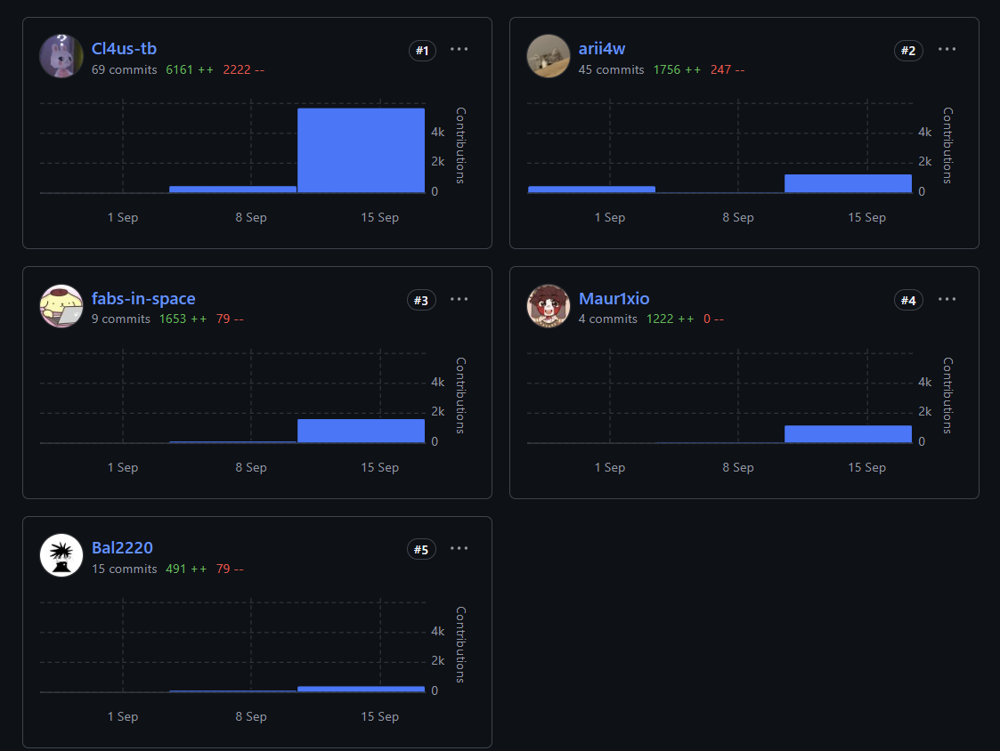
<br><br><br><br>
## TP1
En esta entrega, cada miembro del equipo contribuyó activamente a la consolidación de la solución, organizándose por frentes según el diseño y alcance definidos. Las capturas de Collaboration Insights de los repositorios oficiales evidencian la participación de todos.
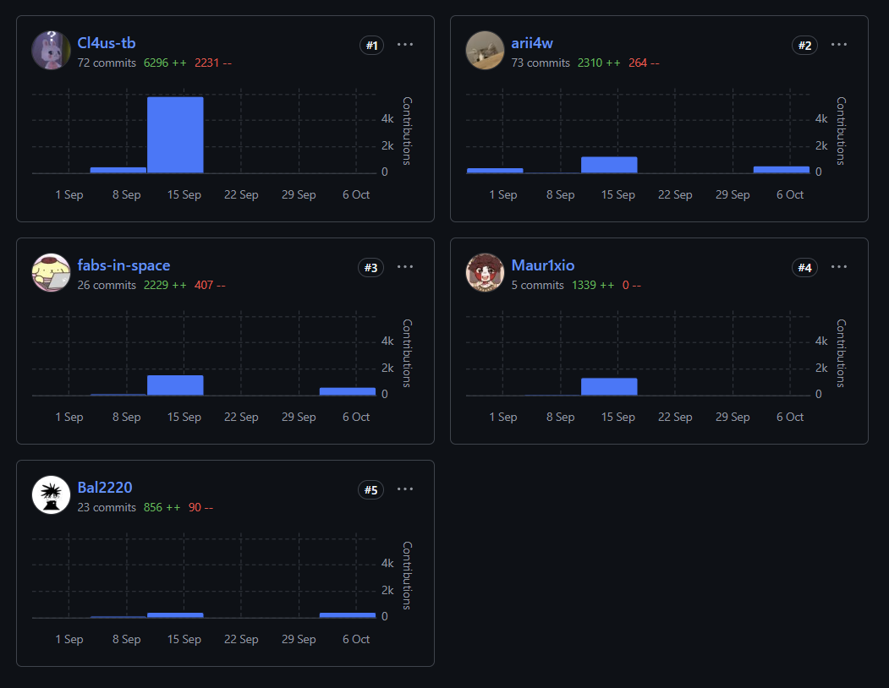
<br><br><br><br><br><br>
<br><br><br><br><br><br>
<br><br><br><br>
<br><br><br><br>
<br><br><br><br><br><br><br><br><br><br><br><br><br>


# Contenido
[Student Outcome](#student-outcome)

- [Project Report](#project-report)
- [Project Report Collaboration Insights](#project-report-collaboration-insights)
  - [TB1](#tb1)
  - [TP1](#tp1)
- [Contenido](#contenido)
- [Student Outcome](#student-outcome)
- [Objetivos SMART](#objetivos-smart)
- [Capítulo I: Presentación](#capítulo-i-presentación)
  - [1.1. Startup Profile](#11-startup-profile)
    - [1.1.1. Descripción de la Startup](#111-descripción-de-la-startup)
    - [1.1.2. Perfiles de integrantes del equipo](#112-perfiles-de-integrantes-del-equipo)
  - [1.2. Solution Profile](#12-solution-profile)
    - [1.2.1. Antecedentes y problemática](#121-antecedentes-y-problemática)
    - [1.2.2. Lean UX Process](#122-lean-ux-process)
      - [1.2.2.1. Lean UX Problem Statements](#1221-lean-ux-problem-statements)
      - [1.2.2.2. Lean UX Assumptions](#1222-lean-ux-assumptions)
      - [1.2.2.3. Lean UX Hypothesis Statements](#1223-lean-ux-hypothesis-statements)
      - [1.2.2.4. Lean UX Canvas](#1224-lean-ux-canvas)
  - [1.3. Segmentos objetivo](#13-segmentos-objetivo)
    - [🎯 Segmento Objetivo #1: Personas o empresas que quieren transportar carga de forma interprovincial](#-segmento-objetivo-1-personas-o-empresas-que-quieren-transportar-carga-de-forma-interprovincial)
      - [📊 Aspectos Demográficos](#-aspectos-demográficos)
      - [🌍 Aspectos Geográficos](#-aspectos-geográficos)
      - [🧠 Aspectos Psicográficos](#-aspectos-psicográficos)
    - [🚛 Segmento Objetivo #2: Administradores de empresas que se encargan del transporte interprovincial de carga](#-segmento-objetivo-2-administradores-de-empresas-que-se-encargan-del-transporte-interprovincial-de-carga)
      - [📊 Aspectos Demográficos](#-aspectos-demográficos-1)
      - [🌍 Aspectos Geográficos](#-aspectos-geográficos-1)
      - [🧠 Aspectos Psicográficos](#-aspectos-psicográficos-1)
    - [2.1.2. Estrategias y tácticas frente a competidores](#212-estrategias-y-tácticas-frente-a-competidores)
  - [2.2. Entrevistas](#22-entrevistas)
    - [2.2.1. Diseño de entrevistas](#221-diseño-de-entrevistas)
      - [**Segmento 1: Personas o empresas que quieren transportar carga de forma interprovincial**](#segmento-1-personas-o-empresas-que-quieren-transportar-carga-de-forma-interprovincial)
      - [**Segmento 2: Administradores de empresas que se encargan del transporte interprovincial de carga**](#segmento-2-administradores-de-empresas-que-se-encargan-del-transporte-interprovincial-de-carga)
    - [2.2.2. Registro de entrevistas](#222-registro-de-entrevistas)
  - [📊 **Análisis del Segmento Objetivo #1**](#-análisis-del-segmento-objetivo-1)
  - [📋 **Entrevista #1**](#-entrevista-1)
    - [📸 **Imagen de la Entrevista**](#-imagen-de-la-entrevista)
    - [📝 **Resumen de la Entrevista**](#-resumen-de-la-entrevista)
  - [📋 **Entrevista #2**](#-entrevista-2)
    - [📸 **Imagen de la Entrevista**](#-imagen-de-la-entrevista-1)
    - [📝 **Resumen de la Entrevista**](#-resumen-de-la-entrevista-1)
  - [📋 **Entrevista #3**](#-entrevista-3)
    - [📸 **Imagen de la Entrevista**](#-imagen-de-la-entrevista-2)
    - [📝 **Resumen de la Entrevista**](#-resumen-de-la-entrevista-2)
  - [📊 **Análisis del Segmento Objetivo #2**](#-análisis-del-segmento-objetivo-2)
  - [📋 **Entrevista #4**](#-entrevista-4)
    - [📸 **Imagen de la Entrevista**](#-imagen-de-la-entrevista-3)
    - [📝 **Resumen de la Entrevista**](#-resumen-de-la-entrevista-3)
  - [📋 **Entrevista #5**](#-entrevista-5)
    - [📸 **Imagen de la Entrevista**](#-imagen-de-la-entrevista-4)
    - [📝 **Resumen de la Entrevista**](#-resumen-de-la-entrevista-4)
  - [📋 **Entrevista #6**](#-entrevista-6)
    - [📸 **Imagen de la Entrevista**](#-imagen-de-la-entrevista-5)
    - [📝 **Resumen de la Entrevista**](#-resumen-de-la-entrevista-5)
    - [2.2.3. Análisis de entrevistas](#223-análisis-de-entrevistas)
  - [📊 **Análisis del Segmento Objetivo #2**](#-análisis-del-segmento-objetivo-2-1)
    - [🎯 **Características Objetivas**](#-características-objetivas)
      - [👥 **Demografía y Rol**](#-demografía-y-rol)
      - [🌍 **Ámbito Geográfico**](#-ámbito-geográfico)
      - [📦 **Portafolio de Carga**](#-portafolio-de-carga)
      - [🔄 **Proceso Actual (de consulta a envío)**](#-proceso-actual-de-consulta-a-envío)
      - [📞 **Canales de Captación y Atención**](#-canales-de-captación-y-atención)
      - [💰 **Pagos**](#-pagos)
      - [📋 **Documentación y Formalidad**](#-documentación-y-formalidad)
      - [🛰️ **Seguimiento y Trazabilidad**](#️-seguimiento-y-trazabilidad)
    - [🧠 **Características Subjetivas**](#-características-subjetivas)
      - [⭐ **Valores y Prioridades**](#-valores-y-prioridades)
      - [🎯 **Actitudes y Expectativas**](#-actitudes-y-expectativas)
    - [⚠️ **Fricciones Operativas Identificadas**](#️-fricciones-operativas-identificadas)
    - [💡 **Necesidades y Deseos**](#-necesidades-y-deseos)
    - [🚧 **Barreras y Riesgos Percibidos**](#-barreras-y-riesgos-percibidos)
    - [🎯 **Oportunidades Claras**](#-oportunidades-claras)
  - [2.3. Needfinding](#23-needfinding)
    - [2.3.1. User Personas](#231-user-personas)
    - [2.3.2. User Task Matrix](#232-user-task-matrix)
    - [2.3.3. User Journey Mapping](#233-user-journey-mapping)
    - [2.3.4. Empathy Mapping](#234-empathy-mapping)
    - [2.3.5. Ubiquitous Language](#235-ubiquitous-language)
  - [2.4. Requirements Specification](#24-requirements-specification)
    - [2.4.1. User Stories](#241-user-stories)
      - [Technical stories](#technical-stories)
      - [Spikes stories](#spikes-stories)
    - [2.4.2. Impact Mapping](#242-impact-mapping)
    - [2.4.3. Product Backlog](#243-product-backlog)
- [Product Backlog](#product-backlog)
  - [2.5. Strategic-Level Domain-Driven Design](#25-strategic-level-domain-driven-design)
    - [2.5.1. EventStorming](#251-eventstorming)
      - [2.5.1.1. Candidate Context Discovery](#2511-candidate-context-discovery)
    - [🌐 **Tablero Interactivo de Event Storming (Candidate Context Discovery)**](#-tablero-interactivo-de-event-storming-candidate-context-discovery)
  - [📋 **Step 0 — Nomenclatura**](#-step-0--nomenclatura)
    - [📋 **Descripción**](#-descripción)
    - [🎨 **Simbología de Colores**](#-simbología-de-colores)
    - [🔤 **Elementos del Sistema**](#-elementos-del-sistema)
  - [🔍 **Step 1 — Collect Domain Events**](#-step-1--collect-domain-events)
    - [📋 **Descripción**](#-descripción-1)
    - [📊 **Eventos Identificados**](#-eventos-identificados)
  - [⏰ **Step 2 — Enforce the Timeline**](#-step-2--enforce-the-timeline)
    - [📋 **Descripción**](#-descripción-2)
    - [📊 **Timelines Identificados**](#-timelines-identificados)
    - [🔄 **Preparación del Proveedor**](#-preparación-del-proveedor)
    - [👤 **Registro de Cliente**](#-registro-de-cliente)
    - [🏢 **Registro de Proveedor**](#-registro-de-proveedor)
    - [🔐 **Sesiones y Seguridad**](#-sesiones-y-seguridad)
    - [📦 **Solicitud de Envío de Carga**](#-solicitud-de-envío-de-carga)
    - [🤝 **Trato**](#-trato)
    - [💰 **Pago**](#-pago)
    - [📋 **Documentación (Guías)**](#-documentación-guías)
    - [🔔 **Notificaciones**](#-notificaciones)
    - [📝 **Plantillas**](#-plantillas)
    - [💬 **Cotizaciones**](#-cotizaciones)
    - [⚖️ **Disputas**](#️-disputas)
    - [⭐ **Calificaciones**](#-calificaciones)
    - [🔄 **Cambio Post-Pago**](#-cambio-post-pago)
    - [🛰️ **Tracking**](#️-tracking)
  - [🔥 **Step 3 — Hotspots**](#-step-3--hotspots)
    - [📋 **Descripción**](#-descripción-3)
    - [📊 **Hotspots Identificados**](#-hotspots-identificados)
    - [🔄 **Preparación del Proveedor**](#-preparación-del-proveedor-1)
    - [👤 **Registro de Cliente**](#-registro-de-cliente-1)
    - [🏢 **Registro de Proveedor**](#-registro-de-proveedor-1)
    - [🔐 **Sesiones y Seguridad**](#-sesiones-y-seguridad-1)
    - [📦 **Solicitud de Envío de Carga**](#-solicitud-de-envío-de-carga-1)
    - [🤝 **Trato (Negociación \& Chat)**](#-trato-negociación--chat)
    - [💰 **Pago**](#-pago-1)
    - [📋 **Documentación (Guías)**](#-documentación-guías-1)
    - [🔔 **Notificaciones**](#-notificaciones-1)
    - [📝 **Plantillas**](#-plantillas-1)
    - [💬 **Cotizaciones**](#-cotizaciones-1)
    - [⚖️ **Disputas**](#️-disputas-1)
    - [⭐ **Calificaciones**](#-calificaciones-1)
    - [🔄 **Cambio Post-Pago**](#-cambio-post-pago-1)
    - [🛰️ **Tracking (Viajes)**](#️-tracking-viajes)
  - [⚙️ **Step 4 — Causality and Domain Orchestration**](#️-step-4--causality-and-domain-orchestration)
    - [📋 **Descripción**](#-descripción-4)
    - [📊 **Orquestación de Dominios**](#-orquestación-de-dominios)
    - [🔄 **Preparación del Proveedor**](#-preparación-del-proveedor-2)
    - [👤 **Registro de Cliente**](#-registro-de-cliente-2)
    - [🏢 **Registro de Proveedor**](#-registro-de-proveedor-2)
    - [🔐 **Sesiones y Seguridad**](#-sesiones-y-seguridad-2)
    - [📦 **Solicitud de Envío de Carga**](#-solicitud-de-envío-de-carga-2)
    - [🤝 **Trato (Negociación \& Chat)**](#-trato-negociación--chat-1)
    - [💰 **Pago**](#-pago-2)
    - [📋 **Documentación (Guías)**](#-documentación-guías-2)
    - [🔔 **Notificaciones**](#-notificaciones-2)
    - [📝 **Plantillas**](#-plantillas-2)
    - [💬 **Cotizaciones (Ofertas)**](#-cotizaciones-ofertas)
    - [⚖️ **Disputas**](#️-disputas-2)
    - [⭐ **Calificaciones (Reputación)**](#-calificaciones-reputación)
    - [🔄 **Cambio Post-Pago (Ajustes)**](#-cambio-post-pago-ajustes)
    - [🛰️ **Tracking (Viajes)**](#️-tracking-viajes-1)
  - [🏗️ **Step 5 — Project to Bounded Contexts**](#️-step-5--project-to-bounded-contexts)
    - [📋 **Descripción**](#-descripción-5)
    - [📊 **Mapa de Bounded Contexts**](#-mapa-de-bounded-contexts)
    - [🔐 **IAM (Identity \& Access Management)**](#-iam-identity--access-management)
    - [👤 **Identity (Identity \& KYC)**](#-identity-identity--kyc)
    - [🔔 **Notifications**](#-notifications)
    - [👥 **Customers**](#-customers)
    - [🏢 **Providers**](#-providers)
    - [🚛 **Fleet**](#-fleet)
    - [📋 **Planning**](#-planning)
    - [📦 **Requests**](#-requests)
    - [⭐ **Reviews**](#-reviews)
    - [🛰️ **Trips**](#️-trips)
    - [📋 **Waybills**](#-waybills)
    - [💰 **Payments**](#-payments)
    - [🤝 **Deals**](#-deals)
    - [⚖️ **Disputes**](#️-disputes)
      - [2.5.1.2. Domain Message Flows Modeling](#2512-domain-message-flows-modeling)
    - [📋 **Descripción**](#-descripción-6)
    - [🔄 **Escenarios de Integración**](#-escenarios-de-integración)
      - [1️⃣ **Alta de Cliente con Verificación KYC**](#1️⃣-alta-de-cliente-con-verificación-kyc)
      - [2️⃣ **Onboarding de Proveedor (Empresa Habilitada)**](#2️⃣-onboarding-de-proveedor-empresa-habilitada)
      - [3️⃣ **Alta de Vehículo y Disponibilidad Publicable**](#3️⃣-alta-de-vehículo-y-disponibilidad-publicable)
      - [4️⃣ **Publicación de Solicitud de Envío**](#4️⃣-publicación-de-solicitud-de-envío)
      - [5️⃣ **Cotización e Inicio de Trato**](#5️⃣-cotización-e-inicio-de-trato)
      - [2.5.1.3. Bounded Context Canvases](#2513-bounded-context-canvases)
    - [📋 **Descripción**](#-descripción-7)
    - [🏗️ **Bounded Contexts del Sistema**](#️-bounded-contexts-del-sistema)
      - [💰 **Payments**](#-payments-1)
      - [🤝 **Deals**](#-deals-1)
      - [📦 **Requests**](#-requests-1)
      - [📋 **Planning**](#-planning-1)
      - [🛰️ **Trips**](#️-trips-1)
      - [📋 **Waybills**](#-waybills-1)
    - [📊 **Resumen de Bounded Contexts**](#-resumen-de-bounded-contexts)
    - [2.5.2. Context Mapping](#252-context-mapping)
    - [2.5.3. Software Architecture](#253-software-architecture)
      - [2.5.3.1. Software Architecture Context Level Diagrams](#2531-software-architecture-context-level-diagrams)
      - [2.5.3.2. Software Architecture Container Level Diagrams](#2532-software-architecture-container-level-diagrams)
      - [2.5.3.3. Software Architecture Deployment Diagrams](#2533-software-architecture-deployment-diagrams)
  - [2.6. Tactical-Level Domain-Driven Design](#26-tactical-level-domain-driven-design)
    - [2.6.1. Bounded Context: IAM](#261-bounded-context-iam)
      - [2.6.1.1. Domain Layer](#2611-domain-layer)
      - [2.6.1.2. Interface Layer](#2612-interface-layer)
      - [2.6.1.3. Application Layer](#2613-application-layer)
      - [2.6.1.4. Infrastructure Layer](#2614-infrastructure-layer)
      - [2.6.1.5. Bounded Context Software Architecture Component Level Diagrams](#2615-bounded-context-software-architecture-component-level-diagrams)
      - [2.6.1.6. Bounded Context Software Architecture Code Level Diagrams](#2616-bounded-context-software-architecture-code-level-diagrams)
        - [2.6.1.6.1. Bounded Context Domain Layer Class Diagrams](#26161-bounded-context-domain-layer-class-diagrams)
        - [2.6.1.6.2. Bounded Context Database Design Diagram](#26162-bounded-context-database-design-diagram)
    - [2.6.2. Bounded Context: Identity \& KYC](#262-bounded-context-identity--kyc)
      - [2.6.2.1. Domain Layer](#2621-domain-layer)
      - [2.6.2.2. Interface Layer](#2622-interface-layer)
      - [2.6.2.3. Application Layer](#2623-application-layer)
      - [2.6.2.4. Infrastructure Layer](#2624-infrastructure-layer)
      - [2.6.2.5. Bounded Context Software Architecture Component Level Diagrams](#2625-bounded-context-software-architecture-component-level-diagrams)
      - [2.6.2.6. Bounded Context Software Architecture Code Level Diagrams](#2626-bounded-context-software-architecture-code-level-diagrams)
        - [2.6.2.6.1. Bounded Context Domain Layer Class Diagrams](#26261-bounded-context-domain-layer-class-diagrams)
        - [2.6.2.6.2. Bounded Context Database Design Diagram](#26262-bounded-context-database-design-diagram)
    - [2.6.3. Bounded Context: Customers](#263-bounded-context-customers)
      - [2.6.3.1. Domain Layer](#2631-domain-layer)
      - [2.6.3.2. Interface Layer](#2632-interface-layer)
      - [2.6.3.3. Application Layer](#2633-application-layer)
      - [2.6.3.4. Infrastructure Layer](#2634-infrastructure-layer)
      - [2.6.3.5. Bounded Context Software Architecture Component Level Diagrams](#2635-bounded-context-software-architecture-component-level-diagrams)
      - [2.6.3.6. Bounded Context Software Architecture Code Level Diagrams](#2636-bounded-context-software-architecture-code-level-diagrams)
        - [2.6.3.6.1. Bounded Context Domain Layer Class Diagrams](#26361-bounded-context-domain-layer-class-diagrams)
        - [2.6.3.6.2. Bounded Context Database Design Diagram](#26362-bounded-context-database-design-diagram)
    - [2.6.4. Bounded Context: Providers](#264-bounded-context-providers)
      - [2.6.4.1. Domain Layer](#2641-domain-layer)
      - [2.6.4.2. Interface Layer](#2642-interface-layer)
      - [2.6.4.3. Application Layer](#2643-application-layer)
      - [2.6.4.4. Infrastructure Layer](#2644-infrastructure-layer)
      - [2.6.4.5. Bounded Context Software Architecture Component Level Diagrams](#2645-bounded-context-software-architecture-component-level-diagrams)
      - [2.6.4.6. Bounded Context Software Architecture Code Level Diagrams](#2646-bounded-context-software-architecture-code-level-diagrams)
        - [2.6.4.6.1. Bounded Context Domain Layer Class Diagrams](#26461-bounded-context-domain-layer-class-diagrams)
        - [2.6.4.6.2. Bounded Context Database Design Diagram](#26462-bounded-context-database-design-diagram)
    - [2.6.5. Bounded Context: Fleet](#265-bounded-context-fleet)
      - [2.6.5.1. Domain Layer](#2651-domain-layer)
- [2.6.x. Bounded Context: Fleet (Flota)](#26x-bounded-context-fleet-flota)
- [Domain Layer](#domain-layer)
      - [2.6.5.2. Interface Layer](#2652-interface-layer)
      - [2.6.5.3. Application Layer](#2653-application-layer)
      - [2.6.5.4. Infrastructure Layer](#2654-infrastructure-layer)
      - [2.6.5.5. Bounded Context Software Architecture Component Level Diagrams](#2655-bounded-context-software-architecture-component-level-diagrams)
      - [2.6.5.6. Bounded Context Software Architecture Code Level Diagrams](#2656-bounded-context-software-architecture-code-level-diagrams)
        - [2.6.5.6.1. Bounded Context Domain Layer Class Diagrams](#26561-bounded-context-domain-layer-class-diagrams)
        - [2.6.5.6.2. Bounded Context Database Design Diagram](#26562-bounded-context-database-design-diagram)
    - [2.6.6. Bounded Context: Planning](#266-bounded-context-planning)
      - [2.6.6.1. Domain Layer](#2661-domain-layer)
      - [2.6.6.2. Interface Layer](#2662-interface-layer)
      - [2.6.6.3. Application Layer](#2663-application-layer)
      - [2.6.6.4. Infrastructure Layer](#2664-infrastructure-layer)
      - [2.6.6.5. Bounded Context Software Architecture Component Level Diagrams](#2665-bounded-context-software-architecture-component-level-diagrams)
      - [2.6.6.6. Bounded Context Software Architecture Code Level Diagrams](#2666-bounded-context-software-architecture-code-level-diagrams)
        - [2.6.6.6.1. Bounded Context Domain Layer Class Diagrams](#26661-bounded-context-domain-layer-class-diagrams)
        - [2.6.6.6.2. Bounded Context Database Design Diagram](#26662-bounded-context-database-design-diagram)
    - [2.6.7. Bounded Context: Requests](#267-bounded-context-requests)
      - [2.6.7.1. Domain Layer](#2671-domain-layer)
      - [2.6.7.2. Interface Layer](#2672-interface-layer)
      - [2.6.7.3. Application Layer](#2673-application-layer)
      - [2.6.7.4. Infrastructure Layer](#2674-infrastructure-layer)
      - [2.6.7.5. Bounded Context Software Architecture Component Level Diagrams](#2675-bounded-context-software-architecture-component-level-diagrams)
      - [2.6.7.6. Bounded Context Software Architecture Code Level Diagrams](#2676-bounded-context-software-architecture-code-level-diagrams)
        - [2.6.7.6.1. Bounded Context Domain Layer Class Diagrams](#26761-bounded-context-domain-layer-class-diagrams)
        - [2.6.7.6.2. Bounded Context Database Design Diagram](#26762-bounded-context-database-design-diagram)
    - [2.6.8. Bounded Context: Deals](#268-bounded-context-deals)
      - [2.6.8.1. Domain Layer](#2681-domain-layer)
      - [2.6.8.2. Interface Layer](#2682-interface-layer)
      - [2.6.8.3. Application Layer](#2683-application-layer)
      - [2.6.8.4. Infrastructure Layer](#2684-infrastructure-layer)
      - [2.6.8.5. Bounded Context Software Architecture Component Level Diagrams](#2685-bounded-context-software-architecture-component-level-diagrams)
      - [2.6.8.6. Bounded Context Software Architecture Code Level Diagrams](#2686-bounded-context-software-architecture-code-level-diagrams)
        - [2.6.8.6.1. Bounded Context Domain Layer Class Diagrams](#26861-bounded-context-domain-layer-class-diagrams)
        - [2.6.8.6.2. Bounded Context Database Design Diagram](#26862-bounded-context-database-design-diagram)
    - [2.6.9. Bounded Context: Payments](#269-bounded-context-payments)
      - [2.6.9.1. Domain Layer](#2691-domain-layer)
      - [2.6.9.2. Interface Layer](#2692-interface-layer)
      - [2.6.9.3. Application Layer](#2693-application-layer)
      - [2.6.9.4. Infrastructure Layer](#2694-infrastructure-layer)
      - [2.6.9.5. Bounded Context Software Architecture Component Level Diagrams](#2695-bounded-context-software-architecture-component-level-diagrams)
      - [2.6.9.6. Bounded Context Software Architecture Code Level Diagrams](#2696-bounded-context-software-architecture-code-level-diagrams)
        - [2.6.9.6.1. Bounded Context Domain Layer Class Diagrams](#26961-bounded-context-domain-layer-class-diagrams)
        - [2.6.9.6.2. Bounded Context Database Design Diagram](#26962-bounded-context-database-design-diagram)
    - [2.6.10. Bounded Context: Waybills](#2610-bounded-context-waybills)
      - [2.6.10.1. Domain Layer](#26101-domain-layer)
    - [Aggregates (AR)](#aggregates-ar)
      - [1) Waybill (Aggregate Root)](#1-waybill-aggregate-root)
      - [Entities / Value Objects](#entities--value-objects)
      - [Domain Services](#domain-services)
      - [Repositories (interfaces)](#repositories-interfaces)
      - [Domain Events (payload mínimo)](#domain-events-payload-mínimo)
      - [Ubiquitous Language (extracto)](#ubiquitous-language-extracto)
      - [2.6.10.2. Interface Layer](#26102-interface-layer)
    - [Endpoints](#endpoints)
    - [Webhooks (filing provider)](#webhooks-filing-provider)
    - [Contratos I/O (alto nivel)](#contratos-io-alto-nivel)
    - [Versionado e Idempotencia](#versionado-e-idempotencia)
      - [2.6.10.3. Application Layer](#26103-application-layer)
    - [Capabilities → Casos de uso](#capabilities--casos-de-uso)
    - [Command/Query Handlers](#commandquery-handlers)
    - [Orquestaciones / Sagas](#orquestaciones--sagas)
    - [Puertos (interfaces a Infra)](#puertos-interfaces-a-infra)
    - [Idempotencia y control transaccional](#idempotencia-y-control-transaccional)
    - [Event Handlers (integración)](#event-handlers-integración)
      - [2.6.10.4. Infrastructure Layer](#26104-infrastructure-layer)
    - [Repositorios (impl)](#repositorios-impl)
    - [Adapters / Integraciones](#adapters--integraciones)
    - [Mensajería / Confiabilidad](#mensajería--confiabilidad)
    - [Configuración y secretos](#configuración-y-secretos)
      - [2.6.10.5. Bounded Context Software Architecture Component Level Diagrams](#26105-bounded-context-software-architecture-component-level-diagrams)
      - [2.6.10.6. Bounded Context Software Architecture Code Level Diagrams](#26106-bounded-context-software-architecture-code-level-diagrams)
        - [2.6.10.6.1. Bounded Context Domain Layer Class Diagrams](#261061-bounded-context-domain-layer-class-diagrams)
        - [2.6.10.6.2. Bounded Context Database Design Diagram](#261062-bounded-context-database-design-diagram)
    - [2.6.11. Bounded Context: Trips](#2611-bounded-context-trips)
      - [2.6.11.1. Domain Layer](#26111-domain-layer)
      - [2.6.11.2. Interface Layer](#26112-interface-layer)
- [2.6.x. Bounded Context: Trips (Viajes)](#26x-bounded-context-trips-viajes)
      - [2.6.11.3. Application Layer](#26113-application-layer)
      - [2.6.11.4. Infrastructure Layer](#26114-infrastructure-layer)
      - [2.6.11.5. Bounded Context Software Architecture Component Level Diagrams](#26115-bounded-context-software-architecture-component-level-diagrams)
      - [2.6.11.6. Bounded Context Software Architecture Code Level Diagrams](#26116-bounded-context-software-architecture-code-level-diagrams)
        - [2.6.11.6.1. Bounded Context Domain Layer Class Diagrams](#261161-bounded-context-domain-layer-class-diagrams)
        - [2.6.11.6.2. Bounded Context Database Design Diagram](#261162-bounded-context-database-design-diagram)
    - [2.6.12. Bounded Context: Reviews](#2612-bounded-context-reviews)
      - [2.6.12.1. Domain Layer](#26121-domain-layer)
      - [2.6.12.2. Interface Layer](#26122-interface-layer)
      - [2.6.12.3. Application Layer](#26123-application-layer)
      - [2.6.12.4. Infrastructure Layer](#26124-infrastructure-layer)
      - [2.6.12.5. Bounded Context Software Architecture Component Level Diagrams](#26125-bounded-context-software-architecture-component-level-diagrams)
      - [2.6.12.6. Bounded Context Software Architecture Code Level Diagrams](#26126-bounded-context-software-architecture-code-level-diagrams)
        - [2.6.12.6.1. Bounded Context Domain Layer Class Diagrams](#261261-bounded-context-domain-layer-class-diagrams)
        - [2.6.12.6.2. Bounded Context Database Design Diagram](#261262-bounded-context-database-design-diagram)
    - [2.6.13. Bounded Context: Notifications](#2613-bounded-context-notifications)
      - [2.6.13.1. Domain Layer](#26131-domain-layer)
      - [2.6.13.2. Interface Layer](#26132-interface-layer)
      - [2.6.13.3. Application Layer](#26133-application-layer)
      - [2.6.13.4. Infrastructure Layer](#26134-infrastructure-layer)
      - [2.6.13.5. Bounded Context Software Architecture Component Level Diagrams](#26135-bounded-context-software-architecture-component-level-diagrams)
      - [2.6.13.6. Bounded Context Software Architecture Code Level Diagrams](#26136-bounded-context-software-architecture-code-level-diagrams)
        - [2.6.13.6.1. Bounded Context Domain Layer Class Diagrams](#261361-bounded-context-domain-layer-class-diagrams)
        - [2.6.13.6.2. Bounded Context Database Design Diagram](#261362-bounded-context-database-design-diagram)
  - [Capítulo III: Solution UI/UX Design](#capítulo-iii-solution-uiux-design)
    - [3.1. Product design](#31-product-design)
      - [3.1.1. Style Guidelines](#311-style-guidelines)
        - [3.1.1.1. General Style Guidelines](#3111-general-style-guidelines)
      - [3.1.2. Information Architecture](#312-information-architecture)
        - [3.1.2.1. Organization Systems](#3121-organization-systems)
        - [3.1.2.2. Labelling Systems](#3122-labelling-systems)
        - [3.1.2.3. SEO Tags and Meta Tags](#3123-seo-tags-and-meta-tags)
        - [3.1.2.4. Searching Systems](#3124-searching-systems)
        - [3.1.2.5. Navigation Systems](#3125-navigation-systems)
      - [3.1.3. Landing Page UI Design](#313-landing-page-ui-design)
        - [3.1.3.1. Landing Page Wireframe](#3131-landing-page-wireframe)
        - [3.1.3.2. Landing Page Mock-up](#3132-landing-page-mock-up)
      - [3.1.4. Mobile Applications UX/UI Design](#314-mobile-applications-uxui-design)
        - [3.1.4.1. Mobile Applications Wireframes](#3141-mobile-applications-wireframes)
        - [3.1.4.2. Mobile Applications Wireflow Diagrams](#3142-mobile-applications-wireflow-diagrams)
        - [3.1.4.3. Mobile Applications Mock-ups](#3143-mobile-applications-mock-ups)
        - [3.1.4.4. Mobile Applications User Flow Diagrams](#3144-mobile-applications-user-flow-diagrams)
        - [3.1.4.5. Mobile Applications Prototyping](#3145-mobile-applications-prototyping)
  - [Capítulo IV: Product Implementation \& Validation](#capítulo-iv-product-implementation--validation)
    - [4. Product Implementation \& Validation](#4-product-implementation--validation)
      - [4.1. Software Configuration Management](#41-software-configuration-management)
        - [4.1.1. Software Development Environment Configuration](#411-software-development-environment-configuration)
        - [4.1.2. Source Code Management](#412-source-code-management)
        - [4.1.3. Source Code Style Guide \& Conventions](#413-source-code-style-guide--conventions)
        - [4.1.4. Software Deployment Configuration](#414-software-deployment-configuration)
      - [4.2. Landing Page \& Mobile Application Implementation](#42-landing-page--mobile-application-implementation)
        - [4.2.1. Sprint 1](#421-sprint-1)
          - [4.2.1.1. Sprint Planning 1](#4211-sprint-planning-1)
          - [4.2.1.2. Sprint Backlog 1](#4212-sprint-backlog-1)
          - [4.2.1.3. Development Evidence for Sprint Review](#4213-development-evidence-for-sprint-review)
          - [4.2.1.4. Testing Suite Evidence for Sprint Review](#4214-testing-suite-evidence-for-sprint-review)
          - [4.2.1.5. Execution Evidence for Sprint Review](#4215-execution-evidence-for-sprint-review)
          - [4.2.1.6. Services Documentation Evidence for Sprint Review](#4216-services-documentation-evidence-for-sprint-review)
          - [4.2.1.7. Software Deployment Evidence for Sprint Review](#4217-software-deployment-evidence-for-sprint-review)
          - [4.2.1.8. Team Collaboration Insights during Sprint](#4218-team-collaboration-insights-during-sprint)
      - [4.3. Validation Interviews](#43-validation-interviews)
        - [4.3.1. Diseño de Entrevistas](#431-diseño-de-entrevistas)
        - [4.3.2. Registro de Entrevistas](#432-registro-de-entrevistas)
        - [4.3.3. Evaluaciones según heurísticas](#433-evaluaciones-según-heurísticas)
- [Conclusiones](#conclusiones)
  - [Conclusiones y recomendaciones](#conclusiones-y-recomendaciones)
    - [Conclusiones](#conclusiones-1)
    - [Recomendaciones](#recomendaciones)
- [Bibliografía](#bibliografía)
- [Anexos](#anexos)

  
<br><br><br><br><br><br><br><br><br><br><br><br><br><br>
<br><br><br><br><br><br><br><br><br><br><br><br><br><br>
<br><br><br><br><br><br><br><br><br><br><br><br><br><br><br><br><br><br><br>

# Student Outcome

ABET - EAC - Student Outcome 7: La capacidad de adquirir y aplicar nuevos
conocimientos según sea necesario, utilizando estrategias de aprendizaje apropiadas.

<table border="1" cellspacing="0" cellpadding="8" style="border-collapse:collapse; width:100%;">
  <thead>
    <tr>
      <th style="width:22%;">Criterio específico</th>
      <th style="width:48%;">Acciones realizadas</th>
      <th style="width:30%;">Conclusiones grupales</th>
    </tr>
  </thead>
  <tbody>
    <tr>
      <td><strong>Actualiza conceptos y conocimientos necesarios para su desarrollo profesional y en especial para su proyecto en soluciones de software.</strong></td>
      <td>
        <strong>Ariana Cecilia Agreda Sobrino</strong> <br>
        <strong>TB1: </strong><br>
          Durante TB1, presenté y sustenté entregables clave: diseño y análisis de entrevistas, User Stories y Arquitectura de Software con diagramas del C4 Model. Para ello actualicé y apliqué conocimientos en         requisitos (planificación y codificación de hallazgos), redacción de historias con criterios de aceptación y modelado C4. Usé estrategias de aprendizaje como revisión de fuentes especializadas, práctica con herramientas (p. ej., Structurizr) y retroalimentación del equipo, evidenciando actualización continua para el proyecto y mi desarrollo profesional.<br>
          <strong>TP1: </strong><br>
          Elaboré las <em>General Style Guidelines</em>, los <em>Mock-ups</em>, <em>User Flow Diagrams</em> y <em>Prototyping</em>, y apoyé <em>Software Configuration Management</em>. Actualicé y apliqué conocimientos en sistemas de diseño (tokens de color y tipografía, escalas, componentes), accesibilidad y contraste, trazado de flujos de usuario y prototipos navegables. En SCM apliqué GitFlow y buenas prácticas de PR. Estrategias de aprendizaje: benchmarking de design systems, revisión de heurísticas, pruebas con usuarios a baja escala y ciclos de crítica de diseño con el equipo. 
        <br>
        <strong>TB2: </strong><br>
          Implementé pantallas en Flutter para <em>chat</em>, <em>tratos</em>, eventos y <em>cotizaciones</em>. Actualicé conocimientos en gestión de estado, navegación, manejo de datos en tiempo real y pruebas instrumentadas; usé prototipos, documentación oficial y revisiones por pares.
        <br><br>
        <strong>Claudia Valeria Belledonne Espinoza</strong> <br>
        <strong>TB1: </strong><br>
          Durante TB1, presenté y sustenté entregables clave: el análisis competitivo con estrategias y tácticas frente a competidores, la redacción de User Stories y el diseño táctico DDD mediante Bounded Contexts. Para ello actualicé y apliqué conocimientos en análisis comparativo de mercado y propuesta de valor, criterios de aceptación y trazabilidad, así como en delimitación de contextos y responsabilidades del dominio. Utilicé estrategias de aprendizaje como revisión de fuentes especializadas, contraste de casos, práctica con story/context mapping y retroalimentación del equipo, fortaleciendo mi desarrollo profesional y el avance del proyecto.<br>
        <strong>TP1: </strong><br>
          Implementé la creación de <em>bounded contexts</em> en el backend, la comunicación en tiempo real mediante <em>WebSockets</em> y los <em>CRUDs</em> principales. Actualicé y apliqué conocimientos en modularización con DDD (paquetes/módulos coherentes), configuración de canales WebSocket y estandarización de endpoints. Estrategias: lectura de documentación oficial, <em>spikes</em> técnicos, pruebas con clientes de mensajería y revisiones por pares para validar diseño e implementación.<br>
        <strong>TB2: </strong><br>
          Amplié soporte backend para el flujo principal (solicitudes, cotizaciones, tratos, rutas) y estabilicé la mensajería en tiempo real. Apliqué aprendizaje incremental con iteraciones cortas, pruebas y code reviews.
        <br><br>
        <strong>Mauricio Daniel Elera Rodríguez</strong> <br>
        <strong>TB1: </strong><br>
          Durante TB1, presenté y sustenté entregables clave como la Descripción de la Startup, los Perfiles del equipo, el registro de entrevistas, las User Stories y los artefactos de modelado (EventStorming, Context Mapping y diseño táctico DDD con Bounded Contexts). Para elaborarlos, actualicé y apliqué conocimientos en síntesis de propuesta de valor, investigación cualitativa, trazabilidad requisito–modelo y diseño dirigido por dominio, utilizando estrategias de aprendizaje como revisión de guías especializadas, práctica con plantillas y validación por retroalimentación.<br>
        <strong>TP1: </strong><br>
          Desarrollé pantallas de la app móvil, integré con el backend (consumo de endpoints, manejo de estados y errores) y colaboré en parte de los endpoints y <em>CRUDs</em>. Apliqué conocimientos actualizados en patrones de UI móvil, navegación, manejo de datos remotos y contratos API. Estrategias: prototipos funcionales, pruebas de integración, lectura de documentación y depuración iterativa con el equipo.
        <br>
        <strong>TB2: </strong><br>
          Concluí la app Android con el flujo principal: conexión cliente–proveedor, solicitudes, cotizaciones, tratos y rutas. Profundicé en navegación, manejo de estados/errores y pruebas de integración end-to-end.
        <br><br>
        <strong>María Patricia Hernández Uchuya</strong>  <br>
        <strong>TB1: </strong><br>
         En la práctica, sinteticé el problema y sus causas, definí hipótesis y métricas, caractericé segmentos, prioricé épicas y tareas en el backlog y redacté historias verificables alineadas al valor. Estas actividades revelaron áreas a profundizar (experimentación Lean, métricas de impacto, técnicas de priorización), que abordé con estudio sistemático, iteración y validación continua, reconociendo la necesidad de aprendizaje permanente para un desempeño profesional competente y la evolución del proyecto de software.
        <br>
          <strong>TP1: </strong><br>
          Diseñé la <em>Landing Page UI</em>, conduje el <em>Sprint Planning</em> y el <em>Sprint Backlog</em>, y colaboré en parte de los endpoints del backend. Actualicé y apliqué conocimientos en diseño responsive orientado a conversión (estructura, jerarquía y CTAs), planificación ágil y desglose de trabajo, además de estandarización de contratos API. Estrategias: consulta de guías de diseño y Scrum, uso de plantillas, sesiones de refinamiento y validación con el equipo.
        <br>
        <strong>TB2: </strong><br>
          Implementé pantallas de <em>flotas</em> y <em>conductores</em> y avancé en <em>solicitudes</em> en Flutter. Registré el Sprint 2 en el informe. Actualicé conocimientos en formularios, validación y navegación.
        <br><br>
        <strong>Fabiola Del Rocio Saldaña Ayala</strong> <br>
        <strong>TB1: </strong><br>
           Durante TB1, presenté y sustenté entregables clave: Needfinding (User Personas, User Task Mapping, Empathy Map, Impact Mapping) y User Stories. Para ello actualicé y apliqué conocimientos en investigación centrada en el usuario, mapeo de tareas, empatía e impacto, y redacción de historias con criterios de aceptación; utilicé revisión de fuentes, análisis de casos y práctica con plantillas, fortaleciendo capacidades necesarias para el proyecto y mi desarrollo profesional.
      <br>
        <strong>TP1: </strong><br>
          Desarrollé la <em>Information Architecture</em>, la <em>Landing Page UI Design</em>, <em>Mobile Applications Wireframes</em> y <em>Wireflow Diagrams</em>, y apoyé <em>Software Configuration Management</em>. Actualicé y apliqué conocimientos en sistemas de organización/etiquetado y navegación, wireframing y flujos, así como en prácticas de versionado colaborativo. Estrategias: análisis comparativo de IA, pruebas internas de recorrido, y guías de mensajes de commit/PR en el repositorio.
      <br>
        <strong>TB2: </strong><br>
          Desarrollé pantallas de <em>login</em> y <em>registro</em> conectadas al backend, además de <em>solicitudes</em> y <em>home</em> en Flutter. Apliqué buenas prácticas en autenticación, manejo de errores y estados.
      </td>
      <td>
        <strong>TB1: </strong><br>
        Como equipo, durante TB1 actualizamos y aplicamos conocimientos clave en entrevistas, User Stories, arquitectura con C4 y diseño del dominio con DDD. Nos apoyamos en estrategias de aprendizaje concretas: revisión de fuentes, contraste de casos, práctica con herramientas y retroalimentación continua. Gracias a ello, convertimos hallazgos en historias priorizadas, una arquitectura coherente y límites contextuales claros, además de definir tácticas frente a competidores. Esto evidencia una actualización constante orientada tanto a nuestro desarrollo profesional como a elevar la calidad y viabilidad del proyecto de software.
      <br><br>
        <strong>TP1: </strong><br>
        En TP1 actualizamos y aplicamos conocimientos prácticos para avanzar en la solución: arquitectura de la información, guías de estilo, wireframes/wireflows, mock-ups y prototipos; pantallas móviles e integración con backend; delimitación de bounded contexts, endpoints y <em>CRUDs</em>; y mensajería en tiempo real con WebSockets. Las estrategias incluyeron <em>spikes</em> técnicos, benchmarking de diseño, pruebas de integración, GitFlow con revisiones por pares y sesiones de crítica de diseño. Esto consolidó entregables funcionales y alineados al valor del producto, fortaleciendo nuestras competencias profesionales.
      <br><br>
        <strong>TB2: </strong><br>
        En TB2 se actualizó y aplicó conocimiento para cerrar el flujo principal de la solución: pantallas Flutter (chat, tratos, solicitudes, flotas/conductores, autenticación), app Android completa y backend alineado. Se reforzaron prácticas de pruebas, gestión de estado, mensajería en tiempo real y documentación del sprint.
      </td>
    </tr>
    <tr>
      <td><strong>Reconoce la necesidad del aprendizaje permanente para el desempeño profesional y el desarrollo de proyectos en soluciones de software.</strong></td>
      <td>
        <strong>TB1: </strong><br>
        <strong>Ariana Cecilia Agreda Sobrino</strong>  <br>
        <strong>TB1: </strong><br>
        En la práctica, ejecuté entrevistas, sintetizándolas en funcionalidades priorizadas; redacté historias verificables y modelé la arquitectura para comunicar alcance y responsabilidades. Estas tareas expusieron brechas que abordé con estudio sistemático, experimentación y validación iterativa, reconociendo la necesidad de aprendizaje permanente para un desempeño profesional competente y la evolución del proyecto.
        <br>
        <strong>TP1: </strong><br>
        Las decisiones de diseño (accesibilidad, consistencia, escalabilidad del sistema de estilos) evidenciaron la necesidad de aprendizaje continuo en internacionalización, diseño inclusivo y mantenimiento de librerías de componentes. Abordé estas brechas con estudio focalizado, prototipos y revisiones periódicas con el equipo, reafirmando el aprendizaje permanente como práctica.
        <br>
        <strong>TB2: </strong><br>
        El desarrollo de chat/tratos en tiempo real demandó profundizar en sincronización, reconexión y pruebas de UI; consolidé un plan de mejora continua en estado, navegación y calidad visual.
        <br><br>
        <strong>Claudia Valeria Belledonne Espinoza</strong>  <br>
        <strong>TB1: </strong><br>
         En la práctica, estructuré el panorama competitivo, identifiqué oportunidades y riesgos, las traduje en tácticas priorizadas y epics, detallé historias verificables y definí contextos funcionales coherentes con los objetivos del producto. Estas tareas revelaron áreas de mejora que abordé con estudio sistemático, experimentación guiada y validación iterativa, reconociendo la necesidad de aprendizaje permanente para un desempeño profesional competente y la evolución sostenida de proyectos de software.
        <br>
        <strong>TP1: </strong><br>
        La implementación de WebSockets y <em>CRUDs</em> en BCs mostró retos de concurrencia, seguridad y observabilidad. Reconozco la necesidad de profundizar continuamente en patrones de integración, pruebas automatizadas y monitoreo, aplicando lecturas dirigidas, <em>spikes</em> y code reviews como estrategia sostenida.
        <br>
        <strong>TB2: </strong><br>
        El cierre del flujo backend evidenció la necesidad de seguir profundizando en consistencia transaccional, idempotencia y observabilidad; mantengo ciclos de aprendizaje con pruebas y revisiones.
        <br><br>
        <strong>Mauricio Daniel Elera Rodríguez</strong>  <br>
        <strong>TB1: </strong><br>
          En la práctica, definí la visión y alcance del producto, caractericé roles y responsabilidades, documenté hallazgos de entrevistas y los convertí en historias verificables; además, mapeé eventos del dominio y establecí límites contextuales coherentes. Estas actividades evidenciaron brechas que abordé con estudio sistemático, experimentación con herramientas de modelado y ciclos de mejora continua, reconociendo la necesidad de aprendizaje permanente para un desempeño profesional sólido y la evolución del proyecto de software.
        <br>
        <strong>TP1: </strong><br>
        La integración app-backend evidenció brechas en manejo de estados, errores y resiliencia frente a fallos de red. Fortalezco un plan de aprendizaje continuo en pruebas de UI/integración, patrones de sincronización y mejora del rendimiento, con iteraciones guiadas por métricas y retroalimentación.
        <br>
        <strong>TB2: </strong><br>
        El cierre del flujo Android expuso casos límite de red y usabilidad; priorizo aprendizaje en pruebas automatizadas, manejo offline y monitoreo de rendimiento.
        <br><br>
        <strong>María Patricia Hernández Uchuya</strong>  <br>
        <strong>TB1: </strong><br>
          En la práctica, sinteticé el problema y sus causas, definí hipótesis y métricas, caractericé segmentos, prioricé épicas y tareas en el backlog y redacté historias verificables alineadas al valor. Estas actividades revelaron áreas a profundizar (experimentación Lean, métricas de impacto, técnicas de priorización), que abordé con estudio sistemático, iteración y validación continua, reconociendo la necesidad de aprendizaje permanente para un desempeño profesional competente y la evolución del proyecto de software.
        <br>
        <strong>TP1: </strong><br>
        El diseño de la landing y la gestión del Sprint mostraron oportunidades de mejora en SEO, performance y estimación ágil. Reconozco la necesidad de seguir aprendiendo en medición de conversión, <em>slicing</em> vertical y optimización de entregables, mediante estudio guiado y retroalimentación continua.
         <br>
        <strong>TB2: </strong><br>
        Las pantallas de flotas/conductores y solicitudes mostraron retos de usabilidad y validación; continúo aprendiendo patrones de formularios, accesibilidad y gestión de datos.
        <br><br>
        <strong>Fabiola Del Rocio Saldaña Ayala</strong>  <br>
        <strong>TB1: </strong><br>
          En la práctica, caractericé perfiles y tareas, modelé motivaciones/dolores y objetivos de impacto, y traduje los hallazgos en historias priorizadas y verificables. Este ciclo reveló áreas a profundizar que atendí con estudio sistemático, experimentación y validación continua, por lo que reconozco la necesidad de aprendizaje permanente para un desempeño profesional competente y la evolución del proyecto de software.
      <br>
        <strong>TP1: </strong><br>
        La arquitectura de información y los wireflows requirieron iterar nomenclaturas y rutas, y validar encontrabilidad. Mantengo un enfoque de aprendizaje continuo en pruebas de usabilidad, patrones de navegación y documentación colaborativa, usando revisiones y experimentación controlada como estrategia.
       <br>
        <strong>TB2: </strong><br>
        Los flujos de autenticación y pantallas iniciales exigieron reforzar seguridad, manejo de errores y estados; sigo profundizando en buenas prácticas de auth y telemetría de UX.
      </td>
      <td>
        <strong>TB1: </strong><br>
        En TB1 confirmamos que el progreso del proyecto exige aprendizaje continuo: perfeccionamos técnicas de entrevista y síntesis, formulación de historias verificables, arquitectura con C4 y límites contextuales con DDD, además de análisis competitivo, segmentación y métricas Lean. Detectamos brechas y las abordamos con estudio sistemático, experimentación y validación iterativa. Asumimos el aprendizaje permanente como práctica de equipo —lecturas focalizadas, pruebas con herramientas, revisión por pares y retroalimentación continua— para sostener un desempeño profesional competente y la evolución del proyecto de software.
      <br><br>
        <strong>TP1: </strong><br>
        En TP1 reafirmamos el aprendizaje permanente ante retos concretos: accesibilidad y consistencia del sistema de estilos, integración móvil-backend, definición de BCs y diseño de endpoints/CRUDs, comunicación en tiempo real con WebSockets, y planeación ágil efectiva. Como estrategia, institucionalizamos <em>spikes</em>, checklists de PR, sesiones de crítica de diseño, pruebas de integración y documentación viva. Esto fortalece nuestra capacidad de adquirir y aplicar nuevos conocimientos de forma continua, elevando la calidad del producto.
      <br><br>
        <strong>TB2: </strong><br>
        En TB2 reconocimos la necesidad de aprendizaje permanente para cerrar el flujo principal y mejorar calidad: profundizamos en estado y navegación en Flutter/Android, robustecimos backend en tiempo real, fortalecimos pruebas y documentamos Sprint 2. Mantuvimos ciclos de mejora con revisiones por pares y correcciones globales del trabajo.
      </td>
    </tr>
  </tbody>
</table>

<br><br><br><br><br><br><br><br><br><br><br><br><br><br><br><br><br><br><br><br><br><br><br><br><br>

<br>
<br>

# Objetivos SMART
<table border="1" cellspacing="0" cellpadding="8" style="border-collapse:collapse; width:100%;">
  <thead>
    <tr>
      <th>Nombre del estudiante</th>
      <th>Descripción del objetivo</th>
      <th>Fecha de inicio</th>
      <th>Fecha de cumplimiento esperada</th>
      <th>¿Qué se va a lograr?</th>
      <th>¿Tiene KPI o métrica clara?</th>
      <th>¿Es retador o va más allá de sus funciones?</th>
      <th>¿Está alineado a la estrategia?</th>
      <th>¿Cuándo se cumplirá?</th>
    </tr>
  </thead>
  <tbody>
    <tr>
      <td>Ariana Agreda</td>
      <td>Aprender y mejorar mis habilidades en la programación móvil usando Android Studio y Flutter, desarrollando prácticas semanales para reforzar lo aprendido.</td>
      <td>10/09/2025</td>
      <td>20/12/2025</td>
      <td>Lograr crear aplicaciones móviles básicas con formularios, conexión a base de datos y navegación entre pantallas.</td>
      <td>El avance se medirá en base a la finalización de al menos 3 mini-proyectos funcionales probados por mis compañeros.</td>
      <td>Sí, porque implica ir más allá de las clases y practicar de forma constante fuera del horario académico.</td>
      <td>Sí, está alineado al curso de aplicaciones móviles y al objetivo del equipo de construir una solución real.</td>
      <td>Cuando se completen los proyectos y puedan ser presentados como prototipos al final del ciclo.</td>
    </tr>
    <tr>
      <td>Claudia Belledonne</td>
      <td>Practicar y fortalecer mis conocimientos en interfaces gráficas y experiencia de usuario (UI/UX) para aplicaciones móviles.</td>
      <td>10/09/2025</td>
      <td>20/12/2025</td>
      <td>Diseñar pantallas amigables y coherentes con las necesidades de los usuarios de la app del proyecto.</td>
      <td>La métrica será la retroalimentación recibida de al menos 5 usuarios en pruebas de usabilidad.</td>
      <td>Sí, porque no solo implica programar, sino también entender la perspectiva de los usuarios.</td>
      <td>Sí, está alineado a la meta de entregar una aplicación clara y fácil de usar.</td>
      <td>Cuando los prototipos y vistas de la aplicación sean terminados y validados por el equipo.</td>
    </tr>
    <tr>
      <td>Mauricio Elera</td>
      <td>Mejorar mis habilidades en la conexión de aplicaciones móviles con bases de datos y servicios en la nube.</td>
      <td>10/09/2025</td>
      <td>20/12/2025</td>
      <td>Poder implementar el registro y login de usuarios, almacenando información de manera segura.</td>
      <td>Se medirá al lograr un sistema de autenticación que funcione correctamente con al menos 10 usuarios de prueba.</td>
      <td>Sí, porque exige integrar varias tecnologías y superar la teoría para llegar a la práctica real.</td>
      <td>Sí, está alineado a la necesidad de tener una app completa con sesiones seguras.</td>
      <td>Al finalizar el proyecto de curso con un login y base de datos funcionando.</td>
    </tr>
    <tr>
      <td>María Hernández</td>
      <td>Aprender a trabajar con APIs externas e integrar funciones en la aplicación (ejemplo: mapas, notificaciones).</td>
      <td>10/09/2025</td>
      <td>20/12/2025</td>
      <td>Incorporar en la app funciones como ubicación en mapa y envío de notificaciones en tiempo real.</td>
      <td>Se validará con pruebas de funcionamiento en al menos 2 dispositivos distintos.</td>
      <td>Sí, porque demanda investigar documentación oficial y resolver problemas de integración.</td>
      <td>Sí, está alineado a dar mayor valor y realismo a la aplicación.</td>
      <td>Cuando estas funciones estén disponibles y sean probadas dentro del prototipo final.</td>
    </tr>
    <tr>
      <td>Fabiola Saldaña</td>
      <td>Fortalecer mis habilidades en la planificación, arquitectura y buenas prácticas de desarrollo móvil en equipo.</td>
      <td>10/09/2025</td>
      <td>20/12/2025</td>
      <td>Aplicar principios de organización del código y control de versiones para mantener un proyecto ordenado.</td>
      <td>El progreso se medirá al mantener un repositorio con commits claros y revisiones de código entre compañeros.</td>
      <td>Sí, porque no solo implica programar, sino coordinar con el equipo para seguir estándares comunes.</td>
      <td>Sí, está alineado al objetivo de entregar un producto grupal funcional y mantenible.</td>
      <td>Al presentar el proyecto final con código limpio, documentado y ordenado.</td>
    </tr>
  </tbody>
</table>

<br><br><br><br><br><br><br><br>
# Capítulo I: Presentación

## 1.1. Startup Profile
### 1.1.1. Descripción de la Startup

**Descripción.**  
Wapps es una startup tecnológica creada por estudiantes de la Universidad UPC, dedicada al desarrollo de soluciones digitales que transforman procesos tradicionales en experiencias más simples, seguras y eficientes. Nuestro proyecto principal, **Red Carga**, conecta a clientes que necesitan enviar carga interprovincial con proveedores de transporte, ofreciendo una plataforma moderna de gestión de solicitudes, cotizaciones, pagos y trazabilidad en tiempo real.

**Misión.**  
Impulsar la digitalización en el sector logístico y de transporte en el Perú, creando herramientas accesibles y confiables que faciliten la conexión entre personas y empresas, optimizando tiempo, costos y transparencia en cada envío.

**Visión.**  
Convertirnos en una empresa tecnológica referente en Latinoamérica, reconocida por desarrollar soluciones innovadoras que mejoren la eficiencia y confianza en sectores clave de la economía, comenzando por la logística y expandiéndonos hacia nuevas industrias.

### 1.1.2. Perfiles de integrantes del equipo

<table align="center" border="1" cellspacing="0" cellpadding="8" style="width: 90%; border-collapse: collapse;">
  <tr>
    <td style="width: 150px; text-align: center;">
      </img>
    </td>
      <td>
          <p align="center"><strong>Ariana Agreda - u202315044</strong></p>
          <p align="justify">
            Mi nombre es Ariana Agreda, tengo 19 años y soy estudiante del 6to ciclo de Ingeniería de Software en la UPC. Me considero una persona creativa, responsable y comprometida con cada tarea. Por ello, estoy dispuesta a dedicar un gran esfuerzo y apoyo para que logremos los mejores resultados para el proyecto.
          </p>
    </td>
  </tr>
</table>

<table align="center" border="1" cellspacing="0" cellpadding="8" style="width: 90%; border-collapse: collapse;">
  <tr>
    <td style="width: 150px; text-align: center;">
      </img>
    </td>
      <td>
          <p align="center"><strong>Claudia Belledonne - u202210259</strong></p>
          <p align="justify">
            Mi nombre es Claudia Belledonne, tengo 20 años y me encuentro en mi tercer año de Ingeniería de Software en la UPC.
            En general, soy alguien creativa, responsable, dedicada y manejo bien el hacer muchas tareas a la vez.
            Para este trabajo, me comprometo a brindar mi máximo esfuerzo y dedicación.
          </p>
    </td>
  </tr>
</table>

<table align="center" border="1" cellspacing="0" cellpadding="8" style="width: 90%; border-collapse: collapse;">
  <tr>
    <td style="width: 150px; text-align: center;">
      </img>
    </td>
      <td>
          <p align="center"><strong>Mauricio Elera - u202313702</strong></p>
          <p align="justify">
            Mi nombre es Mauricio Elera, tengo 19 años y soy estudiante del 6to ciclo de Ingeniería de Software en la UPC. Me considero una persona proactiva, organizada y con muchas ganas de aprender. Estoy comprometido con el trabajo en equipo y dispuesto a aportar todo lo necesario para que nuestro proyecto sea exitoso.
          </p>
    </td>
  </tr>
</table>

<table align="center" border="1" cellspacing="0" cellpadding="8" style="width: 90%; border-collapse: collapse;">
  <tr>
    <td style="width: 150px; text-align: center;">
      </img>
    </td>
      <td>
          <p align="center"><strong>María Hernández - u202311258</strong></p>
          <p align="justify">
             Estudio la carrera de Ingeniería de Software, tengo 19 años y actualmente me encuentro cursando el sexto ciclo de dicha carrera. Tengo conocimientos en C++, C#, Python, Java, HTML, CSS, JavaScript y Vue. Me considero una persona con responsabilidad, optimismo y honestidad, cualidades que considero fundamentales para una colaboración efectiva en equipo y un buen desarrollo en este proyecto.
          </p>
    </td>
  </tr>
</table>
<table align="center" border="1" cellspacing="0" cellpadding="8" style="width: 90%; border-collapse: collapse;">
  <tr>
    <td style="width: 150px; text-align: center;">
      </img>
    </td>
      <td>
          <p align="center"><strong>Fabiola Saldaña - u202313773</strong></p>
          <p align="justify">
             Mi nombre es Fabiola Saldaña, tengo 19 años y actualmente curso el 6to ciclo de la carrera de Ingeniería de Software. En lo personal busco aprender constantemente y me considero alguien responsable, proactiva y dedicada con mis trabajos. Es por ello que me comprometo apoyar al equipo con mis habilidades y conocimientos para alcanzar los mejores resultados.
          </p>
    </td>
  </tr>
</table>

## 1.2. Solution Profile
### 1.2.1. Antecedentes y problemática

**What (Qué)**

- ¿Cuál es el problema?<br>
Los clientes que necesitan transportar carga entre provincias enfrentan procesos informales, poco transparentes y fragmentados para cotizar, pagar, documentar y rastrear sus envíos. En muchos casos, esto conlleva demoras, malos entendidos, falta de confianza, o pagos fuera de lo pactado.

- ¿Cuál es la relación con la persona en cuestión?<br>
El producto busca facilitar la vida de dos perfiles; el cliente que requiere enviar carga (sea empresa o persona natural), y el proveedor de transporte que quiere ofrecer su servicio de forma formal, eficiente, y con garantías de pago y cumplimiento.

**When (Cuándo)**

- ¿Cuándo sucede el problema?<br>
Sucede cuando un cliente necesita enviar carga interprovincial, al momento de solicitar cotizaciones, coordinar rutas, verificar medidas y/o peso, asegurarse de la documentación, negociar cambios de último momento, hacer seguimiento del envío, etc.

- ¿Cuándo utiliza el cliente el producto?<br>
Al crear su cuenta, configurar sus datos, querer realizar una solicitud de envío, comparar cotizaciones, aceptar un trato y realiza el pago. Durante el transporte, para ver trazabilidad. Luego de la entrega, para calificar al proveedor.

**Where (Dónde)**

- ¿Dónde está el cliente cuando usa el producto?<br>
Normalmente desde su teléfono móvil, desde donde se encuentre, como en casa, oficina, almacén, o mientras organiza logística. No necesariamente en los puntos de carga o descarga, aunque puede estar allí para revisar la carga o coordinar los detalles.

- ¿A dónde se dirige?<br>
Se dirige a completar el flujo que va desde solicitar envío hasta la entrega final de la carga, con todas las etapas intermedias funcionando bien: cotizaciones, aceptación, pago, documentación, seguimiento, entrega.

- ¿Dónde surge el problema?<br>
Surge en los momentos de coordinación, al enviar fotos y medidas, al negociar precio y ruta, al momento del pago, y sobre todo la falta de trazabilidad y documentación cuando el envio ya está en curso. Esta falta de integración operativa ha sido abordada por Saxena et al. (2025), quienes proponen un modelo inteligente de gestión de rutas y flotas desde múltiples depósitos, optimizando la asignación de vehículos y mejorando la eficiencia logística en entornos fragmentados como el transporte interprovincial de carga.

**Who (Quién)**

- ¿Quiénes están involucrados?<br>
EL cliente (empresa o persona natural) que envía la carga, el proveedor de transporte, el personal de logística del proveedor (los que materialmente transportan).

- ¿A quiénes les sucede el problema?<br>
Clientes sin experiencia en transporte formal, que dependen de cotizaciones informales y proveedores que no tienen un sistema digital para gestionar rutas, pagos, documentación, seguimiento.

- ¿Quién lo utilizará?<br>
Clientes quienes necesitan transporte interprovincial y proveedores de transporte con flotas.

**Why (Por qué)**

- ¿Cuál es la causa del problema?<br>
Falta de formalización en muchos servicios de transporte interprovincial, las cuales en su mayoría se coordinan por teléfono, WhatsApp, sin garantía de pagos y documentación. Además de la dificultad para estimar costos reales cuando datos de peso, volumen, rutas, puntos intermedios no están estandarizados. También la falta de transparencia sobre el estado del envío "¿dónde está mi carga?" o "¿cuándo llegará? se agrava por la fragmentación de las redes logísticas y la baja adopción tecnológica. Según Peng et al. (2025), los patrones de movilidad de carga urbana muestran estructuras comunitarias dispersas que dificultan la trazabilidad, especialmente en entornos con flotas mixtas (diésel y eléctricas), lo cual es extrapolable al transporte interprovincial en países como Perú.

**How (Cómo)**

- ¿En qué condiciones los clientes usan nuestro producto?<br>
Los clientes usan el aplicativo cuando necesitan enviar carga de forma segura y rápida, desde oficina o móvil. Buscan trazabilidad, pagos documentados y coordinación confiable, evitando la informalidad en envíos puntuales o recurrentes. Este enfoque se alinea con propuestas como la de Fazi y Fransoo (2025), quienes plantean plataformas abiertas para coordinar transporte de carga en tiempo real, integrando actores logísticos mediante soluciones digitales interoperables.

- ¿Cómo nos conocieron los compradores?<br>
Los compradores llegan por recomendaciones, búsquedas en internet y redes sociales. También descubren la solución a través de transportistas asociados, asociaciones comerciales o campañas de publicidad que destacan seguridad, trazabilidad y pagos confiables.

- ¿Cómo prefieren los lectores acceder a nuestro contenido?<br>
Prefieren un aplicativo móvil fácil de usar, con notificaciones, formularios simples y chat integrado.

- ¿Qué llevó a la persona a llegar a esta situación?<br>
Experiencias previas con fraudes y retrasos, sumadas al desconocimiento de plataformas digitales confiables. La urgencia por envíos seguros y la falta de trazabilidad en canales informales la empujaron a buscar soluciones formales. Como señalan Marques y Agostinho (2025), la baja visibilidad operativa genera decisiones improvisadas y dependencia informal

**How much (cuánto)**

Según el Anuario Estadístico del MTC (2024), el número de empresas autorizadas para el transporte terrestre de carga por carretera registró una disminución del 1.5% respecto al 2023, equivalente a 1 907 unidades menos. Si bien esta reducción parece moderada, evidencia la inestabilidad en el sector, marcado por ciclos anuales de aumentos y descensos. Este comportamiento irregular refleja los desafíos de sostenibilidad en el transporte formal, especialmente para pequeñas empresas que enfrentan costos elevados y competencia con servicios informales.

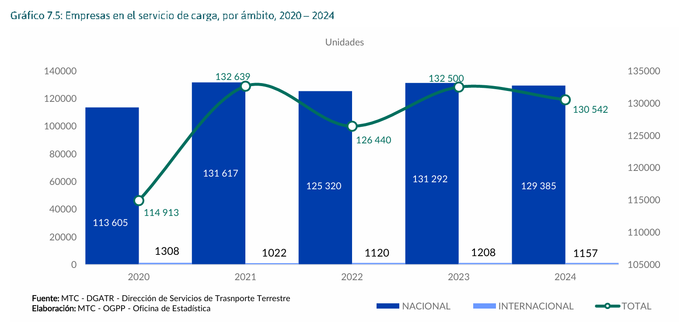

Asimismo, en el año 2024 se realizaron 1 109 510 intervenciones a vehículos de carga. De estas, el 98.4% cumplió con los reglamentos vigentes, mientras que el 1.6% fue calificado como "No conforme". Aunque la cifra de incumplimiento parece mínima, representa 18 298 casos que ponen en riesgo la seguridad y la confianza en el sector. Cabe destacar que, en el período 2020–2024, estos incumplimientos descendieron significativamente, pasando de 41 476 a 18 298 casos, lo que indica un avance en fiscalización, pero también la persistencia de brechas que requieren soluciones tecnológicas y de control más efectivas.

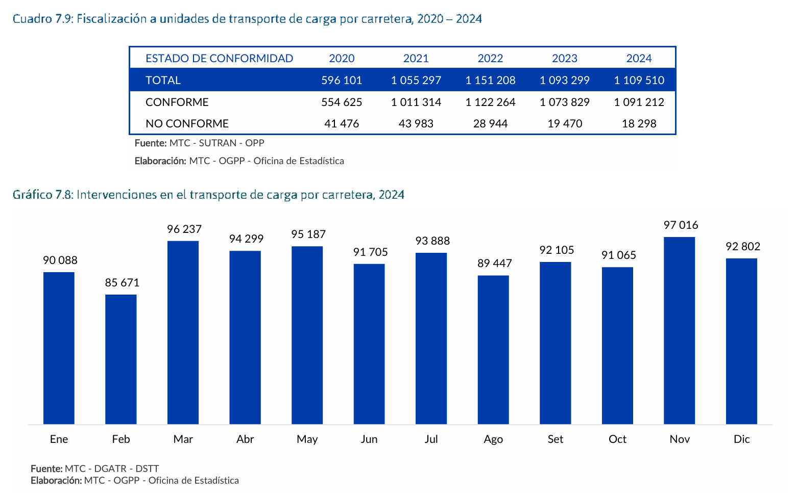

### 1.2.2. Lean UX Process
#### 1.2.2.1. Lean UX Problem Statements

Nuestro servicio ofrece un aplicativo móvil que conecta a clientes que desean transportar carga interprovincial con proveedores que cuentan con flotas disponibles para realizar dicho servicio. La aplicación busca centralizar solicitudes, cotizaciones, pagos y trazabilidad en un solo espacio confiable.

Hemos observado un factor crítico que afecta la confianza y satisfacción de los usuarios: actualmente, el proceso de solicitar transporte y coordinar con proveedores es informal, fragmentado y poco transparente. Los clientes enfrentan dificultades para obtener cotizaciones rápidas y confiables, mientras que los proveedores carecen de herramientas para gestionar sus flotas, pagos y documentación de manera eficiente. Esto genera demoras, desconfianza en los pagos y problemas en la trazabilidad de la carga.

¿Cómo podemos mejorar la confianza, rapidez y transparencia en la gestión del transporte interprovincial, asegurando que tanto clientes como proveedores cumplan sus objetivos con una experiencia clara, segura y satisfactoria dentro del aplicativo móvil?

#### 1.2.2.2. Lean UX Assumptions

**Business Assumptions**

- Creo que mis clientes necesitan una forma rápida, segura y confiable de coordinar el transporte de carga interprovincial con proveedores verificados.
- Estas necesidades se pueden resolver con un aplicativo móvil que centralice solicitudes, cotizaciones en tiempo real, pagos seguros y trazabilidad mediante geolocalización.
- Mis clientes iniciales serán pequeñas y medianas empresas, comerciantes y personas naturales que requieren enviar carga entre provincias.
- El valor #1 que un cliente quiere de mi servicio es confianza y transparencia en el proceso de contratación y transporte.
- El cliente también puede obtener beneficios adicionales como rapidez en recibir cotizaciones, facilidad de pago, gestión automatizada de documentos de transporte y soporte en disputas.
- Voy a adquirir la mayoría de mis clientes a través de campañas digitales, asociaciones con cámaras de comercio, y marketing de boca a boca de los primeros usuarios satisfechos.
- Haré dinero a través de una comisión del 1% sobre cada transacción pagada dentro de la app.
- Mi competencia principal en el mercado serán servicios tradicionales de transporte y marketplaces informales de transporte.
- Los venceremos debido a la seguridad en pagos, la trazabilidad de la carga, la facilidad de uso y la formalidad al emitir documentos automáticamente.
- Mi mayor riesgo de producto es que los usuarios intenten realizar el pago fuera de la app para evitar la comisión.
- Resolveremos esto a través de beneficios exclusivos solo disponibles con el pago en la app.

**User Assumptions**

- ¿Quién es el usuario?<br>
Clientes que necesitan transportar carga interprovincial y proveedores.
- ¿Dónde encaja nuestro producto en su trabajo o vida?<br>
En la organización de sus envíos y operaciones logísticas, reemplazando la informalidad actual por un sistema digital confiable.
- ¿Qué problemas tiene nuestro producto que resolver?<br>
Falta de transparencia en precios, informalidad en la documentación, inseguridad en pagos y dificultad en el seguimiento de la carga.
- ¿Cuándo y cómo es nuestro producto usado?<br>
Los clientes lo usan al generar solicitudes de transporte y pagar servicios; los proveedores al responder cotizaciones, gestionar flotas y coordinar envíos. Ambos lo usan en tiempo real para chatear y dar seguimiento a cargas en tránsito.
- ¿Qué características son importantes?<br>
Cotizaciones en tiempo real, chat seguro, pasarela de pagos integrada, emisión automática de documentos, trazabilidad por geolocalización, calificaciones y reputación.
- ¿Cómo debe verse nuestro producto y cómo comportarse?<br>
Debe tener una interfaz móvil intuitiva, clara y confiable, con notificaciones oportunas, navegación sencilla y elementos visuales que transmitan seguridad y formalidad.

**Feature Assumptions**

- Creemos que la aplicación debe incluir una pasarela de pagos segura que incentive a los clientes a realizar transacciones dentro de la app, garantizando que se cobre la comisión.
- Creemos que la aplicación debe contar con un sistema de geolocalización en tiempo real para que los clientes puedan seguir la trazabilidad de sus envíos.
- Creemos que la aplicación debe generar documentos automáticos (guía de remisión y guía de transportista) tras el pago, lo que dará formalidad y confianza al servicio.
- Creemos que la aplicación debe permitir chat en tiempo real entre cliente y proveedor para coordinar ajustes de última hora en sus envíos.
- Creemos que la aplicación debe ofrecer un sistema de calificaciones y comentarios para aumentar la confianza entre usuarios.

#### 1.2.2.3. Lean UX Hypothesis Statements

- Creemos que los clientes usarán la pasarela de pagos dentro del aplicativo móvil cuando vean que al hacerlo obtienen automáticamente sus documentos de transporte.<br>
Sabremos que hemos tenido éxito<br>
Cuando al menos el 80% de los pagos de tratos formales se realicen dentro de la app y recibamos comentarios positivos sobre la facilidad del trámite de documentos.
- Creemos que los clientes valorarán la trazabilidad en tiempo real de su carga a través de geolocalización.<br>
Sabremos que hemos tenido éxito<br>
Cuando al menos el 70% de los clientes consulte la vista de trazabilidad en cada envío y un 60% de ellos la califique como “muy útil”.
- Creemos que el sistema de calificaciones aumentará la confianza entre clientes y proveedores.<br>
Sabremos que hemos tenido éxito<br>
Cuando al menos el 50% de los usuarios califiquen después de un trato formal y observemos un incremento en la cantidad de solicitudes aceptadas sin necesidad de negociación extensa.
- Creemos que el chat en tiempo real entre cliente y proveedor facilitará la coordinación y reducirá disputas.<br>
Sabremos que hemos tenido éxito<br>
Cuando la tasa de disputas disminuya en al menos un 20% respecto a tratos sin uso de chat activo y los usuarios lo reporten como una herramienta clave para coordinar detalles.

#### 1.2.2.4. Lean UX Canvas

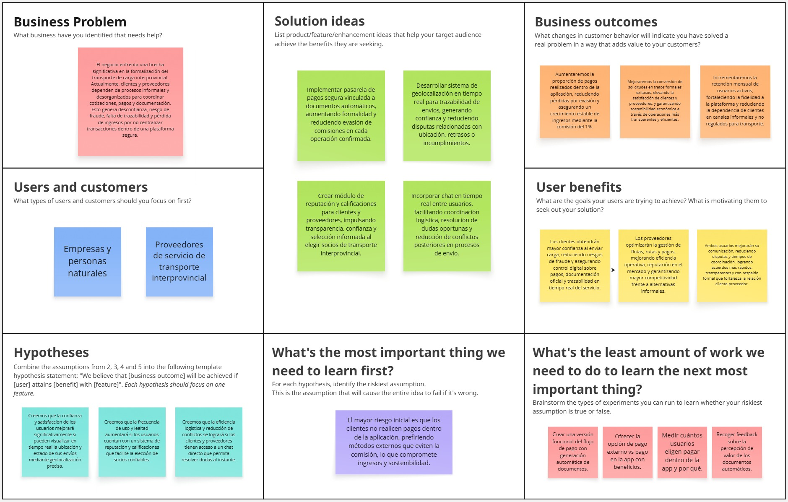

## 1.3. Segmentos objetivo

### 🎯 Segmento Objetivo #1: Personas o empresas que quieren transportar carga de forma interprovincial

#### 📊 Aspectos Demográficos
- **Sexo:** Masculino y Femenino
- **Edades:** 18 a 65+ años (personas naturales) y responsables de logística/administración en empresas
- **Nivel socioeconómico:** Clases A, B, C, D y E

#### 🌍 Aspectos Geográficos
- **Nacionalidad:** Peruana
- **Zona geográfica:** Urbana y rural
- **Departamento:** Todos los departamentos del Perú (incluida Lima Metropolitana y Callao)

#### 🧠 Aspectos Psicográficos
- Valoran comparar precios y tiempos de entrega para optimizar costo/beneficio
- Buscan formalidad (emisión de guía de remisión cuando corresponda) y trazabilidad en tiempo real
- Prefieren procesos simples desde el móvil: solicitud → cotización → trato → pago en la app
- Confían en proveedores con buena reputación, soporte en chat y políticas claras de cambios
- **Perfil de uso:** envíos puntuales (personas) y recurrentes (pymes/empresas), con necesidades de plantilla para ítems frecuentes

---

### 🚛 Segmento Objetivo #2: Administradores de empresas que se encargan del transporte interprovincial de carga

#### 📊 Aspectos Demográficos
- **Sexo:** Masculino y Femenino
- **Edades:** 21 a 65+ años (conductores y administradores/operadores de flota)
- **Nivel socioeconómico:** Clases A, B, C, D y E (predominio de micro, pequeñas y medianas empresas; compatible con grandes flotas)

#### 🌍 Aspectos Geográficos
- **Nacionalidad:** Peruana
- **Zona geográfica:** Urbana y rural
- **Departamento:** Todos los departamentos del Perú (incluida Lima Metropolitana y Callao)

#### 🧠 Aspectos Psicográficos
- Quieren captar demanda formal y estable para mejorar ocupación y flujo de caja
- Valoran una app que facilite cotizar rápido, chatear con el cliente y gestionar documentos (guía de transportista)
- Necesitan activar geolocalización para generar confianza y cumplir con hitos operativos (recogido/en ruta/entregado)
- Prefieren liquidaciones claras en la plataforma (99% al proveedor, 1% fee) y visibilidad de pagos
- **Perfil operativo:** flotas pequeñas y medianas como núcleo, con soporte para grandes operadores y subcontratación controlada

<br>
<br>

<!-- Capítulo II: Requirements Elicitation & Analysis -->
<h1>2.1. Competidores</h1>
<h2>2.1.1. Análisis competitivo</h2>

<table border="1" cellspacing="0" cellpadding="6" width="100%">
  <tr>
    <th colspan="6">Competitive Analysis Landscape</th>
  </tr>

  <tr>
    <td align="center"><b>¿Por qué llevar a cabo este análisis?</b></td>
    <td colspan="5" align="center">
      Identificar cómo <b>RedCarga</b> puede diferenciarse en el mercado peruano de carga interprovincial frente a jugadores existentes,
      qué funcionalidades y tácticas priorizar, y qué riesgos/amenazas debemos mitigar.
    </td>
  </tr>


  <tr>
    <th colspan="2" align="center">Nombre y logo</th>
    <th align="center">Su startup: <b>RedCarga</b></th>
    <th align="center">Competidor 1: <b>Efletex (Perú)</b></th>
    <th align="center">Competidor 2: <b>DeltaX (LatAm)</b></th>
    <th align="center">Competidor 3: <b>MiCarga (Tracklink, Perú)</b></th>
  </tr>

<tr class="table-logos">
  <th colspan="2" align="center">Nombre y logo</th>

  <th align="center">
    <div class="cell-logo">
    
      <div>Su startup: <b>RedCarga</b></div>
    </div>
  </th>

  <th align="center">
    <div class="cell-logo">
      
      <div>Competidor 1: <b>Efletex (Perú)</b></div>
    </div>
  </th>

  <th align="center">
    <div class="cell-logo">
      
      <div>Competidor 2: <b>DeltaX (LatAm)</b></div>
    </div>
  </th>

  <th align="center">
    <div class="cell-logo">
        
      <div>Competidor 3: <b>MiCarga (Tracklink, Perú)</b></div>
    </div>
  </th>
</tr>

  <!-- PERFIL -->
  <tr>
    <th rowspan="2" align="center">Perfil</th>
    <td align="center"><b>Overview</b></td>
    <td>
      <p align="justify">
        <b>RedCarga</b> es una app móvil que conecta empresas/usuarios que envían <b>carga pesada interprovincial</b> con transportistas,
        con experiencia en tiempo real: solicitud con fotos (IA estima medidas), cotizaciones instantáneas, negociación por chat,
        pago in-app, <b>documentos automáticos</b> y <b>tracking GPS obligatorio</b> tras el pago.
      </p>
    </td>
    <td>
      <p align="justify">
        Plataforma peruana de transporte de carga pesada (2018). Conecta generadores de carga con transportistas vía web/móvil,
        modernizando la logística con comunidades de transporte. Empezó B2B y se amplió a pymes/usuarios.
      </p>
    </td>
    <td>
      <p align="justify">
        Plataforma digital B2B (2020) conocida como “Uber de camiones” andino. Ofrece software integral para gestionar logística
        end-to-end y opera en varios países con marketplace regional unificado y respaldo de inversión.
      </p>
    </td>
    <td>
      <p align="justify">
        Plataforma peruana creada por <b>Tracklink</b> (GPS vehicular) para conectar clientes y transportistas a nivel nacional.
        Comunidad online + app móvil; los transportistas ofertan/aceptan servicios “de A a B”.
      </p>
    </td>
  </tr>

  <tr>
    <td align="center"><b>Ventaja competitiva<br/>¿Qué valor ofrece?</b></td>
    <td>
      <ul>
        <li><b>1% de comisión</b> (solo si el pago es in-app) → mejores tarifas netas y retención en la plataforma.</li>
        <li><b>Documentos obligatorios automáticos</b> (guía de remisión y de transportista) tras el pago.</li>
        <li><b>IA</b> para estimar medidas desde fotos + plantillas reutilizables.</li>
        <li>Enfoque <b>Perú</b> (adaptación rápida a normativa local).</li>
      </ul>
    </td>
    <td>
      <ul>
        <li>Pionero local; conocimiento del mercado peruano.</li>
        <li>Ahorro de tiempo/costos; comparación de ofertas.</li>
        <li>Seguimiento GPS 24/7; verificación y reputación.</li>
        <li>Soporte con asesores; menos viajes en vacío.</li>
      </ul>
    </td>
    <td>
      <ul>
        <li>Digitaliza procesos end-to-end (licitaciones, planificación, tracking).</li>
        <li>Homologación/seguridad; alertas y documentación digital.</li>
        <li>Gran red regional; cargas de retorno.</li>
        <li>Fintech: anticipos de pago y beneficios.</li>
      </ul>
    </td>
    <td>
      <ul>
        <li>Matching con <b>cotización y cierre</b> en línea.</li>
        <li><b>Seguimiento GPS</b> con el stack Tracklink.</li>
        <li>App móvil nativa para transportistas (Android/iOS).</li>
      </ul>
    </td>
  </tr>

  <!-- PERFIL DE MARKETING -->
  <tr>
    <th rowspan="2" align="center">Perfil de marketing</th>
    <td align="center"><b>Mercado objetivo</b></td>
    <td>
      <ul>
        <li><b>Perú</b>, rutas interprovinciales.</li>
        <li>Empresas medianas/grandes y transportistas verificados (heavy cargo).</li>
        <li>Pymes con envíos recurrentes y usuarios con envíos puntuales de alto volumen.</li>
      </ul>
    </td>
    <td>
      <ul>
        <li>Perú; carga pesada interprovincial (≥1 t).</li>
        <li>Corporativos (minería, consumo, logística) → pymes/mudanzas.</li>
        <li>No última milla/paquetería ligera.</li>
      </ul>
    </td>
    <td>
      <ul>
        <li>Medianas y grandes empresas (bebidas, puertos, agro, construcción).</li>
        <li>Región andina + México; oferta: empresas y choferes independientes.</li>
      </ul>
    </td>
    <td>
      <ul>
        <li>Perú; cargas ligeras-medianas-pesadas (foco operativo nacional).</li>
        <li>Transportistas con GPS Tracklink y clientes que requieren visibilidad.</li>
      </ul>
    </td>
  </tr>

  <tr>
    <td align="center"><b>Estrategias de marketing</b></td>
    <td>
      <ul>
        <li>Lanzamiento por <b>corredores</b> (Lima–Arequipa, Lima–Piura) con clientes ancla.</li>
        <li><b>Onboarding asistido</b> a transportistas (WhatsApp/llamadas) + verificación rápida.</li>
        <li>Incentivos a <b>pago in-app</b> (documentos + tracking solo tras pagar).</li>
        <li>Narrativa “<b>hecho en Perú</b>”, casos de uso locales y PR sectorial.</li>
      </ul>
    </td>
    <td>
      <ul>
        <li>PR y estudios de mercado; prensa local.</li>
        <li>RR. SS. (comunidad “amigos ruteros”, tutoriales, promos).</li>
        <li>Activaciones B2B y testimonios de ahorros.</li>
      </ul>
    </td>
    <td>
      <ul>
        <li>Ventas consultivas y demos; casos de éxito y logos.</li>
        <li>PR en ecosistema startup; redes para captar transportistas.</li>
        <li>Incentivos (anticipos/beneficios) y oficinas locales.</li>
      </ul>
    </td>
    <td>
      <ul>
        <li>Uso de canales Tracklink (base instalada GPS) y prensa logística.</li>
        <li>Redes sociales para captar oferta y demanda.</li>
        <li>Promesa de seguridad/visibilidad 24/7.</li>
      </ul>
    </td>
  </tr>

  <!-- PERFIL DEL PRODUCTO -->
  <tr>
    <th rowspan="3" align="center">Perfil del producto</th>
    <td align="center"><b>Productos &amp; Servicios</b></td>
    <td>
      <ul>
        <li>Marketplace móvil: solicitud por ítem (fotos→<b>IA</b>→medidas), ruta con puntos intermedios.</li>
        <li><b>Cotizaciones en tiempo real</b>, chat, estado <i>trato</i> y <i>trato formal</i> tras pagar.</li>
        <li><b>Documentos</b> automáticos (cliente/proveedor) y <b>tracking</b> obligatorio.</li>
        <li>Ajustes post-pago: top-ups, reembolsos, y recálculo del 1%.</li>
      </ul>
    </td>
    <td>
      <ul>
        <li>Marketplace: órdenes, chat/alertas, calificaciones.</li>
        <li>Tracking en vivo.</li>
        <li>GPS/fleet propio (reportes, cumplimiento SUTRAN/OSINERGMIN).</li>
        <li>Vertical de mudanzas.</li>
      </ul>
    </td>
    <td>
      <ul>
        <li><b>SaaS TMS</b> configurable (roles, dashboards, KPIs; ML para matching).</li>
        <li>Marketplace por invitación; compartir cargas/rutas entre clientes.</li>
        <li>APIs/integraciones; <b>fintech</b> (anticipos/factoring).</li>
      </ul>
    </td>
    <td>
      <ul>
        <li>Marketplace: clientes publican; transportistas ofertan y cierran en línea.</li>
        <li>Tracking en tiempo real con GPS de Tracklink.</li>
      </ul>
    </td>
  </tr>

  <tr>
    <td align="center"><b>Precios &amp; Costos</b></td>
    <td>
      <ul>
        <li><b>1% de comisión</b> solo si el pago se realiza en la app.</li>
        <li>Con top-ups o reembolsos, el 1% se <b>recalcula</b> sobre el monto final.</li>
        <li>Documentos/tracking se habilitan <b>solo tras el pago</b> (incentivo anti “cerrar por fuera”).</li>
      </ul>
    </td>
    <td>
      <ul>
        <li>Registro/uso básico gratis.</li>
        <li>Comisión al transportista por flete (rango de mercado ~5–10%).</li>
        <li>Ahorros reportados para clientes; GPS con precio adicional.</li>
      </ul>
    </td>
    <td>
      <ul>
        <li>SaaS: suscripción/licenciamiento según tamaño/uso.</li>
        <li>Marketplace: comisión por transacción.</li>
        <li>Ingresos fintech (descuentos/intereses de anticipos).</li>
      </ul>
    </td>
    <td>
      <ul>
        <li>No publica comisión/estructura de precios en canales abiertos.</li>
      </ul>
    </td>
  </tr>

  <tr>
    <td align="center"><b>Canales de distribución<br/>(Web y/o Móvil)</b></td>
    <td>
      <ul>
        <li><b>Móvil (Android)</b> como canal principal.</li>
        <li>Panel web para empresas (posterior/roadmap).</li>
      </ul>
    </td>
    <td>
      <ul>
        <li>Web + apps Android/iOS (&gt;5k descargas Android).</li>
        <li>24/7; notificaciones en tiempo real.</li>
        <li>Soporte telefónico y oficina en Lima; números MX/CO/AR.</li>
      </ul>
    </td>
    <td>
      <ul>
        <li>Web SaaS (empresas) + apps Android/iOS (&gt;10k descargas).</li>
        <li>Tracking resiliente; equipos locales por país.</li>
        <li>Integraciones vía API con ERPs.</li>
      </ul>
    </td>
    <td>
      <ul>
        <li>Web (captación) + <b>MiCarga Transportista</b> en Android/iOS.</li>
      </ul>
    </td>
  </tr>

  <!-- SWOT -->
  <tr>
    <th rowspan="4" align="center">Análisis SWOT</th>
    <td align="center"><b>Fortalezas</b></td>
    <td>
      <ul>
        <li><b>Costos</b>: 1% → propuesta agresiva para atraer oferta/demanda.</li>
        <li><b>Compliance</b>: documentos automáticos + tracking obligatorio.</li>
        <li><b>UX</b> simple y móvil-first; IA en captura de medidas.</li>
        <li><b>Local</b>: velocidad para adaptar normativa peruana.</li>
      </ul>
    </td>
    <td>
      <ul>
        <li>First mover en Perú; red local validada.</li>
        <li>Funcionalidades adaptadas a normativa local.</li>
        <li>Seguridad: verificación + GPS + reputación.</li>
        <li>Soporte personalizado y servicios complementarios (GPS).</li>
      </ul>
    </td>
    <td>
      <ul>
        <li>Solución integral TMS + Marketplace.</li>
        <li>&gt;200 empresas; 42k transportistas, 240k viajes monitoreados.</li>
        <li>Seguridad/homologación y analítica avanzada.</li>
        <li>Respaldo VC; beneficios y fintech.</li>
      </ul>
    </td>
    <td>
      <ul>
        <li>Respaldo Tracklink (confianza + infraestructura GPS).</li>
        <li>Matching con cotización/cierre en app.</li>
        <li>Apps móviles nativas para operación en campo.</li>
      </ul>
    </td>
  </tr>

  <tr>
    <td align="center"><b>Debilidades</b></td>
    <td>
      <ul>
        <li><b>Efecto red</b> inicial limitado (liquidez por corredor).</li>
        <li>Riesgo de <b>desintermediación</b> si no se incentiva pago in-app.</li>
        <li>Necesidad de soporte 24/7 y verificación robusta.</li>
      </ul>
    </td>
    <td>
      <ul>
        <li>Menor escala vs actores regionales.</li>
        <li>Menor financiación; posible menor sofisticación analítica.</li>
        <li>Foco amplio (B2B + mudanzas) diluye esfuerzos.</li>
        <li>Presencia internacional limitada.</li>
      </ul>
    </td>
    <td>
      <ul>
        <li>Menos accesible para pequeños/espóradicos.</li>
        <li>Plataforma compleja; curva de aprendizaje.</li>
        <li>Marketplace por invitación limita crecimiento.</li>
        <li>Riesgos de adopción digital multi-país.</li>
      </ul>
    </td>
    <td>
      <ul>
        <li>Información pública limitada sobre comisiones/precios.</li>
        <li>Foco mixto (ligera-mediana-pesada) puede diluir heavy cargo.</li>
        <li>Dependencia del ecosistema GPS Tracklink.</li>
      </ul>
    </td>
  </tr>

  <tr>
    <td align="center"><b>Oportunidades</b></td>
    <td>
      <ul>
        <li>Formalización (guías electrónicas) y digitalización del sector.</li>
        <li>Nichos de heavy cargo especializado y pymes regionales.</li>
        <li>Alianzas con gremios, terminales, aseguradoras.</li>
      </ul>
    </td>
    <td>
      <ul>
        <li>Digitalización/guías electrónicas; captar independientes.</li>
        <li>Verticales clave: minería, agro, retail.</li>
        <li>Expansión andina y alianzas (seguros, combustible, MTC).</li>
      </ul>
    </td>
    <td>
      <ul>
        <li>Mercado LatAm grande; nuevos países/industrias.</li>
        <li>Profundizar fintech (seguros, leasing, puntos).</li>
        <li>Alianzas gobierno/gremios; monetizar insights.</li>
      </ul>
    </td>
    <td>
      <ul>
        <li>Integrar documentación electrónica para diferenciarse.</li>
        <li>Captar pymes y regiones poco digitalizadas.</li>
        <li>Aprovechar base Tracklink para escalar oferta.</li>
      </ul>
    </td>
  </tr>

  <tr>
    <td align="center"><b>Amenazas</b></td>
    <td>
      <ul>
        <li>Efletex/DeltaX/MiCarga con base instalada o escala.</li>
        <li>Cambios regulatorios/seguros que eleven barreras.</li>
        <li>Desintermediación cliente-transportista.</li>
      </ul>
    </td>
    <td>
      <ul>
        <li>Competidores tecnológicos y nuevos entrantes.</li>
        <li>Actores tradicionales/soluciones internas.</li>
        <li>Cambios regulatorios; resistencia de transportistas.</li>
      </ul>
    </td>
    <td>
      <ul>
        <li>Competencia local ágil y jugadores globales.</li>
        <li>Entornos regulatorios diversos.</li>
        <li>Preferencia por soluciones locales; incidentes de seguridad.</li>
      </ul>
    </td>
    <td>
      <ul>
        <li>DeltaX (escala) y Efletex (arraigo local).</li>
        <li>Nuevos entrantes móviles con UX simple y costos bajos.</li>
      </ul>
    </td>
  </tr>
</table>


### 2.1.2. Estrategias y tácticas frente a competidores

<h4>1) Palancas de diferenciación (Producto, Precio, Plaza, Promoción)</h4>
<ul>
  <li><b>Producto:</b>
    <ul>
      <li><b>Documentos automáticos</b> (guía de remisión/transportista) <u>solo</u> al pagar en-app → reduce fricción y asegura uso del pago in-app.</li>
      <li><b>IA en captura</b> (fotos → medidas sugeridas) + <b>plantillas reutilizables</b> por ítem/ruta para acelerar nuevas solicitudes.</li>
      <li><b>Tracking obligatorio</b> pospago con alertas (salida, llegada a hitos, ETA) y tableros móviles simples para el cliente.</li>
      <li><b>Antidesintermediación:</b> ocultar teléfono/email hasta pago; chat con detección de intento de compartir contacto; <i>beneficios</i> (docs, tracking, soporte) solo si pagan en la app.</li>
    </ul>
  </li>
  <li><b>Precio:</b>
    <ul>
      <li><b>Comisión plana 1%</b> (solo in-app). Mensaje: “Mejor tarifa neta para ambos”.</li>
      <li><b>Incentivos</b>: cantidad limitada de cotizaciones gratuitas de bienvenida para los clientes.</li>
    </ul>
  </li>
  <li><b>Plaza (canales):</b>
    <ul>
      <li><b>Móvil-first</b> (Android). Panel web ligero para empresas (seguimiento y reportes) en fase 2.</li>
      <li><b>Alianzas</b>: gremios/terminales, patios logísticos, cámaras regionales, aseguradoras (seguro básico ligado al pago in-app), pasarela local de bajo costo.</li>
    </ul>
  </li>
  <li><b>Promoción:</b>
    <ul>
      <li><b>Hecho en Perú</b> + cumplimiento local (documentos automáticos) como narrativa central.</li>
      <li><b>Onboarding asistido</b> a transportistas (WhatsApp/llamadas) + jornadas presenciales en terminales.</li>
      <li>Contenido simple: “cómo cotizar”, “cómo activar GPS”, “cómo emitir guías en 1 toque”.</li>
    </ul>
  </li>
</ul>

<br>

## 2.2. Entrevistas
### 2.2.1. Diseño de entrevistas

#### **Segmento 1: Personas o empresas que quieren transportar carga de forma interprovincial**

**Dirigido a:** Personas o representantes de empresas que desean enviar carga interprovincial y buscan seleccionar entre distintas propuestas el servicio más adecuado.<br>
**Objetivo:** Conocer las necesidades, prioridades y problemas de quienes desean transportar carga interprovincialmente, identificando los procesos más complicados o lentos, así como sus expectativas frente a una herramienta digital como Red Carga.<br>
**Preguntas:**<br>
**Preguntas:**  
1. ¿Cuál es su nombre completo?  
2. ¿Qué edad tiene?  
3. ¿En qué provincia reside actualmente?  
4. ¿A qué se dedica (ocupación/empresa)?  
5. ¿Con qué frecuencia realiza envíos interprovinciales y qué tipo de carga envía normalmente?  
6. ¿Cómo busca y selecciona actualmente una empresa de transporte? (canales, criterios).  
7. ¿Cuánto tiempo le toma en promedio encontrar una empresa que se ajuste a sus necesidades?  
8. ¿Qué canales utiliza para contactar a la empresa (teléfono, redes sociales, página web, presencial, etc.)?  
9. ¿Cuántas cotizaciones suele solicitar antes de decidirse por una empresa?  
10. ¿Qué tan fácil o difícil le resulta obtener una cotización adecuada?  
11. ¿Qué documentos o requisitos legales suele solicitarle la empresa de transporte y qué tan complicados le resultan?  
12. ¿Qué medio de pago utiliza normalmente y qué problemas ha tenido en este proceso?  
13. ¿Qué tan importante es para usted la seguridad, el precio, la rapidez y la atención al cliente en este servicio?  
14. ¿Qué experiencias negativas ha tenido en el pasado (demoras, pérdidas, mal servicio, etc.)?  
15. Si existiera una aplicación que centralice cotizaciones, contratos, pagos y seguimiento, ¿qué funcionalidades consideraría imprescindibles?  


#### **Segmento 2: Administradores de empresas que se encargan del transporte interprovincial de carga**

**Dirigido a:** Personas que administran una empresa de transporte interprovincial y desean agilizar sus procesos de conexión con clientes y cotizaciones.<br>
**Objetivo:** Comprender los procesos internos que siguen los administradores desde el primer contacto con el cliente hasta la entrega final, identificando fallas, tiempos, impacto en la calidad del servicio, así como sus expectativas frente a una herramienta digital como Red Carga.<br>
**Preguntas:**<br>
1. ¿Cuál es su nombre completo?  
2. ¿Qué edad tiene?  
3. ¿En qué provincia opera principalmente su empresa?  
4. ¿Cuál es su cargo u ocupación dentro de la empresa?  
5. ¿Qué tipo de carga gestionan con mayor frecuencia y qué volumen promedio manejan en sus envíos?  
6. ¿Cómo es actualmente el proceso desde que un cliente solicita información hasta la confirmación de un envío?  
7. ¿Cuánto suele demorar este proceso y qué pasos generan más retrasos?  
8. ¿Qué canales utilizan para captar clientes y cuáles resultan más efectivos?  
9. ¿Qué factores influyen más en la decisión de un cliente al contratarlos (precio, tiempo, seguridad, reputación)?  
10. ¿Qué problemas o dificultades se presentan con mayor frecuencia al coordinar un envío?  
11. ¿Qué tipo de documentos o trámites legales deben gestionarse en cada envío y qué dificultades enfrentan con ellos?  
12. ¿Qué dificultades han tenido en el manejo de contratos, comprobantes de pago o facturación?  
13. ¿Qué aspectos considera más débiles en la comunicación actual con los clientes?  
14. ¿Cómo gestionan actualmente el seguimiento de la carga y qué tan importante es la trazabilidad en tiempo real?  
15. Si existiera una aplicación que le permita centralizar en un solo lugar la gestión de cotizaciones, contratos, pagos y seguimiento de envíos, ¿qué funcionalidades le resultarían más valiosas para su empresa?


<br>

### 2.2.2. Registro de entrevistas

<div align="center">

## 📊 **Análisis del Segmento Objetivo #1**

*Personas o empresas que quieren transportar carga de forma interprovincial*
## 📋 **Entrevista #1**

<table align="center" style="margin: 0 auto;">
  <tr>
    <td><strong>Campo</strong></td>
    <td><strong>Información</strong></td>
  </tr>
  <tr>
    <td><strong>Nombre completo</strong></td>
    <td> Jocelyn Damaly Almerco Rojas</td>
  </tr>
  <tr>
    <td><strong>Edad</strong></td>
    <td>22 años</td>
  </tr>
  <tr>
    <td><strong>Cargo / Rol en la empresa</strong></td>
    <td>Dueña de un negocio de venta al por mayor de ropa </td>
  </tr>
  <tr>
    <td><strong>Enlace del video</strong></td>
    <td><a href="https://upcedupe-my.sharepoint.com/personal/u202315044_upc_edu_pe/_layouts/15/stream.aspx?id=%2Fpersonal%2Fu202315044%5Fupc%5Fedu%5Fpe%2FDocuments%2F2025%2020%2E%20%5B1ACC0238%5D%20Aplicaciones%20para%20Dispositivos%20M%C3%B3viles%2Ftrabajo%2Fentrevistas%2FEntrevistas%20Red%20Carga%2Emp4&referrer=StreamWebApp%2EWeb&referrerScenario=AddressBarCopied%2Eview%2Ed5e5774e%2Dceb5%2D408d%2D9745%2Dd83a3086968e">Entrevista 1</a></td>
  </tr>
  <tr>
    <td><strong>Duración</strong></td>
    <td>Inicio: 0:00 s - Fin: 5:04 s</td>
  </tr>
</table>

### 📸 **Imagen de la Entrevista**


### 📝 **Resumen de la Entrevista**
Jocelyn Damaly Almerco, de 22 años y residente de Lima, es dueña de un negocio mayorista de ropa importada que vende a boutiques, ferias y emprendedores en provincias; realiza envíos interprovinciales todas las semanas (6 a 8 al mes), generalmente en bultos grandes o “pacas” de 20 a 60 prendas por caja. Para encontrar transporte recurre a recomendaciones en grupos de Facebook y WhatsApp y, a veces, a Google; compara precio, seguridad y rapidez, solicita entre 3 y 4 cotizaciones y demora de 1 a 2 días en decidir, contactando sobre todo por WhatsApp y llamadas (y de manera presencial si el envío es muy grande). Suele lidiar con cotizaciones confusas porque no siempre queda claro si cobran por peso o por volumen ni si incluyen seguro. Asimismo con trámites de guía de remisión, factura y comprobantes; paga por transferencia o depósito y le incomoda cuando le exigen efectivo para montos altos. Sus prioridades son la seguridad, la rapidez, un precio competitivo y una buena atención al cliente; ha sufrido demoras de varios días, cajas maltratadas e incluso la pérdida total de un paquete. Para una app ideal, considera imprescindibles la cotización inmediata por peso/volumen (con el “peso cobrable” claro), contratar seguro desde la app, pagos digitales seguros (Yape, Plin, tarjeta, transferencia), seguimiento en tiempo real y un historial con comprobantes digitales para su control contable.

---
## 📋 **Entrevista #2**

<table align="center" style="margin: 0 auto;">
  <tr>
    <td><strong>Campo</strong></td>
    <td><strong>Información</strong></td>
  </tr>
  <tr>
    <td><strong>Nombre completo</strong></td>
    <td>Alexander Miranda Vivanco</td>
  </tr>
  <tr>
    <td><strong>Edad</strong></td>
    <td>25 años</td>
  </tr>
  <tr>
    <td><strong>Cargo / Rol en la empresa</strong></td>
    <td>Vendedor de dispositivos electrónico</td>
  </tr>
  <tr>
    <td><strong>Enlace del video</strong></td>
    <td><a href="https://upcedupe-my.sharepoint.com/personal/u202315044_upc_edu_pe/_layouts/15/stream.aspx?id=%2Fpersonal%2Fu202315044%5Fupc%5Fedu%5Fpe%2FDocuments%2F2025%2020%2E%20%5B1ACC0238%5D%20Aplicaciones%20para%20Dispositivos%20M%C3%B3viles%2Ftrabajo%2Fentrevistas%2FEntrevistas%20Red%20Carga%2Emp4&referrer=StreamWebApp%2EWeb&referrerScenario=AddressBarCopied%2Eview%2Ed5e5774e%2Dceb5%2D408d%2D9745%2Dd83a3086968e">Entrevista 1</a></td>
  </tr>
  <tr>
    <td><strong>Duración</strong></td>
    <td>Inicio: 5:05 s - Fin: 12:43 s</td>
  </tr>
</table>

### 📸 **Imagen de la Entrevista**


### 📝 **Resumen de la Entrevista**
Alexander Miranda Vivanco, 25 años, radicado en Lima, vende dispositivos electrónicos y realiza envíos interprovinciales a diario. Para encontrar transporte recurre a redes sociales, priorizando empresas con buenas referencias, y suele cerrar acuerdos en un día. Se comunica principalmente por teléfono o WhatsApp y compara entre cuatro y cinco cotizaciones antes de decidirse. Sus principales fricciones son la comparación entre propuestas,a veces poco claras entre sí, y la demora en las respuestas de los transportistas, lo que termina retrasando sus despachos. Le solicitan guía de remisión; paga por transferencia o tarjeta sin mayores inconvenientes. Valora por encima de todo la seguridad y la rapidez, seguidas de un precio competitivo y una atención al cliente eficaz; ha experimentado demoras e incluso la pérdida de un paquete en ruta. En una app ideal, considera indispensables la cotización inmediata y el seguimiento en tiempo real de sus envíos.


---

## 📋 **Entrevista #3**

<table align="center" style="margin: 0 auto;">
  <tr>
    <td><strong>Campo</strong></td>
    <td><strong>Información</strong></td>
  </tr>
  <tr>
    <td><strong>Nombre completo</strong></td>
    <td>Mariano Oblitas</td>
  </tr>
  <tr>
    <td><strong>Edad</strong></td>
    <td>19 años</td>
  </tr>
  <tr>
    <td><strong>Cargo / Rol en la empresa</strong></td>
    <td>Vendedor de pesas</td>
  </tr>
  <tr>
    <td><strong>Enlace del video</strong></td>
    <td><a href="https://upcedupe-my.sharepoint.com/personal/u202315044_upc_edu_pe/_layouts/15/stream.aspx?id=%2Fpersonal%2Fu202315044%5Fupc%5Fedu%5Fpe%2FDocuments%2F2025%2020%2E%20%5B1ACC0238%5D%20Aplicaciones%20para%20Dispositivos%20M%C3%B3viles%2Ftrabajo%2Fentrevistas%2FEntrevistas%20Red%20Carga%2Emp4&referrer=StreamWebApp%2EWeb&referrerScenario=AddressBarCopied%2Eview%2E48fd1635%2Ddc6d%2D4463%2Db15a%2D424760a0467b">Entrevista 3</a></td>
  </tr>
  <tr>
    <td><strong>Duración</strong></td>
    <td>Inicio: 12:43 s - Fin: 18:58 s</td>
  </tr>
</table>

### 📸 **Imagen de la Entrevista**


### 📝 **Resumen de la Entrevista**
Mariano Oblitas, de 19 años y residente en Lima, tiene un emprendimiento de venta de pesas y barras y realiza envíos interprovinciales una o dos veces por semana. Sus paquetes suelen pesar 10–15 kg y, cuando incluye barras, viajan en cajas grandes. Para elegir transportistas busca referencias en comunidades de vendedores (Mercado Libre y grupos de Facebook) y prioriza la confiabilidad/renombre porque, según cuenta, algunas empresas pequeñas no cumplen, llegan tarde, malogran el paquete o mandan a la dirección equivocada. El tiempo para encontrar una empresa adecuada puede ser de 3–4 horas, en especial por coberturas parciales (hay transportistas que solo van al norte o al sur). Suele contactar a 3–4 proveedores del “ranking” compartido por la comunidad y decide combinando fiabilidad y precio. Cotizar no es sencillo: frecuentemente no responden rápido o brindan información incompleta (dicen solo el precio, no aclaran si incluye seguro, si el envío es directo o si lo derivan, etc.). En requisitos, le piden Guía de Remisión, DNI del remitente, datos de origen (para asignarle almacén de despacho) y datos del destinatario. Paga con efectivo y Yape/Plin, pero a veces el transportista no acepta el medio elegido, obligándolo a buscar una alternativa. En prioridades, valora todo (seguridad, precio, rapidez y atención), pero pone por delante el precio y la seguridad: puede tolerar 3–5 días de tránsito si el costo no le genera pérdidas y si el producto viaja asegurado para cubrir daños o robos. Para una app ideal, quiere comparar precios fácilmente, ver reseñas reales de clientes, contar con seguimiento en tiempo real tipo “tracking” y chatear con el transportista dentro de la plataforma.


---
## 📊 **Análisis del Segmento Objetivo #2**

*Administradores de empresas que se encargan del transporte interprovincial de carga*

## 📋 **Entrevista #4**

<table align="center" style="margin: 0 auto;">
  <tr>
    <td><strong>Campo</strong></td>
    <td><strong>Información</strong></td>
  </tr>
  <tr>
    <td><strong>Nombre completo</strong></td>
    <td>Vladimir Rogel Elera Ozeta</td>
  </tr>
  <tr>
    <td><strong>Edad</strong></td>
    <td>51 años</td>
  </tr>
  <tr>
    <td><strong>Cargo / Rol en la empresa</strong></td>
    <td>Administrador</td>
  </tr>
  <tr>
    <td><strong>Enlace del video</strong></td>
    <td><a href="https://upcedupe-my.sharepoint.com/personal/u202315044_upc_edu_pe/_layouts/15/stream.aspx?id=%2Fpersonal%2Fu202315044%5Fupc%5Fedu%5Fpe%2FDocuments%2F2025%2020%2E%20%5B1ACC0238%5D%20Aplicaciones%20para%20Dispositivos%20M%C3%B3viles%2Ftrabajo%2Fentrevistas%2FEntrevistas%20Red%20Carga%2Emp4&referrer=StreamWebApp%2EWeb&referrerScenario=AddressBarCopied%2Eview%2E2d2a8cf5%2D9aa8%2D4b1c%2D9853%2De2206c54d30a&startedResponseCatch=true">Entrevista 4</a></td>
  </tr>
  <tr>
    <td><strong>Duración</strong></td>
    <td>Inicio: 18:58 s - Fin: 26:15 s</td>
  </tr>
</table>

### 📸 **Imagen de la Entrevista**


### 📝 **Resumen de la Entrevista**

Vladimir Rogel Elera Ozeta, de 51 años, es administrador de una empresa que opera principalmente en Chiclayo y Tumbes. Señala que gestionan todo tipo de carga incluyendo motos, mototaxis, autos y paquetería y que el proceso actual va de forma directa y presencial: los clientes llegan a la oficina, realizan la consulta y allí mismo se coordina el envío.

Indica que el mayor retraso ocurre por el regateo de precios: aunque existen precios estándar, suelen flexibilizarlos a pedido del cliente, lo que dilata el cierre. En la coordinación operativa, la dificultad recurrente está en el acomodado de encomiendas (cuidado de frágiles, orden de descarga priorizando destinos lejanos) y la enseñanza al personal que realiza esa tarea. En documentación, trabajan con boleta, factura o guía de remisión y hoy enfrentan objeciones de algunos clientes por la transición obligatoria a la guía de remisión electrónica de SUNAT. En contraste, afirma no tener problemas con contratos, pagos o facturación. Sobre la comunicación, no la percibe débil, pero reconoce como punto flaco la precisión de precios debido al regateo.

Para captar clientes, su principal canal sigue siendo el boca a boca, aunque recientemente están incursionando en redes sociales. Como factores que inclinan la decisión de los clientes, menciona la confianza: cuentan con un local seguro para resguardar mercadería y garantizan buena condición en la entrega. Respecto al seguimiento, utilizan equipos GPS y un sistema de monitoreo para ubicar en tiempo real las unidades. Finalmente, considera que una aplicación que centralice cotizaciones, contratos, pagos y tracking sería excelente: permitiría acordar precios y gestionar sin ir al local, y ayudaría a expandirse más allá del boca a boca y atraer más clientes.

---

## 📋 **Entrevista #5**

<table align="center" style="margin: 0 auto;">
  <tr>
    <td><strong>Campo</strong></td>
    <td><strong>Información</strong></td>
  </tr>
  <tr>
    <td><strong>Nombre completo</strong></td>
    <td>Antonieta Ayra</td>
  </tr>
  <tr>
    <td><strong>Edad</strong></td>
    <td>67 años</td>
  </tr>
  <tr>
    <td><strong>Cargo / Rol en la empresa</strong></td>
    <td>Gerencia</td>
  </tr>
  <tr>
    <td><strong>Enlace del video</strong></td>
    <td><a href="https://upcedupe-my.sharepoint.com/personal/u202315044_upc_edu_pe/_layouts/15/stream.aspx?id=%2Fpersonal%2Fu202315044%5Fupc%5Fedu%5Fpe%2FDocuments%2F2025%2020%2E%20%5B1ACC0238%5D%20Aplicaciones%20para%20Dispositivos%20M%C3%B3viles%2Ftrabajo%2Fentrevistas%2FEntrevistas%20Red%20Carga%2Emp4&referrer=StreamWebApp%2EWeb&referrerScenario=AddressBarCopied%2Eview%2Ec9a707b5%2D00b1%2D42d3%2D9893%2D5f8f2bd163e9&startedResponseCatch=true">Entrevista 5</a></td>
  </tr>
  <tr>
    <td><strong>Duración</strong></td>
    <td>Inicio: 26:16 s - Fin: 30:57 s</td>
  </tr>
</table>

### 📸 **Imagen de la Entrevista**


### 📝 **Resumen de la Entrevista**

Antonieta Ayra (67), gerente de una empresa con operación en Chiclayo, explica que reciben con mayor frecuencia mototaxis, motos lineales, motores, televisores nuevos, mudanzas y mercadería diversa. El flujo actual es presencial: el cliente se acerca a la oficina, solicita el precio y, si acepta, deja boleta o factura para que la empresa emita su guía de transportes. Señala que la tramitación en sí no suele generar demoras; los atrasos aparecen al arribo cuando el consignatario no recoge la carga y esta puede quedar 2–3 días en la oficina de destino. Resalta que la captación de clientes se apoya en la antigüedad de la empresa y en la seguridad del servicio: muchos usuarios confían su producto al local de Chiclayo para el traslado "con todo seguro".

En materia documentaria, subraya la formalidad: boleta para persona natural y factura para persona jurídica, y menciona como dificultad la resistencia de algunos clientes acostumbrados a la informalidad. Para el seguimiento del envío, indica que los camiones cuentan con GPS y se monitorean para conocer ubicación y hora de llegada en tiempo real. Sobre una aplicación como Red Carga, valora poder centralizar cotizaciones, contratos, pagos y tracking, además de acceder a una base más amplia de clientes; le resultan clave la puntualidad y los pagos directos, considerando que algunos clientes cancelan al dejar el producto y otros en destino, pero en todos los casos la mercadería viaja lista.

---

## 📋 **Entrevista #6**

<table align="center" style="margin: 0 auto;">
  <tr>
    <td><strong>Campo</strong></td>
    <td><strong>Información</strong></td>
  </tr>
  <tr>
    <td><strong>Nombre completo</strong></td>
    <td>Erika Rodríguez</td>
  </tr>
  <tr>
    <td><strong>Edad</strong></td>
    <td>46 años</td>
  </tr>
  <tr>
    <td><strong>Cargo / Rol en la empresa</strong></td>
    <td>Administrador</td>
  </tr>
  <tr>
    <td><strong>Enlace del video</strong></td>
    <td><a href="https://upcedupe-my.sharepoint.com/personal/u202315044_upc_edu_pe/_layouts/15/stream.aspx?id=%2Fpersonal%2Fu202315044_upc_edu_pe%2FDocuments%2F2025+20.+%5B1ACC0238%5D+Aplicaciones+para+Dispositivos+M%C3%B3viles%2Ftrabajo%2Fentrevistas%2FEntrevistas+Red+Carga.mp4&referrer=StreamWebApp.Web&referrerScenario=AddressBarCopied.view.1955f1c9-6535-4a47-bf98-65deeb8d68e0&startedResponseCatch=true">Entrevista 6</a></td>
  </tr>
  <tr>
    <td><strong>Duración</strong></td>
    <td>Inicio: 30:57 s - Fin: 34:39 s</td>
  </tr>
</table>

### 📸 **Imagen de la Entrevista**


### 📝 **Resumen de la Entrevista**

Erika Rodríguez, 46 años, administradora, comenta que gestionan principalmente paquetería, mudanzas, mototaxis y motos lineales, con un flujo operativo breve y puntual al que aplican un seguimiento riguroso para asegurar que todo marche bien. Señala que los retrasos más habituales provienen de la verificación de que la encomienda efectivamente llegue a destino en el tiempo previsto. Para captar clientes usan atención directa en los counters, WhatsApp y teléfono; los más efectivos son WhatsApp y el trato personal en mostrador. Afirma que los eligen por puntualidad, rapidez y precio. En lo documentario, cada envío debe ir con declaración jurada, boleta, guía de remisión o factura; la fricción típica surge por la informalidad de algunos clientes, a quienes piden firmar una declaración jurada si no cuentan con los papeles exactos. No reporta problemas en contratos, pagos o facturación. El seguimiento se realiza por GPS. Sobre una aplicación, valora centralizar cotizaciones, contratos, pagos y tracking para atraer y atender a más clientes.

---


</div>


### 2.2.3. Análisis de entrevistas

<div align="center">

<!-- =============================================== -->
<!-- SEGMENTO: Remitentes que comparan transportistas -->
<!-- =============================================== -->
<hr>

<h2>📊 <strong>Análisis del Segmento Objetivo #1</strong></h2>
<p><strong>Dirigido a:</strong> Personas o representantes de empresas que desean enviar carga interprovincial y buscan seleccionar entre distintas propuestas el servicio más adecuado.</p>

<p><em>Base: 3 entrevistas (Jocelyn, Alexander, Mariano)</em></p>


---

<!-- ========================= -->
<!-- Características Objetivas -->
<!-- ========================= -->
<h3>🎯 <strong>Características Objetivas</strong></h3>

<h4>👥 <strong>Demografía y rol</strong></h4>
<table align="center" style="margin:0 auto;">
  <tr>
    <td><strong>Rango de edad</strong></td>
    <td>19–25 años</td>
  </tr>
  <tr>
    <td><strong>Ubicación</strong></td>
    <td>Lima (100%)</td>
  </tr>
  <tr>
    <td><strong>Actividad</strong></td>
    <td>Venta mayorista/minorista (ropa importada, electrónicos, pesas/barras)</td>
  </tr>
</table>

<h4>🌍 <strong>Ámbito y frecuencia</strong></h4>
<table align="center" style="margin:0 auto;">
  <tr>
    <td><strong>Destino</strong></td>
    <td>Provincias a nivel nacional (coberturas parciales por zonas en algunos casos)</td>
  </tr>
  <tr>
    <td><strong>Frecuencia</strong></td>
    <td>Diaria (1 caso), semanal 1–2 veces (1 caso), 6–8 envíos/mes (1 caso)</td>
  </tr>
  <tr>
    <td><strong>Tipo/volumen de carga</strong></td>
    <td>Pacas de 20–60 prendas; dispositivos electrónicos; pesas (10–15 kg) y barras (cajas grandes)</td>
  </tr>
</table>

<h4>🔎 <strong>Búsqueda y selección</strong></h4>
<table align="center" style="margin:0 auto;">
  <tr>
    <td><strong>Canales de descubrimiento</strong></td>
    <td>Grupos de Facebook y WhatsApp; comunidades de vendedores; Google</td>
  </tr>
  <tr>
    <td><strong>Contacto</strong></td>
    <td>WhatsApp y llamadas (presencial para bultos muy grandes)</td>
  </tr>
  <tr>
    <td><strong>Criba inicial</strong></td>
    <td>Confiabilidad/renombre, precio y cobertura por ruta (norte/sur/todo Perú)</td>
  </tr>
  <tr>
    <td><strong>Alternativas comparadas</strong></td>
    <td>3–5 cotizaciones por envío</td>
  </tr>
  <tr>
    <td><strong>Tiempo a decisión</strong></td>
    <td>De 3–4 horas a 1–2 días</td>
  </tr>
</table>

<h4>💳 <strong>Pagos</strong></h4>
<table align="center" style="margin:0 auto;">
  <tr>
    <td><strong>Métodos usados</strong></td>
    <td>Transferencia/depósito, tarjeta; Yape/Plin; efectivo en algunos casos</td>
  </tr>
  <tr>
    <td><strong>Fricciones</strong></td>
    <td>Exigencia de efectivo para montos altos; proveedores que no aceptan el medio elegido</td>
  </tr>
</table>

<h4>📋 <strong>Documentación</strong></h4>
<table align="center" style="margin:0 auto;">
  <tr>
    <td><strong>Requisitos comunes</strong></td>
    <td>Guía de remisión (obligatoria), datos de remitente/destinatario; factura/boleta (según caso)</td>
  </tr>
  <tr>
    <td><strong>Trabas típicas</strong></td>
    <td>Cotizaciones confusas (peso vs. volumen, “peso cobrable”); claridad del seguro</td>
  </tr>
</table>

<!-- ========================= -->
<!-- Características Subjetivas -->
<!-- ========================= -->
<h3>🧠 <strong>Características Subjetivas</strong></h3>

<h4>⭐ <strong>Valores y prioridades</strong></h4>
<table align="center" style="margin:0 auto;">
  <tr>
    <td><strong>Top 1–3</strong></td>
    <td>Seguridad del envío; precio competitivo; rapidez</td>
  </tr>
  <tr>
    <td><strong>Servicio</strong></td>
    <td>Atención clara y oportuna; reputación/renombre del transportista</td>
  </tr>
  <tr>
    <td><strong>Tolerancias</strong></td>
    <td>Admiten 3–5 días de tránsito si hay buen precio y seguro</td>
  </tr>
</table>

<!-- ============================ -->
<!-- Fricciones y puntos de dolor -->
<!-- ============================ -->
<!-- ⚠️ Fricciones Operativas Identificadas -->
<h3>⚠️ <strong>Fricciones Operativas Identificadas</strong></h3>
<table align="center" style="margin:0 auto; border-collapse:collapse;" border="1" cellpadding="8">
  <thead>
    <tr>
      <th>Fricción</th>
      <th>Detalle observado</th>
    </tr>
  </thead>
  <tbody>
    <tr>
      <td>Cotizaciones incompletas</td>
      <td>No aclaran peso vs. volumen (“peso cobrable”) ni si incluye seguro; falta estandarización.</td>
    </tr>
    <tr>
      <td>Demora en respuestas</td>
      <td>Respuestas tardías de transportistas que retrasan el despacho y la decisión.</td>
    </tr>
    <tr>
      <td>Cobertura por zonas</td>
      <td>Transportistas que solo cubren norte/sur; obliga a buscar alternativas por ruta.</td>
    </tr>
    <tr>
      <td>Incidencias en envío</td>
      <td>Demoras, cajas maltratadas, direcciones erróneas y pérdidas reportadas.</td>
    </tr>
    <tr>
      <td>Pagos con fricción</td>
      <td>Exigencia de efectivo para montos altos o rechazo del medio preferido (Yape/Plin/tarjeta).</td>
    </tr>
  </tbody>
</table>

<!-- 💡 Necesidades y Deseos -->
<h3>💡 <strong>Necesidades y Deseos</strong></h3>
<table align="center" style="margin:16px auto; border-collapse:collapse;" border="1" cellpadding="8">
  <thead>
    <tr>
      <th>Necesidad/Deseo</th>
      <th>Descripción</th>
    </tr>
  </thead>
  <tbody>
    <tr>
      <td>Cotización inmediata y clara</td>
      <td>Mostrar precio por peso/volumen, “peso cobrable”, cobertura y tiempos estimados.</td>
    </tr>
    <tr>
      <td>Seguro configurable</td>
      <td>Contratar/activar seguro desde la app con monto y condiciones visibles.</td>
    </tr>
    <tr>
      <td>Pagos digitales seguros</td>
      <td>Yape, Plin, tarjeta y transferencia con comprobantes digitales automáticos.</td>
    </tr>
    <tr>
      <td>Tracking en tiempo real</td>
      <td>Seguimiento del envío con hitos (“recibido”, “en ruta”, “llegó”, “listo para recojo”).</td>
    </tr>
    <tr>
      <td>Historial y documentos</td>
      <td>Centralizar guías, boletas/facturas y comprobantes para control contable.</td>
    </tr>
    <tr>
      <td>Confianza y comunicación</td>
      <td>Reseñas verificadas del transportista y chat in-app para coordinar.</td>
    </tr>
  </tbody>
</table>

<!-- 🎯 Oportunidades Claras para Red Carga -->
<h3>🎯 <strong>Oportunidades Claras para Red Carga</strong></h3>
<table align="center" style="margin:0 auto; border-collapse:collapse;" border="1" cellpadding="8">
  <thead>
    <tr>
      <th>Oportunidad</th>
      <th>Cómo se implementa</th>
      <th>Beneficio esperado</th>
    </tr>
  </thead>
  <tbody>
    <tr>
      <td>Comparador estandarizado</td>
      <td>Ficha de cotización con campos obligatorios (precio, peso/volumen, seguro, directo/derivado, cobertura, ETA).</td>
      <td>Reduce ambigüedad y acelera la decisión.</td>
    </tr>
    <tr>
      <td>Motor de cobertura por ruta</td>
      <td>Filtro automático por origen/destino (norte/sur/todo Perú) antes de cotizar.</td>
      <td>Evita cotizaciones inviables y ahorra tiempo.</td>
    </tr>
    <tr>
      <td>Checkout de pago flexible</td>
      <td>Compatibilidad visible con Yape/Plin/tarjeta/transferencia y emisión de comprobantes.</td>
      <td>Disminuye fricción y rechazos en el pago.</td>
    </tr>
    <tr>
      <td>Tracking + eventos</td>
      <td>Geolocalización del proveedor y notificaciones de hitos del envío.</td>
      <td>Transparencia y tranquilidad para el cliente.</td>
    </tr>
    <tr>
      <td>Gestión documental guiada</td>
      <td>Asistente para generar/adjuntar guía de remisión y comprobantes, con historial descargable.</td>
      <td>Cumplimiento y orden contable.</td>
    </tr>
    <tr>
      <td>Reputación y soporte</td>
      <td>Ratings verificados, evidencia de envíos previos y chat in-app para incidencias.</td>
      <td>Mayor confianza y resolución rápida de problemas.</td>
    </tr>
  </tbody>
</table>

</div>

---

<div align="center">

## 📊 **Análisis del Segmento Objetivo #2**

*Administradores de empresas que se encargan del transporte interprovincial de carga*

---

### 🎯 **Características Objetivas**

#### 👥 **Demografía y Rol**

<table align="center" style="margin: 0 auto;">
  <tr>
    <td><strong>Rango de edad</strong></td>
    <td>46–67 años</td>
  </tr>
  <tr>
    <td><strong>Rol</strong></td>
    <td>Administración/Gerencia en empresas de transporte interprovincial (100% de entrevistados)</td>
  </tr>
</table>

#### 🌍 **Ámbito Geográfico**

<table align="center" style="margin: 0 auto;">
  <tr>
    <td><strong>Operación principal</strong></td>
    <td>Chiclayo (67%)</td>
  </tr>
  <tr>
    <td><strong>Cobertura extendida</strong></td>
    <td>Chiclayo–Tumbes (33%)</td>
  </tr>
</table>

#### 📦 **Portafolio de Carga**

<table align="center" style="margin: 0 auto;">
  <tr>
    <td><strong>Tipos más frecuentes</strong></td>
    <td>Paquetería, mudanzas, mototaxis, motos lineales, motores y televisores (100%)</td>
  </tr>
  <tr>
    <td><strong>Otros</strong></td>
    <td>Autos (33%)</td>
  </tr>
</table>

#### 🔄 **Proceso Actual (de consulta a envío)**

<table align="center" style="margin: 0 auto;">
  <tr>
    <td><strong>Modalidad</strong></td>
    <td>Predominio presencial en mostrador/counter u oficina para cotizar y confirmar (100%)</td>
  </tr>
  <tr>
    <td><strong>Documentos en el cierre</strong></td>
    <td>Boleta o factura y guía (100%)</td>
  </tr>
</table>

#### 📞 **Canales de Captación y Atención**

<table align="center" style="margin: 0 auto;">
  <tr>
    <td><strong>Canal principal</strong></td>
    <td>Directo/presencial (100%)</td>
  </tr>
  <tr>
    <td><strong>Motor de confianza</strong></td>
    <td>Boca a boca (67%)</td>
  </tr>
  <tr>
    <td><strong>Canales digitales</strong></td>
    <td>WhatsApp/teléfono operativos para atención/cierre (33%)</td>
  </tr>
  <tr>
    <td><strong>Expansión digital</strong></td>
    <td>Intención de ampliar presencia digital/redes (67%)</td>
  </tr>
</table>

#### 💰 **Pagos**

<table align="center" style="margin: 0 auto;">
  <tr>
    <td><strong>Modalidad</strong></td>
    <td>Mixta: pago en origen o en destino (33% lo menciona explícito)</td>
  </tr>
  <tr>
    <td><strong>Disposición</strong></td>
    <td>100% abiertos a centralizar pagos en una app</td>
  </tr>
</table>

#### 📋 **Documentación y Formalidad**

<table align="center" style="margin: 0 auto;">
  <tr>
    <td><strong>Requisitos mínimos</strong></td>
    <td>Boleta/factura + guía (100%)</td>
  </tr>
  <tr>
    <td><strong>Transición regulatoria</strong></td>
    <td>Guía de remisión electrónica (SUNAT) y objeciones de clientes (33%)</td>
  </tr>
  <tr>
    <td><strong>Brecha de formalidad</strong></td>
    <td>Casos de informalidad del cliente; se recurre a declaración jurada (67%)</td>
  </tr>
</table>

#### 🛰️ **Seguimiento y Trazabilidad**

<table align="center" style="margin: 0 auto;">
  <tr>
    <td><strong>Equipos</strong></td>
    <td>GPS en unidades y monitoreo interno (100%)</td>
  </tr>
  <tr>
    <td><strong>Interés en compartir</strong></td>
    <td>Trazabilidad al cliente y centralizar eventos en una sola plataforma (100%)</td>
  </tr>
</table>

---

### 🧠 **Características Subjetivas**

#### ⭐ **Valores y Prioridades**

<table align="center" style="margin: 0 auto;">
  <tr>
    <td><strong>Confianza y seguridad</strong></td>
    <td>Local seguro, cuidado del estado del producto (100%)</td>
  </tr>
  <tr>
    <td><strong>Puntualidad/rapidez</strong></td>
    <td>67%</td>
  </tr>
  <tr>
    <td><strong>Precio competitivo</strong></td>
    <td>67%</td>
  </tr>
</table>

#### 🎯 **Actitudes y Expectativas**

<table align="center" style="margin: 0 auto;">
  <tr>
    <td><strong>Orientación a resultados</strong></td>
    <td>Buscan que "todo marche bien" con seguimiento riguroso (100%)</td>
  </tr>
  <tr>
    <td><strong>Apertura a digitalizar</strong></td>
    <td>Si acelera respuesta, evita visitas al local y amplía clientes (100%)</td>
  </tr>
  <tr>
    <td><strong>Comunicación constante</strong></td>
    <td>Sobre el estado del envío (67%)</td>
  </tr>
</table>

---

### ⚠️ **Fricciones Operativas Identificadas**

<table align="center" style="margin: 0 auto;">
  <tr>
    <td><strong>Regateo de precios</strong></td>
    <td>Alarga el cierre (33%)</td>
  </tr>
  <tr>
    <td><strong>No recojo en destino</strong></td>
    <td>2–3 días en oficina destino que genera tiempos/costos (33%)</td>
  </tr>
  <tr>
    <td><strong>Acomodo/estiba</strong></td>
    <td>Frágiles, orden de descarga depende de la pericia del personal (33%)</td>
  </tr>
  <tr>
    <td><strong>Verificación de entrega</strong></td>
    <td>Demanda seguimiento adicional (33%)</td>
  </tr>
  <tr>
    <td><strong>Documentación incompleta</strong></td>
    <td>Cliente informal → declaración jurada (67%)</td>
  </tr>
</table>

---

### 💡 **Necesidades y Deseos**

<table align="center" style="margin: 0 auto;">
  <tr>
    <td><strong>Cotizar y cerrar a distancia</strong></td>
    <td>Ahorrar visitas y regateos extensos (100%)</td>
  </tr>
  <tr>
    <td><strong>Centralizar todo</strong></td>
    <td>Cotizaciones, documentos, pagos, tracking en un solo lugar (100%)</td>
  </tr>
  <tr>
    <td><strong>Mostrar trazabilidad</strong></td>
    <td>Clara al cliente (100%)</td>
  </tr>
  <tr>
    <td><strong>Manejar formalidad</strong></td>
    <td>Capturar boleta/factura/guía y declaración jurada guiada (100%)</td>
  </tr>
  <tr>
    <td><strong>Gestionar pagos</strong></td>
    <td>Casos de pago en destino y pagos directos/puntuales (67%)</td>
  </tr>
  <tr>
    <td><strong>Ampliar alcance comercial</strong></td>
    <td>Más allá del boca a boca (100%)</td>
  </tr>
  <tr>
    <td><strong>Comunicación proactiva</strong></td>
    <td>Avisos de estado y "listo para recojo" (67%)</td>
  </tr>
</table>

---

### 🚧 **Barreras y Riesgos Percibidos**

<table align="center" style="margin: 0 auto;">
  <tr>
    <td><strong>Clientes reacios a formalizar</strong></td>
    <td>Transición a GRE electrónica (67%)</td>
  </tr>
  <tr>
    <td><strong>Hábitos arraigados</strong></td>
    <td>Atención presencial y regateo (≥33%)</td>
  </tr>
  <tr>
    <td><strong>Cuellos en destino</strong></td>
    <td>No recojo que afecta satisfacción y costos (33%)</td>
  </tr>
</table>

---

### 🎯 **Oportunidades Claras**

<table align="center" style="margin: 0 auto;">
  <tr>
    <td><strong>Respuesta a distancia</strong></td>
    <td>Cotizar y confirmar con precios claros y reglas visibles (evita regateo infinito)</td>
  </tr>
  <tr>
    <td><strong>Documentar sin dolor</strong></td>
    <td>Guías y comprobantes guiados, con plan B de declaración jurada</td>
  </tr>
  <tr>
    <td><strong>Trazabilidad compartida</strong></td>
    <td>Cliente ve GPS/eventos y recibe avisos ("en ruta", "llegó a oficina destino", "listo para recojo")</td>
  </tr>
  <tr>
    <td><strong>Cobros ordenados</strong></td>
    <td>Soportar pago al dejar y pago en destino, con confirmaciones claras</td>
  </tr>
  <tr>
    <td><strong>Alcance comercial</strong></td>
    <td>Facilidades para enviar cotización por WhatsApp y mostrar reputación/seguridad</td>
  </tr>
</table>

</div>

## 2.3. Needfinding

En el siguiente apartado, analizaremos a nuestros segmentos objetivos para identificar sus necesidades y en base a esto ofrecerles soluciones óptimas a sus problemas.

<br>

### 2.3.1. User Personas
**Segmento 1: Personas o empresas que quieren transportar carga de forma interprovincial**
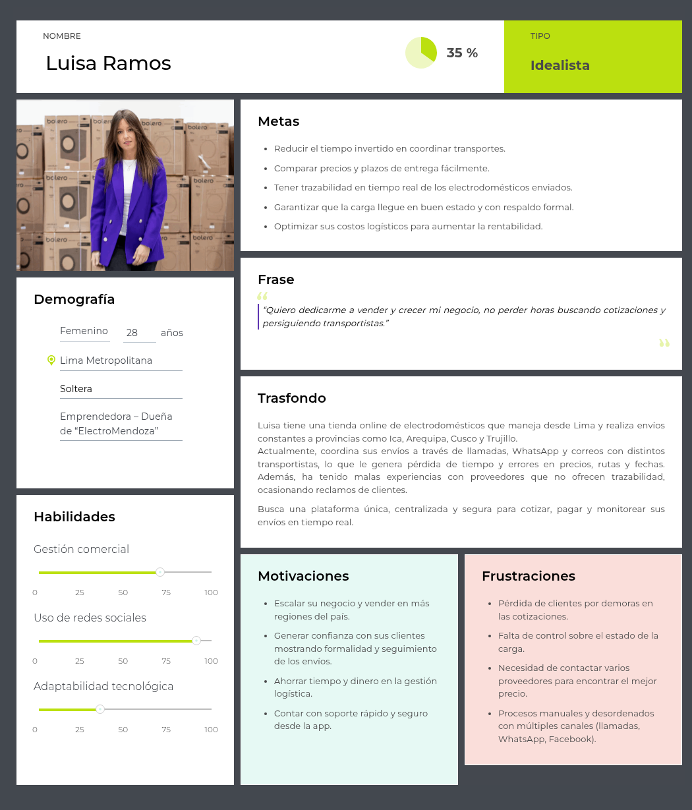


**Segmento 2: Administradores de empresas que se encargan del transporte interprovincial de carga**
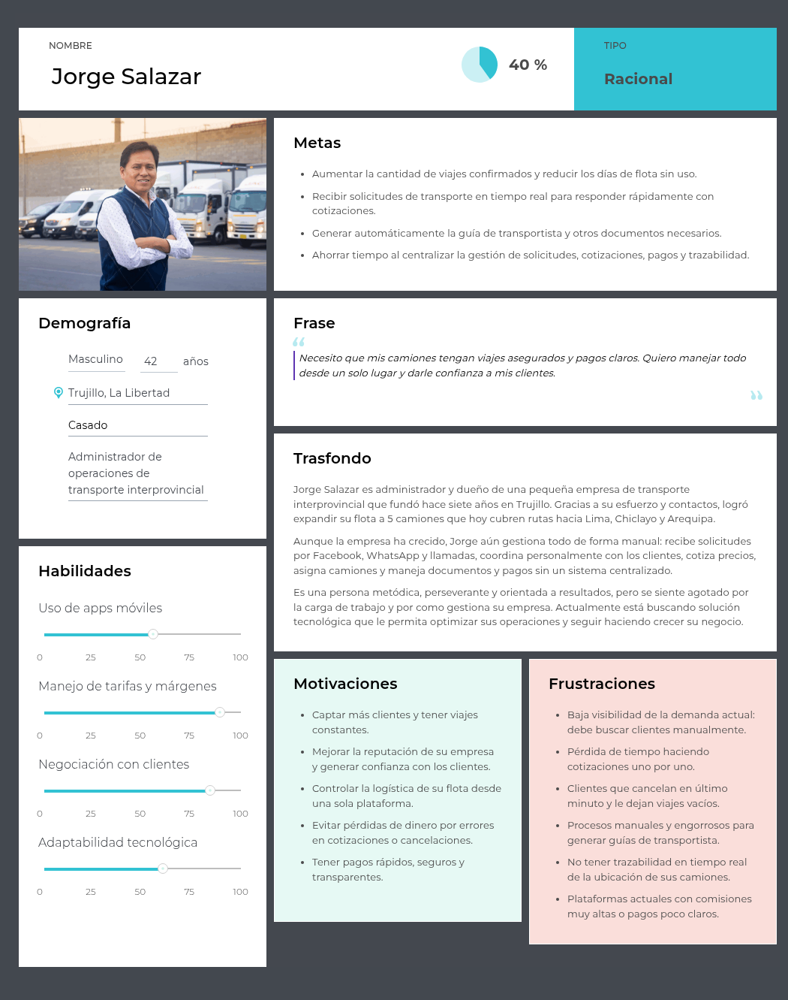


### 2.3.2. User Task Matrix

**Segmento 1: Personas o empresas que quieren transportar carga de forma interprovincial**

| **Task Matrix**                                                                | **Frecuencia** | **Importancia** |
| ------------------------------------------------------------------------------ | -------------- | --------------- |
| Solicitar transporte para enviar electrodomésticos a provincias                | Alta           | Alta            |
| Comparar precios y tiempos de entrega entre diferentes proveedores             | Alta           | Alta            |
| Coordinar entregas con clientes finales                                        | Alta           | Alta            |
| Empacar y preparar los electrodomésticos para el transporte                    | Media          | Alta            |
| Hacer seguimiento de los envíos en tiempo real                                 | Alta           | Alta            |
| Registrar ventas y costos en hojas de cálculo o aplicaciones simples           | Media          | Alta            |
| Responder consultas y coordinar ventas en Facebook, WhatsApp e Instagram       | Alta           | Media           |
| Negociar precios con clientes y proveedores de transporte                      | Alta           | Alta            |
| Gestionar pagos y reembolsos a través de apps bancarias o billeteras digitales | Alta           | Alta            |
| Resolver problemas con entregas dañadas, retrasos o pérdidas                   | Media          | Alta            |
| Capacitarse en nuevas herramientas digitales para mejorar la gestión           | Baja           | Media           |

<br>

**Segmento 2: Administradores de empresas que se encargan del transporte interprovincial de carga**

| **Task Matrix**                                                              | **Frecuencia** | **Importancia** |
| ---------------------------------------------------------------------------- | -------------- | --------------- |
| Coordinar y asignar rutas a los camiones                                     | Alta           | Alta            |
| Cotizar precios y responder solicitudes de transporte                        | Alta           | Alta            |
| Gestionar la documentación de envío (guías de remisión, contratos, facturas) | Alta           | Alta            |
| Supervisar el estado y mantenimiento de los camiones                         | Media          | Alta            |
| Contactar y negociar con nuevos clientes                                     | Alta           | Alta            |
| Hacer seguimiento del transporte y ubicación de las unidades en tiempo real  | Alta           | Alta            |
| Controlar pagos, ingresos y liquidaciones con clientes y transportistas      | Alta           | Alta            |
| Publicar y responder mensajes en Facebook, WhatsApp y otras plataformas      | Alta           | Media           |
| Registrar datos de viajes, pagos y clientes en hojas de cálculo o cuadernos  | Media          | Alta            |
| Capacitarse en nuevas herramientas tecnológicas para optimizar procesos      | Baja           | Alta            |


### 2.3.3. User Journey Mapping
**Segmento 1: Personas o empresas que quieren transportar carga de forma interprovincial**
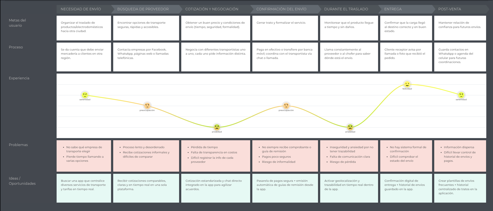

<br>

**Segmento 2: Administradores de empresas que se encargan del transporte interprovincial de carga**
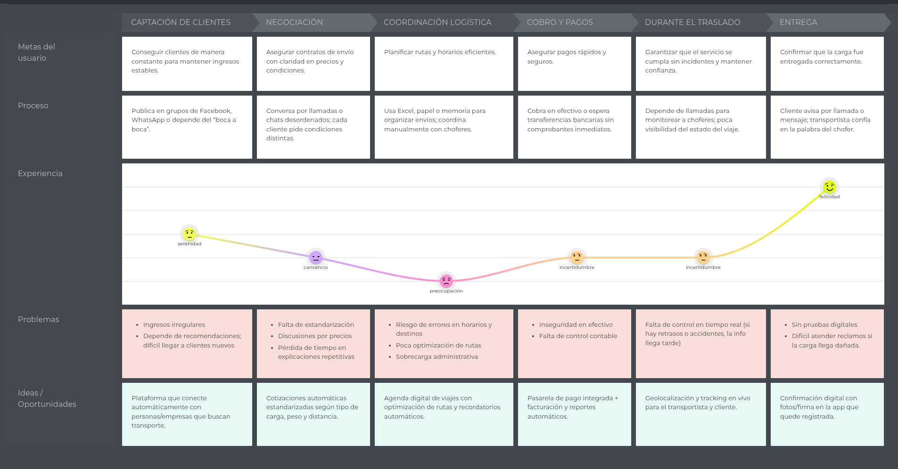


### 2.3.4. Empathy Mapping
**Segmento 1: Personas o empresas que quieren transportar carga de forma interprovincial**
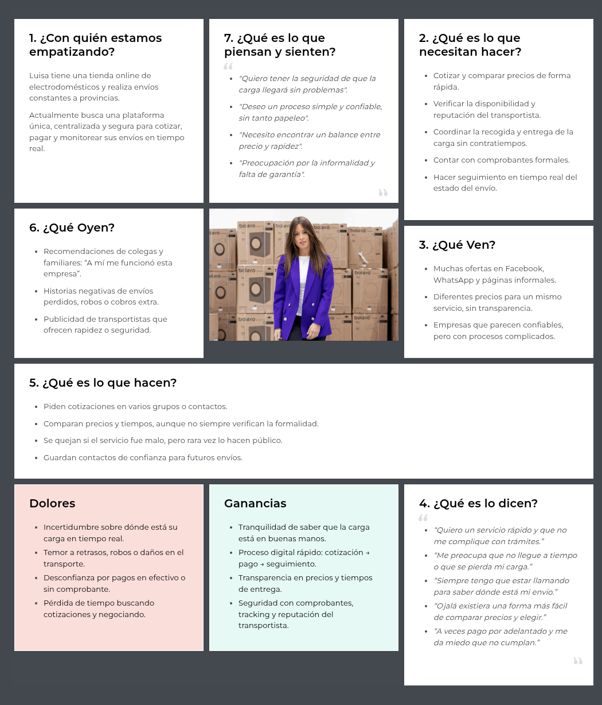

<br>

**Segmento 2: Administradores de empresas que se encargan del transporte interprovincial de carga**
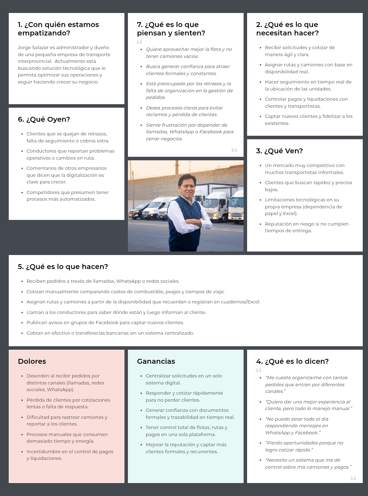


### 2.3.5. Ubiquitous Language

| **Término** | **Definición** |
| ----------- | -------------- |
| **Cliente** | Persona natural o jurídica que solicita el traslado de mercancías a través de la plataforma. Es quien genera las solicitudes de envío.                                                    |
| **Proveedor de Transporte** | Empresa o conductor independiente autorizado que ofrece sus unidades de transporte (camiones, furgones, tráileres) para movilizar la carga de los clientes.                               |
| **Solicitud de Envío** | Registro formal creado por el cliente en la plataforma donde se especifican los datos de la carga (origen, destino, tipo, peso, volumen, fecha y condiciones especiales).                 |
| **Oferta de Transporte** | Propuesta emitida por un proveedor indicando condiciones de servicio (precio, tiempos, disponibilidad) para cumplir con una solicitud de envío.                                           |
| **Contrato de Transporte** | Acuerdo generado digitalmente en la plataforma cuando un cliente acepta la oferta de un proveedor, estableciendo las obligaciones de ambas partes.                                        |
| **Carga** | Mercancía, producto o material que debe ser trasladado de un punto de origen a un punto de destino. Puede clasificarse por peso, volumen, categoría o condiciones de manejo.              |
| **Unidad de Transporte** | Vehículo registrado en la plataforma (camión, tráiler, furgoneta, etc.) que cuenta con características específicas de capacidad, dimensiones y permisos.                                  |
| **Ruta** | Trayecto definido entre el punto de origen y el punto de destino del envío, que puede incluir paradas intermedias o desvíos.                                                              |
| **Seguimiento en Tiempo Real** | Funcionalidad de la plataforma que permite visualizar la ubicación actualizada del vehículo y el estado del envío durante el transporte.                                                  |
| **Guía de Transporte** | Documento digital generado por la plataforma que respalda el traslado de la carga, detallando información legal, datos del cliente, proveedor, ruta y características de la mercancía.    |
| **Incidencia de Transporte** | Evento inesperado (demora, accidente, desperfecto mecánico, pérdida parcial de carga) que afecta el normal cumplimiento del contrato de transporte y debe ser reportado en la plataforma. |
| **Historial de Envíos** | Registro cronológico de todas las solicitudes, contratos y movimientos realizados por un cliente o proveedor en la plataforma.                                                            |
| **Notificación de Servicio** | Alerta enviada al cliente o proveedor informando sobre cambios de estado de la solicitud, aceptación de oferta, inicio de ruta, incidencias o entrega finalizada.                         |
| **Entrega Confirmada** | Estado final de un envío que indica que la carga ha llegado a destino y el cliente ha confirmado la recepción conforme.                                                                   |
| **Calificación de Servicio** | Evaluación que realiza el cliente respecto al proveedor de transporte (o viceversa) una vez concluido el envío, con el fin de medir calidad, puntualidad y seguridad.                     |
| **Panel de Control** | Interfaz principal de la plataforma que muestra indicadores, notificaciones y herramientas de gestión para clientes y proveedores.   

## 2.4. Requirements Specification
### 2.4.1. User Stories

<!-- ======================= CLIENTES ======================= -->

<table border="1" cellspacing="0" cellpadding="8" style="border-collapse:collapse; width:100%;">
  <tbody>
    <!-- US01 -->
    <th style="width:10%;">Story ID</th><th style="width:40%;">User</th><th style="width:10%;">Priority</th><th style="width:40%;">Epic</th>
    <tr>
      <td>US01</td>
      <td>Cliente no registrado</td>
      <td>Alta</td>
      <td>Cliente – Registro</td>
    </tr>
    <tr><th colspan="4">Title</th></tr>
    <tr><td colspan="4">Verificar correo e iniciar registro</td></tr>
    <tr><th colspan="4">Description</th></tr>
    <tr>
      <td colspan="4">Como cliente no registrado, quiero verificar mi correo y crear una cuenta, para iniciar el proceso de registro de forma segura.</td>
    </tr>
    <tr><th colspan="4">Acceptance Criteria</th></tr>
    <tr>
      <td colspan="4">
        <strong>Escenario 1: Enlace de verificación enviado</strong><br>
        <strong>Dado que</strong> ingreso un correo válido<br>
        <strong>Y</strong> no existe una cuenta activa con ese correo<br>
        <strong>Cuando</strong> presiono “Enviar verificación”<br>
        <strong>Entonces</strong> el sistema envía un enlace/OTP y registra el intento<br>
        <strong>Y</strong> muestra el tiempo de expiración y la opción “Reenviar” con límite.<br><br>
        <strong>Escenario 2: Correo verificado</strong><br>
        <strong>Dado que</strong> recibí el enlace/OTP<br>
        <strong>Y</strong> estoy dentro del tiempo de validez<br>
        <strong>Cuando</strong> hago clic en el enlace o ingreso el OTP correcto<br>
        <strong>Entonces</strong> el correo queda <em>verificado</em><br>
        <strong>Y</strong> el sistema me redirige al siguiente paso del registro.
      </td>
    </tr>
  </tbody>
</table>

<br>

<table border="1" cellspacing="0" cellpadding="8" style="border-collapse:collapse; width:100%;">
  <tbody>
    <!-- US02 -->
    <tr>
      <th style="width:10%;">Story ID</th><th style="width:40%;">User</th><th style="width:10%;">Priority</th><th style="width:40%;">Epic</th>
    </tr>
    <tr>
      <td>US02</td>
      <td>Cliente en registro</td>
      <td>Alta</td>
      <td>Cliente – Registro</td>
    </tr>
    <tr><th colspan="4">Title</th></tr>
    <tr><td colspan="4">Verificar teléfono por SMS OTP</td></tr>
    <tr><th colspan="4">Description</th></tr>
    <tr>
      <td colspan="4">Como cliente, quiero verificar mi teléfono con un código OTP por SMS, para habilitar el segundo factor de autenticación y notificaciones.</td>
    </tr>
    <tr><th colspan="4">Acceptance Criteria</th></tr>
    <tr>
      <td colspan="4">
        <strong>Escenario 1: OTP enviado</strong><br>
        <strong>Dado que</strong> ingreso un número válido<br>
        <strong>Y</strong> acepto recibir SMS<br>
        <strong>Cuando</strong> solicito el OTP<br>
        <strong>Entonces</strong> el sistema envía el código y muestra un contador de expiración<br>
        <strong>Y</strong> limita reenvíos para evitar abuso.<br><br>
        <strong>Escenario 2: OTP validado</strong><br>
        <strong>Dado que</strong> recibí el OTP<br>
        <strong>Y</strong> no ha expirado<br>
        <strong>Cuando</strong> lo ingreso correctamente<br>
        <strong>Entonces</strong> el teléfono queda <em>verificado</em><br>
        <strong>Y</strong> el sistema registra auditoría del evento.
      </td>
    </tr>
  </tbody>
</table>

<br>

<table border="1" cellspacing="0" cellpadding="8" style="border-collapse:collapse; width:100%;">
  <tbody>
    <!-- US03 -->
    <tr>
      <th style="width:10%;">Story ID</th><th style="width:40%;">User</th><th style="width:10%;">Priority</th><th style="width:40%;">Epic</th>
    </tr>
    <tr>
      <td>US03</td>
      <td>Cliente en registro</td>
      <td>Alta</td>
      <td>Cliente – Registro</td>
    </tr>
    <tr><th colspan="4">Title</th></tr>
    <tr><td colspan="4">Validar documento de identidad y coincidencia de nombre</td></tr>
    <tr><th colspan="4">Description</th></tr>
    <tr>
      <td colspan="4">Como cliente, quiero validar mi documento (DNI/CE) y que mi nombre coincida, para asegurar mi identidad antes de usar la plataforma.</td>
    </tr>
    <tr><th colspan="4">Acceptance Criteria</th></tr>
    <tr>
      <td colspan="4">
        <strong>Escenario 1: Documento validado</strong><br>
        <strong>Dado que</strong> ingreso tipo y número de documento<br>
        <strong>Y</strong> adjunto evidencia si se solicita<br>
        <strong>Cuando</strong> el sistema consulta/valida con la fuente correspondiente<br>
        <strong>Entonces</strong> se marca “Documento validado”<br>
        <strong>Y</strong> se guarda evidencia y timestamp de la verificación.<br><br>
        <strong>Escenario 2: Coincidencia de nombre</strong><br>
        <strong>Dado que</strong> el documento está validado<br>
        <strong>Y</strong> declaré un nombre de perfil<br>
        <strong>Cuando</strong> el sistema compara contra la fuente<br>
        <strong>Entonces</strong> aprueba si coincide<br>
        <strong>Y</strong> muestra correcciones si hay discrepancias.
      </td>
    </tr>
  </tbody>
</table>

<br>

<table border="1" cellspacing="0" cellpadding="8" style="border-collapse:collapse; width:100%;">
  <tbody>
    <!-- US04 -->
    <tr>
      <th style="width:10%;">Story ID</th><th style="width:40%;">User</th><th style="width:10%;">Priority</th><th style="width:40%;">Epic</th>
    </tr>
    <tr>
      <td>US04</td>
      <td>Cliente en registro</td>
      <td>Media</td>
      <td>Cliente – Registro</td>
    </tr>
    <tr><th colspan="4">Title</th></tr>
    <tr><td colspan="4">Validar edad mínima y configurar PIN</td></tr>
    <tr><th colspan="4">Description</th></tr>
    <tr>
      <td colspan="4">Como cliente, quiero validar que cumplo la edad mínima y definir un PIN, para operar de forma segura dentro de la app.</td>
    </tr>
    <tr><th colspan="4">Acceptance Criteria</th></tr>
    <tr>
      <td colspan="4">
        <strong>Escenario 1: Edad validada</strong><br>
        <strong>Dado que</strong> ingresé mi fecha de nacimiento<br>
        <strong>Y</strong> completé pasos previos<br>
        <strong>Cuando</strong> el sistema calcula mi edad<br>
        <strong>Entonces</strong> si cumplo la mínima avanzo<br>
        <strong>Y</strong> si no cumplo se bloquea el registro con mensaje claro.<br><br>
        <strong>Escenario 2: PIN configurado</strong><br>
        <strong>Dado que</strong> superé las validaciones previas<br>
        <strong>Y</strong> el PIN cumple la política (longitud/complejidad)<br>
        <strong>Cuando</strong> confirmo el PIN<br>
        <strong>Entonces</strong> se almacena en hash y queda activo<br>
        <strong>Y</strong> se registra auditoría.
      </td>
    </tr>
  </tbody>
</table>

<br>

<table border="1" cellspacing="0" cellpadding="8" style="border-collapse:collapse; width:100%;">
  <tbody>
    <!-- US05 -->
    <tr>
      <th style="width:10%;">Story ID</th><th style="width:40%;">User</th><th style="width:10%;">Priority</th><th style="width:40%;">Epic</th>
    </tr>
    <tr>
      <td>US05</td>
      <td>Cliente en registro</td>
      <td>Media</td>
      <td>Cliente – Registro</td>
    </tr>
    <tr><th colspan="4">Title</th></tr>
    <tr><td colspan="4">Registrar datos fiscales (RUC opcional) y completar perfil</td></tr>
    <tr><th colspan="4">Description</th></tr>
    <tr>
      <td colspan="4">Como cliente, quiero registrar mis datos fiscales (RUC si aplica) y completar mi perfil, para que la emisión de documentos sea correcta.</td>
    </tr>
    <tr><th colspan="4">Acceptance Criteria</th></tr>
    <tr>
      <td colspan="4">
        <strong>Escenario 1: RUC validado</strong><br>
        <strong>Dado que</strong> ingreso mi RUC (si corresponde)<br>
        <strong>Y</strong> la razón social declarada<br>
        <strong>Cuando</strong> el sistema consulta el estado y razón social<br>
        <strong>Entonces</strong> se marca “RUC validado” si coincide<br>
        <strong>Y</strong> queda asociado al perfil.<br><br>
        <strong>Escenario 2: Perfil validado</strong><br>
        <strong>Dado que</strong> completé los campos obligatorios<br>
        <strong>Y</strong> acepté términos y política de privacidad<br>
        <strong>Cuando</strong> guardo la información<br>
        <strong>Entonces</strong> el perfil queda “Validado”<br>
        <strong>Y</strong> la cuenta se habilita para operar.
      </td>
    </tr>
  </tbody>
</table>

<br>

<table border="1" cellspacing="0" cellpadding="8" style="border-collapse:collapse; width:100%;">
  <tbody>
    <!-- US06 -->
    <tr>
      <th style="width:10%;">Story ID</th><th style="width:40%;">User</th><th style="width:10%;">Priority</th><th style="width:40%;">Epic</th>
    </tr>
    <tr>
      <td>US06</td>
      <td>Cliente registrado</td>
      <td>Media</td>
      <td>Cliente – Preferencias</td>
    </tr>
    <tr><th colspan="4">Title</th></tr>
    <tr><td colspan="4">Configurar preferencias de notificación y horarios</td></tr>
    <tr><th colspan="4">Description</th></tr>
    <tr>
      <td colspan="4">Como cliente, quiero elegir canales (push/email/SMS) y horarios de contacto, para recibir alertas relevantes cuando me conviene.</td>
    </tr>
    <tr><th colspan="4">Acceptance Criteria</th></tr>
    <tr>
      <td colspan="4">
        <strong>Escenario 1: Guardar preferencias</strong><br>
        <strong>Dado que</strong> selecciono canales y ventanas horarias<br>
        <strong>Y</strong> confirmo la zona horaria<br>
        <strong>Cuando</strong> guardo la configuración<br>
        <strong>Entonces</strong> el sistema la aplica a futuras notificaciones<br>
        <strong>Y</strong> puedo modificarla en cualquier momento.<br><br>
        <strong>Escenario 2: Silencio programado</strong><br>
        <strong>Dado que</strong> activo un periodo “No molestar”<br>
        <strong>Y</strong> defino una excepción para alertas críticas<br>
        <strong>Cuando</strong> ocurre un evento durante el periodo<br>
        <strong>Entonces</strong> solo se envían alertas marcadas como críticas<br>
        <strong>Y</strong> las demás se encolan para el fin del periodo.
      </td>
    </tr>
  </tbody>
</table>

<br>

<table border="1" cellspacing="0" cellpadding="8" style="border-collapse:collapse; width:100%;">
  <tbody>
    <!-- US07 -->
    <tr>
      <th style="width:10%;">Story ID</th><th style="width:40%;">User</th><th style="width:10%;">Priority</th><th style="width:40%;">Epic</th>
    </tr>
    <tr>
      <td>US07</td>
      <td>Cliente registrado</td>
      <td>Alta</td>
      <td>Cliente – Plantillas</td>
    </tr>
    <tr><th colspan="4">Title</th></tr>
    <tr><td colspan="4">Gestionar plantillas de ítems (crear, reutilizar, eliminar)</td></tr>
    <tr><th colspan="4">Description</th></tr>
    <tr>
      <td colspan="4">Como cliente, quiero guardar mis ítems frecuentes (fotos, medidas, peso, categoría, frecuencia), para reutilizarlos en nuevas solicitudes en menos tiempo.</td>
    </tr>
    <tr><th colspan="4">Acceptance Criteria</th></tr>
    <tr>
      <td colspan="4">
        <strong>Escenario 1: Creación automática tras solicitud</strong><br>
        <strong>Dado que</strong> envío una solicitud con un ítem nuevo<br>
        <strong>Y</strong> marco “Guardar como plantilla”<br>
        <strong>Cuando</strong> se publica la solicitud<br>
        <strong>Entonces</strong> el sistema crea la plantilla<br>
        <strong>Y</strong> queda disponible para futuros usos.<br><br>
        <strong>Escenario 2: Reutilización y edición</strong><br>
        <strong>Dado que</strong> tengo plantillas guardadas<br>
        <strong>Y</strong> elijo “Usar plantilla” al crear una solicitud<br>
        <strong>Cuando</strong> se autocompletan los campos<br>
        <strong>Entonces</strong> puedo editar cualquier valor antes de enviar<br>
        <strong>Y</strong> los cambios no alteran la plantilla original.
      </td>
    </tr>
  </tbody>
</table>

<br>

<table border="1" cellspacing="0" cellpadding="8" style="border-collapse:collapse; width:100%;">
  <tbody>
    <!-- US08 -->
    <tr>
      <th style="width:10%;">Story ID</th><th style="width:40%;">User</th><th style="width:10%;">Priority</th><th style="width:40%;">Epic</th>
    </tr>
    <tr>
      <td>US08</td>
      <td>Cliente registrado</td>
      <td>Alta</td>
      <td>Cliente – Plantillas</td>
    </tr>
    <tr><th colspan="4">Title</th></tr>
    <tr><td colspan="4">Gestionar plantillas de rutas (crear, actualizar, eliminar)</td></tr>
    <tr><th colspan="4">Description</th></tr>
    <tr>
      <td colspan="4">Como cliente, quiero guardar mis rutas frecuentes (origen, puntos intermedios, destino), para crear solicitudes más rápido.</td>
    </tr>
    <tr><th colspan="4">Acceptance Criteria</th></tr>
    <tr>
      <td colspan="4">
        <strong>Escenario 1: Crear plantilla de ruta</strong><br>
        <strong>Dado que</strong> defino una ruta completa<br>
        <strong>Y</strong> le asigno un nombre único<br>
        <strong>Cuando</strong> guardo la plantilla<br>
        <strong>Entonces</strong> queda registrada y visible en “Mis plantillas”<br>
        <strong>Y</strong> muestra resumen (origen, paradas, destino).<br><br>
        <strong>Escenario 2: Actualizar/Eliminar con bloqueo</strong><br>
        <strong>Dado que</strong> la plantilla está referenciada por una solicitud en curso<br>
        <strong>Y</strong> deseo editarla o eliminarla<br>
        <strong>Cuando</strong> intento guardar cambios<br>
        <strong>Entonces</strong> el sistema bloquea la operación<br>
        <strong>Y</strong> sugiere duplicar la plantilla para no afectar solicitudes activas.
      </td>
    </tr>
  </tbody>
</table>

<br>

<!-- Nueva Clientes: US18 -->
<table border="1" cellspacing="0" cellpadding="8" style="border-collapse:collapse; width:100%;">
  <tbody>
    <tr>
      <th style="width:10%;">Story ID</th><th style="width:40%;">User</th><th style="width:10%;">Priority</th><th style="width:40%;">Epic</th>
    </tr>
    <tr>
      <td>US18</td>
      <td>Cliente registrado</td>
      <td>Baja</td>
      <td>Cliente – Plantillas</td>
    </tr>
    <tr><th colspan="4">Title</th></tr>
    <tr><td colspan="4">Duplicar plantilla de ítem o ruta</td></tr>
    <tr><th colspan="4">Description</th></tr>
    <tr>
      <td colspan="4">Como cliente, quiero duplicar una plantilla existente para crear una variante sin afectar la original.</td>
    </tr>
    <tr><th colspan="4">Acceptance Criteria</th></tr>
    <tr>
      <td colspan="4">
        <strong>Escenario 1: Duplicado exitoso</strong><br>
        <strong>Dado que</strong> selecciono una plantilla<br>
        <strong>Y</strong> asigno un nuevo nombre<br>
        <strong>Cuando</strong> confirmo la duplicación<br>
        <strong>Entonces</strong> se crea una copia editable<br>
        <strong>Y</strong> la original permanece intacta.
      </td>
    </tr>
  </tbody>
</table>

<br>

<!-- ======================= PROVEEDORES – ONBOARDING ======================= -->

<table border="1" cellspacing="0" cellpadding="8" style="border-collapse:collapse; width:100%;">
  <tbody>
    <!-- US09 -->
    <tr>
      <th style="width:10%;">Story ID</th><th style="width:40%;">User</th><th style="width:10%;">Priority</th><th style="width:40%;">Epic</th>
    </tr>
    <tr>
      <td>US09</td>
      <td>Proveedor (administrador)</td>
      <td>Alta</td>
      <td>Proveedores – Onboarding</td>
    </tr>
    <tr><th colspan="4">Title</th></tr>
    <tr><td colspan="4">Registrar empresa transportista y validar RUC</td></tr>
    <tr><th colspan="4">Description</th></tr>
    <tr>
      <td colspan="4">Como proveedor administrador, quiero registrar la razón social y validar el RUC, para habilitar a mi empresa y operar conforme a la normativa.</td>
    </tr>
    <tr><th colspan="4">Acceptance Criteria</th></tr>
    <tr>
      <td colspan="4">
        <strong>Escenario 1: RUC válido</strong><br>
        <strong>Dado que</strong> ingreso RUC y razón social<br>
        <strong>Y</strong> los datos coinciden con la fuente oficial<br>
        <strong>Cuando</strong> envío el formulario<br>
        <strong>Entonces</strong> el estado del RUC queda “Validado”<br>
        <strong>Y</strong> se habilita el siguiente paso del onboarding.<br><br>
        <strong>Escenario 2: RUC observado</strong><br>
        <strong>Dado que</strong> el RUC está inactivo o no coincide<br>
        <strong>Y</strong> la fuente devuelve un estado no operativo<br>
        <strong>Cuando</strong> intento avanzar<br>
        <strong>Entonces</strong> el sistema bloquea el avance<br>
        <strong>Y</strong> muestra el motivo de observación y acciones sugeridas.
      </td>
    </tr>
  </tbody>
</table>

<br>

<table border="1" cellspacing="0" cellpadding="8" style="border-collapse:collapse; width:100%;">
  <tbody>
    <!-- US10 -->
    <tr>
      <th style="width:10%;">Story ID</th><th style="width:40%;">User</th><th style="width:10%;">Priority</th><th style="width:40%;">Epic</th>
    </tr>
    <tr>
      <td>US10</td>
      <td>Proveedor (representante legal)</td>
      <td>Alta</td>
      <td>Proveedores – Onboarding</td>
    </tr>
    <tr><th colspan="4">Title</th></tr>
    <tr><td colspan="4">Cargar y validar poderes y documentación legal</td></tr>
    <tr><th colspan="4">Description</th></tr>
    <tr>
      <td colspan="4">Como representante legal, quiero subir poderes/vigencia y otros documentos legales requeridos, para que la plataforma verifique mi capacidad de representación.</td>
    </tr>
    <tr><th colspan="4">Acceptance Criteria</th></tr>
    <tr>
      <td colspan="4">
        <strong>Escenario 1: Carga correcta</strong><br>
        <strong>Dado que</strong> adjunto archivos legibles (PDF/imagen)<br>
        <strong>Y</strong> indico tipo y fecha de vencimiento<br>
        <strong>Cuando</strong> envío el documento<br>
        <strong>Entonces</strong> queda en estado “En revisión”<br>
        <strong>Y</strong> se extraen metadatos básicos para auditoría.<br><br>
        <strong>Escenario 2: Aprobación/Observación</strong><br>
        <strong>Dado que</strong> el revisor valida vigencia y coincidencia de datos<br>
        <strong>Y</strong> existe consistencia con el RUC<br>
        <strong>Cuando</strong> emite el dictamen<br>
        <strong>Entonces</strong> el documento pasa a “Aprobado” o “Observado”<br>
        <strong>Y</strong> en caso de observación se publica un comentario de subsanación.
      </td>
    </tr>
  </tbody>
</table>

<br>

<table border="1" cellspacing="0" cellpadding="8" style="border-collapse:collapse; width:100%;">
  <tbody>
    <!-- US11 -->
    <tr>
      <th style="width:10%;">Story ID</th><th style="width:40%;">User</th><th style="width:10%;">Priority</th><th style="width:40%;">Epic</th>
    </tr>
    <tr>
      <td>US11</td>
      <td>Proveedor (administrador)</td>
      <td>Alta</td>
      <td>Proveedores – Onboarding</td>
    </tr>
    <tr><th colspan="4">Title</th></tr>
    <tr><td colspan="4">Solicitar habilitación de la empresa y dictamen</td></tr>
    <tr><th colspan="4">Description</th></tr>
    <tr>
      <td colspan="4">Como proveedor, quiero enviar mi expediente para revisión y obtener un dictamen, para comenzar a operar en la plataforma.</td>
    </tr>
    <tr><th colspan="4">Acceptance Criteria</th></tr>
    <tr>
      <td colspan="4">
        <strong>Escenario 1: Estados del expediente</strong><br>
        <strong>Dado que</strong> completé los requisitos<br>
        <strong>Y</strong> todos los documentos obligatorios están “Aprobados”<br>
        <strong>Cuando</strong> envío a revisión<br>
        <strong>Entonces</strong> el expediente queda “Pendiente” hasta dictamen<br>
        <strong>Y</strong> puede resultar “Aprobada”, “Observada” o “Rechazada”.<br><br>
        <strong>Escenario 2: Gating operativo</strong><br>
        <strong>Dado que</strong> la empresa no está “Aprobada”<br>
        <strong>Y</strong> intento asignar unidades o tomar viajes<br>
        <strong>Cuando</strong> ejecuto la acción<br>
        <strong>Entonces</strong> el sistema lo impide<br>
        <strong>Y</strong> muestra que debo completar la habilitación.
      </td>
    </tr>
  </tbody>
</table>

<br>

<table border="1" cellspacing="0" cellpadding="8" style="border-collapse:collapse; width:100%;">
  <tbody>
    <!-- US12 -->
    <tr>
      <th style="width:10%;">Story ID</th><th style="width:40%;">User</th><th style="width:10%;">Priority</th><th style="width:40%;">Epic</th>
    </tr>
    <tr>
      <td>US12</td>
      <td>Proveedor (administrador)</td>
      <td>Media</td>
      <td>Proveedores – Onboarding</td>
    </tr>
    <tr><th colspan="4">Title</th></tr>
    <tr><td colspan="4">Alertas de vencimiento y renovación de documentos</td></tr>
    <tr><th colspan="4">Description</th></tr>
    <tr>
      <td colspan="4">Como proveedor, quiero recibir alertas por documentos próximos a vencer, para renovarlos y evitar la suspensión operativa.</td>
    </tr>
    <tr><th colspan="4">Acceptance Criteria</th></tr>
    <tr>
      <td colspan="4">
        <strong>Escenario 1: Notificaciones preventivas</strong><br>
        <strong>Dado que</strong> un documento vencerá en ≤30 días<br>
        <strong>Y</strong> la empresa está habilitada<br>
        <strong>Cuando</strong> se cumpla el umbral<br>
        <strong>Entonces</strong> recibo alertas (email/push) con instrucciones de renovación<br>
        <strong>Y</strong> el panel muestra estado de advertencia.<br><br>
        <strong>Escenario 2: Bloqueo por vencimiento</strong><br>
        <strong>Dado que</strong> un documento crítico está vencido<br>
        <strong>Y</strong> no se ha cargado uno vigente<br>
        <strong>Cuando</strong> intento operar<br>
        <strong>Entonces</strong> la operación se bloquea temporalmente<br>
        <strong>Y</strong> se solicita actualizar documentación.
      </td>
    </tr>
  </tbody>
</table>

<br>

<!-- Nueva Proveedores: US19 -->
<table border="1" cellspacing="0" cellpadding="8" style="border-collapse:collapse; width:100%;">
  <tbody>
    <tr>
      <th style="width:10%;">Story ID</th><th style="width:40%;">User</th><th style="width:10%;">Priority</th><th style="width:40%;">Epic</th>
    </tr>
    <tr>
      <td>US19</td>
      <td>Proveedor (administrador)</td>
      <td>Media</td>
      <td>Proveedores – Onboarding</td>
    </tr>
    <tr><th colspan="4">Title</th></tr>
    <tr><td colspan="4">Checklist de requisitos y progreso de habilitación</td></tr>
    <tr><th colspan="4">Description</th></tr>
    <tr>
      <td colspan="4">Como administrador, quiero visualizar un checklist con porcentaje de avance del onboarding, para saber qué falta completar.</td>
    </tr>
    <tr><th colspan="4">Acceptance Criteria</th></tr>
    <tr>
      <td colspan="4">
        <strong>Escenario 1: Vista de progreso</strong><br>
        <strong>Dado que</strong> ingreso al módulo de habilitación<br>
        <strong>Y</strong> tengo documentos cargados y pendientes<br>
        <strong>Cuando</strong> se calcula el avance<br>
        <strong>Entonces</strong> veo un porcentaje y los requisitos con estado<br>
        <strong>Y</strong> accesos directos para completar cada pendiente.
      </td>
    </tr>
  </tbody>
</table>

<br>

<!-- ======================= VIAJES – ASIGNACIÓN Y EJECUCIÓN ======================= -->

<table border="1" cellspacing="0" cellpadding="8" style="border-collapse:collapse; width:100%;">
  <tbody>
    <!-- US13 -->
    <tr>
      <th style="width:10%;">Story ID</th><th style="width:40%;">User</th><th style="width:10%;">Priority</th><th style="width:40%;">Epic</th>
    </tr>
    <tr>
      <td>US13</td>
      <td>Proveedor (operador)</td>
      <td>Alta</td>
      <td>Viajes – Ejecución</td>
    </tr>
    <tr><th colspan="4">Title</th></tr>
    <tr><td colspan="4">Asignar unidad/placa a un trato formal</td></tr>
    <tr><th colspan="4">Description</th></tr>
    <tr>
      <td colspan="4">Como proveedor operador, quiero asignar la unidad (placa) a un trato formal, para iniciar el viaje con un vehículo habilitado y sin conflictos.</td>
    </tr>
    <tr><th colspan="4">Acceptance Criteria</th></tr>
    <tr>
      <td colspan="4">
        <strong>Escenario 1: Validaciones de asignación</strong><br>
        <strong>Dado que</strong> existe un trato formal<br>
        <strong>Y</strong> la unidad pertenece a mi empresa y está habilitada<br>
        <strong>Cuando</strong> intento asignarla<br>
        <strong>Entonces</strong> el sistema valida solapes de horario<br>
        <strong>Y</strong> registra la asignación con timestamp y usuario.<br><br>
        <strong>Escenario 2: Reasignación previa al tracking</strong><br>
        <strong>Dado que</strong> la unidad asignada tiene incidencia antes de iniciar<br>
        <strong>Y</strong> aún no se activó el tracking<br>
        <strong>Cuando</strong> reasigno a otra unidad habilitada<br>
        <strong>Entonces</strong> se actualiza la asignación<br>
        <strong>Y</strong> queda la trazabilidad del cambio.
      </td>
    </tr>
  </tbody>
</table>

<br>

<table border="1" cellspacing="0" cellpadding="8" style="border-collapse:collapse; width:100%;">
  <tbody>
    <!-- US14 -->
    <tr>
      <th style="width:10%;">Story ID</th><th style="width:40%;">User</th><th style="width:10%;">Priority</th><th style="width:40%;">Epic</th>
    </tr>
    <tr>
      <td>US14</td>
      <td>Proveedor (operador)</td>
      <td>Alta</td>
      <td>Viajes – Ejecución</td>
    </tr>
    <tr><th colspan="4">Title</th></tr>
    <tr><td colspan="4">Activar tracking del viaje y enviar posición</td></tr>
    <tr><th colspan="4">Description</th></tr>
    <tr>
      <td colspan="4">Como proveedor, quiero activar el tracking para compartir la ubicación en tiempo real, para que el cliente pueda seguir el estado del envío.</td>
    </tr>
    <tr><th colspan="4">Acceptance Criteria</th></tr>
    <tr>
      <td colspan="4">
        <strong>Escenario 1: Activación del tracking</strong><br>
        <strong>Dado que</strong> el trato formal tiene unidad asignada<br>
        <strong>Y</strong> hay conectividad mínima<br>
        <strong>Cuando</strong> activo el tracking<br>
        <strong>Entonces</strong> el sistema comienza a registrar posiciones (lat/long, velocidad, hora)<br>
        <strong>Y</strong> expone el tracking al cliente en su app.<br><br>
        <strong>Escenario 2: Buffer offline</strong><br>
        <strong>Dado que</strong> se pierde señal durante el viaje<br>
        <strong>Y</strong> el dispositivo almacena puntos localmente<br>
        <strong>Cuando</strong> se recupera la conectividad<br>
        <strong>Entonces</strong> se reenvían los puntos pendientes en orden<br>
        <strong>Y</strong> el mapa se actualiza sin saltos.
      </td>
    </tr>
  </tbody>
</table>

<br>

<table border="1" cellspacing="0" cellpadding="8" style="border-collapse:collapse; width:100%;">
  <tbody>
    <!-- US15 -->
    <tr>
      <th style="width:10%;">Story ID</th><th style="width:40%;">User</th><th style="width:10%;">Priority</th><th style="width:40%;">Epic</th>
    </tr>
    <tr>
      <td>US15</td>
      <td>Proveedor (operador)</td>
      <td>Alta</td>
      <td>Viajes – Ejecución</td>
    </tr>
    <tr><th colspan="4">Title</th></tr>
    <tr><td colspan="4">Registrar eventos operativos en ruta</td></tr>
    <tr><th colspan="4">Description</th></tr>
    <tr>
      <td colspan="4">Como proveedor, quiero registrar eventos del viaje (Recojo iniciado/completado, Salida en ruta, Arribo a punto intermedio, Desvío, Parada no planificada, Incidencia), para mantener trazabilidad operacional.</td>
    </tr>
    <tr><th colspan="4">Acceptance Criteria</th></tr>
    <tr>
      <td colspan="4">
        <strong>Escenario 1: Recojo y salida</strong><br>
        <strong>Dado que</strong> el tracking está activo<br>
        <strong>Y</strong> me encuentro en el punto de recojo<br>
        <strong>Cuando</strong> registro “Recojo iniciado/completado” y “Salida en ruta”<br>
        <strong>Entonces</strong> se guardan eventos con geolocalización y hora<br>
        <strong>Y</strong> se notifica al cliente.<br><br>
        <strong>Escenario 2: Desvío o parada</strong><br>
        <strong>Dado que</strong> el GPS detecta desvío significativo o detención prolongada<br>
        <strong>Y</strong> el operador confirma la condición<br>
        <strong>Cuando</strong> se registra el evento<br>
        <strong>Entonces</strong> se calcula una nueva ETA<br>
        <strong>Y</strong> se notifica al cliente con el motivo (nota/foto opcional).
      </td>
    </tr>
  </tbody>
</table>

<br>

<table border="1" cellspacing="0" cellpadding="8" style="border-collapse:collapse; width:100%;">
  <tbody>
    <!-- US16 -->
    <tr>
      <th style="width:10%;">Story ID</th><th style="width:40%;">User</th><th style="width:10%;">Priority</th><th style="width:40%;">Epic</th>
    </tr>
    <tr>
      <td>US16</td>
      <td>Proveedor (operador)</td>
      <td>Alta</td>
      <td>Viajes – Ejecución</td>
    </tr>
    <tr><th colspan="4">Title</th></tr>
    <tr><td colspan="4">Confirmar entrega y adjuntar prueba de entrega (POD)</td></tr>
    <tr><th colspan="4">Description</th></tr>
    <tr>
      <td colspan="4">Como proveedor, quiero confirmar la entrega en destino y adjuntar POD (firma/foto/documento), para cerrar el viaje con evidencia.</td>
    </tr>
    <tr><th colspan="4">Acceptance Criteria</th></tr>
    <tr>
      <td colspan="4">
        <strong>Escenario 1: Confirmación y POD obligatoria</strong><br>
        <strong>Dado que</strong> arribo a destino<br>
        <strong>Y</strong> tengo evidencia de entrega<br>
        <strong>Cuando</strong> confirmo la entrega<br>
        <strong>Entonces</strong> el sistema exige adjuntar POD válido (formato/tamaño)<br>
        <strong>Y</strong> registra geo y hora del arribo.<br><br>
        <strong>Escenario 2: Doble confirmación</strong><br>
        <strong>Dado que</strong> el proveedor confirmó entrega<br>
        <strong>Y</strong> el cliente recibe notificación<br>
        <strong>Cuando</strong> el cliente confirma en su app<br>
        <strong>Entonces</strong> se completa el cierre operativo<br>
        <strong>Y</strong> se libera el estado “Entregado”.
      </td>
    </tr>
  </tbody>
</table>

<br>

<table border="1" cellspacing="0" cellpadding="8" style="border-collapse:collapse; width:100%;">
  <tbody>
    <!-- US17 -->
    <tr>
      <th style="width:10%;">Story ID</th><th style="width:40%;">User</th><th style="width:10%;">Priority</th><th style="width:40%;">Epic</th>
    </tr>
    <tr>
      <td>US17</td>
      <td>Proveedor (operador)</td>
      <td>Media</td>
      <td>Viajes – Ejecución</td>
    </tr>
    <tr><th colspan="4">Title</th></tr>
    <tr><td colspan="4">Cerrar viaje y desactivar tracking</td></tr>
    <tr><th colspan="4">Description</th></tr>
    <tr>
      <td colspan="4">Como proveedor, quiero cerrar el viaje una vez entregado, para desactivar tracking y generar el resumen operativo.</td>
    </tr>
    <tr><th colspan="4">Acceptance Criteria</th></tr>
    <tr>
      <td colspan="4">
        <strong>Escenario 1: Reglas de cierre</strong><br>
        <strong>Dado que</strong> existe entrega confirmada y POD almacenado<br>
        <strong>Y</strong> no hay eventos críticos abiertos<br>
        <strong>Cuando</strong> cierro el viaje<br>
        <strong>Entonces</strong> el tracking se desactiva<br>
        <strong>Y</strong> se genera un resumen con tiempos, eventos y recorrido.<br><br>
        <strong>Escenario 2: Corrección de POD</strong><br>
        <strong>Dado que</strong> se detectó error en el POD<br>
        <strong>Y</strong> estoy dentro de una ventana de corrección<br>
        <strong>Cuando</strong> cargo un nuevo POD<br>
        <strong>Entonces</strong> se versiona el documento<br>
        <strong>Y</strong> el sistema mantiene la trazabilidad de cambios.
      </td>
    </tr>
  </tbody>
</table>

<br>

<!-- Nueva Viajes: US20 -->
<table border="1" cellspacing="0" cellpadding="8" style="border-collapse:collapse; width:100%;">
  <tbody>
    <tr>
      <th style="width:10%;">Story ID</th><th style="width:40%;">User</th><th style="width:10%;">Priority</th><th style="width:40%;">Epic</th>
    </tr>
    <tr>
      <td>US20</td>
      <td>Cliente</td>
      <td>Media</td>
      <td>Viajes – Ejecución</td>
    </tr>
    <tr><th colspan="4">Title</th></tr>
    <tr><td colspan="4">Recibir notificaciones de eventos de viaje</td></tr>
    <tr><th colspan="4">Description</th></tr>
    <tr>
      <td colspan="4">Como cliente, quiero recibir notificaciones ante eventos relevantes del viaje, para mantenerme informado en tiempo real.</td>
    </tr>
    <tr><th colspan="4">Acceptance Criteria</th></tr>
    <tr>
      <td colspan="4">
        <strong>Escenario 1: Eventos estándar</strong><br>
        <strong>Dado que</strong> el proveedor registra un evento (recojo, salida, arribo)<br>
        <strong>Y</strong> tengo preferencias de notificación configuradas<br>
        <strong>Cuando</strong> ocurre el evento<br>
        <strong>Entonces</strong> recibo notificación por el canal configurado<br>
        <strong>Y</strong> veo el detalle en la app.<br><br>
        <strong>Escenario 2: Eventos críticos</strong><br>
        <strong>Dado que</strong> se detecta desvío o incidencia<br>
        <strong>Y</strong> mi perfil tiene “críticas siempre activas”<br>
        <strong>Cuando</strong> se genera el evento<br>
        <strong>Entonces</strong> recibo alerta inmediata aunque esté en “No molestar”<br>
        <strong>Y</strong> se recalcula y muestra la ETA.
      </td>
    </tr>
  </tbody>
</table>

<br>
<!--helloo-->
<!-- US21 -->
<table border="1" cellspacing="0" cellpadding="8" style="border-collapse:collapse; width:100%;">
  <tbody>
    <tr>
      <th style="width:10%;">Story ID</th><th style="width:40%;">User</th><th style="width:10%;">Priority</th><th style="width:40%;">Epic</th>
    </tr>
    <tr>
      <td>US21</td>
      <td>Cliente registrado</td>
      <td>Alta</td>
      <td>Cliente – Solicitudes</td>
    </tr>
    <tr><th colspan="4">Title</th></tr>
    <tr><td colspan="4">Registrar medidas por IA o manual con edición</td></tr>
    <tr><th colspan="4">Description</th></tr>
    <tr>
      <td colspan="4">Como cliente, quiero elegir entre estimar medidas desde fotos con IA o ingresarlas manualmente, y poder ajustarlas, para completar mis solicitudes con precisión y rapidez.</td>
    </tr>
    <tr><th colspan="4">Acceptance Criteria</th></tr>
    <tr>
      <td colspan="4">
        <strong>Escenario 1: Selección de método</strong><br>
        <strong>Dado que</strong> estoy creando una solicitud<br>
        <strong>Cuando</strong> elijo “IA” o “Manual”<br>
        <strong>Entonces</strong> la app ajusta el flujo según el método elegido <strong>Y</strong> registra mi elección.<br><br>
        <strong>Escenario 2: Modo IA</strong><br>
        <strong>Dado que</strong> subo fotos válidas y suficientes<br>
        <strong>Cuando</strong> el sistema procesa las imágenes<br>
        <strong>Entonces</strong> sugiere largo, ancho, alto, volumen y peso volumétrico <strong>Y</strong> puedo ajustarlos antes de guardar.<br><br>
        <strong>Escenario 3: Modo manual</strong><br>
        <strong>Dado que</strong> elijo “Manual”<br>
        <strong>Cuando</strong> ingreso largo, ancho y alto<br>
        <strong>Entonces</strong> la app valida rangos <strong>Y</strong> calcula automáticamente el peso volumétrico.<br><br>
        <strong>Escenario 4: Falla o baja confianza de IA</strong><br>
        <strong>Dado que</strong> la IA falla o su confianza es baja<br>
        <strong>Cuando</strong> se detecta esa condición<br>
        <strong>Entonces</strong> la app me ofrece continuar en modo manual <strong>Y</strong> conserva las fotos capturadas.
      </td>
    </tr>
  </tbody>
</table>
<br>

<!-- US22 -->
<table border="1" cellspacing="0" cellpadding="8" style="border-collapse:collapse; width:100%;">
  <tbody>
    <tr>
      <th style="width:10%;">Story ID</th><th style="width:40%;">User</th><th style="width:10%;">Priority</th><th style="width:40%;">Epic</th>
    </tr>
    <tr>
      <td>US22</td>
      <td>Cliente registrado</td>
      <td>Alta</td>
      <td>Cliente – Solicitudes</td>
    </tr>
    <tr><th colspan="4">Title</th></tr>
    <tr><td colspan="4">Capturar fotos de ítems con reglas de calidad</td></tr>
    <tr><th colspan="4">Description</th></tr>
    <tr>
      <td colspan="4">Como cliente, quiero que la app me guíe para tomar fotos con ángulos y formatos mínimos, para mejorar la precisión de la estimación y la confianza del proveedor.</td>
    </tr>
    <tr><th colspan="4">Acceptance Criteria</th></tr>
    <tr>
      <td colspan="4">
        <strong>Escenario 1: Reglas mínimas</strong><br>
        <strong>Dado que</strong> inicio la captura<br>
        <strong>Cuando</strong> intento continuar sin cumplir el mínimo de fotos/ángulos/formatos<br>
        <strong>Entonces</strong> la app bloquea el avance <strong>Y</strong> muestra qué falta.<br><br>
        <strong>Escenario 2: Validación de calidad</strong><br>
        <strong>Dado que</strong> subo fotos borrosas u oscuras<br>
        <strong>Cuando</strong> la app evalúa la calidad<br>
        <strong>Entonces</strong> me avisa <strong>Y</strong> sugiere repetir la captura.
      </td>
    </tr>
  </tbody>
</table>

<br>
<!-- US23 -->
<table border="1" cellspacing="0" cellpadding="8" style="border-collapse:collapse; width:100%;">
  <tbody>
    <tr>
      <th style="width:10%;">Story ID</th><th style="width:40%;">User</th><th style="width:10%;">Priority</th><th style="width:40%;">Epic</th>
    </tr>
    <tr>
      <td>US23</td>
      <td>Cliente registrado</td>
      <td>Alta</td>
      <td>Cliente – Solicitudes</td>
    </tr>
    <tr><th colspan="4">Title</th></tr>
    <tr><td colspan="4">Definir ruta (origen y destino)</td></tr>
    <tr><th colspan="4">Description</th></tr>
    <tr>
      <td colspan="4">Como cliente, quiero definir origen y destino, para que los proveedores coticen con base realista de distancia y tiempos.</td>
    </tr>
    <tr><th colspan="4">Acceptance Criteria</th></tr>
    <tr>
      <td colspan="4">
        <strong>Escenario 1: Ruta válida</strong><br>
        <strong>Dado que</strong> completo origen y destino válidos<br>
        <strong>Cuando</strong> guardo la ruta<br>
        <strong>Entonces</strong> la app calcula la distancia estimada <strong>Y</strong> valida coherencia.<br><br>
        <strong>Escenario 2: Edición previa a publicación</strong><br>
        <strong>Dado que</strong> aún no publico la solicitud<br>
        <strong>Cuando</strong> edito la ruta<br>
        <strong>Entonces</strong> puedo modificar origen o destino <strong>Y</strong> guardar cambios.
      </td>
    </tr>
  </tbody>
</table>

<br>
<!-- US24 -->
<table border="1" cellspacing="0" cellpadding="8" style="border-collapse:collapse; width:100%;">
  <tbody>
    <tr>
      <th style="width:10%;">Story ID</th><th style="width:40%;">User</th><th style="width:10%;">Priority</th><th style="width:40%;">Epic</th>
    </tr>
    <tr>
      <td>US24</td>
      <td>Cliente registrado</td>
      <td>Alta</td>
      <td>Cliente – Solicitudes</td>
    </tr>
    <tr><th colspan="4">Title</th></tr>
    <tr><td colspan="4">Registrar peso declarado y cálculo automático del peso volumétrico</td></tr>
    <tr><th colspan="4">Description</th></tr>
    <tr>
      <td colspan="4">Como cliente, quiero declarar el peso real y ver el peso volumétrico automático, para entender el peso cobrable antes de publicar.</td>
    </tr>
    <tr><th colspan="4">Acceptance Criteria</th></tr>
    <tr>
      <td colspan="4">
        <strong>Escenario 1: Cálculo automático</strong><br>
        <strong>Dado que</strong> existen medidas válidas<br>
        <strong>Cuando</strong> se calculan los volúmenes<br>
        <strong>Entonces</strong> la app muestra peso volumétrico <strong>Y</strong> el peso cobrable (máximo entre real y volumétrico) con breve explicación.<br><br>
        <strong>Escenario 2: Aviso de discrepancias</strong><br>
        <strong>Dado que</strong> el peso real difiere mucho del volumétrico<br>
        <strong>Cuando</strong> intento publicar<br>
        <strong>Entonces</strong> la app muestra una advertencia <strong>Y</strong> enlace a la política de diferencias <strong>Y</strong> me permite continuar consciente.
      </td>
    </tr>
  </tbody>
</table>

<br>
<!-- US25 -->
<table border="1" cellspacing="0" cellpadding="8" style="border-collapse:collapse; width:100%;">
  <tbody>
    <tr>
      <th style="width:10%;">Story ID</th><th style="width:40%;">User</th><th style="width:10%;">Priority</th><th style="width:40%;">Epic</th>
    </tr>
    <tr>
      <td>US25</td>
      <td>Cliente registrado</td>
      <td>Alta</td>
      <td>Cliente – Solicitudes</td>
    </tr>
    <tr><th colspan="4">Title</th></tr>
    <tr><td colspan="4">Publicar solicitud y confirmar exactitud de medidas y peso</td></tr>
    <tr><th colspan="4">Description</th></tr>
    <tr>
      <td colspan="4">Como cliente, quiero publicar mi solicitud y confirmar que medidas y peso son correctos, para que los proveedores la vean en tiempo real con información fiable.</td>
    </tr>
    <tr><th colspan="4">Acceptance Criteria</th></tr>
    <tr>
      <td colspan="4">
        <strong>Escenario 1: Confirmación de exactitud</strong><br>
        <strong>Dado que</strong> voy a publicar<br>
        <strong>Cuando</strong> reviso el resumen<br>
        <strong>Entonces</strong> debo marcar que confirmo que las medidas y el peso son correctos para continuar.<br><br>
        <strong>Escenario 2: Publicación exitosa</strong><br>
        <strong>Dado que</strong> completé ítems, peso y ruta<br>
        <strong>Cuando</strong> confirmo publicar<br>
        <strong>Entonces</strong> la solicitud pasa a “Publicada” <strong>Y</strong> queda disponible para cotización.<br><br>
        <strong>Escenario 3: Validaciones</strong><br>
        <strong>Dado que</strong> faltan datos obligatorios<br>
        <strong>Cuando</strong> intento publicar<br>
        <strong>Entonces</strong> la app bloquea la acción <strong>Y</strong> muestra los campos por corregir.
      </td>
    </tr>
  </tbody>
</table>

<br>
<!-- US26 -->
<table border="1" cellspacing="0" cellpadding="8" style="border-collapse:collapse; width:100%;">
  <tbody>
    <tr>
      <th style="width:10%;">Story ID</th><th style="width:40%;">User</th><th style="width:10%;">Priority</th><th style="width:40%;">Epic</th>
    </tr>
    <tr>
      <td>US26</td>
      <td>Cliente con solicitud publicada</td>
      <td>Media</td>
      <td>Cliente – Solicitudes</td>
    </tr>
    <tr><th colspan="4">Title</th></tr>
    <tr><td colspan="4">Actualizar solicitud publicada con notificación de cambios / cancelar / expirar</td></tr>
    <tr><th colspan="4">Description</th></tr>
    <tr>
      <td colspan="4">Como cliente, quiero poder actualizar mi solicitud ya publicada, y que se notifique su actualización; además, cancelarla o dejar que expire por vigencia.</td>
    </tr>
    <tr><th colspan="4">Acceptance Criteria</th></tr>
    <tr>
      <td colspan="4">
        <strong>Escenario 1: Edición posterior a publicación con notificación</strong><br>
        <strong>Dado que</strong> la solicitud está “Publicada”<br>
        <strong>Cuando</strong> edito un campo permitido<br>
        <strong>Entonces</strong> el cambio se guarda con auditoría <strong>Y</strong> se emite el evento “Solicitud actualizada” para notificar a los interesados.<br><br>
        <strong>Escenario 2: Cancelación por el cliente</strong><br>
        <strong>Dado que</strong> no hay trato iniciado<br>
        <strong>Cuando</strong> cancelo<br>
        <strong>Entonces</strong> la solicitud pasa a “Cancelada por el cliente” <strong>Y</strong> deja de estar visible.<br><br>
        <strong>Escenario 3: Cierre por inicio de trato</strong><br>
        <strong>Dado que</strong> inicio un trato desde una cotización<br>
        <strong>Cuando</strong> se crea el trato<br>
        <strong>Entonces</strong> la solicitud se marca “Cerrada por inicio de trato” de forma idempotente.<br><br>
        <strong>Escenario 4: Expiración automática por vigencia</strong><br>
        <strong>Dado que</strong> se cumple el tiempo de vigencia configurado sin actividad<br>
        <strong>Cuando</strong> el sistema ejecuta el proceso de expiración<br>
        <strong>Entonces</strong> la solicitud pasa a “Expirada”.
      </td>
    </tr>
  </tbody>
</table>

<br>
<!-- US27 -->
<table border="1" cellspacing="0" cellpadding="8" style="border-collapse:collapse; width:100%;">
  <tbody>
    <tr>
      <th style="width:10%;">Story ID</th><th style="width:40%;">User</th><th style="width:10%;">Priority</th><th style="width:40%;">Epic</th>
    </tr>
    <tr>
      <td>US27</td>
      <td>Cliente registrado</td>
      <td>Media</td>
      <td>Cliente – Solicitudes</td>
    </tr>
    <tr><th colspan="4">Title</th></tr>
    <tr><td colspan="4">Seleccionar objetos genéricos y personalizar</td></tr>
    <tr><th colspan="4">Description</th></tr>
    <tr>
      <td colspan="4">Como cliente, quiero poder elegir objetos genéricos (p. ej., caja, pallet, electrodoméstico) con medidas sugeridas y poder personalizarlas, para agilizar la creación de solicitudes.</td>
    </tr>
    <tr><th colspan="4">Acceptance Criteria</th></tr>
    <tr>
      <td colspan="4">
        <strong>Escenario 1: Selección de objeto genérico</strong><br>
        <strong>Dado que</strong> estoy creando una solicitud<br>
        <strong>Cuando</strong> elijo un objeto genérico<br>
        <strong>Entonces</strong> la app precarga nombre, categoría y medidas sugeridas.<br><br>
        <strong>Escenario 2: Personalización</strong><br>
        <strong>Dado que</strong> seleccioné un objeto genérico<br>
        <strong>Cuando</strong> edito sus medidas o peso<br>
        <strong>Entonces</strong> la app recalcula el peso volumétrico <strong>Y</strong> guarda la versión personalizada en mis ítems.
      </td>
    </tr>
  </tbody>
</table>

<br>
<!-- US28 -->
<table border="1" cellspacing="0" cellpadding="8" style="border-collapse:collapse; width:100%;">
  <tbody>
    <tr>
      <th style="width:10%;">Story ID</th><th style="width:40%;">User</th><th style="width:10%;">Priority</th><th style="width:40%;">Epic</th>
    </tr>
    <tr>
      <td>US28</td>
      <td>Cliente con cotizaciones</td>
      <td>Alta</td>
      <td>Cliente/Proveedor – Tratos</td>
    </tr>
    <tr><th colspan="4">Title</th></tr>
    <tr><td colspan="4">Iniciar trato desde una cotización y habilitar chat contextual</td></tr>
    <tr><th colspan="4">Description</th></tr>
    <tr>
      <td colspan="4">Como cliente, quiero iniciar un trato a partir de una cotización y abrir un chat con el proveedor, para negociar detalles antes de acordar.</td>
    </tr>
    <tr><th colspan="4">Acceptance Criteria</th></tr>
    <tr>
      <td colspan="4">
        <strong>Escenario 1: Creación de trato</strong><br>
        <strong>Dado que</strong> selecciono una cotización<br>
        <strong>Cuando</strong> presiono “Iniciar trato”<br>
        <strong>Entonces</strong> se crea el trato con referencia a solicitud y cotización <strong>Y</strong> se habilita el chat del trato.<br><br>
        <strong>Escenario 2: Reserva temporal</strong><br>
        <strong>Dado que</strong> el trato se crea<br>
        <strong>Cuando</strong> se confirman condiciones iniciales<br>
        <strong>Entonces</strong> se reserva capacidad/tarifa por una ventana configurable <strong>Y</strong> se muestra el vencimiento.
      </td>
    </tr>
  </tbody>
</table>

<br>
<!-- US29 -->
<table border="1" cellspacing="0" cellpadding="8" style="border-collapse:collapse; width:100%;">
  <tbody>
    <tr>
      <th style="width:10%;">Story ID</th><th style="width:40%;">User</th><th style="width:10%;">Priority</th><th style="width:40%;">Epic</th>
    </tr>
    <tr>
      <td>US29</td>
      <td>Cliente o Proveedor en chat</td>
      <td>Media</td>
      <td>Cliente/Proveedor – Tratos</td>
    </tr>
    <tr><th colspan="4">Title</th></tr>
    <tr><td colspan="4">Mensajería del trato: enviar y leer mensajes</td></tr>
    <tr><th colspan="4">Description</th></tr>
    <tr>
      <td colspan="4">Como participante del trato, quiero enviar y leer mensajes del chat para coordinar y negociar de forma contextual.</td>
    </tr>
    <tr><th colspan="4">Acceptance Criteria</th></tr>
    <tr>
      <td colspan="4">
        <strong>Escenario 1: Envío y lectura</strong><br>
        <strong>Dado</strong> un chat habilitado<br>
        <strong>Cuando</strong> envío un mensaje<br>
        <strong>Entonces</strong> se entrega al receptor <strong>Y</strong> se muestra confirmación de lectura cuando el receptor lo visualiza.
      </td>
    </tr>
  </tbody>
</table>
<br>

<!-- US30 -->
<table border="1" cellspacing="0" cellpadding="8" style="border-collapse:collapse; width:100%;">
  <tbody>
    <tr>
      <th style="width:10%;">Story ID</th><th style="width:40%;">User</th><th style="width:10%;">Priority</th><th style="width:40%;">Epic</th>
    </tr>
    <tr>
      <td>US30</td>
      <td>Cliente y Proveedor</td>
      <td>Alta</td>
      <td>Cliente/Proveedor – Tratos</td>
    </tr>
    <tr><th colspan="4">Title</th></tr>
    <tr><td colspan="4">Acordar trato, congelar negociación y mantener chat operativo hasta entrega confirmada</td></tr>
    <tr><th colspan="4">Description</th></tr>
    <tr>
      <td colspan="4">Como partes del trato, queremos confirmar la última versión de condiciones para bloquear cambios y pasar a pago, manteniendo el chat abierto para coordinación hasta la confirmación final de recepción por ambas partes.</td>
    </tr>
    <tr><th colspan="4">Acceptance Criteria</th></tr>
    <tr>
      <td colspan="4">
        <strong>Escenario 1: Cierre de negociación</strong><br>
        <strong>Dado que</strong> existe una versión propuesta<br>
        <strong>Cuando</strong> ambos aceptan<br>
        <strong>Entonces</strong> el trato pasa a “Acordado” <strong>Y</strong> las condiciones quedan bloqueadas; cualquier cambio posterior requiere reiniciar la negociación.<br><br>
        <strong>Escenario 2: Chat operativo hasta cierre logístico</strong><br>
        <strong>Dado que</strong> el trato está “Acordado” o en etapas posteriores<br>
        <strong>Cuando</strong> usamos el chat<br>
        <strong>Entonces</strong> podemos seguir coordinando por chat hasta que cliente y proveedor confirmen la recepción del paquete <strong>Y</strong> recién entonces el chat queda solo lectura.
      </td>
    </tr>
  </tbody>
</table>

<br>
<!-- US31 -->
<table border="1" cellspacing="0" cellpadding="8" style="border-collapse:collapse; width:100%;">
  <tbody>
    <tr>
      <th style="width:10%;">Story ID</th><th style="width:40%;">User</th><th style="width:10%;">Priority</th><th style="width:40%;">Epic</th>
    </tr>
    <tr>
      <td>US31</td>
      <td>Cliente</td>
      <td>Alta</td>
      <td>Cliente/Proveedor – Tratos</td>
    </tr>
    <tr><th colspan="4">Title</th></tr>
    <tr><td colspan="4">Marcar trato “Listo para pago” con resumen y comisión</td></tr>
    <tr><th colspan="4">Description</th></tr>
    <tr>
      <td colspan="4">Como cliente, quiero ver el total acordado, impuestos y la comisión del 1% para proceder al pago informado.</td>
    </tr>
    <tr><th colspan="4">Acceptance Criteria</th></tr>
    <tr>
      <td colspan="4">
        <strong>Escenario 1: Resumen correcto</strong><br>
        <strong>Dado que</strong> el trato está “Acordado”<br>
        <strong>Cuando</strong> abro el resumen<br>
        <strong>Entonces</strong> veo el desglose <strong>Y</strong> puedo continuar al pago.<br><br>
        <strong>Escenario 2: Vencimiento de reserva</strong><br>
        <strong>Dado que</strong> expira la reserva de capacidad/tarifa<br>
        <strong>Cuando</strong> intento pagar fuera de tiempo<br>
        <strong>Entonces</strong> el sistema pide revalidar condiciones <strong>O</strong> retorna a “Iniciado”.
      </td>
    </tr>
  </tbody>
</table>

<br>
<!-- US32 -->
<table border="1" cellspacing="0" cellpadding="8" style="border-collapse:collapse; width:100%;">
  <tbody>
    <tr>
      <th style="width:10%;">Story ID</th><th style="width:40%;">User</th><th style="width:10%;">Priority</th><th style="width:40%;">Epic</th>
    </tr>
    <tr>
      <td>US32</td>
      <td>Cliente o Proveedor</td>
      <td>Media</td>
      <td>Cliente/Proveedor – Tratos</td>
    </tr>
    <tr><th colspan="4">Title</th></tr>
    <tr><td colspan="4">Cancelar trato con causa y reglas de reputación</td></tr>
    <tr><th colspan="4">Description</th></tr>
    <tr>
      <td colspan="4">Como participante, quiero cancelar un trato indicando motivo, para cerrar el proceso respetando políticas de reputación y reabrir la solicitud si aplica.</td>
    </tr>
    <tr><th colspan="4">Acceptance Criteria</th></tr>
    <tr>
      <td colspan="4">
        <strong>Escenario 1: Cancelación del cliente</strong><br>
        <strong>Dado que</strong> hay un trato activo sin pago<br>
        <strong>Cuando</strong> el cliente cancela con motivo<br>
        <strong>Entonces</strong> el sistema registra el motivo <strong>Y</strong> actualiza reputación si corresponde.<br><br>
        <strong>Escenario 2: Cancelación del proveedor</strong><br>
        <strong>Dado que</strong> hay un trato activo<br>
        <strong>Cuando</strong> el proveedor cancela con motivo<br>
        <strong>Entonces</strong> la solicitud puede volver a “Publicada” <strong>Y</strong> se registra el impacto en reputación.
      </td>
    </tr>
  </tbody>
</table>

<br>
<!-- US33 -->
<table border="1" cellspacing="0" cellpadding="8" style="border-collapse:collapse; width:100%;">
  <tbody>
    <tr>
      <th style="width:10%;">Story ID</th><th style="width:40%;">User</th><th style="width:10%;">Priority</th><th style="width:40%;">Epic</th>
    </tr>
    <tr>
      <td>US33</td>
      <td>Sistema de Notificaciones</td>
      <td>Alta</td>
      <td>Todos – Notificaciones</td>
    </tr>
    <tr><th colspan="4">Title</th></tr>
    <tr><td colspan="4">Notificar nuevo mensaje de chat</td></tr>
    <tr><th colspan="4">Description</th></tr>
    <tr>
      <td colspan="4">Como sistema, quiero enviar una notificación cuando llega un nuevo mensaje de chat, para que el destinatario responda a tiempo.</td>
    </tr>
    <tr><th colspan="4">Acceptance Criteria</th></tr>
    <tr>
      <td colspan="4">
        <strong>Escenario 1: Envío básico</strong><br>
        <strong>Dado que</strong> se crea un mensaje en el chat del trato<br>
        <strong>Y</strong> el destinatario no está en la pantalla del chat<br>
        <strong>Cuando</strong> se confirma el mensaje<br>
        <strong>Entonces</strong> se envía una notificación <strong>Y</strong> se incrementa el contador de no leídos.<br><br>
        <strong>Escenario 2: Abrir desde la notificación</strong><br>
        <strong>Dado que</strong> recibo la notificación<br>
        <strong>Cuando</strong> toco la notificación<br>
        <strong>Entonces</strong> se abre el hilo del chat <strong>Y</strong> los mensajes visibles se marcan como leídos.
      </td>
    </tr>
  </tbody>
</table>

<br>
<!-- US34 -->
<table border="1" cellspacing="0" cellpadding="8" style="border-collapse:collapse; width:100%;">
  <tbody>
    <tr>
      <th style="width:10%;">Story ID</th><th style="width:40%;">User</th><th style="width:10%;">Priority</th><th style="width:40%;">Epic</th>
    </tr>
    <tr>
      <td>US34</td>
      <td>Sistema de Notificaciones</td>
      <td>Alta</td>
      <td>Todos – Notificaciones</td>
    </tr>
    <tr><th colspan="4">Title</th></tr>
    <tr><td colspan="4">Notificar a proveedores sobre nueva solicitud publicada</td></tr>
    <tr><th colspan="4">Description</th></tr>
    <tr>
      <td colspan="4">Como sistema, quiero notificar a los proveedores cuando un cliente publica una solicitud compatible, para que puedan cotizar rápidamente.</td>
    </tr>
    <tr><th colspan="4">Acceptance Criteria</th></tr>
    <tr>
      <td colspan="4">
        <strong>Escenario 1: Envío a compatibles</strong><br>
        <strong>Dado que</strong> una solicitud pasa a “Publicada”<br>
        <strong>Y</strong> coincide con criterios del proveedor<br>
        <strong>Cuando</strong> se procesa el evento<br>
        <strong>Entonces</strong> se envía una notificación al proveedor con acceso directo a la solicitud.<br><br>
        <strong>Escenario 2: Evitar duplicados</strong><br>
        <strong>Dado que</strong> ya se notificó una solicitud a un proveedor<br>
        <strong>Cuando</strong> no hay cambios relevantes<br>
        <strong>Entonces</strong> no se envían notificaciones duplicadas.
      </td>
    </tr>
  </tbody>
</table>

<br>
<!-- US35 -->
<table border="1" cellspacing="0" cellpadding="8" style="border-collapse:collapse; width:100%;">
  <tbody>
    <tr>
      <th style="width:10%;">Story ID</th><th style="width:40%;">User</th><th style="width:10%;">Priority</th><th style="width:40%;">Epic</th>
    </tr>
    <tr>
      <td>US35</td>
      <td>Sistema de Notificaciones</td>
      <td>Alta</td>
      <td>Todos – Notificaciones</td>
    </tr>
    <tr><th colspan="4">Title</th></tr>
    <tr><td colspan="4">Notificar al cliente por cotización recibida</td></tr>
    <tr><th colspan="4">Description</th></tr>
    <tr>
      <td colspan="4">Como sistema, quiero notificar al cliente cuando llega una nueva cotización, para que la revise y pueda iniciar un trato.</td>
    </tr>
    <tr><th colspan="4">Acceptance Criteria</th></tr>
    <tr>
      <td colspan="4">
        <strong>Escenario 1: Envío básico</strong><br>
        <strong>Dado que</strong> un proveedor registra una cotización sobre una solicitud del cliente<br>
        <strong>Cuando</strong> se confirma el registro<br>
        <strong>Entonces</strong> se envía una notificación al cliente con acceso directo al listado de cotizaciones.<br><br>
        <strong>Escenario 2: Agrupación simple</strong><br>
        <strong>Dado que</strong> llegan varias cotizaciones en poco tiempo<br>
        <strong>Cuando</strong> ya existe una notificación reciente<br>
        <strong>Entonces</strong> se muestra un único aviso con el total actualizado de cotizaciones nuevas.
      </td>
    </tr>
  </tbody>
</table>

<br>
<!-- US36 -->
<table border="1" cellspacing="0" cellpadding="8" style="border-collapse:collapse; width:100%;">
  <tbody>
    <tr>
      <th style="width:10%;">Story ID</th><th style="width:40%;">User</th><th style="width:10%;">Priority</th><th style="width:40%;">Epic</th>
    </tr>
    <tr>
      <td>US36</td>
      <td>Sistema de Notificaciones</td>
      <td>Alta</td>
      <td>Todos – Notificaciones</td>
    </tr>
    <tr><th colspan="4">Title</th></tr>
    <tr><td colspan="4">Notificar actualizaciones de seguimiento del envío</td></tr>
    <tr><th colspan="4">Description</th></tr>
    <tr>
      <td colspan="4">Como sistema, quiero notificar al cliente y al proveedor los hitos principales del seguimiento (salida, en ruta, incidente, llegada y entrega), para mantenerlos informados.</td>
    </tr>
    <tr><th colspan="4">Acceptance Criteria</th></tr>
    <tr>
      <td colspan="4">
        <strong>Escenario 1: Hitos estándar</strong><br>
        <strong>Dado que</strong> se registra un hito de tracking (salida, en ruta, llegada a destino o entregado)<br>
        <strong>Cuando</strong> se actualiza el estado<br>
        <strong>Entonces</strong> se envía la notificación correspondiente a las partes involucradas.<br><br>
        <strong>Escenario 2: Incidente</strong><br>
        <strong>Dado que</strong> se registra un incidente durante el transporte<br>
        <strong>Cuando</strong> se confirma el evento<br>
        <strong>Entonces</strong> se envía una notificación prioritaria con el detalle básico <strong>Y</strong> un enlace al chat del trato.
      </td>
    </tr>
  </tbody>
</table>

<br>
<!-- US37 -->
<table border="1" cellspacing="0" cellpadding="8" style="border-collapse:collapse; width:100%;">
  <tbody>
    <tr>
      <th style="width:10%;">Story ID</th><th style="width:40%;">User</th><th style="width:10%;">Priority</th><th style="width:40%;">Epic</th>
    </tr>
    <tr>
      <td>US37</td>
      <td>Usuario (cliente o proveedor)</td>
      <td>Media</td>
      <td>Todos – Notificaciones</td>
    </tr>
    <tr><th colspan="4">Title</th></tr>
    <tr><td colspan="4">Ver centro de notificaciones y marcar como leído</td></tr>
    <tr><th colspan="4">Description</th></tr>
    <tr>
      <td colspan="4">Como usuario, quiero ver un listado de mis notificaciones y poder marcarlas como leídas, para organizar mi bandeja.</td>
    </tr>
    <tr><th colspan="4">Acceptance Criteria</th></tr>
    <tr>
      <td colspan="4">
        <strong>Escenario 1: Listado</strong><br>
        <strong>Dado que</strong> abro el centro de notificaciones<br>
        <strong>Cuando</strong> hay notificaciones pendientes<br>
        <strong>Entonces</strong> se muestran en orden cronológico con su estado (leída/no leída) <strong>Y</strong> un enlace a la acción (chat, solicitud, cotización o tracking).<br><br>
        <strong>Escenario 2: Marcar como leído</strong><br>
        <strong>Dado que</strong> selecciono una notificación<br>
        <strong>Cuando</strong> la abro o presiono “Marcar como leído”<br>
        <strong>Entonces</strong> su estado cambia a leído <strong>Y</strong> el contador se actualiza.
      </td>
    </tr>
  </tbody>
</table>

<br>
<!-- US38 -->
<table border="1" cellspacing="0" cellpadding="8" style="border-collapse:collapse; width:100%;">
  <tbody>
    <tr>
      <th style="width:10%;">Story ID</th><th style="width:40%;">User</th><th style="width:10%;">Priority</th><th style="width:40%;">Epic</th>
    </tr>
    <tr>
      <td>US38</td>
      <td>Usuario (cliente o proveedor)</td>
      <td>Baja</td>
      <td>Todos – Notificaciones</td>
    </tr>
    <tr><th colspan="4">Title</th></tr>
    <tr><td colspan="4">Silenciar notificaciones de un trato o solicitud</td></tr>
    <tr><th colspan="4">Description</th></tr>
    <tr>
      <td colspan="4">Como usuario, quiero silenciar temporalmente las notificaciones de un trato o solicitud, para reducir distracciones.</td>
    </tr>
    <tr><th colspan="4">Acceptance Criteria</th></tr>
    <tr>
      <td colspan="4">
        <strong>Escenario 1: Silenciar</strong><br>
        <strong>Dado que</strong> estoy en el detalle de un trato o solicitud<br>
        <strong>Cuando</strong> activo “Silenciar”<br>
        <strong>Entonces</strong> dejo de recibir notificaciones de ese hilo durante el periodo seleccionado.<br><br>
        <strong>Escenario 2: Reactivar</strong><br>
        <strong>Dado que</strong> el hilo está silenciado<br>
        <strong>Cuando</strong> desactivo “Silenciar”<br>
        <strong>Entonces</strong> vuelvo a recibir notificaciones normalmente.
      </td>
    </tr>
  </tbody>
</table>


<br>
<!-- ======================= FLOTA – GESTIÓN DE VEHÍCULOS (REVISADO) ======================= -->

<!-- US39 -->
<table border="1" cellspacing="0" cellpadding="8" style="border-collapse:collapse; width:100%;">
  <tbody>
    <tr>
      <th style="width:10%;">Story ID</th><th style="width:40%;">User</th><th style="width:10%;">Priority</th><th style="width:40%;">Epic</th>
    </tr>
    <tr>
      <td>US39</td>
      <td>Proveedor (administrador)</td>
      <td>Alta</td>
      <td>Flota – Gestión de vehículos</td>
    </tr>
    <tr><th colspan="4">Title</th></tr>
    <tr><td colspan="4">Dar de alta vehículo y validar placa única</td></tr>
    <tr><th colspan="4">Description</th></tr>
    <tr>
      <td colspan="4">Como administrador, quiero registrar un vehículo con placa y datos básicos, para incorporarlo a la flota de forma unívoca y continuar con su habilitación.</td>
    </tr>
    <tr><th colspan="4">Acceptance Criteria</th></tr>
    <tr>
      <td colspan="4">
        <strong>Escenario 1: Alta básica</strong><br>
        <strong>Dado que</strong> ingreso placa, marca, modelo y año<br>
        <strong>Y</strong> la placa no existe en mi empresa ni globalmente<br>
        <strong>Cuando</strong> guardo el formulario<br>
        <strong>Entonces</strong> el vehículo se crea en estado “Borrador”<br>
        <strong>Y</strong> queda pendiente de completar documentación y atributos.<br><br>
        <strong>Escenario 2: Placa duplicada</strong><br>
        <strong>Dado que</strong> la placa ya está registrada<br>
        <strong>Cuando</strong> intento guardar<br>
        <strong>Entonces</strong> el sistema bloquea la operación<br>
        <strong>Y</strong> muestra el detalle del conflicto.
      </td>
    </tr>
  </tbody>
</table>

<br>

<!-- US40 (ampliado con equipamiento/temperatura/apilamiento) -->
<table border="1" cellspacing="0" cellpadding="8" style="border-collapse:collapse; width:100%;">
  <tbody>
    <tr>
      <th>Story ID</th><th>User</th><th>Priority</th><th>Epic</th>
    </tr>
    <tr>
      <td>US40</td>
      <td>Proveedor (administrador)</td>
      <td>Alta</td>
      <td>Flota – Gestión de vehículos</td>
    </tr>
    <tr><th colspan="4">Title</th></tr>
    <tr><td colspan="4">Registrar capacidad técnica y atributos logísticos de la unidad</td></tr>
    <tr><th colspan="4">Description</th></tr>
    <tr>
      <td colspan="4">Como administrador, quiero declarar carga útil, volumen útil, dimensiones internas (L×A×H), tipo de carrocería, rango de temperatura, apilamiento permitido, accesos (lateral/trasera/superior) y equipamiento (rampa, fajas, montacargas), para usar la unidad en compatibilidad y capacidad publicable.</td>
    </tr>
    <tr><th colspan="4">Acceptance Criteria</th></tr>
    <tr>
      <td colspan="4">
        <strong>Escenario 1: Captura y validación</strong><br>
        <strong>Dado que</strong> ingreso carga útil y dimensiones<br>
        <strong>Y</strong> selecciono carrocería, temperatura, apilamiento y equipamiento<br>
        <strong>Cuando</strong> guardo<br>
        <strong>Entonces</strong> el sistema calcula volumen útil (m³)<br>
        <strong>Y</strong> valida rangos razonables por tipo de unidad.<br><br>
        <strong>Escenario 2: Atributos para matching</strong><br>
        <strong>Dado que</strong> marco requisitos como “refrigerado” o “con rampa”<br>
        <strong>Cuando</strong> se ejecute el matching<br>
        <strong>Entonces</strong> solo se considerarán solicitudes compatibles con dichos atributos<br>
        <strong>Y</strong> el resto quedará excluido con motivo visible.
      </td>
    </tr>
  </tbody>
</table>

<br>

<!-- US41 (incluye galería/evidencias) -->
<table border="1" cellspacing="0" cellpadding="8" style="border-collapse:collapse; width:100%;">
  <tbody>
    <tr>
      <th>Story ID</th><th>User</th><th>Priority</th><th>Epic</th>
    </tr>
    <tr>
      <td>US41</td>
      <td>Proveedor (administrador)</td>
      <td>Alta</td>
      <td>Flota – Documentos del vehículo</td>
    </tr>
    <tr><th colspan="4">Title</th></tr>
    <tr><td colspan="4">Subir y validar documentos del vehículo con galería de evidencias (SOAT, CITV, tarjeta, fotos VIN/laterales)</td></tr>
    <tr><th colspan="4">Description</th></tr>
    <tr>
      <td colspan="4">Como administrador, quiero cargar documentos obligatorios con lectura de metadatos y adjuntar evidencias fotográficas estandarizadas, para habilitar la unidad conforme a normativa y auditoría.</td>
    </tr>
    <tr><th colspan="4">Acceptance Criteria</th></tr>
    <tr>
      <td colspan="4">
        <strong>Escenario 1: Carga y OCR</strong><br>
        <strong>Dado que</strong> adjunto archivos legibles (PDF/imagen)<br>
        <strong>Y</strong> indico tipo de documento<br>
        <strong>Cuando</strong> envío<br>
        <strong>Entonces</strong> quedan “En revisión”<br>
        <strong>Y</strong> el sistema extrae número, emisor y fecha de vencimiento.<br><br>
        <strong>Escenario 2: Dictamen documental</strong><br>
        <strong>Dado que</strong> un revisor o regla automática valida vigencia y coincidencia con la placa<br>
        <strong>Cuando</strong> se emite el dictamen<br>
        <strong>Entonces</strong> el documento pasa a “Aprobado” u “Observado”<br>
        <strong>Y</strong> se exige subsanación si corresponde.<br><br>
        <strong>Escenario 3: Evidencias fotográficas</strong><br>
        <strong>Dado que</strong> cargo fotos (frontal, posterior, laterales, VIN)<br>
        <strong>Y</strong> falta una toma mínima<br>
        <strong>Cuando</strong> intento guardar<br>
        <strong>Entonces</strong> el sistema bloquea la acción<br>
        <strong>Y</strong> señala qué evidencia falta con guía de calidad.
      </td>
    </tr>
  </tbody>
</table>

<br>

<!-- US42 (explicita exclusión de matching/capacidad) -->
<table border="1" cellspacing="0" cellpadding="8" style="border-collapse:collapse; width:100%;">
  <tbody>
    <tr>
      <th>Story ID</th><th>User</th><th>Priority</th><th>Epic</th>
    </tr>
    <tr>
      <td>US42</td>
      <td>Proveedor (administrador)</td>
      <td>Alta</td>
      <td>Flota – Documentos del vehículo</td>
    </tr>
    <tr><th colspan="4">Title</th></tr>
    <tr><td colspan="4">Alertas de vencimiento y bloqueo operativo por documentos del vehículo</td></tr>
    <tr><th colspan="4">Description</th></tr>
    <tr>
      <td colspan="4">Como administrador, quiero recibir alertas preventivas y bloquear el uso de unidades con documentos vencidos, para evitar riesgos y excluirlas automáticamente del matching y de la capacidad publicada.</td>
    </tr>
    <tr><th colspan="4">Acceptance Criteria</th></tr>
    <tr>
      <td colspan="4">
        <strong>Escenario 1: Alertas preventivas</strong><br>
        <strong>Dado que</strong> un documento vencerá en ≤30/15/7 días<br>
        <strong>Y</strong> la unidad está habilitada<br>
        <strong>Cuando</strong> se alcance cada umbral<br>
        <strong>Entonces</strong> recibo notificaciones (email/push)<br>
        <strong>Y</strong> la unidad muestra advertencia en el panel.<br><br>
        <strong>Escenario 2: Bloqueo y exclusión</strong><br>
        <strong>Dado que</strong> el documento está vencido<br>
        <strong>Cuando</strong> intento asignar la unidad o calcular capacidad<br>
        <strong>Entonces</strong> el sistema lo impide<br>
        <strong>Y</strong> la unidad queda excluida de matching y de cómputos.
      </td>
    </tr>
  </tbody>
</table>

<br>

<!-- US43 (gating por estado) -->
<table border="1" cellspacing="0" cellpadding="8" style="border-collapse:collapse; width:100%;">
  <tbody>
    <tr>
      <th>Story ID</th><th>User</th><th>Priority</th><th>Epic</th>
    </tr>
    <tr>
      <td>US43</td>
      <td>Proveedor (administrador)</td>
      <td>Alta</td>
      <td>Flota – Gestión de vehículos</td>
    </tr>
    <tr><th colspan="4">Title</th></tr>
    <tr><td colspan="4">Cambiar estado del vehículo (Habilitado/Deshabilitado) con motivos y trazabilidad</td></tr>
    <tr><th colspan="4">Description</th></tr>
    <tr>
      <td colspan="4">Como administrador, quiero habilitar/deshabilitar una unidad con motivo (mantenimiento, documento vencido, siniestro), para controlar su disponibilidad con historial auditable y efecto inmediato en matching/capacidad.</td>
    </tr>
    <tr><th colspan="4">Acceptance Criteria</th></tr>
    <tr>
      <td colspan="4">
        <strong>Escenario 1: Deshabilitación manual</strong><br>
        <strong>Dado que</strong> selecciono un vehículo<br>
        <strong>Y</strong> indico motivo y nota<br>
        <strong>Cuando</strong> confirmo<br>
        <strong>Entonces</strong> el estado pasa a “Deshabilitado”<br>
        <strong>Y</strong> queda registro en auditoría y se excluye de matching/capacidad.<br><br>
        <strong>Escenario 2: Habilitación con validaciones</strong><br>
        <strong>Dado que</strong> deseo habilitar una unidad<br>
        <strong>Y</strong> tiene documentos aprobados y atributos completos<br>
        <strong>Cuando</strong> confirmo<br>
        <strong>Entonces</strong> pasa a “Habilitado”<br>
        <strong>Y</strong> vuelve a ser elegible para planificación y viajes.
      </td>
    </tr>
  </tbody>
</table>


<br>

<table border="1" cellspacing="0" cellpadding="8" style="border-collapse:collapse; width:100%;">
  <tbody>
    <tr>
      <th>Story ID</th><th>User</th><th>Priority</th><th>Epic</th>
    </tr>
    <tr>
      <td>US44</td>
      <td>Proveedor (planificador)</td>
      <td>Alta</td>
      <td>Planificación – Rutas operativas</td>
    </tr>
    <tr><th colspan="4">Title</th></tr>
    <tr><td colspan="4">Definir corredores con frecuencia, ventanas, cobertura y compatibilidad de carga (con previsualización de calce)</td></tr>
    <tr><th colspan="4">Description</th></tr>
    <tr>
      <td colspan="4">Como planificador, quiero registrar rutas (origen, intermedios, destino), días de operación y ventanas, más cobertura geográfica (radios/polígonos), modalidad (puerta–puerta/terminal–terminal) y tipos de carga admitida/excluida con límites L×A×H/peso, para filtrar solicitudes y previsualizar calces antes de publicar.</td>
    </tr>
    <tr><th colspan="4">Acceptance Criteria</th></tr>
    <tr>
      <td colspan="4">
        <strong>Escenario 1: Alta de corredor</strong><br>
        <strong>Dado que</strong> defino origen/destino, frecuencia y ventanas<br>
        <strong>Y</strong> establezco cobertura geográfica<br>
        <strong>Cuando</strong> guardo<br>
        <strong>Entonces</strong> el corredor queda “Activo” y visible para capacidad.<br><br>
        <strong>Escenario 2: Compatibilidad de carga</strong><br>
        <strong>Dado que</strong> marco categorías admitidas/excluidas y límites L×A×H/peso<br>
        <strong>Cuando</strong> llegue una solicitud fuera de rango o categoría<br>
        <strong>Entonces</strong> se excluye del matching<br>
        <strong>Y</strong> se muestra el motivo al proveedor.<br><br>
        <strong>Escenario 3: Previsualización de calce</strong><br>
        <strong>Dado que</strong> configuro reglas de la ruta<br>
        <strong>Cuando</strong> ejecuto “Previsualizar calces”<br>
        <strong>Entonces</strong> veo un listado simulado con puntaje de compatibilidad<br>
        <strong>Y</strong> advertencias por bloqueos (mínimos, equipo, cobertura).
      </td>
    </tr>
  </tbody>
</table>

<br>

<!-- US48 (ampliado con buffers y mínimos) -->
<table border="1" cellspacing="0" cellpadding="8" style="border-collapse:collapse; width:100%;">
  <tbody>
    <tr>
      <th>Story ID</th><th>User</th><th>Priority</th><th>Epic</th>
    </tr>
    <tr>
      <td>US45</td>
      <td>Proveedor (planificador)</td>
      <td>Alta</td>
      <td>Planificación – Capacidad publicable</td>
    </tr>
    <tr><th colspan="4">Title</th></tr>
    <tr><td colspan="4">Calcular capacidad publicable por ruta/fecha (kg, m³, pallets) con buffers y mínimos</td></tr>
    <tr><th colspan="4">Description</th></tr>
    <tr>
      <td colspan="4">Como planificador, quiero calcular capacidad por corredor y día considerando flota habilitada, mantenimientos, reservas, buffers de seguridad y mínimos operativos, para publicar oferta realista.</td>
    </tr>
    <tr><th colspan="4">Acceptance Criteria</th></tr>
    <tr>
      <td colspan="4">
        <strong>Escenario 1: Cómputo base</strong><br>
        <strong>Dado que</strong> existen unidades habilitadas con capacidad técnica<br>
        <strong>Y</strong> la ruta está activa en esa fecha<br>
        <strong>Cuando</strong> ejecuto el cálculo<br>
        <strong>Entonces</strong> obtengo capacidad por métrica (kg/m³/pallets)<br>
        <strong>Y</strong> se excluyen unidades bloqueadas o en mantenimiento.<br><br>
        <strong>Escenario 2: Buffers y mínimos</strong><br>
        <strong>Dado que</strong> establezco un buffer (%) y un mínimo operativo<br>
        <strong>Cuando</strong> publico la capacidad<br>
        <strong>Entonces</strong> la publicable respeta el buffer y no baja del mínimo configurado<br>
        <strong>Y</strong> se advierte si el mínimo no es alcanzable.
      </td>
    </tr>
  </tbody>
</table>

<br>

<!-- US50 (hold → commit) -->
<table border="1" cellspacing="0" cellpadding="8" style="border-collapse:collapse; width:100%;">
  <tbody>
    <tr>
      <th>Story ID</th><th>User</th><th>Priority</th><th>Epic</th>
    </tr>
    <tr>
      <td>US46</td>
      <td>Proveedor (planificador)</td>
      <td>Alta</td>
      <td>Planificación – Reservas y sobreventa</td>
    </tr>
    <tr><th colspan="4">Title</th></tr>
    <tr><td colspan="4">Reservar capacidad al iniciar trato y confirmar al pagar (hold → commit)</td></tr>
    <tr><th colspan="4">Description</th></tr>
    <tr>
      <td colspan="4">Como planificador, quiero que al iniciar un trato se haga una reserva temporal (hold) que se confirma al pagar, para evitar sobreventa y liberar cupo si el trato cae.</td>
    </tr>
    <tr><th colspan="4">Acceptance Criteria</th></tr>
    <tr>
      <td colspan="4">
        <strong>Escenario 1: Hold</strong><br>
        <strong>Dado que</strong> un cliente inicia un trato<br>
        <strong>Y</strong> hay capacidad suficiente<br>
        <strong>Cuando</strong> se crea el trato<br>
        <strong>Entonces</strong> se descuenta capacidad como “hold” con TTL<br>
        <strong>Y</strong> se muestra su expiración.<br><br>
        <strong>Escenario 2: Commit</strong><br>
        <strong>Dado que</strong> el pago es aprobado<br>
        <strong>Cuando</strong> se confirma<br>
        <strong>Entonces</strong> el hold pasa a “commit” firme<br>
        <strong>Y</strong> si el pago falla/expira, el hold se libera automáticamente.
      </td>
    </tr>
  </tbody>
</table>

<br>

<!-- US51 (incluye solapes) -->
<table border="1" cellspacing="0" cellpadding="8" style="border-collapse:collapse; width:100%;">
  <tbody>
    <tr>
      <th>Story ID</th><th>User</th><th>Priority</th><th>Epic</th>
    </tr>
    <tr>
      <td>US47</td>
      <td>Proveedor (planificador)</td>
      <td>Alta</td>
      <td>Planificación – Disponibilidad dinámica</td>
    </tr>
    <tr><th colspan="4">Title</th></tr>
    <tr><td colspan="4">Recalcular disponibilidad ante cambios y prevenir sobreventa/solapes</td></tr>
    <tr><th colspan="4">Description</th></tr>
    <tr>
      <td colspan="4">Como planificador, quiero que cambios en tratos, cancelaciones o reasignaciones actualicen automáticamente la capacidad disponible y se detecten solapes entre rutas/horarios que usen la misma flota.</td>
    </tr>
    <tr><th colspan="4">Acceptance Criteria</th></tr>
    <tr>
      <td colspan="4">
        <strong>Escenario 1: Liberación por cancelación</strong><br>
        <strong>Dado que</strong> un trato cancelado tenía hold/commit<br>
        <strong>Cuando</strong> se procesa la cancelación<br>
        <strong>Entonces</strong> se devuelve capacidad al corredor/salida<br>
        <strong>Y</strong> se actualizan dashboards de ocupación.<br><br>
        <strong>Escenario 2: Prevención de sobreventa</strong><br>
        <strong>Dado que</strong> intentan reservar por sobre la capacidad disponible<br>
        <strong>Cuando</strong> se valida la operación<br>
        <strong>Entonces</strong> el sistema la rechaza<br>
        <strong>Y</strong> muestra el déficit por métrica (kg/m³/pallets).<br><br>
        <strong>Escenario 3: Detección de solapes</strong><br>
        <strong>Dado que</strong> dos rutas/salidas compiten por la misma unidad/ventana<br>
        <strong>Cuando</strong> intento publicarlas<br>
        <strong>Entonces</strong> el sistema alerta el solape y bloquea si no se resuelve<br>
        <strong>Y</strong> exige ajustar capacidad o reasignar unidades.
      </td>
    </tr>
  </tbody>
</table>

<!-- HUS LANDING PAGE --> 

<table border="1" cellspacing="0" cellpadding="8" style="border-collapse:collapse; width:100%;"> <tbody> <tr> <th>Story ID</th><th>User</th><th>Priority</th><th>Epic</th> </tr> <tr> <td>US48</td> <td>Visitante</td> <td>Alta</td> <td>Landing Page – Hero / Información principal</td> </tr> <tr><th colspan="4">Title</th></tr> <tr><td colspan="4">Visualizar información principal de la empresa/producto</td></tr> <tr><th colspan="4">Description</th></tr> <tr> <td colspan="4">Como visitante, quiero ver rápidamente qué ofrece la empresa para entender si me sirve.</td> </tr> <tr><th colspan="4">Acceptance Criteria</th></tr> <tr> <td colspan="4"> <strong>Escenario 1: Hero visible al cargar</strong><br> <strong>Dado que</strong> ingreso por primera vez<br> <strong>Cuando</strong> se renderiza la landing<br> <strong>Entonces</strong> veo logo, propósito en una frase y un CTA primario.<br><br> <strong>Escenario 2: Mensaje claro</strong><br> <strong>Dado que</strong> leo el titular y subtítulo<br> <strong>Cuando</strong> comparo con el producto real<br> <strong>Entonces</strong> el mensaje describe beneficio y público objetivo sin jerga confusa. </td> </tr> </tbody> </table>

<table border="1" cellspacing="0" cellpadding="8" style="border-collapse:collapse; width:100%;"> <tbody> <tr> <th>Story ID</th><th>User</th><th>Priority</th><th>Epic</th> </tr> <tr> <td>US49</td> <td>Visitante</td> <td>Alta</td> <td>Landing Page – Call to Action (CTA)</td> </tr> <tr><th colspan="4">Title</th></tr> <tr><td colspan="4">Acceder fácilmente a llamadas de acción (CTA)</td></tr> <tr><th colspan="4">Description</th></tr> <tr> <td colspan="4">Como visitante, quiero botones de acción evidentes para iniciar contacto o registro sin perderme.</td> </tr> <tr><th colspan="4">Acceptance Criteria</th></tr> <tr> <td colspan="4"> <strong>Escenario 1: CTA primario siempre visible</strong><br> <strong>Dado que</strong> navego por el hero y primer scroll<br> <strong>Cuando</strong> busco qué hacer<br> <strong>Entonces</strong> encuentro un CTA primario distinguible.<br><br> <strong>Escenario 2: CTA secundario coherente</strong><br> <strong>Dado que</strong> no estoy listo para registrarme<br> <strong>Cuando</strong> busco alternativas<br> <strong>Entonces</strong> encuentro un CTA secundario (ej. “Saber más”). </td> </tr> </tbody> </table>

<table border="1" cellspacing="0" cellpadding="8" style="border-collapse:collapse; width:100%;"> <tbody> <tr> <th>Story ID</th><th>User</th><th>Priority</th><th>Epic</th> </tr> <tr> <td>US50</td> <td>Visitante</td> <td>Alta</td> <td>Landing Page – Formulario de contacto</td> </tr> <tr><th colspan="4">Title</th></tr> <tr><td colspan="4">Completar un formulario de contacto</td></tr> <tr><th colspan="4">Description</th></tr> <tr> <td colspan="4">Como visitante, quiero enviar mis datos para que la empresa me responda.</td> </tr> <tr><th colspan="4">Acceptance Criteria</th></tr> <tr> <td colspan="4"> <strong>Escenario 1: Envío exitoso</strong><br> <strong>Dado que</strong> completo campos obligatorios<br> <strong>Cuando</strong> hago clic en “Enviar”<br> <strong>Entonces</strong> veo confirmación y se registra mi solicitud.<br><br> <strong>Escenario 2: Validación de errores</strong><br> <strong>Dado que</strong> dejo un campo vacío o email inválido<br> <strong>Cuando</strong> intento enviar<br> <strong>Entonces</strong> se muestra un mensaje claro indicando cómo corregir.<br><br> <strong>Escenario 3: Prevención de spam</strong><br> <strong>Dado que</strong> existen envíos automatizados<br> <strong>Cuando</strong> se detecta comportamiento sospechoso<br> <strong>Entonces</strong> el envío se bloquea y se sugiere reintentar. </td> </tr> </tbody> </table>

<table border="1" cellspacing="0" cellpadding="8" style="border-collapse:collapse; width:100%;"> <tbody> <tr> <th>Story ID</th><th>User</th><th>Priority</th><th>Epic</th> </tr> <tr> <td>US51</td> <td>Visitante</td> <td>Alta</td> <td>Landing Page – Responsividad (mobile-first)</td> </tr> <tr><th colspan="4">Title</th></tr> <tr><td colspan="4">Adaptación correcta a dispositivos móviles y desktop</td></tr> <tr><th colspan="4">Description</th></tr> <tr> <td colspan="4">Como visitante, quiero que la landing funcione en móvil, tablet y desktop para navegar cómodo.</td> </tr> <tr><th colspan="4">Acceptance Criteria</th></tr> <tr> <td colspan="4"> <strong>Escenario 1: Layout adaptable</strong><br> <strong>Dado que</strong> accedo desde distintos tamaños de pantalla<br> <strong>Cuando</strong> visualizo secciones e imágenes<br> <strong>Entonces</strong> el contenido no se corta ni requiere zoom horizontal.<br><br> <strong>Escenario 2: Interacción táctil</strong><br> <strong>Dado que</strong> estoy en móvil<br> <strong>Cuando</strong> uso el menú o un CTA<br> <strong>Entonces</strong> los targets táctiles son accesibles y responsivos. </td> </tr> </tbody> </table>

<table border="1" cellspacing="0" cellpadding="8" style="border-collapse:collapse; width:100%;"> <tbody> <tr> <th>Story ID</th><th>User</th><th>Priority</th><th>Epic</th> </tr> <tr> <td>US52</td> <td>Visitante</td> <td>Media</td> <td>Landing Page – Navegación y anclas</td> </tr> <tr><th colspan="4">Title</th></tr> <tr><td colspan="4">Navegar fácilmente entre secciones</td></tr> <tr><th colspan="4">Description</th></tr> <tr> <td colspan="4">Como visitante, quiero un menú y anclas para ir rápido a lo que me interesa.</td> </tr> <tr><th colspan="4">Acceptance Criteria</th></tr> <tr> <td colspan="4"> <strong>Escenario 1: Menú funcional</strong><br> <strong>Dado que</strong> estoy en la landing<br> <strong>Cuando</strong> hago clic en una opción<br> <strong>Entonces</strong> me lleva a la sección correcta con scroll suave.<br><br> <strong>Escenario 2: Estado de sección</strong><br> <strong>Dado que</strong> navego por el contenido<br> <strong>Cuando</strong> paso secciones<br> <strong>Entonces</strong> el menú refleja la sección activa. </td> </tr> </tbody> </table>

<table border="1" cellspacing="0" cellpadding="8" style="border-collapse:collapse; width:100%;"> <tbody> <tr> <th>Story ID</th><th>User</th><th>Priority</th><th>Epic</th> </tr> <tr> <td>US53</td> <td>Visitante</td> <td>Alta</td> <td>Landing Page – Rendimiento (Core Web Vitals)</td> </tr> <tr><th colspan="4">Title</th></tr> <tr><td colspan="4">Acceder a una página con buena velocidad de carga</td></tr> <tr><th colspan="4">Description</th></tr> <tr> <td colspan="4">Como visitante, quiero que la página cargue rápido para no abandonar.</td> </tr> <tr><th colspan="4">Acceptance Criteria</th></tr> <tr> <td colspan="4"> <strong>Escenario 1: Tiempo inicial aceptable</strong><br> <strong>Dado que</strong> entro desde una conexión estándar<br> <strong>Cuando</strong> se carga el hero<br> <strong>Entonces</strong> el contenido principal aparece en menos de 3 segundos.<br><br> <strong>Escenario 2: Imágenes optimizadas</strong><br> <strong>Dado que</strong> hay imágenes en la landing<br> <strong>Cuando</strong> se renderizan<br> <strong>Entonces</strong> se sirven en formatos optimizados y con lazy-load donde aplique. </td> </tr> </tbody> </table>

<table border="1" cellspacing="0" cellpadding="8" style="border-collapse:collapse; width:100%;"> <tbody> <tr> <th>Story ID</th><th>User</th><th>Priority</th><th>Epic</th> </tr> <tr> <td>US54</td> <td>Visitante</td> <td>Media</td> <td>Landing Page – Accesibilidad (WCAG AA)</td> </tr> <tr><th colspan="4">Title</th></tr> <tr><td colspan="4">Acceder a un sitio accesible e inclusivo</td></tr> <tr><th colspan="4">Description</th></tr> <tr> <td colspan="4">Como visitante con distintas necesidades, quiero que el sitio sea accesible para usarlo sin barreras.</td> </tr> <tr><th colspan="4">Acceptance Criteria</th></tr> <tr> <td colspan="4"> <strong>Escenario 1: Contraste y tipografía</strong><br> <strong>Dado que</strong> leo textos y botones<br> <strong>Cuando</strong> evalúo contraste y tamaño<br> <strong>Entonces</strong> cumple WCAG AA.<br><br> <strong>Escenario 2: Etiquetas semánticas</strong><br> <strong>Dado que</strong> uso lector de pantalla<br> <strong>Cuando</strong> recorro el contenido<br> <strong>Entonces</strong> los elementos tienen roles/alt/labels adecuados y orden de tab correcto. </td> </tr> </tbody> </table>

<table border="1" cellspacing="0" cellpadding="8" style="border-collapse:collapse; width:100%;"> <tbody> <tr> <th>Story ID</th><th>User</th><th>Priority</th><th>Epic</th> </tr> <tr> <td>US55</td> <td>Visitante</td> <td>Media</td> <td>Landing Page – Información de contacto (footer + CTA)</td> </tr> <tr><th colspan="4">Title</th></tr> <tr><td colspan="4">Acceder a datos de contacto de la empresa</td></tr> <tr><th colspan="4">Description</th></tr> <tr> <td colspan="4">Como visitante, quiero ver medios de contacto para comunicarme por mi canal preferido.</td> </tr> <tr><th colspan="4">Acceptance Criteria</th></tr> <tr> <td colspan="4"> <strong>Escenario 1: Footer completo</strong><br> <strong>Dado que</strong> llego al pie de página<br> <strong>Cuando</strong> lo reviso<br> <strong>Entonces</strong> veo email, teléfono, dirección/redes con enlaces funcionales.<br><br> <strong>Escenario 2: Acceso desde CTA</strong><br> <strong>Dado que</strong> estoy en el hero<br> <strong>Cuando</strong> elijo “Contáctanos”<br> <strong>Entonces</strong> voy directo al formulario o a un canal (mailto/teléfono). </td> </tr> </tbody> </table>

<table border="1" cellspacing="0" cellpadding="8" style="border-collapse:collapse; width:100%;"> <tbody> <tr> <th>Story ID</th><th>User</th><th>Priority</th><th>Epic</th> </tr> <tr> <td>US56</td> <td>Visitante</td> <td>Media</td> <td>Landing Page – Contenido de valor (Quiénes somos/Beneficios/Testimonios)</td> </tr> <tr><th colspan="4">Title</th></tr> <tr><td colspan="4">Visualizar secciones de información relevante</td></tr> <tr><th colspan="4">Description</th></tr> <tr> <td colspan="4">Como visitante, quiero ver secciones como “Quiénes somos”, “Servicios/Productos”, “Beneficios” y “Testimonios” para evaluar credibilidad y propuesta.</td> </tr> <tr><th colspan="4">Acceptance Criteria</th></tr> <tr> <td colspan="4"> <strong>Escenario 1: Quiénes somos</strong><br> <strong>Dado que</strong> leo la sección<br> <strong>Cuando</strong> busco entender la empresa<br> <strong>Entonces</strong> encuentro misión breve y diferenciación.<br><br> <strong>Escenario 2: Beneficios y prueba social</strong><br> <strong>Dado que</strong> comparo alternativas<br> <strong>Cuando</strong> reviso beneficios y testimonios<br> <strong>Entonces</strong> veo puntos concretos y testimonios verificables. </td> </tr> </tbody> </table>

<!-- HUS LANDING PAGE FIN--> 


<!-- HUS IAM--> 
<table border="1" cellspacing="0" cellpadding="8" style="border-collapse:collapse; width:100%;"> <tbody> <tr> <th>Story ID</th><th>User</th><th>Priority</th><th>Epic</th> </tr> <tr> <td>US57</td> <td>Cliente o Proveedor (visitante)</td> <td>Alta</td> <td>BC: IAM – Registro &amp; Verificación (OTP)</td> </tr> <tr><th colspan="4">Title</th></tr> <tr><td colspan="4">Crear cuenta y verificar con OTP</td></tr> <tr><th colspan="4">Description</th></tr> <tr> <td colspan="4">Como visitante, quiero crear una cuenta y verificar mi email/teléfono para poder iniciar sesión con confianza.</td> </tr> <tr><th colspan="4">Acceptance Criteria</th></tr> <tr> <td colspan="4"> <strong>Escenario 1: Registro válido</strong><br> <strong>Dado que</strong> ingreso un email/teléfono no registrado<br> <strong>Cuando</strong> envío el formulario de registro<br> <strong>Entonces</strong> se crea un Account en estado UNVERIFIED y se envía un OTP con TTL.<br><br> <strong>Escenario 2: Verificación exitosa</strong><br> <strong>Dado que</strong> recibí el OTP<br> <strong>Cuando</strong> lo ingreso dentro del TTL<br> <strong>Entonces</strong> el Account pasa a VERIFIED y queda habilitado para login.<br><br> <strong>Escenario 3: Reenvío controlado</strong><br> <strong>Dado que</strong> no me llegó el OTP<br> <strong>Cuando</strong> pido reenvío<br> <strong>Entonces</strong> se permiten reintentos limitados y se registra auditoría.<br><br> <strong>Escenario 4: Duplicado</strong><br> <strong>Dado que</strong> el email ya existe<br> <strong>Cuando</strong> intento registrar<br> <strong>Entonces</strong> se rechaza y se sugiere recuperar acceso. </td> </tr> </tbody> </table>

<table border="1" cellspacing="0" cellpadding="8" style="border-collapse:collapse; width:100%;"> <tbody> <tr> <th>Story ID</th><th>User</th><th>Priority</th><th>Epic</th> </tr> <tr> <td>US58</td> <td>Cliente o Proveedor</td> <td>Alta</td> <td>BC: IAM – Inicio de sesión y emisión de tokens</td> </tr> <tr><th colspan="4">Title</th></tr> <tr><td colspan="4">Iniciar sesión y abrir Session con access/refresh tokens</td></tr> <tr><th colspan="4">Description</th></tr> <tr> <td colspan="4">Como usuario, quiero iniciar sesión con mis credenciales para obtener accessToken y refreshToken y abrir una Session.</td> </tr> <tr><th colspan="4">Acceptance Criteria</th></tr> <tr> <td colspan="4"> <strong>Escenario 1: Login exitoso</strong><br> <strong>Dado que</strong> mis credenciales son correctas y la cuenta está VERIFIED/ENABLED<br> <strong>Cuando</strong> inicio sesión<br> <strong>Entonces</strong> se abre una Session (ligada a device/IP) y se emiten accessToken (corto) y refreshToken (rotativo).<br><br> <strong>Escenario 2: Credenciales inválidas</strong><br> <strong>Dado que</strong> ingreso password incorrecto<br> <strong>Cuando</strong> envío el login<br> <strong>Entonces</strong> aumenta el contador de fallos y se registra auditoría sin revelar qué dato falló.<br><br> <strong>Escenario 3: Cuenta deshabilitada o no verificada</strong><br> <strong>Dado que</strong> la cuenta está DISABLED o UNVERIFIED<br> <strong>Cuando</strong> intento iniciar sesión<br> <strong>Entonces</strong> el login se bloquea y se indica el paso requerido (verificar o contactar soporte). </td> </tr> </tbody> </table>

<table border="1" cellspacing="0" cellpadding="8" style="border-collapse:collapse; width:100%;"> <tbody> <tr> <th>Story ID</th><th>User</th><th>Priority</th><th>Epic</th> </tr> <tr> <td>US59</td> <td>Cliente o Proveedor (autenticado)</td> <td>Alta</td> <td>BC: IAM – Rotación de refresh y detección de reutilización</td> </tr> <tr><th colspan="4">Title</th></tr> <tr><td colspan="4">Renovar sesión con refresh de forma segura (rotación)</td></tr> <tr><th colspan="4">Description</th></tr> <tr> <td colspan="4">Como usuario autenticado, quiero renovar mi sesión con refresh para mantenerme conectado de forma segura.</td> </tr> <tr><th colspan="4">Acceptance Criteria</th></tr> <tr> <td colspan="4"> <strong>Escenario 1: Rotación correcta</strong><br> <strong>Dado que</strong> envío el refreshToken más reciente<br> <strong>Cuando</strong> pido renovación<br> <strong>Entonces</strong> se emite un nuevo refresh y el anterior queda invalidado (cadena de rotación).<br><br> <strong>Escenario 2: Reutilización detectada</strong><br> <strong>Dado que</strong> se presenta un refresh antiguo ya rotado<br> <strong>Cuando</strong> el sistema lo valida<br> <strong>Entonces</strong> detecta reuse, revoca la sesión relacionada y marca posible compromiso.<br><br> <strong>Escenario 3: Refresh expirado</strong><br> <strong>Dado que</strong> el refresh excedió su TTL<br> <strong>Cuando</strong> intento renovar<br> <strong>Entonces</strong> se rechaza con 401 y se solicita login pleno. </td> </tr> </tbody> </table>

<table border="1" cellspacing="0" cellpadding="8" style="border-collapse:collapse; width:100%;"> <tbody> <tr> <th>Story ID</th><th>User</th><th>Priority</th><th>Epic</th> </tr> <tr> <td>US60</td> <td>Cliente o Proveedor (autenticado)</td> <td>Alta</td> <td>BC: IAM – Cierre de sesión (individual y global)</td> </tr> <tr><th colspan="4">Title</th></tr> <tr><td colspan="4">Cerrar sesión actual o todas las sesiones</td></tr> <tr><th colspan="4">Description</th></tr> <tr> <td colspan="4">Como usuario, quiero cerrar mi sesión actual o todas mis sesiones para proteger mi cuenta.</td> </tr> <tr><th colspan="4">Acceptance Criteria</th></tr> <tr> <td colspan="4"> <strong>Escenario 1: Logout actual</strong><br> <strong>Dado que</strong> estoy autenticado<br> <strong>Cuando</strong> cierro sesión<br> <strong>Entonces</strong> se invalidan los tokens de la Session activa.<br><br> <strong>Escenario 2: Logout global</strong><br> <strong>Dado que</strong> sospecho compromiso<br> <strong>Cuando</strong> cierro sesión en todos los dispositivos<br> <strong>Entonces</strong> se invalidan todas las sesiones y refresh de mi cuenta.<br><br> <strong>Escenario 3: Auto-cierre por inactividad</strong><br> <strong>Dado que</strong> pasa el tiempo de inactividad configurado<br> <strong>Cuando</strong> intento usar el accessToken<br> <strong>Entonces</strong> ya expiró y debo renovar o volver a iniciar sesión. </td> </tr> </tbody> </table>

<table border="1" cellspacing="0" cellpadding="8" style="border-collapse:collapse; width:100%;"> <tbody> <tr> <th>Story ID</th><th>User</th><th>Priority</th><th>Epic</th> </tr> <tr> <td>US61</td> <td>Cliente o Proveedor (autenticado)</td> <td>Alta</td> <td>BC: IAM – Step-up (VerifyPin)</td> </tr> <tr><th colspan="4">Title</th></tr> <tr><td colspan="4">Verificar PIN temporal para autorizar acciones sensibles</td></tr> <tr><th colspan="4">Description</th></tr> <tr> <td colspan="4">Como usuario autenticado, quiero verificar un PIN temporal para autorizar acciones de alto riesgo.</td> </tr> <tr><th colspan="4">Acceptance Criteria</th></tr> <tr> <td colspan="4"> <strong>Escenario 1: Verificación válida</strong><br> <strong>Dado que</strong> tengo un PIN configurado<br> <strong>Cuando</strong> lo ingreso correctamente<br> <strong>Entonces</strong> obtengo una elevación de confianza temporal para completar la acción sensible.<br><br> <strong>Escenario 2: PIN incorrecto con límite</strong><br> <strong>Dado que</strong> ingreso un PIN erróneo<br> <strong>Cuando</strong> reintento<br> <strong>Entonces</strong> el sistema rate-limita y al exceder el umbral bloquea temporalmente VerifyPin.<br><br> <strong>Escenario 3: PIN requerido</strong><br> <strong>Dado que</strong> intento una acción sensible<br> <strong>Cuando</strong> no he hecho step-up reciente<br> <strong>Entonces</strong> se exige VerifyPin antes de continuar. </td> </tr> </tbody> </table>

<table border="1" cellspacing="0" cellpadding="8" style="border-collapse:collapse; width:100%;"> <tbody> <tr> <th>Story ID</th><th>User</th><th>Priority</th><th>Epic</th> </tr> <tr> <td>US62</td> <td>Cliente o Proveedor (autenticado)</td> <td>Alta</td> <td>BC: IAM – Gestión de credenciales</td> </tr> <tr><th colspan="4">Title</th></tr> <tr><td colspan="4">Cambiar password/correo con step-up y confirmaciones</td></tr> <tr><th colspan="4">Description</th></tr> <tr> <td colspan="4">Como usuario autenticado, quiero cambiar mi password y/o correo para mantener mis credenciales al día.</td> </tr> <tr><th colspan="4">Acceptance Criteria</th></tr> <tr> <td colspan="4"> <strong>Escenario 1: Cambio de password con step-up</strong><br> <strong>Dado que</strong> pasé VerifyPin recientemente<br> <strong>Cuando</strong> propongo un nuevo password válido<br> <strong>Entonces</strong> se actualiza, se cierran todas las sesiones y se notifica por email.<br><br> <strong>Escenario 2: Cambio de correo con confirmación</strong><br> <strong>Dado que</strong> solicito cambiar mi correo<br> <strong>Cuando</strong> verifico el OTP enviado al nuevo correo<br> <strong>Entonces</strong> el Account actualiza su correo principal y dispara evento interno.<br><br> <strong>Escenario 3: Política de complejidad</strong><br> <strong>Dado que</strong> el nuevo password no cumple reglas<br> <strong>Cuando</strong> intento guardar<br> <strong>Entonces</strong> se rechaza indicando los criterios faltantes. </td> </tr> </tbody> </table>

<table border="1" cellspacing="0" cellpadding="8" style="border-collapse:collapse; width:100%;"> <tbody> <tr> <th>Story ID</th><th>User</th><th>Priority</th><th>Epic</th> </tr> <tr> <td>US63</td> <td>Cliente o Proveedor</td> <td>Alta</td> <td>BC: IAM – Lockout por intentos</td> </tr> <tr><th colspan="4">Title</th></tr> <tr><td colspan="4">Bloqueo por intentos fallidos y mecanismos de desbloqueo</td></tr> <tr><th colspan="4">Description</th></tr> <tr> <td colspan="4">Como seguridad/usuario, quiero políticas de bloqueo por intentos y mecanismos de desbloqueo para mitigar fuerza bruta.</td> </tr> <tr><th colspan="4">Acceptance Criteria</th></tr> <tr> <td colspan="4"> <strong>Escenario 1: Bloqueo automático</strong><br> <strong>Dado que</strong> supero N fallos de login o VerifyPin<br> <strong>Cuando</strong> excedo el umbral<br> <strong>Entonces</strong> la cuenta entra en LOCKED_TEMPORARY por T minutos.<br><br> <strong>Escenario 2: Desbloqueo por recuperación</strong><br> <strong>Dado que</strong> estoy bloqueado<br> <strong>Cuando</strong> completo el flujo de recuperación de acceso (OTP)<br> <strong>Entonces</strong> se desbloquea y se resetea el contador.<br><br> <strong>Escenario 3: Desbloqueo administrativo (auditable)</strong><br> <strong>Dado que</strong> soporte valida el caso<br> <strong>Cuando</strong> procede a desbloquear<br> <strong>Entonces</strong> queda traza en auditoría append-only. </td> </tr> </tbody> </table>
<!-- HUS IAM FIN--> 


<!-- ======================= PAGOS ======================= -->

<table border="1" cellspacing="0" cellpadding="8" style="border-collapse:collapse; width:100%;"> <tbody> <!-- US64 --> <tr> <th style="width:10%;">Story ID</th><th style="width:40%;">User</th><th style="width:10%;">Priority</th><th style="width:40%;">Epic</th> </tr> <tr> <td>US64</td> <td>Cliente</td> <td>Alta</td> <td>Pagos – Métodos</td> </tr> <tr><th colspan="4">Title</th></tr> <tr><td colspan="4">Registrar medio de pago (tarjeta o cuenta)</td></tr> <tr><th colspan="4">Description</th></tr> <tr> <td colspan="4">Como cliente, quiero registrar un medio de pago (tarjeta o cuenta bancaria), para poder usarlo en mis transacciones dentro de la plataforma.</td> </tr> <tr><th colspan="4">Acceptance Criteria</th></tr> <tr> <td colspan="4"> <strong>Escenario 1: Registro exitoso</strong><br> <strong>Dado que</strong> ingreso datos válidos de tarjeta o cuenta<br> <strong>Y</strong> cumplen el formato requerido<br> <strong>Cuando</strong> confirmo el registro<br> <strong>Entonces</strong> el medio queda almacenado<br> <strong>Y</strong> aparece en mi lista de métodos disponibles.<br><br> <strong>Escenario 2: Validación fallida</strong><br> <strong>Dado que</strong> los datos ingresados no son válidos<br> <strong>Cuando</strong> intento guardarlos<br> <strong>Entonces</strong> se bloquea el registro<br> <strong>Y</strong> se muestra un mensaje con el motivo del error. </td> </tr> </tbody> </table>

<table border="1" cellspacing="0" cellpadding="8" style="border-collapse:collapse; width:100%;"> <tbody> <!-- US65 --> <tr> <th style="width:10%;">Story ID</th><th style="width:40%;">User</th><th style="width:10%;">Priority</th><th style="width:40%;">Epic</th> </tr> <tr> <td>US65</td> <td>Cliente</td> <td>Alta</td> <td>Pagos – Tratos</td> </tr> <tr><th colspan="4">Title</th></tr> <tr><td colspan="4">Realizar pago de un trato acordado</td></tr> <tr><th colspan="4">Description</th></tr> <tr> <td colspan="4">Como cliente, quiero pagar un trato con el medio registrado, para formalizar el servicio de transporte de forma segura.</td> </tr> <tr><th colspan="4">Acceptance Criteria</th></tr> <tr> <td colspan="4"> <strong>Escenario 1: Pago exitoso</strong><br> <strong>Dado que</strong> seleccioné un trato “Listo para pago”<br> <strong>Y</strong> tengo un medio de pago válido<br> <strong>Cuando</strong> confirmo el pago<br> <strong>Entonces</strong> el importe se debita<br> <strong>Y</strong> el trato pasa a estado “Pagado”.<br><br> <strong>Escenario 2: Pago rechazado</strong><br> <strong>Dado que</strong> el medio de pago tiene fondos insuficientes o es inválido<br> <strong>Cuando</strong> intento procesar el pago<br> <strong>Entonces</strong> se rechaza la transacción<br> <strong>Y</strong> se notifica el motivo al cliente. </td> </tr> </tbody> </table>

<table border="1" cellspacing="0" cellpadding="8" style="border-collapse:collapse; width:100%;"> <tbody> <!-- US66 --> <tr> <th style="width:10%;">Story ID</th><th style="width:40%;">User</th><th style="width:10%;">Priority</th><th style="width:40%;">Epic</th> </tr> <tr> <td>US66</td> <td>Cliente</td> <td>Alta</td> <td>Pagos – Tratos</td> </tr> <tr><th colspan="4">Title</th></tr> <tr><td colspan="4">Visualizar desglose del pago con comisión</td></tr> <tr><th colspan="4">Description</th></tr> <tr> <td colspan="4">Como cliente, quiero ver el desglose del pago (importe acordado, impuestos y comisión 1%), para pagar con transparencia.</td> </tr> <tr><th colspan="4">Acceptance Criteria</th></tr> <tr> <td colspan="4"> <strong>Escenario 1: Desglose correcto</strong><br> <strong>Dado que</strong> estoy en un trato “Listo para pago”<br> <strong>Cuando</strong> reviso el resumen<br> <strong>Entonces</strong> veo el monto del proveedor, impuestos aplicables y la comisión del 1%<br> <strong>Y</strong> confirmo el total a pagar.<br><br> <strong>Escenario 2: Transparencia</strong><br> <strong>Dado que</strong> se genera el comprobante<br> <strong>Cuando</strong> descargo el documento<br> <strong>Entonces</strong> el desglose aparece detallado<br> <strong>Y</strong> queda almacenado en mi historial. </td> </tr> </tbody> </table>

<table border="1" cellspacing="0" cellpadding="8" style="border-collapse:collapse; width:100%;"> <tbody> <!-- US67 --> <tr> <th style="width:10%;">Story ID</th><th style="width:40%;">User</th><th style="width:10%;">Priority</th><th style="width:40%;">Epic</th> </tr> <tr> <td>US67</td> <td>Proveedor</td> <td>Alta</td> <td>Pagos – Liquidaciones</td> </tr> <tr><th colspan="4">Title</th></tr> <tr><td colspan="4">Solicitar liquidación de ingresos disponibles</td></tr> <tr><th colspan="4">Description</th></tr> <tr> <td colspan="4">Como proveedor, quiero solicitar la liquidación de mis ingresos disponibles, para recibir el dinero acumulado de mis servicios realizados.</td> </tr> <tr><th colspan="4">Acceptance Criteria</th></tr> <tr> <td colspan="4"> <strong>Escenario 1: Solicitud exitosa</strong><br> <strong>Dado que</strong> tengo viajes completados y pagos confirmados<br> <strong>Cuando</strong> solicito la liquidación<br> <strong>Entonces</strong> el sistema registra la solicitud<br> <strong>Y</strong> programa la transferencia al medio registrado.<br><br> <strong>Escenario 2: Sin saldo disponible</strong><br> <strong>Dado que</strong> no tengo ingresos acumulados<br> <strong>Cuando</strong> intento solicitar la liquidación<br> <strong>Entonces</strong> el sistema bloquea la acción<br> <strong>Y</strong> muestra que no hay saldo disponible. </td> </tr> </tbody> </table>

<table border="1" cellspacing="0" cellpadding="8" style="border-collapse:collapse; width:100%;"> <tbody> <!-- US68 --> <tr> <th style="width:10%;">Story ID</th><th style="width:40%;">User</th><th style="width:10%;">Priority</th><th style="width:40%;">Epic</th> </tr> <tr> <td>US68</td> <td>Proveedor</td> <td>Media</td> <td>Pagos – Liquidaciones</td> </tr> <tr><th colspan="4">Title</th></tr> <tr><td colspan="4">Visualizar historial de liquidaciones</td></tr> <tr><th colspan="4">Description</th></tr> <tr> <td colspan="4">Como proveedor, quiero visualizar el historial de mis liquidaciones con detalle de montos y fechas, para llevar control de mis ingresos.</td> </tr> <tr><th colspan="4">Acceptance Criteria</th></tr> <tr> <td colspan="4"> <strong>Escenario 1: Historial completo</strong><br> <strong>Dado que</strong> he recibido liquidaciones anteriores<br> <strong>Cuando</strong> accedo a la sección de historial<br> <strong>Entonces</strong> veo una lista con fecha, monto y estado de cada liquidación.<br><br> <strong>Escenario 2: Detalle por liquidación</strong><br> <strong>Dado que</strong> selecciono una liquidación específica<br> <strong>Cuando</strong> abro el detalle<br> <strong>Entonces</strong> visualizo los tratos incluidos<br> <strong>Y</strong> el cálculo de la comisión aplicada. </td> </tr> </tbody> </table>

<table border="1" cellspacing="0" cellpadding="8" style="border-collapse:collapse; width:100%;"> <tbody> <!-- US69 --> <tr> <th style="width:10%;">Story ID</th><th style="width:40%;">User</th><th style="width:10%;">Priority</th><th style="width:40%;">Epic</th> </tr> <tr> <td>US69</td> <td>Cliente</td> <td>Media</td> <td>Pagos – Tratos</td> </tr> <tr><th colspan="4">Title</th></tr> <tr><td colspan="4">Descargar comprobante de pago</td></tr> <tr><th colspan="4">Description</th></tr> <tr> <td colspan="4">Como cliente, quiero descargar el comprobante de pago de un trato, para tener evidencia del pago realizado.</td> </tr> <tr><th colspan="4">Acceptance Criteria</th></tr> <tr> <td colspan="4"> <strong>Escenario 1: Comprobante disponible</strong><br> <strong>Dado que</strong> realicé un pago exitoso<br> <strong>Cuando</strong> accedo al historial de pagos<br> <strong>Entonces</strong> puedo descargar el comprobante en formato PDF<br> <strong>Y</strong> contiene el desglose del pago.<br><br> <strong>Escenario 2: Validación de acceso</strong><br> <strong>Dado que</strong> intento acceder a un pago que no es mío<br> <strong>Cuando</strong> consulto el comprobante<br> <strong>Entonces</strong> el sistema bloquea la acción<br> <strong>Y</strong> muestra un mensaje de restricción. </td> </tr> </tbody> </table>

<table border="1" cellspacing="0" cellpadding="8" style="border-collapse:collapse; width:100%;"> <tbody> <!-- US70 --> <tr> <th style="width:10%;">Story ID</th><th style="width:40%;">User</th><th style="width:10%;">Priority</th><th style="width:40%;">Epic</th> </tr> <tr> <td>US70</td> <td>Proveedor</td> <td>Alta</td> <td>Pagos – Liquidaciones</td> </tr> <tr><th colspan="4">Title</th></tr> <tr><td colspan="4">Recibir liquidación consolidada con detalle</td></tr> <tr><th colspan="4">Description</th></tr> <tr> <td colspan="4">Como proveedor, quiero recibir la liquidación consolidada con detalle de tratos y comisiones, para tener claridad en mis ingresos transferidos.</td> </tr> <tr><th colspan="4">Acceptance Criteria</th></tr> <tr> <td colspan="4"> <strong>Escenario 1: Liquidación consolidada</strong><br> <strong>Dado que</strong> solicité una liquidación<br> <strong>Y</strong> el sistema la procesó<br> <strong>Cuando</strong> recibo el depósito<br> <strong>Entonces</strong> visualizo el detalle con lista de tratos, montos y comisiones.<br><br> <strong>Escenario 2: Notificación</strong><br> <strong>Dado que</strong> se completó una liquidación<br> <strong>Cuando</strong> el dinero fue transferido<br> <strong>Entonces</strong> recibo una notificación con el comprobante<br> <strong>Y</strong> queda registrado en el historial de liquidaciones. </td> </tr> </tbody> </table>


<!-- ======================= REPUTACION ======================= -->

<table border="1" cellspacing="0" cellpadding="8" style="border-collapse:collapse; width:100%;"> <tbody> <!-- US71 --> <tr> <th style="width:10%;">Story ID</th><th style="width:40%;">User</th><th style="width:10%;">Priority</th><th style="width:40%;">Epic</th> </tr> <tr> <td>US71</td> <td>Cliente</td> <td>Alta</td> <td>Reputación – Calificaciones</td> </tr> <tr><th colspan="4">Title</th></tr> <tr><td colspan="4">Calificar al proveedor tras la entrega</td></tr> <tr><th colspan="4">Description</th></tr> <tr> <td colspan="4">Como cliente, quiero calificar al proveedor después de recibir mi pedido, para reflejar mi experiencia con el servicio.</td> </tr> <tr><th colspan="4">Acceptance Criteria</th></tr> <tr> <td colspan="4"> <strong>Escenario 1: Calificación exitosa</strong><br> <strong>Dado que</strong> el viaje ha finalizado<br> <strong>Cuando</strong> ingreso una calificación y comentario<br> <strong>Entonces</strong> la opinión se registra en el perfil del proveedor.<br><br> <strong>Escenario 2: Intento fuera de plazo</strong><br> <strong>Dado que</strong> ya pasó la ventana de tiempo definida<br> <strong>Cuando</strong> intento calificar<br> <strong>Entonces</strong> no se permite la acción<br> <strong>Y</strong> se muestra un mensaje indicando que la ventana expiró. </td> </tr> </tbody> </table>

<table border="1" cellspacing="0" cellpadding="8" style="border-collapse:collapse; width:100%;"> <tbody> <!-- US72 --> <tr> <th style="width:10%;">Story ID</th><th style="width:40%;">User</th><th style="width:10%;">Priority</th><th style="width:40%;">Epic</th> </tr> <tr> <td>US72</td> <td>Proveedor</td> <td>Alta</td> <td>Reputación – Calificaciones</td> </tr> <tr><th colspan="4">Title</th></tr> <tr><td colspan="4">Calificar al cliente tras la entrega</td></tr> <tr><th colspan="4">Description</th></tr> <tr> <td colspan="4">Como proveedor, quiero calificar al cliente al finalizar el servicio, para reflejar la claridad en el trato y el cumplimiento de pago.</td> </tr> <tr><th colspan="4">Acceptance Criteria</th></tr> <tr> <td colspan="4"> <strong>Escenario 1: Registro exitoso</strong><br> <strong>Dado que</strong> el servicio fue completado<br> <strong>Cuando</strong> califico al cliente con puntaje y comentario<br> <strong>Entonces</strong> la información queda asociada a su perfil.<br><br> <strong>Escenario 2: Calificación omitida</strong><br> <strong>Dado que</strong> no realicé la calificación dentro de la ventana<br> <strong>Cuando</strong> intento hacerlo después<br> <strong>Entonces</strong> se bloquea el registro<br> <strong>Y</strong> se informa que el plazo venció. </td> </tr> </tbody> </table>

<table border="1" cellspacing="0" cellpadding="8" style="border-collapse:collapse; width:100%;"> <tbody> <!-- US73 --> <tr> <th style="width:10%;">Story ID</th><th style="width:40%;">User</th><th style="width:10%;">Priority</th><th style="width:40%;">Epic</th> </tr> <tr> <td>US73</td> <td>Cliente</td> <td>Media</td> <td>Reputación – Calificaciones</td> </tr> <tr><th colspan="4">Title</th></tr> <tr><td colspan="4">Recibir notificación para calificar al proveedor</td></tr> <tr><th colspan="4">Description</th></tr> <tr> <td colspan="4">Como cliente, quiero recibir una notificación después de la entrega, para no olvidar calificar al proveedor.</td> </tr> <tr><th colspan="4">Acceptance Criteria</th></tr> <tr> <td colspan="4"> <strong>Escenario 1: Notificación recibida</strong><br> <strong>Dado que</strong> un viaje ha sido finalizado<br> <strong>Cuando</strong> se abre la ventana de calificación<br> <strong>Entonces</strong> recibo una notificación push y en la aplicación.<br><br> <strong>Escenario 2: Notificación no duplicada</strong><br> <strong>Dado que</strong> ya realicé la calificación<br> <strong>Cuando</strong> se intente enviar recordatorio<br> <strong>Entonces</strong> no recibo notificación adicional. </td> </tr> </tbody> </table>

<table border="1" cellspacing="0" cellpadding="8" style="border-collapse:collapse; width:100%;"> <tbody> <!-- US74 --> <tr> <th style="width:10%;">Story ID</th><th style="width:40%;">User</th><th style="width:10%;">Priority</th><th style="width:40%;">Epic</th> </tr> <tr> <td>US74</td> <td>Proveedor</td> <td>Media</td> <td>Reputación – Calificaciones</td> </tr> <tr><th colspan="4">Title</th></tr> <tr><td colspan="4">Recibir notificación para calificar al cliente</td></tr> <tr><th colspan="4">Description</th></tr> <tr> <td colspan="4">Como proveedor, quiero recibir una notificación tras finalizar un servicio, para no olvidar calificar al cliente.</td> </tr> <tr><th colspan="4">Acceptance Criteria</th></tr> <tr> <td colspan="4"> <strong>Escenario 1: Recordatorio</strong><br> <strong>Dado que</strong> el viaje ha sido completado<br> <strong>Cuando</strong> se activa la ventana de calificación<br> <strong>Entonces</strong> recibo una notificación en mi dispositivo.<br><br> <strong>Escenario 2: Notificación no repetida</strong><br> <strong>Dado que</strong> ya califiqué al cliente<br> <strong>Cuando</strong> se genere el recordatorio<br> <strong>Entonces</strong> no recibo notificación adicional. </td> </tr> </tbody> </table>

<table border="1" cellspacing="0" cellpadding="8" style="border-collapse:collapse; width:100%;"> <tbody> <!-- US75 --> <tr> <th style="width:10%;">Story ID</th><th style="width:40%;">User</th><th style="width:10%;">Priority</th><th style="width:40%;">Epic</th> </tr> <tr> <td>US75</td> <td>Cliente</td> <td>Media</td> <td>Reputación – Tags</td> </tr> <tr><th colspan="4">Title</th></tr> <tr><td colspan="4">Seleccionar tags en la calificación de proveedor</td></tr> <tr><th colspan="4">Description</th></tr> <tr> <td colspan="4">Como cliente, quiero elegir tags positivos o negativos al calificar al proveedor, para dar feedback específico sobre el servicio recibido.</td> </tr> <tr><th colspan="4">Acceptance Criteria</th></tr> <tr> <td colspan="4"> <strong>Escenario 1: Tags visibles</strong><br> <strong>Dado que</strong> voy a calificar al proveedor<br> <strong>Cuando</strong> selecciono tags<br> <strong>Entonces</strong> quedan asociados a la calificación.<br><br> <strong>Escenario 2: Feedback sin tags</strong><br> <strong>Dado que</strong> no selecciono ningún tag<br> <strong>Cuando</strong> envío la calificación<br> <strong>Entonces</strong> se registra solo el puntaje y comentario. </td> </tr> </tbody> </table>

<table border="1" cellspacing="0" cellpadding="8" style="border-collapse:collapse; width:100%;"> <tbody> <!-- US76 --> <tr> <th style="width:10%;">Story ID</th><th style="width:40%;">User</th><th style="width:10%;">Priority</th><th style="width:40%;">Epic</th> </tr> <tr> <td>US76</td> <td>Proveedor</td> <td>Media</td> <td>Reputación – Tags</td> </tr> <tr><th colspan="4">Title</th></tr> <tr><td colspan="4">Seleccionar tags en la calificación de cliente</td></tr> <tr><th colspan="4">Description</th></tr> <tr> <td colspan="4">Como proveedor, quiero elegir tags positivos o negativos al calificar al cliente, para dar feedback claro sobre su comportamiento.</td> </tr> <tr><th colspan="4">Acceptance Criteria</th></tr> <tr> <td colspan="4"> <strong>Escenario 1: Tags aplicados</strong><br> <strong>Dado que</strong> voy a calificar al cliente<br> <strong>Cuando</strong> selecciono tags<br> <strong>Entonces</strong> estos se registran junto a la calificación.<br><br> <strong>Escenario 2: Sin tags</strong><br> <strong>Dado que</strong> no selecciono ningún tag<br> <strong>Cuando</strong> envío la calificación<br> <strong>Entonces</strong> se registra solo el puntaje y comentario. </td> </tr> </tbody> </table>

<table border="1" cellspacing="0" cellpadding="8" style="border-collapse:collapse; width:100%;"> <tbody> <!-- US77 --> <tr> <th style="width:10%;">Story ID</th><th style="width:40%;">User</th><th style="width:10%;">Priority</th><th style="width:40%;">Epic</th> </tr> <tr> <td>US77</td> <td>Cliente</td> <td>Baja</td> <td>Reputación – Métricas</td> </tr> <tr><th colspan="4">Title</th></tr> <tr><td colspan="4">Visualizar métricas y badges del proveedor</td></tr> <tr><th colspan="4">Description</th></tr> <tr> <td colspan="4">Como cliente, quiero ver las métricas y badges de reputación de un proveedor, para elegir con mayor confianza a quién contratar.</td> </tr> <tr><th colspan="4">Acceptance Criteria</th></tr> <tr> <td colspan="4"> <strong>Escenario 1: Métricas visibles</strong><br> <strong>Dado que</strong> estoy revisando el perfil de un proveedor<br> <strong>Cuando</strong> entro a la sección de reputación<br> <strong>Entonces</strong> veo su calificación promedio, número de servicios y badges obtenidos.<br><br> <strong>Escenario 2: Sin reputación</strong><br> <strong>Dado que</strong> un proveedor no tiene calificaciones<br> <strong>Cuando</strong> reviso su perfil<br> <strong>Entonces</strong> se muestra que aún no cuenta con reputación. </td> </tr> </tbody> </table>

<table border="1" cellspacing="0" cellpadding="8" style="border-collapse:collapse; width:100%;"> <tbody> <!-- US78 --> <tr> <th style="width:10%;">Story ID</th><th style="width:40%;">User</th><th style="width:10%;">Priority</th><th style="width:40%;">Epic</th> </tr> <tr> <td>US78</td> <td>Proveedor</td> <td>Baja</td> <td>Reputación – Métricas</td> </tr> <tr><th colspan="4">Title</th></tr> <tr><td colspan="4">Visualizar métricas y badges del cliente</td></tr> <tr><th colspan="4">Description</th></tr> <tr> <td colspan="4">Como proveedor, quiero ver las métricas y badges de reputación de un cliente, para decidir si acepto o no un trato con él.</td> </tr> <tr><th colspan="4">Acceptance Criteria</th></tr> <tr> <td colspan="4"> <strong>Escenario 1: Información disponible</strong><br> <strong>Dado que</strong> estoy en el perfil de un cliente<br> <strong>Cuando</strong> consulto su reputación<br> <strong>Entonces</strong> visualizo su calificación promedio, número de servicios y badges obtenidos.<br><br> <strong>Escenario 2: Cliente nuevo</strong><br> <strong>Dado que</strong> el cliente no tiene historial<br> <strong>Cuando</strong> reviso su perfil<br> <strong>Entonces</strong> se muestra un mensaje indicando que aún no cuenta con reputación. </td> </tr> </tbody> </table>

<!-- ======================= GUIAS ======================= -->

<table border="1" cellspacing="0" cellpadding="8" style="border-collapse:collapse; width:100%;"> <tbody> <!-- US79 --> <tr> <th style="width:10%;">Story ID</th><th style="width:40%;">User</th><th style="width:10%;">Priority</th><th style="width:40%;">Epic</th> </tr> <tr> <td>US79</td> <td>Cliente</td> <td>Alta</td> <td>Guías – Emisión</td> </tr> <tr><th colspan="4">Title</th></tr> <tr><td colspan="4">Emitir guía de remisión del cliente</td></tr> <tr><th colspan="4">Description</th></tr> <tr> <td colspan="4">Como cliente, quiero emitir una guía de remisión con los datos del envío, para cumplir con los requisitos legales y entregar los productos al transportista.</td> </tr> <tr><th colspan="4">Acceptance Criteria</th></tr> <tr> <td colspan="4"> <strong>Escenario 1: Emisión válida</strong><br> <strong>Dado que</strong> el pedido está confirmado<br> <strong>Cuando</strong> completo los datos requeridos de la guía<br> <strong>Entonces</strong> se genera la guía con un número único<br> <strong>Y</strong> queda registrada en mi historial.<br><br> <strong>Escenario 2: Datos incompletos</strong><br> <strong>Dado que</strong> no llené todos los campos obligatorios<br> <strong>Cuando</strong> intento emitir la guía<br> <strong>Entonces</strong> se bloquea la acción<br> <strong>Y</strong> se muestra un mensaje con los campos faltantes. </td> </tr> </tbody> </table>

<table border="1" cellspacing="0" cellpadding="8" style="border-collapse:collapse; width:100%;"> <tbody> <!-- US80 --> <tr> <th style="width:10%;">Story ID</th><th style="width:40%;">User</th><th style="width:10%;">Priority</th><th style="width:40%;">Epic</th> </tr> <tr> <td>US81</td> <td>Proveedor</td> <td>Alta</td> <td>Guías – Emisión</td> </tr> <tr><th colspan="4">Title</th></tr> <tr><td colspan="4">Emitir guía de remisión del transportista</td></tr> <tr><th colspan="4">Description</th></tr> <tr> <td colspan="4">Como proveedor, quiero emitir mi propia guía de remisión, para respaldar legalmente el traslado de la mercancía en la ruta asignada.</td> </tr> <tr><th colspan="4">Acceptance Criteria</th></tr> <tr> <td colspan="4"> <strong>Escenario 1: Generación exitosa</strong><br> <strong>Dado que</strong> tengo un viaje asignado<br> <strong>Cuando</strong> registro los datos requeridos<br> <strong>Entonces</strong> la guía queda emitida con un identificador<br> <strong>Y</strong> se envía copia al cliente.<br><br> <strong>Escenario 2: Error de validación</strong><br> <strong>Dado que</strong> faltan documentos habilitantes<br> <strong>Cuando</strong> intento emitir la guía<br> <strong>Entonces</strong> no se permite la acción<br> <strong>Y</strong> se notifica qué documentos faltan. </td> </tr> </tbody> </table>

<table border="1" cellspacing="0" cellpadding="8" style="border-collapse:collapse; width:100%;"> <tbody> <!-- US81 --> <tr> <th style="width:10%;">Story ID</th><th style="width:40%;">User</th><th style="width:10%;">Priority</th><th style="width:40%;">Epic</th> </tr> <tr> <td>US81</td> <td>Cliente</td> <td>Media</td> <td>Guías – Corrección</td> </tr> <tr><th colspan="4">Title</th></tr> <tr><td colspan="4">Solicitar corrección de guía emitida</td></tr> <tr><th colspan="4">Description</th></tr> <tr> <td colspan="4">Como cliente, quiero poder corregir una guía emitida con error, para actualizar la información antes de que inicie el transporte.</td> </tr> <tr><th colspan="4">Acceptance Criteria</th></tr> <tr> <td colspan="4"> <strong>Escenario 1: Corrección permitida</strong><br> <strong>Dado que</strong> la guía fue emitida recientemente<br> <strong>Y</strong> el transporte aún no comenzó<br> <strong>Cuando</strong> solicito corregirla<br> <strong>Entonces</strong> se habilita la edición<br> <strong>Y</strong> se genera una nueva versión válida.<br><br> <strong>Escenario 2: Transporte iniciado</strong><br> <strong>Dado que</strong> el vehículo ya inició ruta<br> <strong>Cuando</strong> intento corregir la guía<br> <strong>Entonces</strong> la modificación queda bloqueada<br> <strong>Y</strong> se indica que la guía solo puede anularse. </td> </tr> </tbody> </table>

<table border="1" cellspacing="0" cellpadding="8" style="border-collapse:collapse; width:100%;"> <tbody> <!-- US82 --> <tr> <th style="width:10%;">Story ID</th><th style="width:40%;">User</th><th style="width:10%;">Priority</th><th style="width:40%;">Epic</th> </tr> <tr> <td>US82</td> <td>Proveedor</td> <td>Media</td> <td>Guías – Corrección</td> </tr> <tr><th colspan="4">Title</th></tr> <tr><td colspan="4">Corregir guía del transportista antes del viaje</td></tr> <tr><th colspan="4">Description</th></tr> <tr> <td colspan="4">Como proveedor, quiero corregir mi guía de remisión antes de iniciar el viaje, para garantizar que los datos sean exactos en controles de ruta.</td> </tr> <tr><th colspan="4">Acceptance Criteria</th></tr> <tr> <td colspan="4"> <strong>Escenario 1: Corrección exitosa</strong><br> <strong>Dado que</strong> la guía fue emitida<br> <strong>Cuando</strong> detecto un error en la información<br> <strong>Entonces</strong> puedo modificarla<br> <strong>Y</strong> se genera la versión corregida.<br><br> <strong>Escenario 2: Intento fuera de plazo</strong><br> <strong>Dado que</strong> el viaje ya comenzó<br> <strong>Cuando</strong> intento corregir la guía<br> <strong>Entonces</strong> no se permite el cambio<br> <strong>Y</strong> debo emitir una nueva guía si corresponde. </td> </tr> </tbody> </table>

<table border="1" cellspacing="0" cellpadding="8" style="border-collapse:collapse; width:100%;"> <tbody> <!-- US83 --> <tr> <th style="width:10%;">Story ID</th><th style="width:40%;">User</th><th style="width:10%;">Priority</th><th style="width:40%;">Epic</th> </tr> <tr> <td>US83</td> <td>Cliente</td> <td>Media</td> <td>Guías – Anulación</td> </tr> <tr><th colspan="4">Title</th></tr> <tr><td colspan="4">Anular guía de remisión del cliente</td></tr> <tr><th colspan="4">Description</th></tr> <tr> <td colspan="4">Como cliente, quiero anular una guía de remisión emitida por error, para que no sea utilizada en el transporte de la mercancía.</td> </tr> <tr><th colspan="4">Acceptance Criteria</th></tr> <tr> <td colspan="4"> <strong>Escenario 1: Anulación permitida</strong><br> <strong>Dado que</strong> el viaje aún no comenzó<br> <strong>Cuando</strong> solicito anular la guía<br> <strong>Entonces</strong> la guía queda invalidada<br> <strong>Y</strong> se marca como “Anulada” en mi historial.<br><br> <strong>Escenario 2: Transporte en curso</strong><br> <strong>Dado que</strong> el viaje ya está en curso<br> <strong>Cuando</strong> intento anular la guía<br> <strong>Entonces</strong> no se permite<br> <strong>Y</strong> se notifica que solo se puede emitir una nueva guía. </td> </tr> </tbody> </table>

<table border="1" cellspacing="0" cellpadding="8" style="border-collapse:collapse; width:100%;"> <tbody> <!-- US84 --> <tr> <th style="width:10%;">Story ID</th><th style="width:40%;">User</th><th style="width:10%;">Priority</th><th style="width:40%;">Epic</th> </tr> <tr> <td>US84</td> <td>Proveedor</td> <td>Media</td> <td>Guías – Anulación</td> </tr> <tr><th colspan="4">Title</th></tr> <tr><td colspan="4">Anular guía de remisión del transportista</td></tr> <tr><th colspan="4">Description</th></tr> <tr> <td colspan="4">Como proveedor, quiero anular mi guía de remisión si fue emitida con error, para evitar problemas en los controles de transporte.</td> </tr> <tr><th colspan="4">Acceptance Criteria</th></tr> <tr> <td colspan="4"> <strong>Escenario 1: Anulación exitosa</strong><br> <strong>Dado que</strong> la guía fue emitida incorrectamente<br> <strong>Cuando</strong> solicito anularla antes de iniciar el viaje<br> <strong>Entonces</strong> la guía queda invalidada<br> <strong>Y</strong> se registra el motivo de la anulación.<br><br> <strong>Escenario 2: Intento fuera de plazo</strong><br> <strong>Dado que</strong> el viaje ya está en curso<br> <strong>Cuando</strong> intento anular la guía<br> <strong>Entonces</strong> no se permite<br> <strong>Y</strong> se muestra la opción de emitir una nueva guía. </td> </tr> </tbody> </table>

<br>

#### Technical stories
<table border="1" cellspacing="0" cellpadding="8" style="border-collapse:collapse; width:100%;"> <tbody> <tr> <th style="width:10%;">Story ID</th><th style="width:40%;">User</th><th style="width:10%;">Priority</th><th style="width:40%;">Epic</th> </tr> <tr> <td>TS01</td> <td>Motor de Identidad (técnico)</td> <td>Alta</td> <td>Identidad – Captura y Validación de Documento</td> </tr> <tr><th colspan="4">Title</th></tr> <tr><td colspan="4">Capturar documento y validar contra fuente oficial (OCR/MRZ + padrón)</td></tr> <tr><th colspan="4">Description</th></tr> <tr> <td colspan="4">Como motor de identidad, quiero capturar anverso/reverso del documento, extraer datos con OCR/MRZ y validar estado/coincidencia en fuente oficial para reducir suplantación.</td> </tr> <tr><th colspan="4">Acceptance Criteria</th></tr> <tr> <td colspan="4"> <strong>Escenario 1: Captura y extracción</strong><br> <strong>Dado que</strong> el usuario sube fotos nítidas de anverso y reverso<br> <strong>Y</strong> se cumplen umbrales de calidad<br> <strong>Cuando</strong> ejecuto OCR/MRZ<br> <strong>Entonces</strong> obtengo tipo y número de documento, nombres, apellidos, fecha de nacimiento y vigencia <strong>Y</strong> guardo hash de evidencias.<br><br> <strong>Escenario 2: Verificación oficial</strong><br> <strong>Dado que</strong> dispongo de los datos extraídos<br> <strong>Cuando</strong> consulto la fuente oficial<br> <strong>Entonces</strong> marco “Documento validado” si estado=vigente y coincide <strong>Y</strong> en caso contrario “Observado” con motivo y payload de auditoría. </td> </tr> </tbody> </table> <br> 

<!-- TS02 --> 
<table border="1" cellspacing="0" cellpadding="8" style="border-collapse:collapse; width:100%;"> <tbody> <tr> <th>Story ID</th><th>User</th><th>Priority</th><th>Epic</th> </tr> <tr> <td>TS02</td> <td>Motor de Identidad (técnico)</td> <td>Alta</td> <td>Identidad – Biometría</td> </tr> <tr><th colspan="4">Title</th></tr> <tr><td colspan="4">Selfie con liveness y face-match contra foto del documento</td></tr> <tr><th colspan="4">Description</th></tr> <tr> <td colspan="4">Como motor de identidad, quiero verificar liveness (anti-spoofing) y comparar la selfie con la foto del documento, aprobando si el score supera el umbral configurado.</td> </tr> <tr><th colspan="4">Acceptance Criteria</th></tr> <tr> <td colspan="4"> <strong>Escenario 1: Liveness aprobado</strong><br> <strong>Dado que</strong> la selfie cumple requisitos de calidad<br> <strong>Cuando</strong> ejecuto el modelo de liveness<br> <strong>Entonces</strong> retorno “Aprobado” <strong>Y</strong> habilito face-match.<br><br> <strong>Escenario 2: Face-match con umbral</strong><br> <strong>Dado que</strong> tengo recorte de foto del documento y la selfie<br> <strong>Cuando</strong> calculo el score de similitud<br> <strong>Entonces</strong> si ≥ umbral marco “Face-match aprobado” <strong>Y</strong> si &lt; umbral marco “Observado” con opción de recaptura limitada por política. </td> </tr> </tbody> </table> <br> 

<!-- TS03 --> 
<table border="1" cellspacing="0" cellpadding="8" style="border-collapse:collapse; width:100%;"> <tbody> <tr> <th>Story ID</th><th>User</th><th>Priority</th><th>Epic</th> </tr> <tr> <td>TS03</td> <td>Motor de Identidad (técnico)</td> <td>Alta</td> <td>Identidad – Reglas y Decisión</td> </tr> <tr><th colspan="4">Title</th></tr> <tr><td colspan="4">Verificación de nombre y edad mínima + motor de decisión KYC</td></tr> <tr><th colspan="4">Description</th></tr> <tr> <td colspan="4">Como motor de identidad, quiero normalizar y comparar el nombre declarado vs. oficial, calcular edad y aplicar reglas para decidir Aprobado/Observado/Rechazado.</td> </tr> <tr><th colspan="4">Acceptance Criteria</th></tr> <tr> <td colspan="4"> <strong>Escenario 1: Nombre y edad</strong><br> <strong>Dado que</strong> poseo nombre oficial y fecha de nacimiento<br> <strong>Cuando</strong> normalizo cadenas (acentos/caso) y calculo edad<br> <strong>Entonces</strong> marco “Nombre verificado” si coincide <strong>Y</strong> valido edad ≥ umbral configurado.<br><br> <strong>Escenario 2: Decisor KYC</strong><br> <strong>Dado que</strong> tengo resultados de documento, liveness y face-match<br> <strong>Cuando</strong> evalúo reglas (scores/estados/flags)<br> <strong>Entonces</strong> emito dictamen (Aprobado/Observado/Rechazado) <strong>Y</strong> persisto motivos normalizados. </td> </tr> </tbody> </table> <br> 

<!-- TS04 --> 
<table border="1" cellspacing="0" cellpadding="8" style="border-collapse:collapse; width:100%;"> <tbody> <tr> <th>Story ID</th><th>User</th><th>Priority</th><th>Epic</th> </tr> <tr> <td>TS04</td> <td>Motor de Identidad (técnico)</td> <td>Alta</td> <td>Identidad – Seguridad y Auditoría</td> </tr> <tr><th colspan="4">Title</th></tr> <tr><td colspan="4">Auditoría integral y protección de PII (hash, cifrado, retención)</td></tr> <tr><th colspan="4">Description</th></tr> <tr> <td colspan="4">Como motor de identidad, quiero registrar cada paso con timestamps y hash de evidencias, cifrar PII en tránsito/reposo y aplicar políticas de retención/expurgo.</td> </tr> <tr><th colspan="4">Acceptance Criteria</th></tr> <tr> <td colspan="4"> <strong>Escenario 1: Bitácora inmutable</strong><br> <strong>Dado que</strong> ejecuto una validación KYC<br> <strong>Cuando</strong> persisto resultados<br> <strong>Entonces</strong> guardo actor/servicio, versión de modelos, hash de archivos y correlación del expediente.<br><br> <strong>Escenario 2: Cifrado y retención</strong><br> <strong>Dado que</strong> almaceno PII/evidencias<br> <strong>Cuando</strong> se guardan o vencen periodos<br> <strong>Entonces</strong> uso cifrado fuerte y rotación de llaves <strong>Y</strong> expurgo/anonimizo según política dejando traza en auditoría. </td> </tr> </tbody> </table> <br> 

<!-- TS05 --> 
<table border="1" cellspacing="0" cellpadding="8" style="border-collapse:collapse; width:100%;"> <tbody> <tr> <th>Story ID</th><th>User</th><th>Priority</th><th>Epic</th> </tr> <tr> <td>TS05</td> <td>Motor de Identidad (técnico)</td> <td>Media</td> <td>Identidad – Gestión de casos</td> </tr> <tr><th colspan="4">Title</th></tr> <tr><td colspan="4">Política de reintentos, bloqueo temporal y fallback a revisión manual</td></tr> <tr><th colspan="4">Description</th></tr> <tr> <td colspan="4">Como motor de identidad, quiero limitar reintentos por etapa, aplicar bloqueos por riesgo y derivar a revisión manual con SLA cuando no se alcancen umbrales automáticos.</td> </tr> <tr><th colspan="4">Acceptance Criteria</th></tr> <tr> <td colspan="4"> <strong>Escenario 1: Límite y bloqueo</strong><br> <strong>Dado que</strong> se alcanzó el máximo de intentos de liveness/face-match<br> <strong>Cuando</strong> ocurre el último intento<br> <strong>Entonces</strong> bloqueo la etapa por un TTL <strong>Y</strong> registro la señal de riesgo.<br><br> <strong>Escenario 2: Fallback manual</strong><br> <strong>Dado que</strong> el caso queda “Observado” o con scores límite<br> <strong>Cuando</strong> invoco el fallback<br> <strong>Entonces</strong> creo una tarea de revisión con SLA y adjunto evidencias/logs <strong>Y</strong> actualizo el dictamen según decisión humana. </td> </tr> </tbody> </table>

<br>

#### Spikes stories<!-- ======================= SPIKE 6 ======================= -->
<table border="1" cellspacing="0" cellpadding="8" style="border-collapse:collapse; width:100%;">
  <tbody>
    <tr>
      <th style="width:15%;">Story ID</th>
      <th>Title</th>
    </tr>
    <tr>
      <td>SP01</td>
      <td><strong>Evaluación y prototipo de geocodificación, ruteo y visualización con soporte offline</strong></td>
    </tr>
    <tr><th colspan="2">Description</th></tr>
    <tr>
      <td colspan="2">Como equipo, quiero comparar proveedores de mapas (Google/Mapbox/HERE/OSRM) para geocodificar direcciones en Perú, calcular distancia/ETA (perfil camión) y renderizar mapas con buffer offline, a fin de soportar US23, US14, US15 y notificaciones de tracking.</td>
    </tr>
    <tr><th colspan="2">Acceptance Criteria</th></tr>
    <tr>
      <td colspan="2">
        <strong>Criterio 1: Exactitud de geocoding</strong><br>
        <strong>Dado que</strong> usamos un set de 50–100 direcciones reales (Perú)<br>
        <strong>Cuando</strong> ejecutamos geocoding forward/reverse en cada vendor<br>
        <strong>Entonces</strong> documentamos tasa de acierto, ambigüedad y tiempos de respuesta. <br><br>
        <strong>Criterio 2: Ruteo con perfil de camión</strong><br>
        <strong>Dado que</strong> definimos 10 rutas representativas (urbano/interurbano)<br>
        <strong>Cuando</strong> consultamos distancia/ETA con tráfico histórico y restricciones de camión (si aplica)<br>
        <strong>Entonces</strong> comparamos diferencias y registramos APIs necesarias (Distance Matrix/Routing) y costos estimados. <br><br>
        <strong>Criterio 3: Visualización y buffer offline</strong><br>
        <strong>Dado que</strong> integramos el SDK móvil<br>
        <strong>Cuando</strong> cacheamos tiles para un corredor y simulamos pérdida de señal<br>
        <strong>Entonces</strong> el mapa sigue operativo y el trazado no “salta”. <br><br>
        <strong>Criterio 4: Costos, límites y fallback</strong><br>
        <strong>Dado que</strong> modelamos QPS/mes por solicitud, tracking y ruteo<br>
        <strong>Cuando</strong> proyectamos pricing/cuotas<br>
        <strong>Entonces</strong> definimos caché, rate limits y plan de degradación/fallback entre vendors.
      </td>
    </tr>
  </tbody>
</table>

<br>
<!-- ======================= SPIKE 3 ======================= -->
<table border="1" cellspacing="0" cellpadding="8" style="border-collapse:collapse; width:100%;">
  <tbody>
    <tr>
      <th style="width:15%;">Story ID</th>
      <th>Title</th>
    </tr>
    <tr>
      <td>SP02</td>
      <td><strong>Prototipo de estimación L×A×H y peso volumétrico con umbral de confianza y fallback</strong></td>
    </tr>
    <tr><th colspan="2">Description</th></tr>
    <tr>
      <td colspan="2">Como equipo, quiero prototipar la estimación de dimensiones y peso volumétrico desde fotos (multi-ángulo), comparando enfoques (profundidad monocular + referencia de escala vs. fotogrametría ligera), para soportar US21/US22 con métricas de precisión y tiempos.</td>
    </tr>
    <tr><th colspan="2">Acceptance Criteria</th></tr>
    <tr>
      <td colspan="2">
        <strong>Criterio 1: Enfoques y precisión</strong><br>
        <strong>Dado que</strong> probamos dos enfoques (monocular+escala y multi-vista)<br>
        <strong>Cuando</strong> evaluamos sobre un set etiquetado (&ge;30 ítems, 3 tamaños/clases)<br>
        <strong>Entonces</strong> reportamos error medio relativo (%) por dimensión y por volumen, y latencia por ítem. <br><br>
        <strong>Criterio 2: Escala y UX de captura</strong><br>
        <strong>Dado que</strong> necesitamos referencia de escala (A4/tarjeta/moneda)<br>
        <strong>Cuando</strong> la app valida presencia/posición de referencia<br>
        <strong>Entonces</strong> el modelo reduce error y se documentan reglas mínimas de captura (fotos/ángulos/iluminación). <br><br>
        <strong>Criterio 3: Confianza y fallback</strong><br>
        <strong>Dado que</strong> el modelo entrega un score<br>
        <strong>Cuando</strong> el score &lt; umbral configurado<br>
        <strong>Entonces</strong> se ofrece completar manualmente (US21 Esc.4) preservando fotos, y se guarda causa/score. <br><br>
        <strong>Criterio 4: Costos y despliegue</strong><br>
        <strong>Dado que</strong> comparamos on-device vs. server (CPU/GPU serverless)<br>
        <strong>Cuando</strong> estimamos costo por 1,000 ítems y p95 de latencia<br>
        <strong>Entonces</strong> recomendamos arquitectura (inferencia en backend u on-device) y límites operativos.
      </td>
    </tr>
  </tbody>
</table>

<table border="1" cellspacing="0" cellpadding="8" style="border-collapse:collapse; width:100%;">
  <tbody>
    <tr>
      <th style="width:15%;">Story ID</th>
      <th>Title</th>
    </tr>
    <tr>
      <td>SP03</td>
      <td><strong>Evaluación de PSP (Payment Service Providers) y estrategia de webhooks para pagos y liquidaciones</strong></td>
    </tr>
    <tr><th colspan="2">Description</th></tr>
    <tr>
      <td colspan="2">Como equipo, quiero evaluar PSPs disponibles en Perú (Culqi, Niubiz, PayU, MercadoPago) comparando tarifas, métodos de pago, tiempos de liquidación y robustez de webhooks, para soportar US64-US70 con alta disponibilidad y reconciliación automática.</td>
    </tr>
    <tr><th colspan="2">Acceptance Criteria</th></tr>
    <tr>
      <td colspan="2">
        <strong>Criterio 1: Comparativa de PSPs</strong><br>
        <strong>Dado que</strong> evaluamos 4 PSPs principales en Perú<br>
        <strong>Cuando</strong> comparamos tarifas por transacción, métodos soportados (tarjetas/billeteras) y tiempos de settlement<br>
        <strong>Entonces</strong> documentamos costos proyectados para 1,000/10,000 transacciones mensuales y tiempo hasta liquidación al proveedor.<br><br>
        <strong>Criterio 2: Robustez de webhooks y reintentos</strong><br>
        <strong>Dado que</strong> simulamos fallos de red y timeouts<br>
        <strong>Cuando</strong> probamos el mecanismo de reintentos y verificación de firma de cada PSP<br>
        <strong>Entonces</strong> validamos idempotencia, ordenamiento de eventos y capacidad de recuperación ante caídas.<br><br>
        <strong>Criterio 3: Reconciliación y disputas</strong><br>
        <strong>Dado que</strong> necesitamos conciliar pagos vs. liquidaciones automáticamente<br>
        <strong>Cuando</strong> revisamos APIs de reporting y manejo de chargebacks<br>
        <strong>Entonces</strong> diseñamos flujo de reconciliación diaria y estrategia de hold de fondos para disputas.<br><br>
        <strong>Criterio 4: Prototipo de integración dual</strong><br>
        <strong>Dado que</strong> consideramos usar 2 PSPs (principal + fallback)<br>
        <strong>Cuando</strong> implementamos switching automático por fallos o límites<br>
        <strong>Entonces</strong> validamos complejidad técnica y beneficios de redundancia vs. costo adicional.
      </td>
    </tr>
  </tbody>
</table>
<br>

<table border="1" cellspacing="0" cellpadding="8" style="border-collapse:collapse; width:100%;">
  <tbody>
    <tr>
      <th style="width:15%;">Story ID</th>
      <th>Title</th>
    </tr>
    <tr>
      <td>SP04</td>
      <td><strong>Arquitectura de notificaciones multi-canal con delivery garantizado y throttling</strong></td>
    </tr>
    <tr><th colspan="2">Description</th></tr>
    <tr>
      <td colspan="2">Como equipo, quiero diseñar un sistema de notificaciones que combine FCM/APNs (push), SES/SendGrid (email), SMS y WebSockets (in-app) con colas resilientes, throttling por usuario y tracking de delivery, para soportar US33-US38 con alta confiabilidad.</td>
    </tr>
    <tr><th colspan="2">Acceptance Criteria</th></tr>
    <tr>
      <td colspan="2">
        <strong>Criterio 1: Proveedores y costos por canal</strong><br>
        <strong>Dado que</strong> comparamos FCM vs. APNs, SES vs. SendGrid/Mailgun y SMS providers (Twilio/Plivo/local)<br>
        <strong>Cuando</strong> proyectamos 50K usuarios activos con 10 notificaciones/usuario/mes<br>
        <strong>Entonces</strong> documentamos costos, límites de rate y latencias esperadas por canal.<br><br>
        <strong>Criterio 2: Colas y delivery garantizado</strong><br>
        <strong>Dado que</strong> usamos colas (SQS/Redis/RabbitMQ) para delivery asíncrono<br>
        <strong>Cuando</strong> simulamos fallos de providers y reintentos exponenciales<br>
        <strong>Entonces</strong> validamos que ninguna notificación crítica se pierda y se respeten preferencias de usuario.<br><br>
        <strong>Criterio 3: Throttling y anti-spam</strong><br>
        <strong>Dado que</strong> implementamos rate limiting por usuario y tipo de notificación<br>
        <strong>Cuando</strong> un evento genera múltiples notificaciones (ej: nuevas cotizaciones)<br>
        <strong>Entonces</strong> se agregan inteligentemente y respetan ventanas de "No molestar".<br><br>
        <strong>Criterio 4: Métricas y fallback</strong><br>
        <strong>Dado que</strong> tracked delivery, opens, clicks y bounce rates<br>
        <strong>Cuando</strong> un canal falla consistentemente para un usuario<br>
        <strong>Entonces</strong> se switchea automáticamente a canal secundario y se alerta al equipo.
      </td>
    </tr>
  </tbody>
</table>
<br>

<table border="1" cellspacing="0" cellpadding="8" style="border-collapse:collapse; width:100%;">
  <tbody>
    <tr>
      <th style="width:15%;">Story ID</th>
      <th>Title</th>
    </tr>
    <tr>
      <td>SP05</td>
      <td><strong>Integración con APIs fiscales peruanas (SUNAT) y emisores electrónicos para guías de remisión</strong></td>
    </tr>
    <tr><th colspan="2">Description</th></tr>
    <tr>
      <td colspan="2">Como equipo, quiero investigar la integración con SUNAT y OSE (Operadores de Servicios Electrónicos) para emitir guías de remisión electrónicas válidas, comparando costos, tiempos de respuesta y complejidad técnica, para soportar US79-US84 con cumplimiento legal total.</td>
    </tr>
    <tr><th colspan="2">Acceptance Criteria</th></tr>
    <tr>
      <td colspan="2">
        <strong>Criterio 1: Comparativa SUNAT vs OSE</strong><br>
        <strong>Dado que</strong> evaluamos integración directa con SUNAT vs. usar OSEs intermedios<br>
        <strong>Cuando</strong> comparamos costos por guía, tiempos de certificación y complejidad técnica<br>
        <strong>Entonces</strong> documentamos ventajas/desventajas y recomendación para MVP vs. escalamiento.<br><br>
        <strong>Criterio 2: Flujo de emisión y validación</strong><br>
        <strong>Dado que</strong> prototipamos emisión de guía electrónica con datos reales<br>
        <strong>Cuando</strong> enviamos XML firmado y recibimos respuesta de SUNAT/OSE<br>
        <strong>Entonces</strong> validamos estructura, certificados digitales requeridos y manejo de errores comunes.<br><br>
        <strong>Criterio 3: Corrección y anulación</strong><br>
        <strong>Dado que</strong> necesitamos modificar/anular guías según reglas de negocio<br>
        <strong>Cuando</strong> probamos notas de corrección y procesos de anulación<br>
        <strong>Entonces</strong> documentamos limitaciones temporales y estados que permiten cada operación.<br><br>
        <strong>Criterio 4: Contingencia y cumplimiento</strong><br>
        <strong>Dado que</strong> consideramos modo offline/contingencia<br>
        <strong>Cuando</strong> SUNAT/OSE no responde en tiempo crítico<br>
        <strong>Entonces</strong> definimos estrategia de guías físicas de emergencia y posterior regularización electrónica.
      </td>
    </tr>
  </tbody>
</table>

### 2.4.2. Impact Mapping

**Segmento 1: Personas o empresas que quieren transportar carga de forma interprovincial**
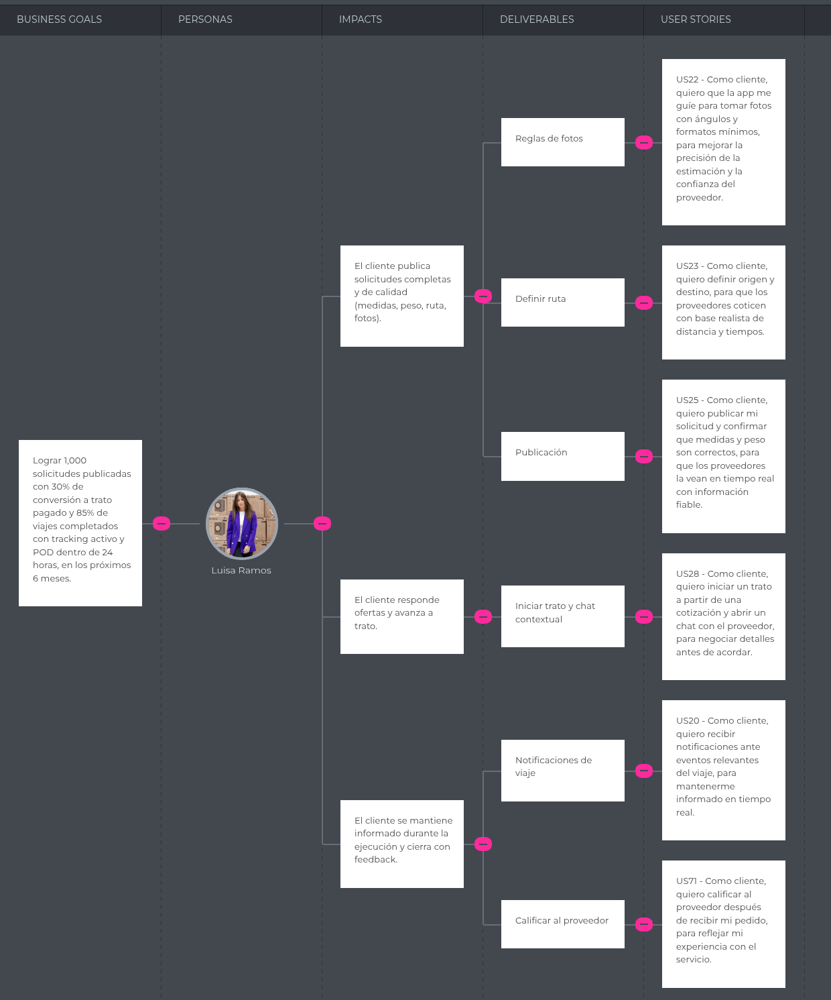

**Segmento 2: Administradores de empresas que se encargan del transporte interprovincial de carga**
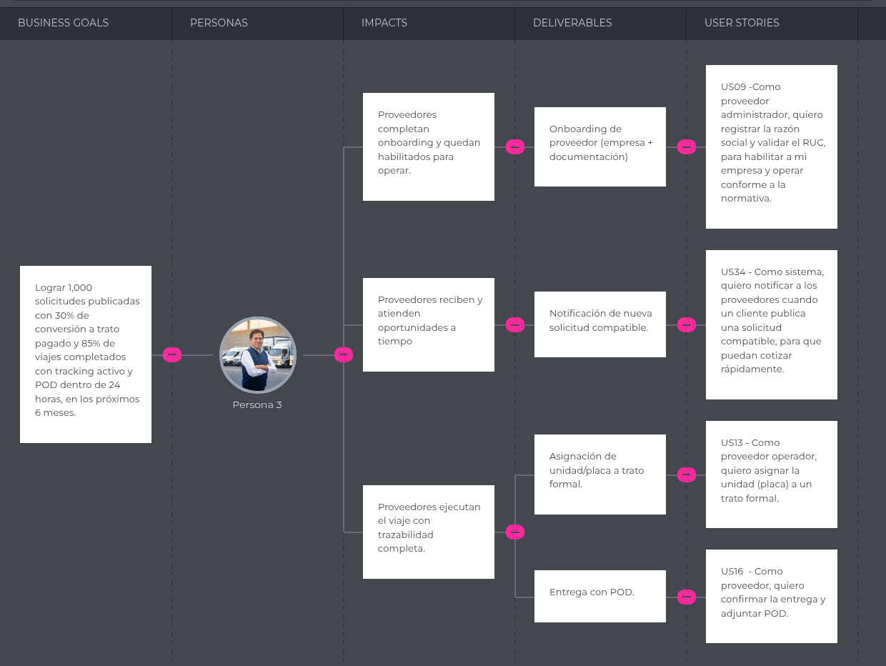


### 2.4.3. Product Backlog

# Product Backlog

| # Orden | User Story Id | Título | Story Points |
|---------|---------------|--------|--------------|
| 1 | US48 | Visualizar información principal de la empresa/producto | 3 |
| 2 | US49 | Acceder fácilmente a llamadas de acción (CTA) | 2 |
| 3 | US50 | Completar un formulario de contacto | 3 |
| 4 | US51 | Adaptación correcta a dispositivos móviles y desktop | 5 |
| 5 | US52 | Navegar fácilmente entre secciones | 2 |
| 6 | US53 | Acceder a una página con buena velocidad de carga | 3 |
| 7 | US54 | Acceder a un sitio accesible e inclusivo | 3 |
| 8 | US55 | Acceder a datos de contacto de la empresa | 2 |
| 9 | US56 | Visualizar secciones de información relevante | 3 |
| 10 | US57 | Crear cuenta y verificar con OTP | 5 |
| 11 | US58 | Iniciar sesión y abrir Session con access/refresh tokens | 5 |
| 12 | US59 | Renovar sesión con refresh de forma segura (rotación) | 5 |
| 13 | US60 | Cerrar sesión actual o todas las sesiones | 3 |
| 14 | US61 | Verificar PIN temporal para autorizar acciones sensibles | 5 |
| 15 | US62 | Cambiar password/correo con step-up y confirmaciones | 5 |
| 16 | US63 | Bloqueo por intentos fallidos y mecanismos de desbloqueo | 5 |
| 17 | US01 | Verificar correo e iniciar registro | 5 |
| 18 | US02 | Verificar teléfono por SMS OTP | 5 |
| 19 | TS01 | Capturar documento y validar contra fuente oficial (OCR/MRZ + padrón) | 8 |
| 20 | TS02 | Selfie con liveness y face-match contra foto del documento | 8 |
| 21 | TS03 | Verificación de nombre y edad mínima + motor de decisión KYC | 5 |
| 22 | TS04 | Auditoría integral y protección de PII (hash, cifrado, retención) | 5 |
| 23 | US03 | Validar documento de identidad y coincidencia de nombre | 8 |
| 24 | US04 | Validar edad mínima y configurar PIN | 3 |
| 25 | US05 | Registrar datos fiscales (RUC opcional) y completar perfil | 5 |
| 26 | US21 | Registrar medidas por IA o manual con edición | 8 |
| 27 | US22 | Capturar fotos de ítems con reglas de calidad | 5 |
| 28 | US23 | Definir ruta (origen y destino) | 3 |
| 29 | US24 | Registrar peso declarado y cálculo automático del peso volumétrico | 3 |
| 30 | US25 | Publicar solicitud y confirmar exactitud de medidas y peso | 5 |
| 31 | US09 | Registrar empresa transportista y validar RUC | 5 |
| 32 | US10 | Cargar y validar poderes y documentación legal | 5 |
| 33 | US11 | Solicitar habilitación de la empresa y dictamen | 5 |
| 34 | US34 | Notificar a proveedores sobre nueva solicitud publicada | 3 |
| 35 | US35 | Notificar al cliente por cotización recibida | 3 |
| 36 | US28 | Iniciar trato desde una cotización y habilitar chat contextual | 5 |
| 37 | US29 | Mensajería del trato: enviar y leer mensajes | 3 |
| 38 | US30 | Acordar trato, congelar negociación y mantener chat operativo hasta entrega confirmada | 8 |
| 39 | US31 | Marcar trato "Listo para pago" con resumen y comisión | 3 |
| 40 | US64 | Registrar medio de pago (tarjeta o cuenta) | 5 |
| 41 | US65 | Realizar pago de un trato acordado | 5 |
| 42 | US66 | Visualizar desglose del pago con comisión | 2 |
| 43 | US79 | Emitir guía de remisión del cliente | 5 |
| 44 | US80 | Emitir guía de remisión del transportista | 5 |
| 45 | US39 | Dar de alta vehículo y validar placa única | 3 |
| 46 | US40 | Registrar capacidad técnica y atributos logísticos de la unidad | 5 |
| 47 | US41 | Subir y validar documentos del vehículo con galería de evidencias (SOAT, CITV, tarjeta, fotos VIN/laterales) | 5 |
| 48 | US44 | Definir corredores con frecuencia, ventanas, cobertura y compatibilidad de carga (con previsualización de calce) | 8 |
| 49 | US45 | Calcular capacidad publicable por ruta/fecha (kg, m³, pallets) con buffers y mínimos | 8 |
| 50 | US13 | Asignar unidad/placa a un trato formal | 5 |
| 51 | US14 | Activar tracking del viaje y enviar posición | 5 |
| 52 | US15 | Registrar eventos operativos en ruta | 5 |
| 53 | US16 | Confirmar entrega y adjuntar prueba de entrega (POD) | 5 |
| 54 | US17 | Cerrar viaje y desactivar tracking | 3 |
| 55 | US20 | Recibir notificaciones de eventos de viaje | 3 |
| 56 | US36 | Notificar actualizaciones de seguimiento del envío | 3 |
| 57 | US33 | Notificar nuevo mensaje de chat | 2 |
| 58 | US67 | Solicitar liquidación de ingresos disponibles | 3 |
| 59 | US70 | Recibir liquidación consolidada con detalle | 3 |
| 60 | US71 | Calificar al proveedor tras la entrega | 3 |
| 61 | US72 | Calificar al cliente tras la entrega | 3 |
| 62 | US07 | Gestionar plantillas de ítems (crear, reutilizar, eliminar) | 5 |
| 63 | US08 | Gestionar plantillas de rutas (crear, actualizar, eliminar) | 5 |
| 64 | US26 | Actualizar solicitud publicada con notificación de cambios / cancelar / expirar | 5 |
| 65 | US27 | Seleccionar objetos genéricos y personalizar | 3 |
| 66 | US32 | Cancelar trato con causa y reglas de reputación | 5 |
| 67 | US06 | Configurar preferencias de notificación y horarios | 3 |
| 68 | US37 | Ver centro de notificaciones y marcar como leído | 3 |
| 69 | US43 | Cambiar estado del vehículo (Habilitado/Deshabilitado) con motivos y trazabilidad | 3 |
| 70 | US42 | Alertas de vencimiento y bloqueo operativo por documentos del vehículo | 5 |
| 71 | US12 | Alertas de vencimiento y renovación de documentos | 5 |
| 72 | US46 | Reservar capacidad al iniciar trato y confirmar al pagar (hold → commit) | 8 |
| 73 | US47 | Recalcular disponibilidad ante cambios y prevenir sobreventa/solapes | 8 |
| 74 | US81 | Solicitar corrección de guía emitida | 3 |
| 75 | US82 | Corregir guía del transportista antes del viaje | 3 |
| 76 | US83 | Anular guía de remisión del cliente | 3 |
| 77 | US84 | Anular guía de remisión del transportista | 3 |
| 78 | US69 | Descargar comprobante de pago | 2 |
| 79 | US68 | Visualizar historial de liquidaciones | 3 |
| 80 | US73 | Recibir notificación para calificar al proveedor | 2 |
| 81 | US74 | Recibir notificación para calificar al cliente | 2 |
| 82 | US75 | Seleccionar tags en la calificación de proveedor | 2 |
| 83 | US76 | Seleccionar tags en la calificación de cliente | 2 |
| 84 | TS05 | Política de reintentos, bloqueo temporal y fallback a revisión manual | 3 |
| 85 | US18 | Duplicar plantilla de ítem o ruta | 2 |
| 86 | US19 | Checklist de requisitos y progreso de habilitación | 3 |
| 87 | US38 | Silenciar notificaciones de un trato o solicitud | 2 |
| 88 | US77 | Visualizar métricas y badges del proveedor | 2 |
| 89 | US78 | Visualizar métricas y badges del cliente | 2 |

## 2.5. Strategic-Level Domain-Driven Design
### 2.5.1. EventStorming
#### 2.5.1.1. Candidate Context Discovery

### 🌐 **Tablero Interactivo de Event Storming (Candidate Context Discovery)**

Para una visualización completa e interactiva de todo el proceso de Event Storming desarrollado, puedes acceder al tablero de Miro donde se encuentra implementado paso a paso:

**[🔗 Ver Event Storming Completo (Candidate Context Discovery) en Miro](https://miro.com/app/board/uXjVJJ2Q680=/?share_link_id=532792292602)**


---

## 📋 **Step 0 — Nomenclatura**

### 📋 **Descripción**

En esta fase inicial del Event Storming, definimos la nomenclatura y simbología que se utilizará a lo largo de todo el proceso. Cada elemento del sistema se representa con un color específico para facilitar la identificación y comprensión durante las sesiones de modelado.

### 🎨 **Simbología de Colores**


### 🔤 **Elementos del Sistema**

| Color | Elemento | Descripción |
|-------|----------|-------------|
| 🟠 **Naranja** | **Domain Event** | Eventos que han ocurrido en el pasado, representan hechos consumados en el dominio |
| 🟡 **Amarillo** | **User/Actor** | Usuarios, actores o roles que interactúan con el sistema |
| 🟣 **Morado** | **Business Process** | Procesos de negocio que conectan eventos y acciones |
| 🔵 **Azul Claro** | **Command** | Acciones o intenciones que los usuarios quieren ejecutar |
| ⚪ **Blanco** | **External System** | Sistemas externos que se integran con nuestra solución |
| 🟢 **Verde Claro** | **View/Read Model** | Modelos de lectura y vistas para consultas de soporte |
| 🔴 **Rojo/Rosa** | **Question/Risk** | Preguntas, riesgos o hotspots que requieren atención |


## 🔍 **Step 1 — Collect Domain Events**

### 📋 **Descripción**

En esta primera fase del Event Storming, volcamos todos los eventos de dominio en pasado, sin orden ni filtros. El objetivo es capturar el vocabulario del negocio y el alcance real del sistema, desde procesos de onboarding, solicitudes y cotizaciones, hasta pagos, guías, tracking, disputas, calificaciones y notificaciones.

### 📊 **Eventos Identificados**

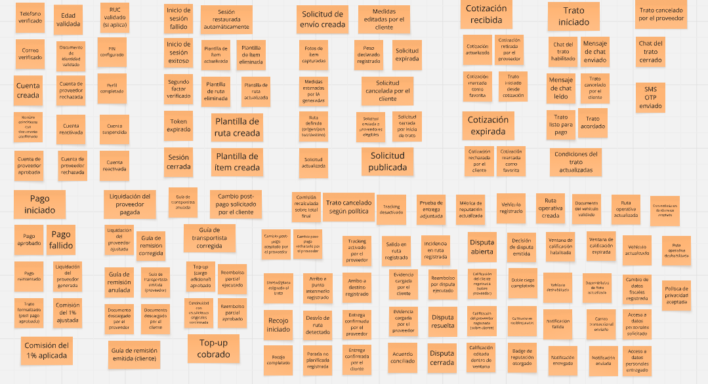


## ⏰ **Step 2 — Enforce the Timeline**

### 📋 **Descripción**

En esta segunda fase del Event Storming, ordenamos los eventos de dominio en timelines coherentes por flujo de negocio. El objetivo es crear historias de negocio end-to-end con causalidad básica y puntos de cierre/expiración, identificando las secuencias lógicas y las ramas de decisión en cada proceso.


### 📊 **Timelines Identificados**

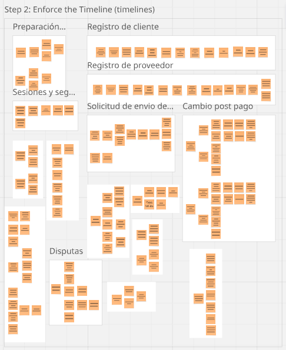

### 🔄 **Preparación del Proveedor**

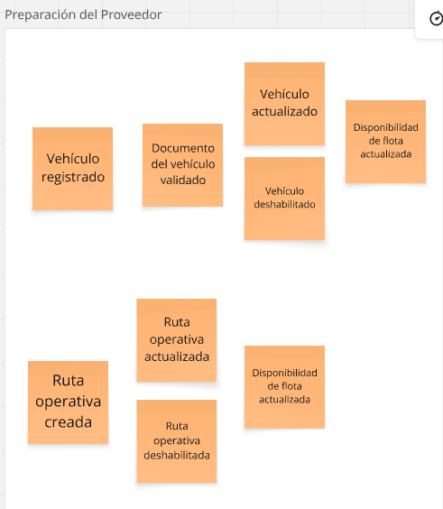

Encadenamos el alta y ciclo de vida de vehículos y rutas: **Vehículo registrado** → **Documento validado** → (actualizaciones 0..n | deshabilitado [terminal]) con side-effect de **Disponibilidad de flota actualizada**. Para rutas: **Ruta creada** → (actualizada 0..n | deshabilitada [terminal]) también disparando disponibilidad.

### 👤 **Registro de Cliente**

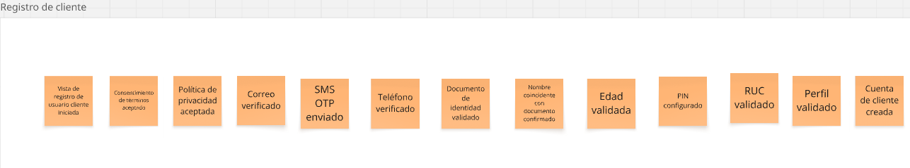

Forzamos prerequisitos y secuencia: **consentimiento** → **verificaciones** (correo, OTP, teléfono) → **validación de identidad** (documento, nombre, edad) → **seguridad** (PIN) → (RUC si aplica) → **Perfil validado** → **Cuenta de cliente creada**. Marcamos que no hay "cuenta preliminar": la cuenta nace al final, tras pasar todos los checks.

### 🏢 **Registro de Proveedor**

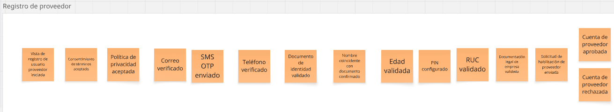

Similar al cliente, pero con capa legal: **consentimiento y verificaciones** → **identidad persona responsable** → **RUC validado y Documentación legal validada** → **Solicitud de habilitación enviada** → decisión: **Cuenta aprobada** | **Cuenta rechazada** [terminal].

### 🔐 **Sesiones y Seguridad**

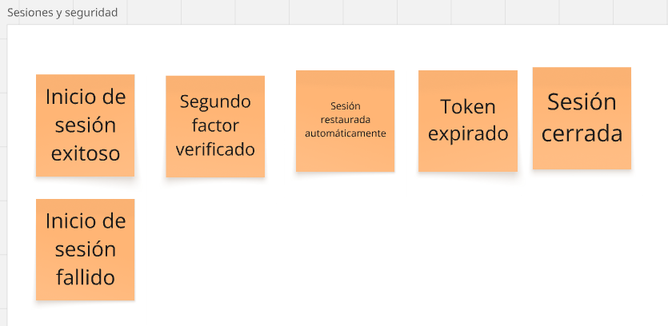

Secuencia y estados de sesión: **Inicio de sesión fallido** | **exitoso** → **Segundo factor verificado** → **Sesión restaurada automáticamente**. Luego eventos de cierre temporal: **Token expirado** → **Sesión cerrada**. Modelamos fallas e inactividad separadas del login exitoso.

### 📦 **Solicitud de Envío de Carga**

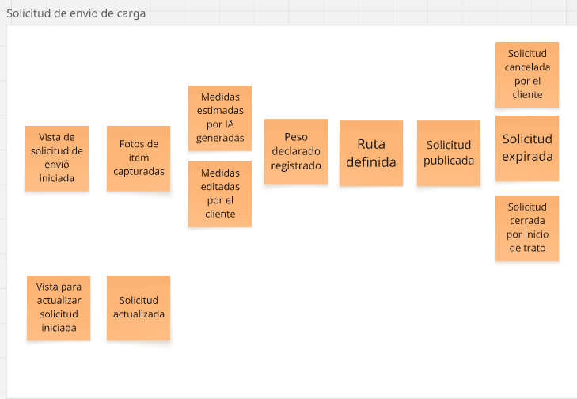

Ordenamos captura y enriquecimiento: **Fotos capturadas** → **Medidas IA** → (edición del cliente) → **Peso registrado** → **Ruta definida** → **Solicitud publicada**. Terminales: **Cancelada**, **Expirada**, o **Cerrada por inicio de trato**. Aseguramos que publicación solo ocurre tras ruta/peso/medidas.

### 🤝 **Trato**

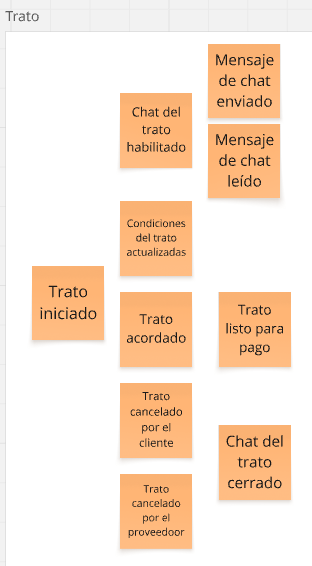

Flujo de negociación: **Trato iniciado** → **Chat habilitado** → (mensajes/lecturas) → **Condiciones actualizadas** → **Trato acordado** → **Trato listo para pago**. Terminales paralelas: **Cancelado por cliente/proveedor** (cierra chat) o continuidad hacia pagos.

### 💰 **Pago**

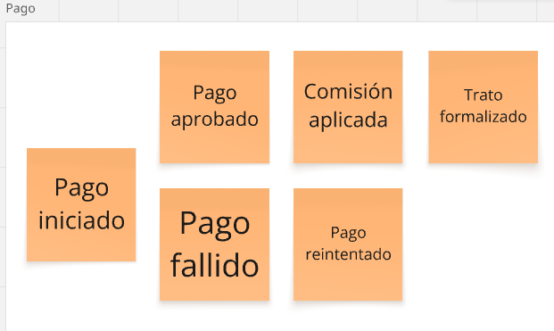

Camino principal: **Pago iniciado** → (aprobado | fallido → reintentado) → **Comisión aplicada** → **Trato formalizado**. Aislamos fallas y reintentos para no avanzar al formalizado hasta la confirmación.

### 📋 **Documentación (Guías)**

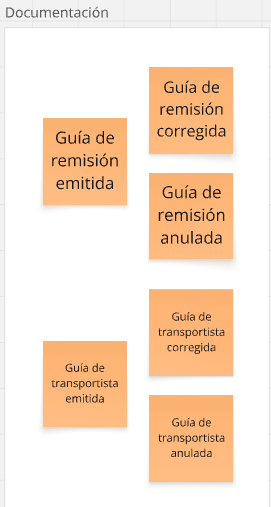

Secuencias separadas por emisor: cliente emite **Guía de remisión** y proveedor **Guía de transportista**; cada una puede corregirse o anularse (terminal). Definimos que la emisión ocurre tras pago/formalización y que correcciones/anulaciones respetan ventanas.

### 🔔 **Notificaciones**

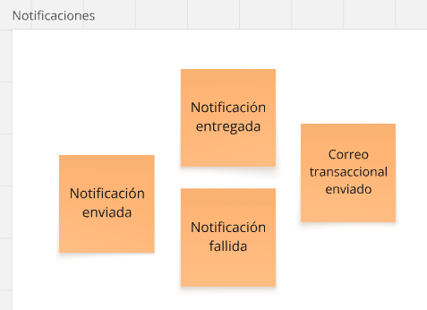

Línea simple con estados de entrega: **Notificación enviada** → (entregada | fallida) y **Correo transaccional enviado** en paralelo. Quedó como timeline auxiliar consumido por otros.

### 📝 **Plantillas**

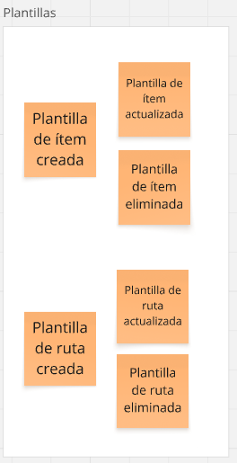

Dos sublíneas (ítem y ruta) con el mismo patrón CRUD: **creada** → (actualizada 0..n | eliminada [terminal]). Útiles como prerequisito opcional en Solicitudes.

### 💬 **Cotizaciones**

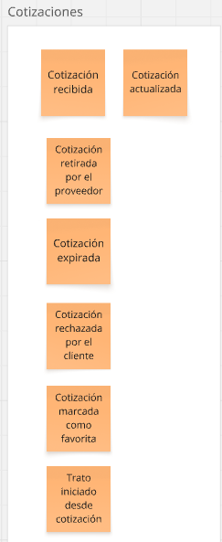

Secuencia desde recepción/actualización hasta decisiones del cliente: **Cotización recibida/actualizada** → (retirada por proveedor | expirada | rechazada | marcada como favorita) → **Trato iniciado desde cotización**. Aclaramos que solo algunas ramas llevan al trato.

### ⚖️ **Disputas**

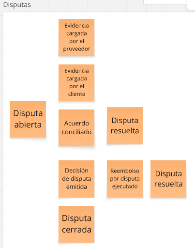

Árbol con resolución por acuerdo o decisión: **Disputa abierta** → (evidencias de ambas partes) → (**Acuerdo conciliado** | **Decisión emitida**) → (**Reembolso por disputa ejecutado** si aplica) → **Disputa resuelta** → **Disputa cerrada** [terminal]. Marcamos pausa de otras ventanas (ratings) mientras está abierta.

### ⭐ **Calificaciones**

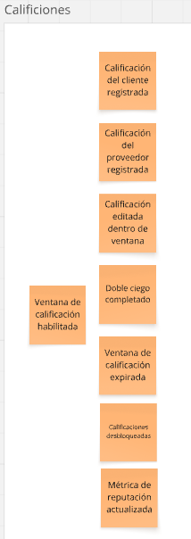

Ventana y doble ciego: **Ventana habilitada** → **Calificación cliente/proveedor** → (ediciones 0..n dentro de ventana) → (**Doble ciego completado** | **Ventana expirada**) → **Calificaciones desbloqueadas** → **Métrica de reputación actualizada**. Indicamos que la ventana puede pausarse por disputa.

### 🔄 **Cambio Post-Pago**

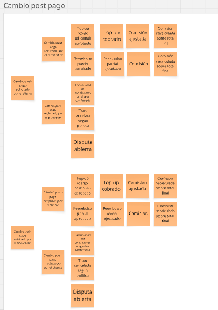

Dos ramas según delta: **Cambio solicitado** → (aceptado | rechazado). Si top-up: **Top-up aprobado** → **Top-up cobrado** → **Comisión ajustada** → **Comisión recalculada**; si refund: **Reembolso aprobado** → **Reembolso ejecutado** → **Comisión ajustada** → **Comisión recalculada**. Alternativa: **Continuidad original** o **Trato cancelado según política** [terminal].

### 🛰️ **Tracking**

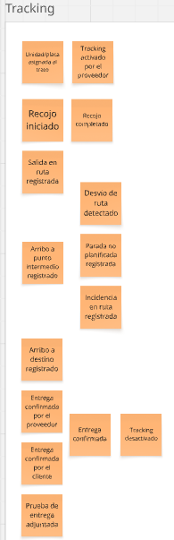

Hitos operativos ordenados: **Unidad/placa asignada** → **Tracking activado** → **Recojo iniciado/completado** → **Salida en ruta** → (arribos intermedios, paradas, desvíos, incidencias) → **Arribo a destino** → **Entrega confirmada** (proveedor/cliente) → **Entrega confirmada** (consolidada) → **Tracking desactivado**. Definimos que eventos en ruta no cierran el viaje pero pueden disparar alertas/ajustes.

## 🔥 **Step 3 — Hotspots**

### 📋 **Descripción**

En esta tercera fase del Event Storming, señalamos ambigüedades, riesgos, reglas finas e integraciones en cada timeline. El objetivo es identificar límites, tolerancias, ventanas legales, idempotencia, expiraciones, antifraude, telemetría, doble ciego y otros aspectos críticos que requieren decisiones de diseño.

### 📊 **Hotspots Identificados**

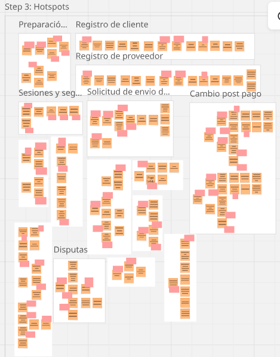

### 🔄 **Preparación del Proveedor**

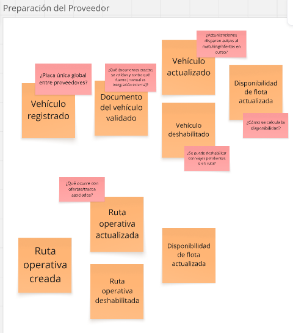

**Hotspots identificados:**
- **Unicidad de placa** entre proveedores
- **Lista exacta de documentos** por país y vencimientos
- **Disparo de rematch** de ofertas activas al actualizar
- **Cálculo de "disponibilidad"** y reglas específicas
- **Reglas para deshabilitar** con viajes pendientes

### 👤 **Registro de Cliente**

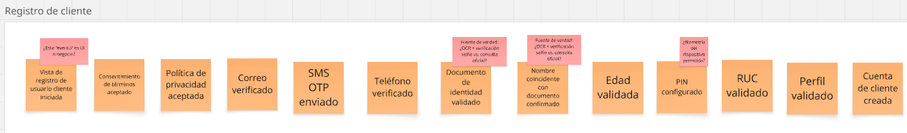

**Hotspots identificados:**
- **¿Qué es evento vs. UI?** (vista iniciada)
- **Fuentes de verdad para KYC** (OCR, face-match, consulta oficial)
- **Aplicación de RUC** a cliente
- **Límites/orden de validaciones**
- **Fallback manual** si IA no confía

### 🏢 **Registro de Proveedor**

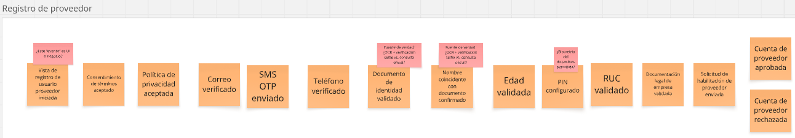

**Hotspots identificados:**
- **Límite de sesiones** de verificación
- **Origen de verificación RUC** y poderes
- **Documentos habilitantes** (formatos/país)
- **Doble confirmación interna** para aprobar
- **Estados intermedios** y reintentos

### 🔐 **Sesiones y Seguridad**

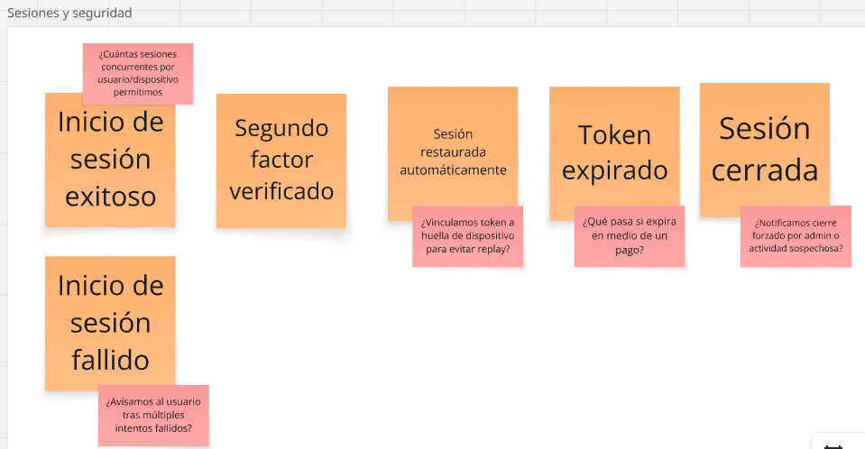

**Hotspots identificados:**
- **Nº de sesiones concurrentes** por usuario/dispositivo
- **Vínculo del token** a huella de dispositivo
- **Manejo de token expirado** en medio de pago
- **Cierre forzado** por actividad sospechosa
- **Notificación tras múltiples fallos**

### 📦 **Solicitud de Envío de Carga**

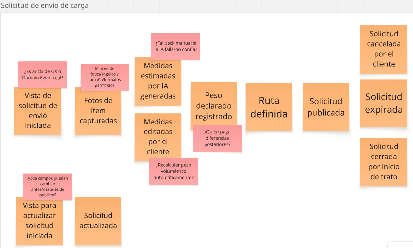

**Hotspots identificados:**
- **UX del flujo** (orden real vs. Domain Events)
- **Mínimos de fotos/ángulos** y tamaños
- **Confianza/errores de IA** de medidas
- **Recálculo de peso volumétrico**
- **Campos editables** tras publicar
- **Responsabilidad de diferencias** posteriores

### 🤝 **Trato (Negociación & Chat)**

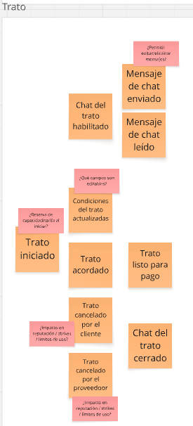

**Hotspots identificados:**
- **Cap de tratos abiertos** por solicitud/proveedor
- **Rate-limits de chat**
- **Campos editables** de condiciones y tolerancias
- **Cierre de chat** y condiciones
- **Impacto en reputación** por cancelaciones fuera de ventana

### 💰 **Pago**

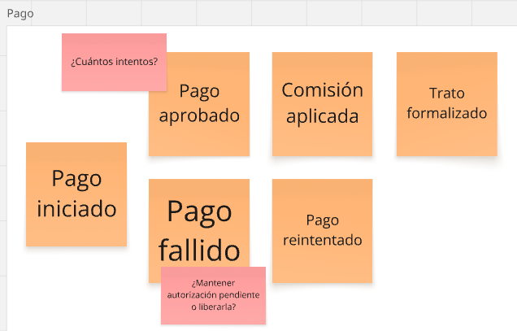

**Hotspots identificados:**
- **Nº de reintentos** y backoff
- **Mantenimiento/liberación** de autorización pendiente
- **Orden exacto** de "comisión aplicada" vs. "formalizado"
- **Manejo de fallas** con PSP
- **Reconciliación de webhooks**

### 📋 **Documentación (Guías)**

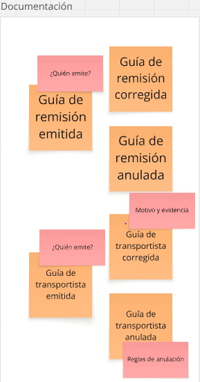

**Hotspots identificados:**
- **Quién emite qué** (cliente vs. proveedor)
- **Motivos y ventana** de corrección/anulación
- **Dependencias con estado** del viaje
- **Consistencia entre guías** cuando cambia la ruta/peso

### 🔔 **Notificaciones**

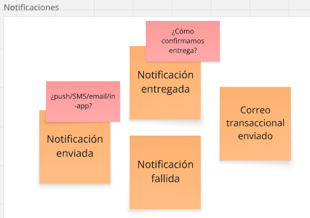

**Hotspots identificados:**
- **Medios por tipo** (push/SMS/email/in-app)
- **Confirmación de entrega real** (open tracking/TTL)
- **Reintentos y políticas** de fallback
- **Plantillas transaccionales** multi-idioma

### 📝 **Plantillas**

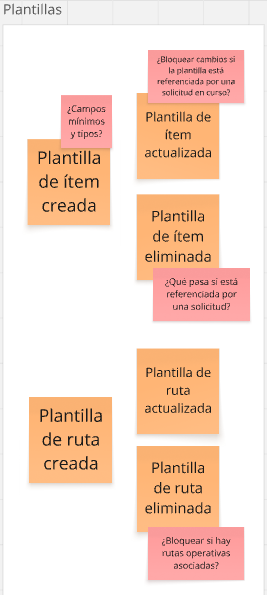

**Hotspots identificados:**
- **Unicidad por nombre** vs. por usuario
- **Límites de cantidad** por usuario
- **Normalización de unidades** (cm/kg)
- **Edición/propagación** de cambios a solicitudes ya publicadas

### 💬 **Cotizaciones**

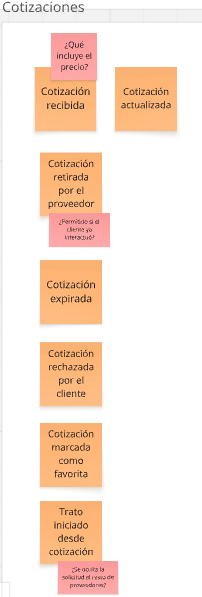

**Hotspots identificados:**
- **Qué incluye el precio** (fees, peajes, extras)
- **Retiro de ofertas** por proveedor y impacto al cliente
- **Expiración y relojes**
- **Transformación de cotización → trato** con idempotencia

### ⚖️ **Disputas**

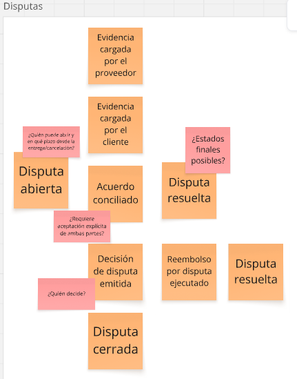

**Hotspots identificados:**
- **Quién puede abrir** y hasta cuándo
- **Evidencias válidas**
- **Aceptación explícita** de ambas partes para conciliar
- **Decisión en no acuerdo**
- **Impacto en reputación** y congelamiento de ventanas de rating

### ⭐ **Calificaciones**

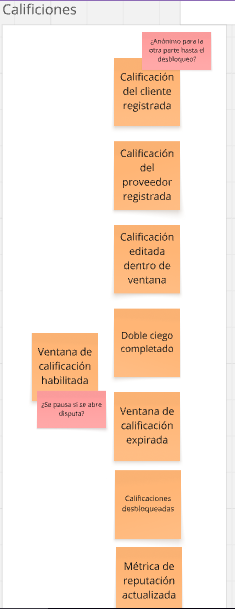

**Hotspots identificados:**
- **Confirmación necesaria** (una o ambas para desbloquear)
- **Pausa automática** si se abre disputa
- **Edición dentro de ventana**
- **Anonimato/doble ciego**
- **Tags válidos** y moderación de contenido

### 🔄 **Cambio Post-Pago**

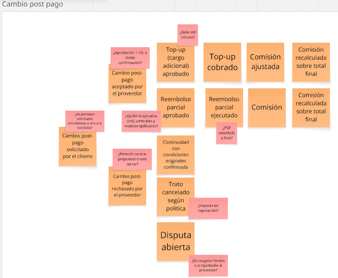

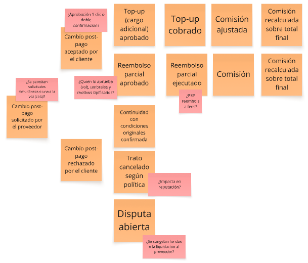

**Hotspots identificados:**
- **Una o doble confirmación**
- **Tolerancias/umbrales** para autoaceptar
- **Simultaneidad de solicitudes** (locking)
- **Responsabilidad de fees PSP** en reembolsos
- **Congelar fondos** y efecto en liquidaciones/proveedor

### 🛰️ **Tracking (Viajes)**

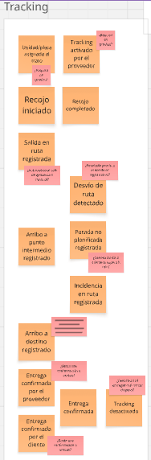

**Hotspots identificados:**
- **Tipo de GPS/telemática**
- **Thresholds de geocerca** y "desvío significativo"
- **Salida "solo si recojo completo"** o override manual
- **Alertas por parada** > X min
- **Confirmación de entrega** (1 o 2 confirmaciones + PoD)
- **Desactivación de tracking** (entrega vs. cierre de disputa)

## ⚙️ **Step 4 — Causality and Domain Orchestration**

### 📋 **Descripción**

En esta cuarta fase del Event Storming, para cada timeline añadimos Commands (intención), Policies/Sagas (reglas y orquestación), Read Models (consultas de soporte) y Sistemas externos (PSP, KYC, OSE, Maps, Telemática, Push/SMS/Email). El objetivo es crear flujos ejecutables con precondiciones, efectos, webhooks y hand-offs entre dominios.


### 📊 **Orquestación de Dominios**

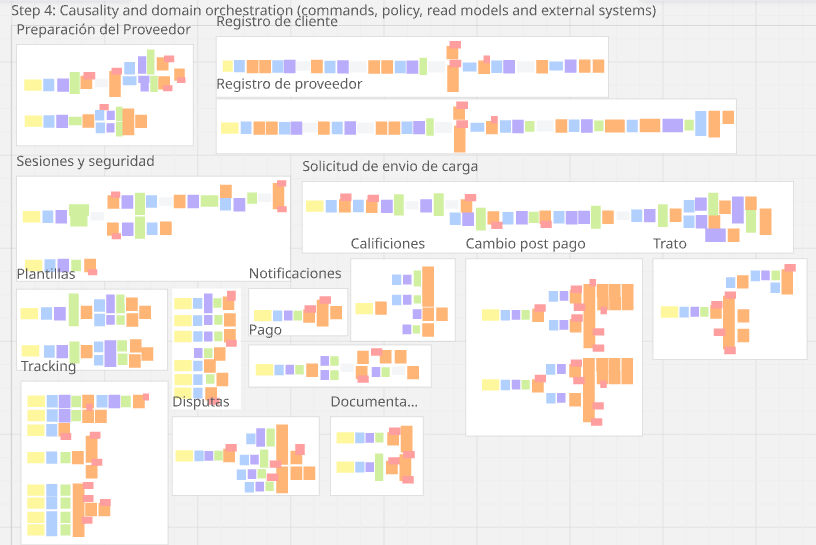

### 🔄 **Preparación del Proveedor**

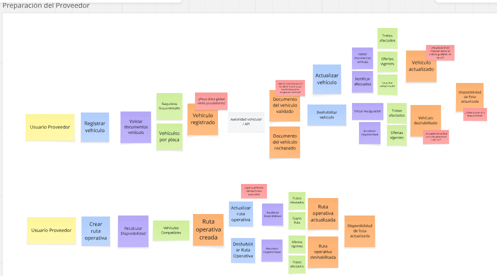

**Commands:** Registrar/actualizar/deshabilitar vehículo y crear/actualizar/deshabilitar ruta

**Policies:** Validar documentos vehiculares, recalcular disponibilidad y notificar impactos

**Read Models:** Requisitos documentales, capacidad comprometida y tratos/ofertas afectadas

**Sistemas Externos:** Autoridad Vehicular, Matching/Index y Notificaciones

### 👤 **Registro de Cliente**

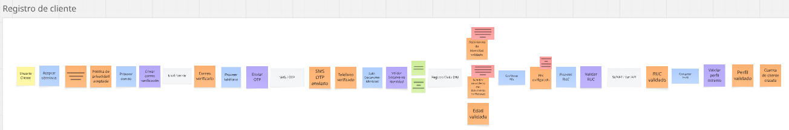

**Commands:** Proporcionar correo/teléfono/documento/PIN

**Policies:** Verificación (OTP, KYC persona, name/age match) y checklist previo a crear cuenta

**Read Models:** Usuarios, intentos fallidos, KYC y límites

**Sistemas Externos:** Email/SMS, IdP/Auth, OCR/KYC

### 🏢 **Registro de Proveedor**


**Commands:** Enviar documentación legal, RUC y solicitar habilitación

**Policies:** Validación (SUNAT/Registro Público), gate de aprobación y auditoría

**Read Models:** Checklist legal/empresarial

**Sistemas Externos:** Tax API/Registros, Notificaciones; decisión final por Operaciones (aprobar/rechazar)

### 🔐 **Sesiones y Seguridad**


**Commands:** Login, confirmar MFA, restaurar/cerrar sesión

**Policies:** Autenticación, anti-bruteforce, riesgo y emisión/rotación de tokens

**Read Models:** Credenciales hash, sesiones activas, dispositivos confiables y perfil de riesgo

**Sistemas Externos:** IdP/Auth, SMS/Push; timers de expiración/rotación

### 📦 **Solicitud de Envío de Carga**


**Commands:** Fotos, estimar medidas IA, editar medidas, registrar peso y definir ruta

**Policies:** Validar contenidos, recalcular peso volumétrico, normalizar direcciones y checklist de publicación

**Read Models:** Catálogos, umbrales IA y configuraciones de expiración

**Sistemas Externos:** MediaStore, Geocoding/Maps, Servicio IA, Matching/Index, Notificaciones

### 🤝 **Trato (Negociación & Chat)**


**Commands:** Iniciar trato, habilitar chat, enviar/marcar leído, proponer/aceptar condiciones y cancelar

**Policies:** Límites, reservas de capacidad, tolerancias y doble aceptación

**Read Models:** Ofertas vigentes, capacidad comprometida y reglas de cancelación

**Sistemas Externos:** WS/Push, MediaStore, Notificaciones y hand-off a Pagos

### 💰 **Pago**


**Commands:** Iniciar/confirmar/reintentar pago y liberar autorización

**Policies:** Antifraude, 3DS, idempotencia, comisión 1% y reintentos con backoff

**Read Models:** Retry policy, conciliación y ledger de comisiones

**Sistemas Externos:** Webhooks con PSP, Notificaciones; eventos conducen a Trato formalizado y programan liquidaciones

### 📋 **Documentación (Guías)**


**Commands:** Emitir/corregir/anular guía de remisión (cliente) y de transportista (proveedor)

**Policies:** Firmas, series/correlativos, ventanas legales y consistencia con el trato

**Read Models:** Checklist legal por país y versiones

**Sistemas Externos:** Autoridad Fiscal/OSE, MediaStore, Notificaciones; hand-off para habilitar Viajes

### 🔔 **Notificaciones**


**Commands:** Command único de encolado con fan-out por canal

**Policies:** Resolución de destinatarios, selección de canal, plantillas, idempotencia, rate limit y reintentos

**Read Models:** Preferencias, canales verificados y políticas de escalamiento

**Sistemas Externos:** FCM/APNs, SES/Email, SMS, in-app/WS con webhooks para entrega/fallo

### 📝 **Plantillas**


**Commands:** CRUD para plantillas de ítem/ruta

**Policies:** Validación, normalización de unidades, unicidad y versionado seguro

**Read Models:** Plantillas por usuario, versiones y uso en borradores

**Sistemas Externos:** MediaStore y Geocoding; triggers desde Solicitudes para autoguardado

### 💬 **Cotizaciones (Ofertas)**


**Commands:** Enviar/actualizar/retirar cotización y acciones del cliente (rechazar, favorito, iniciar trato)

**Policies:** Elegibilidad y compatibilidad (capacidad, ruta, dimensiones), normalización de precio y locks al iniciar trato

**Read Models:** Reglas de cotización, capacidad comprometida y caducidades

**Sistemas Externos:** Matching/Index y Notificaciones

### ⚖️ **Disputas**


**Commands:** Abrir disputa, cargar evidencia, proponer/aceptar acuerdo, emitir decisión y cerrar

**Policies:** Elegibilidad por ventana/estado, pausa de calificaciones/liquidaciones, idempotencia y auditoría

**Read Models:** Disputas por trato, SLA y estado de pagos

**Sistemas Externos:** MediaStore, Notificaciones, y hand-offs a Pagos y Reputación

### ⭐ **Calificaciones (Reputación)**


**Commands:** Habilitar ventana, registrar/editar calificación

**Policies:** Doble ciego, moderación y desbloqueo (ambas calificaciones o expiración)

**Read Models:** Ventanas activas, catálogo de tags y métricas

**Sistemas Externos:** Moderation/NLP, Notificaciones; cálculo de métricas y badges tras desbloqueo

### 🔄 **Cambio Post-Pago (Ajustes)**


**Commands:** Proponer/aceptar/rechazar ajuste

**Policies:** Tolerancias, doble confirmación, locking por propuesta y clasificación delta (top-up/refund)

**Read Models:** Tarificador, tolerancias y estado de liquidación

**Sistemas Externos:** Pagos (top-up/reembolso), Notificaciones y impacto en Guías/Reputación

### 🛰️ **Tracking (Viajes)**


**Commands:** Asignar unidad, activar tracking, registrar hitos (recojo, salida, paradas, desvíos, incidencias, arribo, entregas) y desactivar tracking

**Policies:** Prerequisitos (guías/unidad), geocercas, umbrales de desviación/parada y consolidación de entrega (1-o-2 confirmaciones + PoD)

**Read Models:** Ruta planificada, SLAs y estado del viaje

**Sistemas Externos:** Telemática, Maps, MediaStore, Notificaciones; hand-offs a Reputación, Disputas y Liquidaciones

## 🏗️ **Step 5 — Project to Bounded Contexts**

### 📋 **Descripción**

En esta quinta fase del Event Storming, agrupamos y alineamos los timelines en Bounded Contexts (IAM, Identity, Customers, Providers, Fleet, Planning, Requests, Deals, Payments, Waybills, Trips, Reviews, Disputes, Notifications), definiendo para cada BC qué timelines contiene y el orden operativo interno, más los eventos publicados/consumidos entre BCs. El resultado es un mapa de contextos listo para arquitectura modular o microservicios.

### 📊 **Mapa de Bounded Contexts**


### 🔐 **IAM (Identity & Access Management)**


**Timeline:** Sesiones y seguridad

**Flujo Ultraresumido:** 
- Login → MFA (si aplica) → Sesión activa/restaurada
- Expiración/cierre por token o riesgo
- Rate-limit ante fallos

**Eventos Emitidos:** Identidad autenticada para el resto

### 👤 **Identity (Identity & KYC)**


**Timelines:** Registro KYC de persona (cliente/representante)

**Flujo:**
- Consentimientos → Verificación correo/OTP
- Validación documento + name/age match → PIN
- Si todo OK, "PersonaVerificada" para Customers/Providers

### 🔔 **Notifications**


**Timeline:** Notificaciones transaccionales

**Flujo:**
- Encolar → Resolver destinatarios/preferencias
- Render plantilla → Fan-out por canal (push/email/SMS/in-app)
- Enviada/entregada/fallida con reintentos y fallback

### 👥 **Customers**


**Timelines:** Alta de cuenta cliente (post-KYC) + plantillas

**Flujo:**
- PersonaVerificada → Perfil/estado apto → Cuenta creada
- CRUD de Plantilla de ítem/ruta con versionado y normalización de unidades
- Expuesto a Requests

### 🏢 **Providers**


**Timeline:** Onboarding del proveedor (empresa)

**Flujo:**
- Validar RUC y documentos legales
- Solicitud de habilitación → Aprobado/rechazado
- Si aprobado, habilita Fleet/Planning

### 🚛 **Fleet**


**Timeline:** Preparación del proveedor (vehículos)

**Flujo:**
- Vehículo registrado → Documento validado
- (Actualizaciones 0..n | Deshabilitado [terminal])
- Recalcular disponibilidad
- Propaga cambios a Planning/Deals

### 📋 **Planning**


**Timeline:** Rutas operativas y disponibilidad publicable

**Flujo:**
- Ruta creada → (Actualizada 0..n | Deshabilitada)
- Disponibilidad actualizada
- Publica ofertabilidad hacia Deals (cotizaciones)

### 📦 **Requests**


**Timeline:** Solicitud de envío

**Flujo:**
- Fotos → IA de medidas → Edición → Peso → Ruta → Publicación
- Cierre por cancelación/expiración o por inicio de trato
- Dispara elegibilidad a Deals

### ⭐ **Reviews**


**Timeline:** Calificaciones/reputación

**Flujo:**
- Habilitar ventana al entregar/cerrar disputa
- Cliente/proveedor califican (doble ciego)
- Desbloqueo al completar/expirar
- Recalcular métricas y badges

### 🛰️ **Trips**


**Timeline:** Tracking y entrega

**Flujo:**
- Unidad asignada + guías vigentes → Activar tracking
- Recojo → Salida → Eventos en ruta (paradas/desvíos/incidencias)
- Arribo → Confirmaciones/PoD → Desactivar tracking
- Abre ventana de Reviews y agenda liquidación

### 📋 **Waybills**


**Timeline:** Documentación (guías)

**Flujo:**
- Tras pago/trato formalizado, cliente emite Guía de Remisión
- Proveedor emite Guía de Transportista
- Pueden corregirse/anularse con ventanas legales
- Habilitan inicio de viaje en Trips

### 💰 **Payments**


**Timelines:** Pago y cambios post-pago

**Flujo Pago:**
- Iniciar → (Aprobado | Fallido/reintento)
- Aplicar comisión 1% → Formalizar trato → Programar liquidación

**Flujo Ajustes:**
- Propuesta → (Aceptado: top-up cobrado / reembolso ejecutado → comisión ajustada | Rechazado: continuidad/cancelación)

### 🤝 **Deals**


**Timelines:** Cotizaciones y trato

**Flujo:**
- Solicitud publicada + disponibilidad ⇒ Cotizaciones (recibida/actualizada/retirada/expirada)
- Cliente inicia trato → Chat/negociación → Acuerdo
- Listo para pago (handoff a Payments) o cancelaciones (cierra chat y libera capacidad)

### ⚖️ **Disputes**


**Timeline:** Gestión de disputas

**Flujo:**
- Apertura de disputa → Carga de evidencias
- Proceso de conciliación o decisión
- Resolución y cierre
- Impacto en reputación y liquidaciones

#### 2.5.1.2. Domain Message Flows Modeling

### 📋 **Descripción**

En esta sección se modelan los flujos de mensajes entre Bounded Contexts, mostrando cómo interactúan los diferentes dominios del sistema a través de eventos y comandos. Cada flujo representa un escenario de negocio completo que involucra múltiples contextos y sus interacciones.


### 🔄 **Escenarios de Integración**

#### 1️⃣ **Alta de Cliente con Verificación KYC**


**Flujo de Integración:**
- El cliente solicita iniciar KYC en **Identity**
- El BC **Identity** valida documento/nombre/edad
- **Identity** emite `PersonVerified` a **Customers**
- **Customers** crea la cuenta y publica `CustomerCreated`
- **Notifications** confirma el alta al cliente

**Bounded Contexts Involucrados:**
- Identity → Customers → Notifications

---

#### 2️⃣ **Onboarding de Proveedor (Empresa Habilitada)**


**Flujo de Integración:**
- El proveedor envía RUC y documentos a **Providers**
- **Providers** valida el RUC vía **Identity**
- **Providers** marca la empresa como validada
- **Operaciones** decide con `ApproveProvider` (o rechazo)
- **Providers** emite `ProviderApproved/Rejected`
- **Notifications** notifica la decisión al proveedor

**Bounded Contexts Involucrados:**
- Providers → Identity → Operaciones → Notifications

---

#### 3️⃣ **Alta de Vehículo y Disponibilidad Publicable**


**Flujo de Integración:**
- El proveedor registra un vehículo en **Fleet**
- **Fleet** valida documentos del vehículo
- Al quedar habilitado, **Fleet** publica `VehicleBecameAvailable` a **Planning**
- **Planning** recalcula disponibilidad/cupos
- **Planning** opcionalmente notifica que la flota está lista

**Bounded Contexts Involucrados:**
- Fleet → Planning → Notifications

---

#### 4️⃣ **Publicación de Solicitud de Envío**


**Flujo de Integración:**
- El cliente crea borrador en **Requests**
- **Requests** consulta a un sistema de IA para estimar medidas desde fotos
- **Requests** publica la solicitud (`RequestPublished`)
- **Requests** pide elegibilidad de proveedores a **Planning**
- **Requests** emite `RequestBroadcasted` para notificar a los candidatos

**Bounded Contexts Involucrados:**
- Requests → IA System → Planning → Notifications

---

#### 5️⃣ **Cotización e Inicio de Trato**


**Flujo de Integración:**
- El proveedor envía una cotización a **Deals** (`QuoteReceived`)
- El cliente elige la cotización y dispara `StartDealFromQuote`
- **Deals** bloquea la solicitud en **Requests** (`RequestLockedByDeal`)
- **Deals** emite `DealStarted` para habilitar el chat
- **Deals** avisa a las partes sobre el inicio del trato

**Bounded Contexts Involucrados:**
- Deals → Requests → Notifications


#### 2.5.1.3. Bounded Context Canvases

### 📋 **Descripción**

En esta sección se presentan los Bounded Context Canvases, que definen los límites y responsabilidades de cada contexto del dominio. Cada canvas detalla el propósito, funcionalidades clave, integraciones y eventos de cada Bounded Context, proporcionando una visión clara de cómo se organiza el sistema en dominios cohesivos.

### 🏗️ **Bounded Contexts del Sistema**

#### 💰 **Payments**


**Descripción:**
Orquesta todo el cobro al cliente (autorización/captura), calcula y aplica la comisión del 1%, gestiona top-ups y reembolsos parciales, y emite eventos de "DealFormalized/PaymentApproved" que habilitan documentación y viaje. Se integra con el PSP y mantiene idempotencia, reintentos y liquidaciones al proveedor. Es core/compliance por su impacto directo en ingresos y riesgo.

**Responsabilidades Clave:**
- Procesamiento de pagos y autorizaciones
- Cálculo y aplicación de comisiones
- Gestión de top-ups y reembolsos
- Integración con PSP (Payment Service Provider)
- Mantenimiento de idempotencia y reintentos
- Liquidaciones al proveedor

---

#### 🤝 **Deals**


**Descripción:**
Gestiona la negociación: recepción de cotizaciones, aceptación parcial, arranque del trato desde una quote, control de estado hasta "listo para pago" y bloqueo de la solicitud. Publica eventos que habilitan chat/contexto y coordina con Requests para asegurar exclusividad. Es el punto de encuentro operacional entre cliente y proveedor.

**Responsabilidades Clave:**
- Gestión de cotizaciones y negociaciones
- Control del estado del trato
- Coordinación con Requests para exclusividad
- Habilitación de chat y contexto de negociación
- Publicación de eventos de estado

---

#### 📦 **Requests**


**Descripción:**
Crea y publica solicitudes de envío con ítems, medidas estimadas por IA, peso y ruta, controlando edición/expiración. Tras publicar, consulta a Planning por elegibilidad y dispara un broadcast a proveedores. Mantiene el lifecycle de la solicitud hasta ser bloqueada por un Deal. Es la puerta de entrada del flujo de carga.

**Responsabilidades Clave:**
- Creación y gestión de solicitudes de envío
- Integración con IA para estimación de medidas
- Control de edición y expiración
- Consulta de elegibilidad con Planning
- Broadcast a proveedores
- Gestión del lifecycle de solicitudes

---

#### 📋 **Planning**


**Descripción:**
Calcula disponibilidad publicable combinando rutas operativas, capacidad y calendarios; determina proveedores elegibles para una solicitud. Reacciona a cambios de flota/rutas y recalcúla de forma incremental, exponiendo una query de matching. Es un contexto analítico/gateway clave para la eficiencia del marketplace.

**Responsabilidades Clave:**
- Cálculo de disponibilidad publicable
- Determinación de proveedores elegibles
- Combinación de rutas, capacidad y calendarios
- Reacción a cambios de flota/rutas
- Exposición de queries de matching
- Optimización del marketplace

---

#### 🛰️ **Trips**


**Descripción:**
Administra el ciclo de vida del viaje formal: asignación de unidad, activación de tracking, registro de eventos operativos (desvíos, paradas, incidencias), arribo y confirmación de entrega con POD, cerrando tracking. Consume "DealFormalized" y "WaybillsIssued" como prerrequisitos y alimenta a Notifications y Reviews. Es un execution context central.

**Responsabilidades Clave:**
- Gestión del ciclo de vida del viaje
- Asignación de unidades
- Activación y control de tracking
- Registro de eventos operativos
- Confirmación de entrega con POD
- Integración con Notifications y Reviews

---

#### 📋 **Waybills**


**Descripción:**
Emite, corrige y anula la guía de remisión del cliente y la guía de transportista del proveedor tras el pago aprobado, integrándose con la autoridad fiscal. Asegura validaciones regulatorias, idempotencia y enlaces de descarga, y notifica a Trips/Notifications. Es un contexto de cumplimiento documental crítico para operar legalmente.

**Responsabilidades Clave:**
- Emisión de guías de remisión y transportista
- Corrección y anulación de documentos
- Integración con autoridad fiscal
- Validaciones regulatorias
- Mantenimiento de idempotencia
- Notificación a Trips y Notifications

### 📊 **Resumen de Bounded Contexts**

| Contexto | Tipo | Responsabilidad Principal | Integraciones Clave |
|----------|------|-------------------------|-------------------|
| **Payments** | Core/Compliance | Procesamiento de pagos y comisiones | PSP, Deals, Waybills |
| **Deals** | Core | Negociación y gestión de tratos | Requests, Payments, Notifications |
| **Requests** | Core | Gestión de solicitudes de envío | Planning, Deals, IA System |
| **Planning** | Analítico/Gateway | Cálculo de disponibilidad y matching | Fleet, Requests, Deals |
| **Trips** | Execution | Gestión del ciclo de vida del viaje | Waybills, Notifications, Reviews |
| **Waybills** | Compliance | Gestión documental regulatoria | Payments, Trips, Notifications |

### 2.5.2. Context Mapping

**Open Host Service (OHS)**<br>
El upstream publica capacidades por un contrato estable (API/eventos) que múltiples downstream consumen sin conocer su modelo interno.
En Red Carga, IAM expone autenticación, MFA y emisión/rotación de tokens/claims; todos los BC consumen este OHS para autorizar acciones sin acoplarse a la implementación de IAM.


<br>
<strong>Conformist (CF)</strong> <br>
El downstream adopta el modelo/estados del upstream para integrar rápido.
Aquí Payments se alinea al PSP: usa sus estados y webhooks nativos para autorizar/capturar/reembolsar y conciliar, tomando al PSP como fuente de verdad operativa.
<br>


<br>
<strong>Customer/Supplier (C/S)</strong> <br>
Relación proveedor–cliente: el supplier define el lenguaje; el customer puede influir backlog.
<ul>
<li>Customers → Requests (con ACL): plantillas/preferencias se traducen al modelo publicable.</li>
<li>Requests → Deals: la negociación adopta el lenguaje de la solicitud.</li>
<li>Deals → Payments (Saga/Outbox): eventos orquestan cobro y compensaciones.</li>
<li>Payments → Waybills / Trips (gating=PAID): pago aprobado habilita emisión y operación.</li>
<li>Providers → Fleet / Planning: habilitación de empresa alimenta vehículos y rutas/capacidad.</li>
<li>Fleet → Trips (snapshot): datos de vehículo/licencias para operar.</li>
<li>Planning → Deals / Trips: capacidad/slots gobiernan oferta y programación.</li>
<li>Identity & KYC → Customers / Providers: resultado KYC habilita alta/uso.</li>
</ul>

</img>
<br>
<strong>Partnership (P) </strong><br>
Interdependencia simétrica con coordinación de diseño y releases.
Planning ↔ Deals: la capacidad/ventanas condiciona la negociación y ésta retroalimenta reglas anti-overbooking/SLA; se lanzan cambios coordinados.


<br>
<strong>Anti-Corruption Layer (ACL)</strong> <br>
Capa de traducción que protege al downstream del lenguaje/volatilidad del upstream o externo.
<ul>
<li>Customers → Requests: normaliza unidades, mapea categorías/enums y valida completitud.</li>
<li>Waybills → SUNAT GRE: mapea entidades al payload normativo, maneja idempotencia/reintentos y versionado de API.</li>
</ul>


<br>


### 2.5.3. Software Architecture
En esta sección se describe la arquitectura de software de la solución Red Carga, siguiendo el enfoque del C4 Model. Para ello se presentan los diagramas de Contexto, Contenedores y Despliegue, que permiten visualizar las diferentes capas del sistema iniciando por un panorama hasta su implementación en un entorno de producción. Cada nivel muestra los actores, las tecnologías principales y las interacciones con servicios externos que forman parte del alcance del proyecto.

#### 2.5.3.1. Software Architecture Context Level Diagrams

El siguiente diagrama presenta en una sola vista el sistema Red Carga, sus actores principales y los sistemas externos con los que se comunica:
</img>

#### 2.5.3.2. Software Architecture Container Level Diagrams
El diagrama C2 hace “zoom” dentro del sistema y muestra la forma general de la arquitectura del software. Muestra las principales opciones tecnológicas y cómo se comunican.
</img>

<!--
https://upcedupe-my.sharepoint.com/:f:/g/personal/u202315044_upc_edu_pe/Eh13yv6cNsJMk-mVsKuMM6sBjxdGjEBjXzRDaKtIm23woQ?e=xYPONX
-->

#### 2.5.3.3. Software Architecture Deployment Diagrams

El deployment diagram muestra cómo los contenedores del sistema Red Carga se despliegan en el entorno de producción. 
Se representan los nodos principales en la nube, la base de datos, el almacenamiento de archivos, así como 
los servicios externos (autenticación, pagos, mapas, notificaciones, correo electrónico y monitoreo) con los que interactúa la aplicación.

</img>


## 2.6. Tactical-Level Domain-Driven Design

### 2.6.1. Bounded Context: IAM

- *Autenticación, MFA, emisión/rotación de tokens y control de sesiones concurrentes.*

#### 2.6.1.1. Domain Layer
**Aggregates (AR)**

**Account (Aggregate Root)**

- **Atributos clave**
  - `id: UUID`
  - `externalIdentity: ExternalIdentity` *(issuer, subject)*
  - `email: Email` *(value normalizado; `verified`)*
  - `phone: Phone` *(E.164; `verified`)*
  - `pin: Pin?` *(opcional; hash PHC + `updatedAt`)*
  - `status: AccountStatus` *( `ACTIVE|SUSPENDED|DELETED` )*
  - `version: int` *(control optimista)*

- **Invariantes**
  - `(issuer, subject)` **único y obligatorio**.
  - Flags `email.verified` y `phone.verified` se actualizan **solo** desde `IdpDirectory`.
  - Operaciones sensibles requieren **PIN verificado**.
  - `DELETED` es **tombstone** (no regresa a estados activos).
  - `SUSPENDED` bloquea negocio y `VerifyPin` (lecturas permitidas).

- **Comportamientos**
  - `linkToIdp(issuer, subject)`
  - `syncVerifiedContacts(emailVerified, phoneVerified)`
  - `setPin(rawPin, PinHasher)`
  - `verifyPin(rawPin, PinVerifier) -> boolean`
  - `clearPin()`
  - `activate()`, `suspend()`, `reactivate()`, `delete()`

> El AR **emite Domain Events** al confirmar cambios válidos.

**Entities y Value Objects**

- **ExternalIdentity (VO)**
  - `issuer: String` *(lower + trim)*
  - `subject: String` *(trim)*
  - **Validación:** no vacíos; `issuer` no es URL en dominio (el mapping lo hace Infra/Interface).

- **Email (VO)**
  - `value: String` *(lower + trim)*
  - `verified: boolean`
  - **Validación:** formato básico RFC; normalización obligatoria.

- **Phone (VO)**
  - `value: String` *(E.164)*
  - `verified: boolean`
  - **Validación:** `^\+[1-9]\d{1,14}$`.

- **Pin (VO)**
  - `pinHash: String` *(PHC `$argon2id$…`)*
  - `updatedAt: Instant`
  - **Reglas:** inmutable; set/clear solo vía AR; nunca se expone hash.

- **AccountStatus (enum)**  
  `ACTIVE|SUSPENDED|DELETED`

**Domain Events (payload mínimo)**

- `AccountLinkedToIdp { eventId, occurredAt, accountId, issuer, subject }`
- `ContactsVerifiedSynced { eventId, occurredAt, accountId, emailVerified, phoneVerified }`
- `PinSet { eventId, occurredAt, accountId, pinUpdatedAt }`
- `PinCleared { eventId, occurredAt, accountId, pinUpdatedAt }`
- `AccountActivated|AccountSuspended|AccountReactivated|AccountDeleted { eventId, occurredAt, accountId, newStatus }`

> **Nunca** incluyen PII (ni emails ni teléfonos).

**Repositories (interfaces)**

- **AccountRepository**
  - `findByExternalIdentity(issuer, subject) -> Account?`
  - `findById(id) -> Account?`
  - `save(account) -> void` *(optimistic lock con `version`)*  
    **Restricciones:** unicidad `(issuer,subject)`; rechaza mutaciones si `status=DELETED`.

**Domain Services**

- `PinHasher.hash(rawPin) -> String` *(PHC)*
- `PinVerifier.verify(rawPin, pinHash) -> boolean` *(tiempo constante)*

**Ubiquitous Language (breve)**  
`Account`, `ExternalIdentity`, `VerifiedContacts`, `Pin`, `AccountStatus (tombstone)`.

---

<br/>

#### 2.6.1.2. Interface Layer

**Base path:** `/api/iam/v1` · **Auth:** `Authorization: Bearer <ID_TOKEN>`

**Endpoints — Self**
- `POST /me/ensure`
- `GET /me`
- `PUT /me/pin`
- `DELETE /me/pin`
- `POST /me/pin/verify` *(204 si OK)*

**Endpoints — Admin (RBAC en BC Authorization)**
- `GET /accounts/{issuerId}/{subject}`
- `POST /accounts/{issuerId}/{subject}/sync-contacts`
- `POST /accounts/{issuerId}/{subject}/activate`
- `POST /accounts/{issuerId}/{subject}/suspend`
- `POST /accounts/{issuerId}/{subject}/reactivate`
- `POST /accounts/{issuerId}/{subject}/delete`  
  `issuerId` es alias corto del `issuer` real (configuración).

**Contratos I/O y errores (RFC 7807)**
- **Errores:** `401`, `403 (PinMismatch)`, `404` (admin), `409`, `410 (AccountDeleted)`, `423 (AccountSuspended)`, `429` (`VerifyPin`).
- **Headers:** `Retry-After` en `429`; `Cache-Control: no-store` en `/me` y `/me/ensure`.
- **Respuesta:** DTOs sin PII; hashes y eventos **no** se exponen.

**Autenticación & ownership leak-proof**
- Middleware verifica ID token y puebla `SecurityContext(issuer,subject)`.
- **Self:** siempre sobre el propio sujeto; si `DELETED` → `410`.
- **Admin:** Authorization decide; si no permitido → `403` sin filtrar existencia.

**Versionado e Idempotency-Key**
- Versión: `/v1` (rompientes → `/v2`).
- `Idempotency-Key` aceptada en `POST|PUT|DELETE`.

**Webhooks**  
No aplica.

---

<br/>

#### 2.6.1.3. Application Layer

**Capabilities → Casos de uso**
- **Asegurar identidad y sincronizar verificados:** `EnsureAccountFromIdp`, `SyncVerifiedContacts`
- **PIN (step-up):** `SetPin`, `ClearPin`, `VerifyPin`
- **Estado:** `ActivateAccount`, `SuspendAccount`, `ReactivateAccount`, `DeleteAccount`
- **Lectura:** `GetOwnAccount`, `GetAccountByExternalIdentity`

**Command/Query Handlers**  
*(Todos reciben `issuer, subject` desde `SecurityContext`)*

- **EnsureAccountFromIdp** → crea/enlaza `Account`, sincroniza flags con `IdpDirectory`; emite `AccountLinkedToIdp` y, si cambian flags, `ContactsVerifiedSynced`. **Idempotente.**
- **SyncVerifiedContacts** → reconcilia `verified`; emite `ContactsVerifiedSynced` si cambian. **Idempotente.**
- **SetPin / ClearPin / VerifyPin**
  - *Pre:* no `DELETED`; `SUSPENDED` bloquea `VerifyPin`; `RateLimiterStore` aplica ventana/TTL.
  - *Efecto:* `PinSet` / `PinCleared`; `VerifyPin` devuelve `204` o `403/429`.
- **Activate / Suspend / Reactivate / Delete**
  - *Pre:* transiciones válidas; `DELETED` terminal.
  - *Efecto:* evento de estado correspondiente.
- **GetOwnAccount / GetAccountByExternalIdentity** → proyección sin PII sensible.

**Orquestadores / Sagas**  
No aplican (flujos locales, un AR por TX).

**Puertos (a Infra)**  
`IdpDirectory`, `PinHasher`, `PinVerifier`, `RateLimiterStore`, `AuditLogger`, `AccountRepository`.

**Idempotencia y control transaccional**
- Idempotencia en `EnsureAccount`, `ClearPin`, `SyncVerifiedContacts`.
- Una TX por comando: `save(account)` + **Outbox**.
- **Optimistic locking** + índice único `(issuer,subject)`.

**Event Handlers**
- Dominio → persisten en Outbox.
- Integración inbound: n/a.

---

<br/>

#### 2.6.1.4. Infrastructure Layer

**Repositorios (implementaciones)**
- `AccountRepositoryPostgres` — persistencia con **optimistic locking** (`version`), unicidad `(issuer,subject)`, regla tombstone.
- `OutboxRepositoryPostgres` — `Transactional Outbox`.
- `AuditLoggerPostgres` — bitácora **append-only** (sin PII).

**Integraciones externas (Adapters)**
- `IdpTokenVerifierFirebase` — middleware: verifica ID token y coloca `(issuer,subject)` en contexto.
- `IdpDirectoryFirebase` — fuente de `email/phone` y flags `verified`.
- `RateLimiterStoreRedis` — intentos/cooldown de `VerifyPin`.
- `PinHasherArgon2id` / `PinVerifierConstantTime` — hashing PHC y verificación en tiempo constante.

**Transactional Outbox / Mensajería**
- Dispatcher (p. ej., Redis Streams): publica en `iam.domain-events` **en orden** y con **retención**; dedupe downstream por `event_id`.

**Configuración y secretos**
- Variables de entorno / secret store (DB/Redis/IdP).
- TLS y autenticación en todos los egress.

---

<br/>

#### 2.6.1.5. Bounded Context Software Architecture Component Level Diagrams

- *BC IAM - System Context*


- *BC IAM - Containers*


- *IAM API - Component Diagram*


- *IAM Event Dispatcher - Component Diagram*


<br/>

#### 2.6.1.6. Bounded Context Software Architecture Code Level Diagrams
##### 2.6.1.6.1. Bounded Context Domain Layer Class Diagrams

</img>

<br/>

##### 2.6.1.6.2. Bounded Context Database Design Diagram

</img>

<br/>

### 2.6.2. Bounded Context: Identity & KYC

- *KYC de persona: validación de documento, biometría/face-match, verificación de nombre y edad.*

#### 2.6.2.1. Domain Layer

**Aggregates (AR): atributos clave, invariantes y comportamientos**

**Aggregate Root:** `KycCase`

- **Propósito:** Orquestar el proceso KYC de un sujeto y mantener **una decisión vigente** (`verified|rejected`) con su traza y política aplicada.
- **Atributos clave:**
  - `caseId: CaseId`, `subjectId: SubjectId` *(hoy = `AccountId` de IAM; abrimos la puerta a `PersonId` en el futuro)*  
  - `status: KycStatus`, `kycLevel?: KycLevel`  
  - `document?: DocumentSnapshot`, `biometrics?: BiometricSnapshot`  
  - `reasons: List<ReasonCode>` *(vacía si `VERIFIED`)*  
  - `decisionMeta?: DecisionMeta` *(policyVersion, thresholds, scores, decidedBy=`SYSTEM|HUMAN`, decidedAt, correlationId)*  
  - `attempts: AttemptsCounter` *(ventana/TTL + máximo por submit)*  
  - `createdAt: Instant`, `expiresAt?: Instant`
- **FSM (transiciones válidas):**
  - nacimiento: `start()` → `IN_PROGRESS`
  - `IN_PROGRESS → PENDING_REVIEW | VERIFIED | REJECTED | EXPIRED`
  - `PENDING_REVIEW → VERIFIED | REJECTED | EXPIRED`
  - `VERIFIED → EXPIRED | REVOKED`
  - `REJECTED | EXPIRED | REVOKED` son **finales**
- **Invariantes:**
  1. **Un solo caso abierto** por `subjectId` (`IN_PROGRESS|PENDING_REVIEW`).
  2. Para **VERIFIED**:  
     (a) `document` válido *(tipo/país correcto, `DocumentNumber` válido, **no vencido**, `extractionConfidence ≥ minConfidence`)*;  
     (b) `biometrics.liveness = PASSED` y `faceMatchScore ≥ threshold`;  
     (c) **edad mínima** cumplida (desde `DateOfBirth`).
  3. **REVOKED** solo desde `VERIFIED` (fraude/compliance).
  4. **EXPIRED** por `DOC_EXPIRED` o `POLICY_REEVAL_TTL`.
  5. **AttemptsExceeded**: `submitDocument|submitBiometrics` rechazan si supera ventana.
  6. **Estados finales no mutables**: sin `submit*` ni nuevas decisiones.
- **Comportamientos:**
  - `start(subjectId)` · `submitDocument(doc)` · `submitBiometrics(bio)`  
  - `autoDecide(policy)` → `VERIFIED | PENDING_REVIEW | REJECTED`  
  - `applyManualDecision(decision, reasonCodes?)` → `VERIFIED | REJECTED`  
  - `expire(reason)` → `EXPIRED` · `revoke(reason)` → `REVOKED`

---

**Aggregate Root:** `ReviewTask`

- **Propósito:** Gestionar la **revisión humana** sin contaminar el ciclo de `KycCase`.
- **Estado:** `taskId: TaskId`, `caseId: CaseId`, `status: OPEN|ASSIGNED|DECIDED`, `assignee?`, `notes?`, `decision?: APPROVE|REJECT`, `reasonCodes?: List<ReasonCode>`, `createdAt`, `decidedAt?`.
- **Regla:** al pasar a `DECIDED`, **Application** invoca `applyManualDecision(...)` en `KycCase`.

---

**Entities y Value Objects: miembros y validaciones**

**Entity:** `DocumentSnapshot`
- **Miembros:** `type: DocumentType (NATIONAL_ID|PASSPORT)`, `country: CountryCode (ISO-3166)`, `number: DocumentNumber`, `expirationDate: LocalDate`, `legalName: LegalName`, `dob: DateOfBirth`, `mrzData?`, `qualityScore?`, `extractionConfidence`, `docPhotoHash: EvidenceHash`.
- **Reglas:** `expirationDate > now`, `extractionConfidence ≥ minConfidence`, `DocumentNumber` válido según `type+country`.

**Entity:** `BiometricSnapshot`
- **Miembros:** `liveness: PASSED|FAILED|INCONCLUSIVE (+score?)`, `faceMatchScore ∈ [0,1]`, `threshold ∈ [0,1]`, `selfieHash: EvidenceHash`.
- **Regla:** para `VERIFIED` → `liveness=PASSED` y `faceMatchScore ≥ threshold`.

**VOs principales**
- `SubjectId`, `CaseId`, `TaskId`, `KycLevel`, `ReasonCode` *(p.ej. `DOC_EXPIRED`, `POLICY_REEVAL_TTL`, `DOC_INVALID_FORMAT`, `OCR_LOW_CONFIDENCE`, `UNDER_AGE`, `FACE_MISMATCH`, `LIVENESS_FAILED`, `FRAUD_SIGNAL`, `COMPLIANCE_HIT`)*, `EvidenceHash`, `LegalName` *(normalizada)*, `DateOfBirth(age())`, `CountryCode`, `DocumentNumber`, `AttemptsCounter(window,max)`, `DecisionMeta(policyVersion, thresholds, scores, decidedBy, decidedAt, correlationId)`.

---

**Domain Events (cuándo y payload mínimo — sin PII/blobs)**
- `KycStarted{caseId,subjectId,startedAt}`
- `KycDocumentSubmitted{caseId,subjectId,extractionConfidence,qualityScore?,evidenceHashes[]}`
- `KycBiometricsSubmitted{caseId,subjectId,liveness,faceMatchScore,evidenceHashes[]}`
- `KycPendingReview{caseId,subjectId,policyVersion,scores,correlationId}`
- `KycVerified{caseId,subjectId,kycLevel,policyVersion,thresholds,scores,decidedBy,decidedAt,correlationId}`
- `KycRejected{caseId,subjectId,reasonCodes[],policyVersion,scores,decidedBy,decidedAt,correlationId}`
- `KycExpired{caseId,subjectId,reason,at}`
- `KycRevoked{caseId,subjectId,reason,at}`
- `ReviewTaskOpened{taskId,caseId,openedAt}` · `ReviewTaskDecided{taskId,caseId,decision,reasonCodes[],decidedAt}`

---

**Repositories (interfaces) por Aggregate**
- `KycCaseRepository` — `save`, `findById`, `findOpenBySubject` (**restricción:** **un caso abierto** por `subjectId`).
- `ReviewTaskRepository` — `save`, `findById`, `findOpenByCase`.

---

**Domain Services (cuando no encaja en AR/VO)**
- `KycDecisionPolicy(doc,bio,policy) → DecisionOutcome(decision,kycLevel?,scores,reasonCodes[],policyVersion,thresholds,decidedBy=SYSTEM,decidedAt,correlationId)`
- `AgeChecker(dob,minAge) → boolean` · `NameNormalizer(name) → LegalName`

---

**Ubiquitous Language (breve)**
- **KycCase**, **ReviewTask**, **DocumentSnapshot**, **BiometricSnapshot**, **Verified/Rejected/Expired/Revoked**, **ReasonCode**, **PolicyVersion**, **EvidenceHash**, **AttemptsCounter**.

---

<br>

#### 2.6.2.2. Interface Layer

**Endpoints/Controllers/Consumers (ruta, verbo, propósito)**
- **User:**  
  `POST /api/v1/kyc/cases` (start) · `POST /api/v1/kyc/cases/{id}/uploads` (upload session) ·  
  `POST /api/v1/kyc/cases/{id}/document` (submit doc) · `POST /api/v1/kyc/cases/{id}/biometrics` (submit biometría) ·  
  `POST /api/v1/kyc/cases/{id}/decide` (auto-decide) · `GET /api/v1/kyc/cases/{id}` · `GET /api/v1/kyc/cases/open` · `GET /api/v1/identity/profile/me`.
- **Admin:**  
  `POST /api/v1/admin/kyc/cases/{id}/review/open` · `POST /api/v1/admin/kyc/reviews/{taskId}/decision` ·  
  `POST /api/v1/admin/kyc/cases/{id}/expire` · `POST /api/v1/admin/kyc/cases/{id}/revoke` *(con `notes` obligatorias; 4-eyes opcional)*.
- **Consumers (webhooks):**  
  `POST /api/v1/webhooks/iam` · `POST /api/v1/webhooks/vendors/{provider}`.

**Contratos I/O**
- **Creaciones:** `201 + Location`.
- **Uploads:** `contentType=image/*`, **maxBytes=5MB**, `ttlSec` en respuesta.
- **AutoDecide:** `200` si decide en request; `202` si queda a callbacks.
- **RFC 7807:** `application/problem+json` (`type`, `title`, `detail`, `instance`, `correlationId`, `reasonCodes[]`); `title/detail` ES/EN por `Accept-Language`.

**Autenticación & ownership leak-proof**
- **JWT** de IAM; `subjectId` desde `SecurityContext`.
- **Ownership:** si `caseId` no pertenece → **404** (no `403`).

**Versionado e Idempotency-Key**
- Prefijo **`/api/v1`**; `Idempotency-Key` scope `(method+path+subjectId)`, ventana **24h**, eco de respuesta.

**Webhooks: firma, reintentos y deduplicación**
- Headers: `X-Event-Name`, `X-Event-Version`, `X-Correlation-Id`, `X-Timestamp`, `X-Signature(HMAC-SHA256(secret, timestamp + canonicalBody))`.
- **JSON canónico**, **clock skew ±5 min**, **dedupe 24h** (`eventId`/`payload_hash`), **202** ACK.

---

<br/>


#### 2.6.2.3. Application Layer

**Capabilities → casos de uso**
- Inicio único de caso · Ingesta doc · Ingesta biométrica · Decisión automática · Revisión humana · Expirar/Revocar · Proyecciones CQRS · Eventos de integración.

**Command/Query Handlers (entradas, precondiciones, efectos)**
- `StartKycCaseHandler` — *Entrada:* (sin body; usa `SecurityContext.currentSubjectId()`). *Pre:* si ya hay abierto → `409`. *Efecto:* crea `IN_PROGRESS` + `KycStarted` *(Idempotency-Key)*.
- `SubmitDocumentHandler` — *Entrada:* `{caseId,frontUploadSessionId,backUploadSessionId,type,country}`. *Pre:* `status==IN_PROGRESS`; si `type=NATIONAL_ID` y falta `front/back` → `422/DOC_INVALID_FORMAT`; **Attempts** OK. *Efecto:* OCR/MRZ → `DocumentSnapshot` + evento.
- `SubmitBiometricsHandler` — *Entrada:* `{caseId,selfieUploadSessionId}`. *Pre:* `status==IN_PROGRESS` y doc previo; **Attempts** OK. *Efecto:* liveness+face-match → `BiometricSnapshot` + evento.
- `AutoDecideHandler` — *Entrada:* `{caseId}`. *Efecto:* `PolicyProvider + KycDecisionPolicy`. *Respuesta:* `200` si decide ahora; `202` si queda pendiente. Eventos: `KycVerified|KycRejected|KycPendingReview`.
- `ApplyManualDecisionHandler` — *Entrada:* `{taskId,decision,reasonCodes?}`. *Pre:* `PENDING_REVIEW`. *Efecto:* `VERIFIED|REJECTED` + evento *(Idempotency-Key)*.
- `ExpireCaseHandler` — *Entrada:* `{caseId,reason: DOC_EXPIRED|POLICY_REEVAL_TTL}`. *Efecto:* `KycExpired`.
- `RevokeCaseHandler` — *Entrada:* `{caseId,reason: FRAUD_SIGNAL|COMPLIANCE_HIT,notes}`. *Pre:* solo desde `VERIFIED`. *Efecto:* `KycRevoked` *(4-eyes opcional en admin)*.
- **Queries:** `GetKycCaseById`, `GetOpenKycCaseForMe` (usa `currentSubjectId()`), `GetMyIdentityProfile` (CQRS).

**Orquestadores/Sagas (pasos esenciales)**
- `DocumentUploadOrchestrator` — issue upload → valida `image/*` **≤5MB**, `ttlSec` → OCR/MRZ → `DocumentSnapshot`.
- `ProviderCallbackOrchestrator` — procesa webhooks de vendors (**idempotente** por `providerTxnId`/fingerprint).
- `HumanReviewOrchestrator` — abre `ReviewTask` y aplica `ApplyManualDecision`.

**Puertos (interfaces) a Infra**
- **Gateways [ACL]:** `DocumentOcrGateway.extract(frontRef,backRef)`, `LivenessGateway.check(selfieRef)`, `FaceMatchGateway.compare(selfieRef,docPhotoRef)`, `BlobStorageGateway.issueUploadUrl/resolveUploadSession`, `SchedulerGateway.scheduleExpire`.
- **Servicios técnicos:** `Clock.now`, `IdempotencyStore.putIfAbsent/get`, `UnitOfWork/TxManager`, `SecurityContext.currentSubjectId`.
- **Nota:** `EventBus` lo usa **solo** `OutboxService`; los handlers **no** publican directo.

**Idempotencia y control transaccional**
- `Idempotency-Key` — **scope** `(HTTP method + path + subjectId)`, ventana **24h**, reintento = **eco** de respuesta.
- **Tx + Outbox** por use case; publicación **ordenada** por (`caseId`,`subscriberId`).

**Event Handlers**
- **Integración entrante (IAM):** `OnAccountCreated`, `OnPhoneVerified` vía `EventInboxService` (dedupe `event_id/payload_hash`).
- **De dominio → integración:** proyectores CQRS + mapper → `Kyc*.v1` (sin PII) y variante **ForIAM** con PII mínima si política lo exige.

---

<b/>

#### 2.6.2.4. Infrastructure Layer

**Repositorios (implementaciones)**

- SqlKycCaseRepository y SqlReviewTaskRepository (ORM/JDBC, optimistic locking `version`).
- Esquema clave (DDL simplificado):

    KycCase(
      case_id PK,
      subject_id,
      status,
      kyc_level?,
      reasons JSON,
      decision_meta JSON,
      attempts,
      created_at,
      expires_at?,
      version
    )

    KycDocument(
      case_id PK/FK,
      type,
      country,
      number_enc KMS,
      number_tok?,
      expiration_date,
      legal_name,
      dob,
      extraction_confidence,
      quality_score?,
      doc_photo_hash,
      mrz JSON
    )

    KycBiometrics(
      case_id PK/FK,
      liveness,
      liveness_score?,
      face_match_score,
      threshold,
      selfie_hash
    )

    ReviewTask(
      task_id PK,
      case_id FK,
      status,
      assignee?,
      notes?,
      decision?,
      reason_codes JSON,
      created_at,
      decided_at?
    )

- Constraints:
  - Índice único filtrado `UNIQUE(subject_id)` para `IN_PROGRESS|PENDING_REVIEW`.
  - CHECK de puntuaciones ∈ [0,1].
  - `expiration_date > created_at`.
- PII: `number_enc` cifrado KMS; `number_tok` (tokenización determinística) opcional para búsqueda.

---

**Integraciones externas (Adapters)**

- [ACL] OcrVendorGateway, LivenessVendorGateway, FaceMatchVendorGateway, ObjectStorageAdapter, CronSchedulerAdapter.
- Resiliencia: timeouts 3–5s, retries con backoff, circuit breaker, idempotencia por `providerTxnId`/fingerprint.
- Storage: `issueUploadUrl/resolveUploadSession` con `image/*`, ≤5MB, `ttlSec`. Lifecycle/TTL del bucket ejecuta purga; EvidencePurgeWorker audita (no emite domain events).

---

**Transactional Outbox / mensajería**

- Outbox (DB) + OutboxHttpPublisher (worker): publica webhooks en orden por (`caseId`,`subscriberId`), reintentos exponenciales, DLQ.
- Inbox (DB) + EventInboxService: dedupe por `event_id` y `payload_hash`, reintentos y DLQ.
- Regla: los handlers no publican directo; solo vía OutboxService.

---

**Configuración y secretos**

- Secret Manager/KMS (llaves HMAC, cifrado de campo).
- TLS y egress de adapters restringido; DB en red privada.
- Observabilidad: logs estructurados (`correlationId`, `caseId`, `subjectId`, `policyVersion`) y métricas (lead time `Started→(Verified|Rejected)`, latencias/errores gateways, backlog/retries Outbox/Inbox).


<br/>

#### 2.6.2.5. Bounded Context Software Architecture Component Level Diagrams

- *Identity & KYC - System Context*


- *Identity & KYC - Containers*


- *KYC API - Component Diagram*


<br/>
 
#### 2.6.2.6. Bounded Context Software Architecture Code Level Diagrams

##### 2.6.2.6.1. Bounded Context Domain Layer Class Diagrams

</img>

<br/>

##### 2.6.2.6.2. Bounded Context Database Design Diagram

</img>

<br/>

### 2.6.3. Bounded Context: Customers

- *Perfil operativo del cliente apto para usar la app, preferencias y plantillas de ítems/rutas.*

<b/>

#### 2.6.3.1. Domain Layer

**Aggregates (AR): atributos clave, invariantes y comportamientos**

- **CustomerOperationalProfile (AR)**
  - **Propósito.** Determina la *aptitud operativa* (readiness) del cliente y mantiene sus preferencias.
  - **Estado.** `subjectId` (único = `AccountId` del IAM), `status: INCOMPLETE|ELIGIBLE|SUSPENDED|BANNED`, `reasons: Set<EligibilityReason>`, `preferences{language,units,notificationChannels,uxDefaults}`, `audit{createdAt,updatedAt,lastStatusChangeAt}`.
  - **Invariantes.**
    - Un perfil por `subjectId`.
    - `status` es función determinista de `reasons` (precedencia fija).
    - `BANNED` es terminal.
    - PII mínima (se referencia IAM/KYC).
  - **Precedencia (de mayor a menor).**
    1. `FRAUD_BLOCKED` ⇒ `BANNED`
    2. `DISPUTE_BLOCKED | ACCOUNT_DISABLED | COMPLIANCE_HOLD` ⇒ `SUSPENDED`
    3. `KYC_MISSING | KYC_REJECTED | PHONE_NOT_VERIFIED | AGE_UNDER_MIN` ⇒ `INCOMPLETE`
    4. Sin razones ⇒ `ELIGIBLE`
  - **Ciclo de razones.** `AGE_UNDER_MIN` se limpia por evento externo `LegalAgeReached`; el resto por eventos explícitos (KYC/IAM/Disputas/Antifraude).
  - **Comportamientos.** `ensureCreated(subjectId)` (inicial `{KYC_MISSING, PHONE_NOT_VERIFIED}`), `applyReason`, `clearReason`, `suspendFor`, `unsuspend` (solo razones bloqueantes), `banFor(FRAUD_BLOCKED)`, `updatePreferences` (normaliza a kg/cm).

- **ItemTemplate (AR)**
  - **Propósito.** Reutilizar descripciones de ítems para acelerar solicitudes.
  - **Estado.** `templateId`, `ownerId (=subjectId)`, `name`, `category`, `dimensions(cm)`, `weight(kg)`, `photos: PhotoRef[]` (inmutables), `notes?`, `favorite`, `usage{count,lastUsedAt}`, `status: ACTIVE|DELETED`, `version?`.
  - **Invariantes.** Owner-only; `name/category` obligatorias; medidas/peso > 0 (canónico); `registerUse` rechaza `DELETED`.
  - **Comportamientos.** CRUD, `markFavorite`, `registerUse(usageCorrelationId)` (idempotente).

- **RouteTemplate (AR)**
  - **Propósito.** Reutilizar rutas completas.
  - **Estado.** `templateId`, `ownerId`, `label`, `origin: Location`, `waypoints: Location[] (≤10)`, `destination: Location`, `favorite`, `usage{…}`, `status: ACTIVE|DELETED`, `version?`.
  - **Validaciones.** `lat ∈ [-90,90]`, `lng ∈ [-180,180]`; `address?` opcional; límite de `waypoints` al mutar.
  - **Comportamientos.** CRUD, `markFavorite`, `registerUse(usageCorrelationId)` (rechaza `DELETED`).

**Entities y Value Objects (reglas de validación incluidas)**

- `SubjectId`, `TemplateId` (identificadores opacos).
- `EligibilityStatus`, `EligibilityReason` (enums).
- `Language` (p. ej., `es-PE`).
- `Units { mass: kg|lb, length: cm|in }` — **interno canónico: kg/cm** (entradas lb/in se convierten).
- `Dimensions { length, width, height, unit }` — > 0; persiste en **cm**.
- `Weight { value, unit }` — > 0; persiste en **kg**.
- `PhotoRef { bucket, key, checksum, version }` — inmutable (cambio ⇒ nueva ref).
- `Location { lat, lng, address? }` — lat/lng en rango.
- `UsageStats { count, lastUsedAt }`.

**Domain Events (payload mínimo, sin PII/blobs)**

- `Customers.CustomerOperationalProfileEnsured { subjectId, occurredAt }`
- `Customers.CustomerEligibilityUpdated { subjectId, oldStatus, newStatus, reasons[], occurredAt }` (solo si cambia `status`)
- `Customers.CustomerPreferencesUpdated { subjectId, preferences, occurredAt }`
- `Customers.CustomerBanned { subjectId, reason=FRAUD_BLOCKED, occurredAt }`
- `Customers.ItemTemplate* / Customers.RouteTemplate* { ownerId, templateId, occurredAt, … }` (`Created/Updated/Deleted/Used/Favorited/Unfavorited`)

**Repositories (interfaces) por AR**

- `CustomerOperationalProfileRepository` — `findBySubjectId`, `save`, `lockForUpdate(subjectId)` (único por `subjectId`).
- `ItemTemplateRepository` — `findById(owner,id, includeDeleted=false)`, `findAllByOwner(owner,paging, includeDeleted=false)`, `save`.
- `RouteTemplateRepository` — misma API; por defecto solo `ACTIVE` (usar `includeDeleted=true` para administración).

**Domain Services / Policies**

- `EligibilityPolicy` (precedencia determinista de razones → status).
- `LegalAgePolicy` (edad mínima por zona/jurisdicción).
- `LocationValidator` (rangos y máximo de `waypoints`).

**Ubiquitous Language (breve)**

- *Readiness*, *Reasons*, *Template* (item/route), *Favorite*, *RegisterUse*, *UsageCorrelationId*, *OwnerId*, *PhotoRef*, *Waypoint*.

---

<b/>

#### 2.6.3.2. Interface Layer

**Interface/Presentation Layer**

> ¿Qué es esta capa?  
> Controllers HTTP (RFC 7807, ETag/If-Match, paginación) y Consumers. Aplica autenticación, ownership leak-proof e idempotencia.

**Base** `/api/v1/customers` · **Auth** `Authorization: Bearer <JWT>` (IAM) · **Ownership leak-proof**: `404` si el recurso no pertenece al `subjectId`.

**ProfileController**
- `GET /profile` → `status`, `reasons[]`, `preferences` (auto-ensure si no existe).

**PreferencesController**
- `PUT /preferences` → actualiza preferencias (normaliza kg/cm); emite evento solo si cambió (permitido incluso `BANNED`).

**ItemTemplatesController**
- `GET /item-templates?page&size&includeDeleted=false` → lista (solo `ACTIVE`), headers `X-Total-Count` y `Link`.
- `POST /item-templates` → `201` + `Location: /api/v1/customers/item-templates/{id}`.
- `GET /item-templates/{id}` → `ETag: W/"{version}"` (opcional `If-None-Match` → `304`).
- `PATCH /item-templates/{id}` → **JSON Merge Patch (RFC 7386)**, `Content-Type: application/merge-patch+json`, `null` borra; **`If-Match` requerido** (mismatch → `412`).
- `POST /item-templates/{id}/photos` → body `PhotoRef{bucket,objectKey,checksum?,versionTag?}`; `position` opcional (auto-append).
- `DELETE /item-templates/{id}/photos/{position}`.
- `POST/DELETE /item-templates/{id}/favorite`.
- `DELETE /item-templates/{id}` (soft-delete).
- `POST /item-templates/{id}/use` → `{ "usageCorrelationId": "^[A-Za-z0-9-_:.]{1,128}$" }`; reintento deduplicado → `200`.

**RouteTemplatesController**
- `GET /route-templates?page&size&includeDeleted=false`
- `POST /route-templates` → `201` + `Location`.
- `GET /route-templates/{id}` → `ETag: W/"{version}"` (opcional `If-None-Match` → `304`).
- `PATCH /route-templates/{id}` → Merge Patch + `If-Match` (412 si no coincide); valida rangos.
- `POST/DELETE /route-templates/{id}/favorite`
- `DELETE /route-templates/{id}`
- `POST /route-templates/{id}/use` → `usageCorrelationId`; `200` si deduplicado.

**Consumers (mensajería entrante)**
- `identity.kyc.verified/rejected`, `iam.phone.verified/changed`, `iam.account.enabled/disabled`, `disputes.resolved/opened`, `fraud.confirmed`, `identity.legalAge.reached`.  
  Con **Inbox** (idempotencia por `eventId`+`handler`), **orden causal** y `lockForUpdate(subjectId)` al modificar perfil.

**Contratos I/O, errores y convenciones**
- **Errores (RFC 7807):** `type`, `title`, `status`, `detail`, `instance` + `code`, `correlationId`, `path`, `timestamp`.
- **Paginación:** `page` (0-based), `size` (def. 20, máx. 100), headers `X-Total-Count`, `Link` (RFC 8288).
- **Condicionales:** `ETag` en GET detalle; `If-Match` en PATCH; `If-None-Match` opcional → `304`.
- **Rate-limit (si aplica):** `429` con `Retry-After`, `X-RateLimit-Remaining`, `X-RateLimit-Reset`.

**Autenticación y ownership**
- JWT validado en middleware (firma, `iss`, `aud`, revocación).  
- `ownerId` siempre se compara con `subjectId`; si no coincide → `404`.

**Versionado e Idempotency-Key**
- Versión `v1` en la ruta base.  
- `Idempotency-Key` solo en `POST|PUT|PATCH|DELETE` (alcance `method+path+subjectId`).  
- Para `/use`, la idempotencia se garantiza con `usageCorrelationId`.

**Webhooks**
- MVP integra por eventos/cola.  
- Si un proveedor usara webhook: firma HMAC (`timestamp` + `deliveryId`), ventana temporal, reintentos con backoff, dedupe por `deliveryId` (análogo a Inbox).

---

<b/>

#### 2.6.3.3. Application Layer

**Application Layer**

> ¿Qué es esta capa?  
> Orquesta casos de uso del BC, coordina Aggregates/Policies/Repos, define Command/Query Handlers y Event Handlers de integración. Aplica idempotencia y control transaccional.

**Capabilities del BC mapeadas a casos de uso**

1) Readiness (perfil, razones, suspensión/ban, preferencias)  
2) Plantillas (CRUD, fotos como referencias, favoritos, registrar uso deduplicado)  
3) Sincronización externa (KYC/IAM/Disputas/Antifraude/LegalAge)  
4) Consultas (perfil, preferencias, plantillas, sugerencias por uso)

**Command/Query Handlers (entradas, precondiciones, efectos)**

- **Perfil operativo**
  - `EnsureCustomerProfile` → crea con `{KYC_MISSING, PHONE_NOT_VERIFIED}`.
  - `ApplyReason` / `ClearReason` → recalcula y emite `CustomerEligibilityUpdated` si cambia `status`.
  - `SuspendCustomer` / `UnsuspendCustomer` (limpia/aplica razones bloqueantes) → reevalúa/emite si cambia.
  - `BanCustomer(FRAUD_BLOCKED)` → idempotente; emite `CustomerBanned` + `CustomerEligibilityUpdated` si corresponde.
  - `UpdatePreferences` → normaliza kg/cm; emite solo si cambió.

- **Plantillas (Item/Route)**
  - `Create*Template`, `Update*Template` (opcional `If-Match`; sin él: LWW), `AttachPhoto`/`DetachPhoto`, `Mark*TemplateFavorite`/`Unfavorite`, `Delete*Template` (soft-delete).
  - `Register*TemplateUse(usageCorrelationId)` → dedup (`templateId`, `usageCorrelationId`) y aumenta `usage`.

- **Queries**
  - `GetCustomerOperationalProfile`, `GetCustomerPreferences`.
  - `List/Get ItemTemplates`, `List/Get RouteTemplates` (solo `ACTIVE` por defecto, `updatedAt DESC`).
  - `GetTemplateSuggestions` (recency/frequency desde `UsageStats`).

- **Precondiciones transversales**
  - Ownership por `subjectId` autenticado.
  - Guards por `status`: `BANNED` solo permite `UpdatePreferences`; `SUSPENDED` permite plantillas y preferencias.

**Orquestadores / Sagas**

- No se requieren Sagas en MVP; sincronización vía event handlers idempotentes (inbox) con orden causal.

**Puertos (interfaces a Infra)**

- Repos: `CustomerOperationalProfileRepository`, `ItemTemplateRepository`, `RouteTemplateRepository`
- Mensajería: `OutboxPublisher` (post-commit), `InboxStore` (dedupe por `eventId`+`handler`)
- Stores: `ExternalStateStore`, `IdempotencyStore`
- Servicios: `UnitsNormalizer`, `LocationValidator`, `EligibilityPolicy`, `LegalAgePolicy`
- Otros: `Clock`, `IdGenerator`, `TxManager`, `CorrelationProvider`

**Idempotencia y control transaccional**

- API/commands: `Idempotency-Key` con alcance `method+path+subjectId` (TTL 6–24h); misma entrada ⇒ misma respuesta; distinto cuerpo ⇒ `409`.
- Eventos externos: `Inbox` con idempotencia por (`eventId`, `handler`).
- Transacciones: una tx por comando/evento; al modificar perfil ⇒ `lockForUpdate(subjectId)` en la misma tx.
- Outbox: eventos de dominio guardados en tx y publicados post-commit.
- Orden causal: `ExternalStateStore` mantiene última versión/`occurredAt` de `kyc|phone|account|dispute` para descartar atrasados.

**Event Handlers**

- **Entrantes (integración):**  
  `OnKycVerified/Rejected`, `OnPhoneVerified/Changed`, `OnAccountEnabled/Disabled`, `OnDisputeResolved/Opened`, `OnFraudConfirmed`, `OnLegalAgeReached` (auto-ensure, lock, orden causal).
- **Salientes (dominio):**  
  `CustomerEligibilityUpdated` y `CustomerPreferencesUpdated` solo ante cambios reales; `ItemTemplate*`/`RouteTemplate*` según mutaciones y `Used` deduplicado.

---

<b/>


#### 2.6.3.4. Infrastructure Layer


**Repositorios (implementaciones) y mapeo**
- `SqlCustomerOperationalProfileRepository` ↔ `customer_profile`, `customer_profile_reason` (único por `subject_id`; soporta `lockForUpdate`).
- `SqlItemTemplateRepository` ↔ `item_template`, `item_template_photo` (CASCADE, `position ≥ 0`).
- `SqlRouteTemplateRepository` ↔ `route_template` (persistiendo `origin/destination`), `route_waypoint` (CASCADE, `lat/lng NOT NULL`, `idx ≥ 0`).
- `TemplateUsageDedupStore` ↔ `template_usage_dedup` (**PK** `template_type, template_id, usage_correlation_id`).

**Integraciones externas / Adapters**
- **DB relacional**: índices por `ownerId` y `updatedAt DESC`; colecciones excluyen `DELETED` por defecto.
- **Mensajería**: `OutboxPublisher` (publicación post-commit), `InboxAwareEventConsumer` (idempotencia por `eventId`+`handler`).
- **Object Storage**: `ObjectStorageClient` guarda solo **referencias** (`PhotoRef`); los binarios viven fuera del BC.

**Transactional Outbox / Inbox**
- **Outbox**: `outbox_event(event_id, aggregate_type/id, event_type, payload, occurred_at, published_at, publish_attempts?, last_error?)`.
- **Inbox**: `inbox_event(event_id, source, handler, received_at, handled_at NULL, attempts)` con **PK (`event_id`,`handler`)**; flujo *insert if absent → procesar si `handled_at IS NULL` → marcar `handled_at`*.
- **Orden causal**: `external_state(subject_id, kyc_version/occurred_at, phone_version/occurred_at, account_version/occurred_at, dispute_version/occurred_at)`.

**Configuración y secretos**
- Config vía variables de entorno/servicio de configuración; secretos en Secret Manager/KMS.  
- Binding por entorno (dev/stage/prod); sin valores incrustados en código/artefactos.

---

<b/>

#### 2.6.3.5. Bounded Context Software Architecture Component Level Diagrams

- *Customers API — Component Diagram*


<b/>

#### 2.6.3.6. Bounded Context Software Architecture Code Level Diagrams
##### 2.6.3.6.1. Bounded Context Domain Layer Class Diagrams

</img>

<b/>

##### 2.6.3.6.2. Bounded Context Database Design Diagram

</img>

<br/>


### 2.6.4. Bounded Context: Providers

-*Onboarding y habilitación de la empresa transportista: RUC, poderes y documentación legal.*

<br/>

#### 2.6.4.1. Domain Layer

**Aggregates (AR), Entities, Value Objects**

- **Company (Aggregate Root)**
  - **Estados**: `DRAFT → SUBMITTED → IN_REVIEW → ENABLED → SUSPENDED | REVOKED`
    - `SUSPENDED` es reversible con `reinstate()`. `REVOKED` es terminal.
  - **Atributos clave**: `companyId`, `ruc`, `legalName`, `tradeName`, `fiscalAddress{ubigeo,line1,line2}`, `contacts{email,phone}`, `status`, `legalDocs:Set<LegalDoc>`, `taxVerification{status=PENDING|VERIFIED|FAILED,provider,checkedAt,evidenceRef?}`, `enablementMeta{enabledAt?,enabledBy?,suspendedAt?,revokedAt?}`, `audit{createdAt/by,updatedAt/by,version}`.
  - **LegalDoc (Entity interna)**: `docId`, `type(POWER_OF_ATTORNEY|RUC_CONSTANCY|…)`, `number`, `issuer`, `validFrom/validTo`, `fileRef`, `status(ACTIVE|EXPIRED|REVOKED)`.
  - **Invariantes**
    - `ruc` válido y único en el BC.
    - `ENABLED` exige tax `VERIFIED` + documentos requeridos activos (según `LegalDocPolicy`).
    - En `SUSPENDED|REVOKED` no se permiten acciones operativas downstream (expuesto por ACL).
    - Cambios de `ruc` o `legalName` emiten evento de cambio legal.
  - **Comportamientos**
    - `register(...)` → `CompanyRegistered`
    - `submit()` (`DRAFT→SUBMITTED`)
    - `startReview()` (`SUBMITTED→IN_REVIEW`)
    - `verifyTaxId(result)` → `CompanyTaxIdVerified` o `CompanyTaxIdVerificationFailed`
    - `enable()` (`IN_REVIEW→ENABLED`, valida `EnablementPolicy`) → `CompanyEnabled`
    - `reinstate(reason?)` (`SUSPENDED→ENABLED`, valida política) → `CompanyReinstated`
    - `suspend(reason)` / `revoke(reason)` → `CompanySuspended` / `CompanyRevoked`
    - `addOrUpdateLegalDoc(doc)` → `CompanyLegalDocUpdated` (re-evalúa habilitación)
    - `expireDoc(docId)` → `CompanyLegalDocExpired` (re-evalúa habilitación)
    - `updateContacts(...)`, `updateFiscalAddress(...)` (auditable)
  - **Validaciones VO (ejemplos)**: `Ruc` (11 dígitos + checksum), `Email` (lower/trim + formato), `Phone` (E.164), `FiscalAddress` (ubigeo válido), `validFrom ≤ validTo` en `LegalDoc`.

- **Membership (Aggregate Root)**
  - **Clave natural**: (`companyId`, `accountId`)
  - **Atributos**: `membershipId`, `companyId`, `accountId` (=`subjectId` IAM), `role(COMPANY_ADMIN|OPERATOR|FINANCE|LEGAL)`, `status(ACTIVE|REMOVED)`, `audit{createdAt/by,updatedAt/by,version}`.
  - **Invariantes**: a lo sumo una `Membership ACTIVE` por (`companyId`,`accountId`).
  - **Comportamientos**: `add(companyId,accountId,role)` → `MembershipAdded`; `changeRole(role)` → `MembershipRoleChanged` (quién puede cambiar se valida en Application); `remove()` → `MembershipRemoved`.

**Domain Services (políticas)**
- **EnablementPolicy**: decide si `Company` puede `enable()`/`reinstate()` (tax `VERIFIED` + docs requeridos activos).
- **LegalDocPolicy**: define el set mínimo de tipos de documentos requeridos.
- **MembershipRolePolicy**: transiciones permitidas de rol.

**Repositories (interfaces)**
- `CompanyRepository` — `findById`, `findByRuc`, `save`, `lockById` (para `If-Match`/versión)
- `MembershipRepository` — `get(companyId,accountId)`, `save`, `remove`, `findByCompany`

**Domain Events (payload mínimo)**
- `CompanyRegistered{companyId,ruc}`
- `CompanySubmitted{companyId}`
- `CompanyInReviewStarted{companyId}`
- `CompanyTaxIdVerified{companyId,provider,checkedAt,evidenceRef?}`
- `CompanyTaxIdVerificationFailed{companyId,provider,checkedAt,reason}`
- `CompanyEnabled{companyId,enabledAt,enabledBy}`
- `CompanyReinstated{companyId,enabledAt,enabledBy}`
- `CompanySuspended{companyId,reason,suspendedAt}`
- `CompanyRevoked{companyId,reason,revokedAt}`
- `CompanyLegalDocUpdated{companyId,docType,status,validTo?}`
- `CompanyLegalDocExpired{companyId,docType}`
- `MembershipAdded{companyId,accountId,role}`
- `MembershipRemoved{companyId,accountId}`
- `MembershipRoleChanged{companyId,accountId,role}`

**Ubiquitous Language (breve)**
- Company (proveedor), Membership (vínculo persona–empresa y rol), Enablement (habilitación), LegalDoc, RUC, Tax Verification.

---

<br/>

#### 2.6.4.2. Interface Layer
**Autenticación y ownership**
- Auth: `Authorization: Bearer <JWT>` (IAM); `subjectId` desde SecurityContext.
- Ownership leak-proof: si el `subjectId` no tiene `Membership ACTIVE` en `companyId` ⇒ **404** (no 403).
- Versionado: base `/api/v1/providers`.
- `Idempotency-Key`: `POST|PUT|PATCH|DELETE`, alcance `method+path+subjectId`.

**Endpoints (esenciales)**

- **Company**
  - `POST /companies` — registra empresa (auto-crea Membership ADMIN del creador, misma TX).
  - `POST /companies/{id}/submit`
  - `POST /companies/{id}/start-review`
  - `POST /companies/{id}/verify-tax`
  - `POST /companies/{id}/enable`
  - `POST /companies/{id}/reinstate`
  - `POST /companies/{id}/suspend` — body `{reason}`
  - `POST /companies/{id}/revoke` — body `{reason}`
  - `PUT  /companies/{id}/contacts` — (*If-Match*)
  - `PUT  /companies/{id}/fiscal-address` — (*If-Match*)
  - `GET  /companies/{id}`
  - `GET  /companies?status=&ruc=`

- **Legal Docs**
  - `PUT  /companies/{id}/legal-docs/{type}` — upsert archivo + metadatos (*If-Match*)
  - `POST /companies/{id}/legal-docs/{type}/expire`

- **Memberships**
  - `POST   /companies/{id}/members` — `{accountId,role}` *(requiere `COMPANY_ADMIN`)*
  - `PATCH  /companies/{id}/members/{accountId}` — `{role}` *(requiere `COMPANY_ADMIN`)*
  - `DELETE /companies/{id}/members/{accountId}`
  - `GET    /companies/{id}/members`
  - `GET    /my/companies`

- **ACL internos (intra-plataforma)**
  - `GET /acl/providers/{id}` — `{status,ruc,legalName,enabledAt}`
  - `GET /acl/providers/{id}/members` — miembros y roles

**Contratos I/O (DTOs mínimos)**
- `CompanyDTO { id, ruc, legalName, tradeName, fiscalAddress, contacts, status, taxVerification, requiredDocs[{type,status,validTo}], enablementMeta{enabledAt?,enabledBy?,suspendedAt?,revokedAt?}, createdAt, updatedAt }`
- `MembershipDTO { companyId, accountId, role, status, createdAt }`

**Errores (RFC 7807)**
- `400 providers.validation_failed`
- `401 auth.unauthorized`
- `403 auth.forbidden` *(solo admin/backoffice; para usuario final preferir 404)*
- `404 providers.company_not_found` / `providers.member_not_found`
- `409 providers.company_conflict` / `providers.membership_conflict`
- `412 common.precondition_failed` *(If-Match)*
- `422 providers.enablement_failed`

**Webhooks / Consumers**
- `POST /webhooks/tax-verification` — firma HMAC (`X-Signature`), protección de replay (`timestamp+nonce`), deduplicación por `eventId`. Responder `2xx` solo tras persistir + outbox; reintentos idempotentes.

---

<br/>

#### 2.6.4.3. Application Layer

**Capacidades → Casos de uso**

- **Company**
  - `RegisterCompany` — input `{ruc,legalName,tradeName,contacts,fiscalAddress}`; pre `ruc` libre; efecto: crea `Company(DRAFT)` y **en la misma TX** crea `Membership(companyId,subjectId,COMPANY_ADMIN,ACTIVE)`; eventos `CompanyRegistered`, `MembershipAdded`.
  - `SubmitCompany` (`DRAFT→SUBMITTED`) → `CompanySubmitted`.
  - `StartCompanyReview` (`SUBMITTED→IN_REVIEW`) → `CompanyInReviewStarted`.
  - `VerifyCompanyTaxId` (con `TaxIdVerificationPort`) → `…Verified` o `…Failed`.
  - `EnableCompany` (`IN_REVIEW→ENABLED`, `EnablementPolicy`) → `CompanyEnabled`.
  - `ReinstateCompany` (`SUSPENDED→ENABLED`, política) → `CompanyReinstated`.
  - `SuspendCompany` / `RevokeCompany` → eventos respectivos.
  - `UpsertLegalDoc` / `ExpireLegalDoc` → re-evalúa habilitación; si caduca requerido estando `ENABLED` ⇒ suspender.
  - `UpdateContacts` / `UpdateFiscalAddress` → actualiza VO (con `If-Match`).

- **Membership**
  - `AddMembership` — pre: caller `COMPANY_ADMIN` en ese `companyId` (Authorization/ACL); evento `MembershipAdded`.
  - `ChangeMembershipRole` — pre: `COMPANY_ADMIN` + `MembershipRolePolicy`; evento `MembershipRoleChanged`.
  - `RemoveMembership` — pre: `COMPANY_ADMIN`; evento `MembershipRemoved`.

- **Queries**
  - `GetCompany`, `ListCompanies(filter)`, `GetEnablementStatus(companyId)`
  - `ListCompanyMembers(companyId)`, `MyCompanies(subjectId)`

**Orquestadores / Sagas**
- **OnboardingSaga**: `RegisterCompany → SubmitCompany → StartCompanyReview → VerifyTaxId(async) → EnableCompany` si política ok → `CompanyEnabled`.  
  Compensación: si verificación falla o faltan docs, queda `IN_REVIEW` y notifica.
- **ComplianceWatcher**: escucha expiraciones de `LegalDoc` (evento/cron) → `ExpireLegalDoc`; si afecta a requeridos y estaba `ENABLED` ⇒ `SuspendCompany`.

**Puertos (interfaces a Infra)**
- `TaxIdVerificationPort`, `DocumentStoragePort`, `AuthorizationPublisherPort`
- `OutboxPort` / `EventPublisherPort`, `Clock`, `IdGenerator`, `TxManager`, `ETagCalculator`, `DedupStore`

**Idempotencia y control transaccional**
- `Idempotency-Key` en `POST|PUT|PATCH|DELETE` con alcance `method+path+subjectId` (usa `DedupStore`).
- **Una transacción por caso de uso**: AR + outbox en la misma TX.
- **Concurrencia optimista**: `version` del AR → `ETag` `W/"<version>"` y `If-Match` en updates.

**Event Handlers**
- **De dominio**: persisten eventos en outbox para su publicación confiable.
- **Integración (entrantes)**: `PersonVerified(KYC)` (si política lo requiere para roles), `PayoutMethodVerified(Pagos)` (si es gating), `DisputeRequestedSuspension(Disputas)` → evaluar `SuspendCompany`.
- **Integración (salientes)**: `Membership*` y cambios de habilitación (`Enabled|Suspended|Revoked|Reinstated`) hacia **Authorization** (permisos por `Scope=COMPANY(companyId)`); `Company*` hacia Flota/Planificación/Solicitudes/Tratos/Guías/etc.

---

<br/>

#### 2.6.4.4. Infrastructure Layer

**Repositorios (implementaciones)**
- `CompanyRepositoryJpa` / `CompanyRepositoryJdbc` — mapea `Company` y `legalDocs`; usa **concurrencia optimista** (campo `version`) y calcula **ETag** para `If-Match`.
- `MembershipRepositoryJpa` / `MembershipRepositoryJdbc` — garantiza unicidad lógica (`companyId`,`accountId`) para `ACTIVE`.

**Integraciones externas (Adapters)**
- `TaxIdVerificationAdapter` (SUNAT/proveedor): REST/gRPC con timeouts, retries exponenciales, circuit breaker.
- `DocumentStorageAdapter` (Blob/S3): subida segura, URLs firmadas, AV scan opcional.
- `AuthorizationPublisherAdapter`: publica `Membership*` y cambios de habilitación (`Enabled|Suspended|Revoked|Reinstated`) a bus interno para que Authorization derive permisos por `Scope=COMPANY(companyId)`.
- `OutboxPublisher` (Kafka/Redis Streams/Service Bus): publicación **idempotente** por `eventId`, con backoff y DLQ.

**Transactional Outbox / mensajería**
- Patrón Outbox: eventos se registran en outbox en la **misma transacción** que el AR.
- Worker de publicación: hace *claim* seguro, publica al broker, confirma; reintenta con backoff; tras N fallos, DLQ.
- Idempotencia extremo a extremo: productor y consumidores deduplican por `eventId`.

**Configuración y secretos**
- Inyección por variables de entorno / Key Vault (sin valores en código): credenciales verificador fiscal, storage, claves HMAC de webhooks, conexiones DB/broker.
- Principio de **least-privilege** y **rotación** periódica.

---

**Coherencia con otros BCs**
- **IAM**: provee `subjectId` (JWT). `RegisterCompany` auto-crea `Membership ADMIN` para el creador.
- **Authorization**: consume `Membership*` y cambios de habilitación para permisos por `companyId`.
- **KYC**: `PersonVerified` puede ser requisito para roles sensibles (según política).
- **Flota/Planificación/Solicitudes/Tratos/Guías/Pagos**: reaccionan a `Company*` y consultan ACL; si `SUSPENDED|REVOKED`, bloquean operaciones.


<br/>

#### 2.6.4.5. Bounded Context Software Architecture Component Level Diagrams

- *BC Providers — Components: API*


<br/>

#### 2.6.4.6. Bounded Context Software Architecture Code Level Diagrams
##### 2.6.4.6.1. Bounded Context Domain Layer Class Diagrams

</img>

<br/>

##### 2.6.4.6.2. Bounded Context Database Design Diagram

</img>

<br/>

### 2.6.5. Bounded Context: Fleet

- *Alta y ciclo de vida de vehículos, documentos del vehículo y estado habilitado/deshabilitado.*

<br/>

#### 2.6.5.1. Domain Layer
# 2.6.x. Bounded Context: Fleet (Flota)

**Propósito:** administrar vehículos de proveedores, sus **documentos** y el **estado operativo** (`ENABLED | DISABLED`) según cumplimiento documental y bloqueos explícitos.

---

# Domain Layer

> Núcleo: vehículo, documentos, policy de cumplimiento y eventos de habilitación.

**Aggregates (AR)**

**1) Vehicle (Aggregate Root)**

- **Estado clave**
  - `vehicleId : UUID`
  - `providerId : UUID`
  - `plate : Plate` *(única global tras normalización)*
  - `type : VehicleType` *(TRUCK|VAN|PLATFORM|…)*
  - `capacity : Capacity` *(maxWeightKg, maxVolumeM3)*
  - `dimensions : Dimensions` *(lengthCm,widthCm,heightCm)*
  - `features : FeatureSet` *(refrigerated, tarp, ramp, sideDoor, …)*
  - `photos : List<ImageRef>` *(opcional)*
  - `opState : VehicleOpState = ENABLED | DISABLED`
  - `disabledCause : DisabledCause? = MANUAL(reason) | DOCS_EXPIRED | PROVIDER_BLOCK | POLICY_GAP`
  - `documents : Set<VehicleDocument>` *(entity interna, único por `docType` en estado activo)*
  - `audit { createdAt, updatedAt, version }`

- **Invariantes**
  - `plate` única global **sobre placa normalizada**.
  - Un `Vehicle` pertenece a **un** `providerId`.
  - `opState == ENABLED` ⇒ `disabledCause == null`.
  - `ENABLED` **solo** si: proveedor **habilitado** y **docs requeridos** por `type` en `VALID`.
  - Máximo **1** doc activo por `docType` (los reemplazados pasan a `SUPERSEDED`).

- **Comportamientos**
  - `register(...)` · `updateProfile(...)` *(si cambia `type` ⇒ `recalculateOpState(policy)`)*  
  - `addOrReplaceDocument(doc)` → el previo (mismo `docType`) pasa a `SUPERSEDED`
  - `markDocumentVerified(docId)` / `rejectDocument(docId, reason)`
  - `expireDocuments(now: Clock)` → marca `EXPIRED` si `now > validity.end`
  - `recalculateOpState(policy)` → deriva `opState/disabledCause`
  - `disable(manualReason)` / `enable()` *(respetando invariantes y policy)*

**2) VehicleDocument (Entity dentro de `Vehicle`)**

- **Miembros**
  - `documentId : UUID`
  - `docType : VehicleDocType` *(SOAT | REV_TEC | TITLE | MTC_PERMIT | …)*
  - `number : DocumentNumber`
  - `issuer : Issuer`
  - `validity : DateRange { start, end }`
  - `status : DocStatus = PENDING_VERIFICATION | VALID | EXPIRED | REJECTED | SUPERSEDED`
  - `attachments : List<FileRef>` *(opcional)*
  - `notes : String?`

- **Reglas**
  - `validity.start <= validity.end`.
  - Transiciones válidas:  
    `PENDING_VERIFICATION → VALID | REJECTED | SUPERSEDED`  
    `VALID → EXPIRED | SUPERSEDED`  
    `REJECTED` y `EXPIRED` son terminales.

**Value Objects (validación breve)**

- `Plate` *(normaliza mayúsculas/espacios/guiones; regex país)*  
- `Capacity` *(>0; coherente con tipo)*  
- `Dimensions` *(>0)*  
- `DocumentNumber` *(no vacío)*  
- `DateRange` *(start ≤ end)*  
- `FeatureSet` *(flags)*

**Domain Services**

- `CompliancePolicy` *(qué `docTypes` requiere cada `VehicleType`)*  
- `VehicleEligibilityService.recompute(vehicle, policy)` *(deriva `opState` y `disabledCause`)*

**Domain Events (payload mínimo)**

- `VehicleRegistered { vehicleId, providerId, plate }`
- `VehicleUpdated { vehicleId }`
- `VehicleDocumentAdded { vehicleId, docId, docType }`
- `VehicleDocumentVerified { vehicleId, docId, docType }`
- `VehicleDocumentRejected { vehicleId, docId, docType, reason }`
- `VehicleDocumentExpired { vehicleId, docId, docType }`
- `VehicleEnabled { vehicleId }`
- `VehicleDisabled { vehicleId, cause }`

**Repositories (interfaces)**

- `VehicleRepository`
  - `findById(vehicleId)`
  - `save(vehicle)` *(optimistic locking; valida unicidad de `plate` normalizada)*
  - `findByProvider(providerId, filters: { opState?, type? }, page)`
  - **Restricción:** rechazo de `save` si rompe unicidad de `plate` normalizada.

**Ubiquitous Language (breve)**

Vehicle, Document, Compliance/Policy, Enabled/Disabled, DisabledCause, Verification, Expiry, Superseded.

---

<br/>

#### 2.6.5.2. Interface Layer

**Base path:** `/api/v1/companies/{companyId}/fleet`

**Endpoints**

- `POST   /vehicles` — Registrar vehículo
- `PATCH  /vehicles/{vehicleId}` — Actualizar perfil
- `POST   /vehicles/{vehicleId}/documents` — Agregar/Reemplazar documento *(multipart o JSON + presigned upload)*
- `POST   /vehicles/{vehicleId}/documents/{documentId}/verify` — Verificar doc
- `POST   /vehicles/{vehicleId}/documents/{documentId}/reject` — Rechazar doc `{ reason }`
- `PUT    /vehicles/{vehicleId}/state` — Setear estado `{ opState, reason? }`
- `GET    /vehicles` — Listar (filtros: `opState`, `type`)
- `GET    /vehicles/{vehicleId}` — Detalle

**Notas clave**

- **Derivación de expiración:** en lecturas/commands se evalúa `now > validity.end`; si aplica, se persiste `EXPIRED` antes de responder.
- Cambio de `plate` en `PATCH` valida unicidad sobre **placa normalizada**.

**Contratos I/O y errores**

- DTOs mínimos (IDs `UUID`, fechas `ISO-8601`, `docType` enum).  
- Errores `RFC 7807` con extensiones: `code`, `correlationId`, `timestamp`.

**Autenticación y ownership leak-proof**

- `Authorization: Bearer <JWT>` (IAM).  
- `companyId` del path debe pertenecer a las **membresías** del `subjectId`; si no ⇒ **404**.  
- Vehículos fuera del `providerId` de `companyId` ⇒ **404**.  
- Permiso faltante con scope correcto ⇒ **403**.

**Versionado e Idempotency-Key**

- Versión: **`/api/v1`**.  
- `Idempotency-Key` **obligatoria** en `POST` mutantes (crear vehículo, agregar documento).

**Webhooks (si hay verificación externa)**

- Consumidor opcional: `/webhooks/doc-verification`.  
- **Firma HMAC**, reintentos con backoff, **deduplicación** por `eventId`.

---

<br/>

#### 2.6.5.3. Application Layer
**Capabilities → casos de uso**

1. Registrar vehículo  
2. Actualizar perfil (y **recompute** si cambia `type`)  
3. Agregar/Reemplazar documento  
4. Verificar/Rechazar documento  
5. Habilitar/Deshabilitar vehículo (manual/policy)  
6. Expirar documentos (job + derivación en lectura)  
7. Consultar vehículos del proveedor (filtros)

**Command / Query Handlers (entradas, precondiciones, efectos)**

- `RegisterVehicleCommand(companyId, providerId, plate, type, capacity, dimensions, features, photos?)`  
  **Pre:** `ProviderStatusPort.isEnabled(providerId) == true`.  
  **Efecto:** crea `Vehicle` → `VehicleRegistered`.

- `UpdateVehicleProfileCommand(companyId, vehicleId, …)`  
  **Pre:** ownership por `companyId/providerId`.  
  **Efecto:** actualiza; si cambia `type` ⇒ `recalculateOpState(policy)` → `VehicleUpdated` (+ `VehicleEnabled/Disabled` si aplica).

- `AddVehicleDocumentCommand(companyId, vehicleId, doc)`  
  **Pre:** ownership + doc válido.  
  **Efecto:** agrega/reemplaza (anterior ⇒ `SUPERSEDED`) → `VehicleDocumentAdded` *(queda `PENDING_VERIFICATION`)*.

- `VerifyVehicleDocumentCommand(companyId, vehicleId, docId)`  
  **Pre:** doc en `PENDING_VERIFICATION`.  
  **Efecto:** `VALID`, `recalculateOpState(policy)` → `VehicleDocumentVerified` (+ posible `VehicleEnabled`).

- `RejectVehicleDocumentCommand(companyId, vehicleId, docId, reason)`  
  **Pre:** doc en `PENDING_VERIFICATION`.  
  **Efecto:** `REJECTED`, `recalculateOpState(policy)` → `VehicleDocumentRejected` (+ posible `VehicleDisabled`).

- `SetVehicleStateCommand(companyId, vehicleId, desiredState, reason?)`  
  **Pre:** si `ENABLED` ⇒ cumplir policy; si `DISABLED` ⇒ motivo.  
  **Efecto:** cambia estado → `VehicleEnabled | VehicleDisabled`.

- `ListVehiclesQuery(companyId, providerId, filters, page)` → listado paginado.

**Orquestadores / Sagas**

- No aplica. Expiración por **job** y derivación inmediata en comandos/lecturas usando `Clock`.

**Puertos (interfaces a Infra)**

- `Clock`, `IdGenerator`, `TxManager`  
- `VehicleRepository`  
- `BinaryStoragePort` *(photos/attachments; retención configurable)*  
- `DocVerificationPort` *(opcional)*  
- `EventPublisher` *(Transactional Outbox)*  
- `ProviderStatusPort` **(nuevo)**: `isEnabled(providerId): boolean`

**Idempotencia y control transaccional**

- `Idempotency-Key` en **POST** mutantes: `RegisterVehicle`, `AddVehicleDocument`.  
- Transacciones por `TxManager` + **Optimistic Lock** en `save`.  
- **Transactional Outbox** para publicar eventos de dominio.

**Event Handlers (integración)**

- **IN:** `ProviderEnabled/ProviderDisabled` (BC Providers) → `recalculateOpState` (`disabledCause = PROVIDER_BLOCK` cuando aplique); `MidnightTick/HourlyTick` → `expireDocuments(now)` + `recalculateOpState(policy)`.  
- **OUT:** todos los eventos del Domain Layer.

---

<br/>

#### 2.6.5.4. Infrastructure Layer

**Repositorios**

- `VehicleRepositoryJpa/MyBatis`  
  - **Optimistic Lock** por `version`.  
  - Verifica **unicidad** de `plate` **normalizada**.  
  - Consultas por `(providerId, opState, type)` con paginación.

**Adapters externos**

- **DB**: persistencia de `vehicle` y `vehicle_document` (relación 1:N).  
- **BinaryStorageAdapter** (S3/Blob/MinIO) para `photos` y `attachments`.  
- **EventPublisher** con **Transactional Outbox** (worker y dedup).  
- **DocVerificationAdapter** (opcional) para servicios de verificación.  
- **ProviderStatusAdapter**: lee estado del proveedor (API/cola o proyección local).

**Mensajería y reintentos**

- Outbox con reintentos idempotentes (clave `eventId` o `aggregateId+version`).  
- Suscriptores `ProviderEnabled/Disabled` con **at-least-once** y **dedup**.

**Configuración y secretos**

- Variables de entorno / secret manager (endpoints de storage/verificación, claves HMAC).  
- Rotación de secretos; sin valores embebidos en código.

<br/>

#### 2.6.5.5. Bounded Context Software Architecture Component Level Diagrams

- *BC Fleet*


- *BC Fleet - Fleet Service*


<br/>

#### 2.6.5.6. Bounded Context Software Architecture Code Level Diagrams
##### 2.6.5.6.1. Bounded Context Domain Layer Class Diagrams

</img>


<br/>

##### 2.6.5.6.2. Bounded Context Database Design Diagram

</img>


<br/>

### 2.6.6. Bounded Context: Planning
#### 2.6.6.1. Domain Layer
**Aggregates (AR)**

**1) OperationalRoute (Aggregate Root)**

- **Estado**
  - `routeId : UUID`, `providerId : UUID`
  - `segments : List<RouteSegment>` *(O → [I…] → D)*
  - `acceptance : AcceptanceFlags`
  - `status : ACTIVE | INACTIVE`
  - `metadata : RouteMeta` *(name/label, notes?)*
- **Invariantes**
  - `segments` no vacío; `origin != destination`.
  - **Continuidad:** `segments[i].to == segments[i+1].from`.
  - **Ownership:** `providerId` es el dueño de la ruta.
- **Comportamientos**
  - `activate()` · `deactivate()` · `updateAcceptance(flags)` · `rename(meta)`

**Entities / Value Objects**

- **RouteSegment (Entity)**  
  `from : Place`, `to : Place` *(sin ciclos triviales)*

- **Place (VO)**  
  `code : GeoCode`, `name : String`, `kind : CITY | DISTRICT | PROVINCE | DEPARTMENT | POINT`  
  *Nota:* para `POINT`, usar geocódigo estable (H3/geohash/PlaceId propio). UBIGEO aplica a niveles administrativos.

- **AcceptanceFlags (VO)**  
  `refrigerated`, `fragile`, `hazardous`, `oversized`, `notes?` *(valida consistencia interna)*

- **RouteKey (VO)**  
  Representación canónica del corredor **O→…→D** por `code/kind` (estable para búsquedas).

- **NormalizedRequest (VO)**  
  `routeKey`, `places`, `flags` *(siempre en términos canónicos)*

- **EligibilityResult (VO)**  
  `eligible : boolean`, `reasons : List<String>`, `normalizedRequest`  
  *Razones típicas:* `PROVIDER_DISABLED`, `ROUTE_INACTIVE`, `ROUTE_NOT_COVERING_CORRIDOR`, `FLAGS_NOT_SUPPORTED`, `PLACE_UNRESOLVED`.

- **ServiceWindowEstimate (VO, orientativo)**  
  `pickupWindow? : TimeWindow`, `deliveryWindow? : TimeWindow`, `notes?`

- **TimeWindow (VO)**  
  `start : Instant`, `end : Instant`

**Domain Services**

- **RouteMatchingService**  
  Matchea si:  
  1) **Cobertura jerárquica y direccional** del corredor (lugares solicitados **iguales o descendientes** del segmento correspondiente y **en orden**).  
  2) **Superset** de `acceptance` de la ruta vs flags solicitados.  
  3) `status == ACTIVE`.

- **PlaceNormalizer**  
  Texto → `Place` canónico.

- **WindowEstimator** *(orientativo)*  
  Heurística simple para ventanas de servicio.

**Domain Events (internos, payload mínimo)**

- `OperationalRouteDefined { routeId, providerId }`
- `OperationalRouteUpdated { routeId, providerId, fieldsChanged }`
- `OperationalRouteDeactivated { routeId, providerId }`

**Repositories (interfaces)**

- `OperationalRouteRepository`  
  `save`, `findById`, `findActiveByProvider(providerId, page)`, `findCandidatesByCorridor(routeKey | places)` *(soporta jerarquía por `code/kind`)*

**Ubiquitous Language**

Ruta operativa, corredor, flags de aceptación, normalización, elegibilidad, estimación operativa.

---

<br/>

#### 2.6.6.2. Interface Layer
**Base path:** `/api/v1/planning` · **Auth:** `Authorization: Bearer <JWT>` (IAM)

**Ownership:** `providerId` proviene del JWT; si no pertenece ⇒ **404**.

**Errores:** `RFC 7807` + `code`, `correlationId`, `timestamp`.

**Endpoints**

- **Proveedor (CRUD rutas)**
  - `POST /providers/me/routes` — crear *(Headers: Idempotency-Key)*  
    **Body:** `{ segments:[{ from:{code|text}, to:{code|text} }...], acceptance:{...}, meta? }`  
    **201 →** `{ routeId }`
  - `PUT /providers/me/routes/{routeId}` — actualizar *(Headers: Idempotency-Key)*  
    **200 →** `{ routeId }`
  - `PATCH /providers/me/routes/{routeId}/deactivate` — desactivar *(Headers: Idempotency-Key)*  
    **200**
  - `GET /providers/me/routes` — listar (paginado)  
    **200 →** `[ { routeId, segments, acceptance, status, meta } ]`

- **Matching / Elegibilidad / Estimación**
  - `POST /match/providers` — `{ route:[text|code], flags }`  
    **200 →** `{ providers:[{ providerId, matched | reasons }], normalizedRoute }`
  - `POST /eligibility/providers/{providerId}` — veredicto  
    **200 →** `{ eligible, reasons, normalizedRequest }`
  - `POST /estimate/providers/{providerId}` *(opcional)*  
    **200 →** `{ pickupWindow?, deliveryWindow?, notes? }`

**DTOs / reglas de entrada**

- Requests aceptan **text o code**; siempre se **normaliza** a `Place`.
- Códigos de error: `INVALID_PLACE`, `UNSUPPORTED_FLAGS_COMBINATION`, `PROVIDER_DISABLED`, `ROUTE_INACTIVE`.

---
<br/>

#### 2.6.6.3. Application Layer
**Capabilities / Casos de uso**

- Crear / actualizar / desactivar `OperationalRoute`
- `MatchProviders` (ruta+flags)
- `CheckRouteEligibility` (explicable)
- `EstimateServiceWindow` (orientativo)

**Command / Query Handlers**

- **CreateOperationalRouteHandler (Command)**  
  **Input:** `{ providerId?, segments[], acceptance, meta? }`  
  **Pre:** ownership (`subjectId ↔ providerId`); `ProvidersStatusPort.isEnabled(providerId) == true`; normalización OK.  
  **Efectos:** crea AR; emite `OperationalRouteDefined`.

- **UpdateOperationalRouteHandler (Command)**  
  **Input:** `{ routeId, acceptance?, segments?, meta? }`  
  **Pre:** ownership; ruta existente; normalización OK.  
  **Efectos:** actualiza; `OperationalRouteUpdated`.

- **DeactivateOperationalRouteHandler (Command)**  
  **Input:** `{ routeId }`  
  **Pre:** ownership.  
  **Efectos:** `status = INACTIVE`; `OperationalRouteDeactivated`.

- **MatchProvidersHandler (Query)**  
  **Input:** `{ route:[places], flags }`  
  **Flujo:** normaliza → `findCandidatesByCorridor` → consulta `ProvidersStatusPort` y `FleetHealthPort` → `RouteMatchingService` → razones.  
  **Output:** `{ providers:[{ providerId, matched | reasons }], normalizedRoute }`.

- **CheckRouteEligibilityHandler (Query)**  
  **Input:** `{ providerId, route:[places], flags }` → `EligibilityResult`.

- **EstimateServiceWindowHandler (Query, opcional)**  
  **Output:** `ServiceWindowEstimate`.

**Puertos (interfaces a Infra)**

- `Clock`, `IdGenerator`, `TxManager`
- `GeoCodingPort`
- `ProvidersStatusPort` *(enabled/disabled)*
- `FleetHealthPort` *(health/capabilities: BASIC|DEGRADED|BLOCKED)*
- `EventBus` *(si se publican eventos)*

**Idempotencia y transacciones**

- `Idempotency-Key` en mutaciones *(scope: `subjectId + method + path + bodyHash`)*.  
- Dedupe de eventos por `eventId`.  
- **Transactional Outbox** para publicar.

---
<br/>

#### 2.6.6.4. Infrastructure Layer

**Repositorios**

- `OperationalRouteRepositoryJdbc | Jpa` *(proyecciones para corredor jerárquico y búsqueda por `RouteKey`)*

**Adapters / Integraciones**

- `GeoCodingAdapter` *(GeoCodingPort)*: `normalize(text) -> Place`
- `ProvidersStatusAdapter` *(ProvidersStatusPort)*: `isEnabled(providerId): boolean`
- `FleetHealthAdapter` *(FleetHealthPort)*: `getHealth(providerId): BASIC | DEGRADED | BLOCKED`
- `EventBusPublisher` *(EventBus)* para publicar `OperationalRoute*` vía **Transactional Outbox**
- `AuthContextAdapter`: obtiene `subjectId/providerId` desde el JWT (IAM)

**Mensajería**

- **Transactional Outbox** + reintentos/backoff + **dedupe** por `messageId`.

<br/>

#### 2.6.6.5. Bounded Context Software Architecture Component Level Diagrams

- *Planning - Planning Service*


<br/>

#### 2.6.6.6. Bounded Context Software Architecture Code Level Diagrams

<br/>

##### 2.6.6.6.1. Bounded Context Domain Layer Class Diagrams

</img>

<br/>

##### 2.6.6.6.2. Bounded Context Database Design Diagram

</img>

<br/>


### 2.6.7. Bounded Context: Requests

- *Creación y publicación de solicitudes de envío (ítems, medidas IA, peso, ruta) y su lifecycle.*

#### 2.6.7.1. Domain Layer

**Aggregate Root — `Request`**

- **Estado**
  - `requestId : UUID` · `ownerId : SubjectId` · `version : Int ≥ 1`
  - `status : DRAFT | PUBLISHED | SUPERSEDED | ARCHIVED | CANCELLED | EXPIRED`
  - `items : List<RequestItem>` · `route : Route`
  - `totals : Totals`
  - `publishedAt?` · `expiredAt?` · `audit { createdAt, updatedAt }`
- **Invariantes**
  - Solo `ownerId` puede mutar.
  - Para **publicar**: `items ≥ 1`, `totals.weightKg > 0`, `route` válida, **ninguna medida pendiente de aceptación**.
  - Cada **publicación** congela snapshot de `version`.
  - `route` sin ciclos; continuidad **O→…→D**.
  - Nueva **publicación** ⇒ **nueva versión** y la anterior pasa a `SUPERSEDED`.
- **Comportamientos**
  - `addItem / updateItem / removeItem`
  - `setRoute()` · `recomputeTotals()`
  - `applyAIEstimates(itemId, suggestion)` *(no pisa valores `USER`)*
  - `acceptMeasurements(itemId)`
  - `publish()` *(DRAFT→PUBLISHED; crea vN)*
  - `revise(changeSet)` *(PUBLISHED→nueva vN; la anterior = `SUPERSEDED`)*
  - `cancel(reason)` *(si no hay Deal formal)*
  - `archive(cause)` *(Deal formalizado o decisión del usuario)*
  - `expire()` *(scheduler)*

**Entities / Value Objects**

- **`RequestItem` (Entity)**  
  `itemId`, `name`, `frequency : ONE_TIME | RECURRING`, `categoryId`,  
  `photos : List<ImageRef>`,  
  `measurements : Measurements { l, w, h, source: USER | AI }`,  
  `weightKg : Decimal (>0)`  
  → **Regla:** si `source = AI`, requiere `acceptMeasurements()`.

- **`Route` (VO)**  
  `origin : Place`, `stops : List<Place>`, `destination : Place`  
  → Validado con `GeoNormalizerPort`.

- **`Measurements` (VO)**  
  Valores **positivos**; `volumeM3` **derivado**.

- **`Totals` (VO)**  
  Agregados de **ítems confirmados**.

- **`ImageRef` (VO)**  
  `fileId`, `mime`, `sizeBytes`, `checksum`.

- **`MeasurementsSuggestion` (VO efímero)**  
  `dims { l, w, h }`, `confidence [0..1]`, `modelId`, `latencyMs`, `limitsNote?`.

**Domain Services**

- `RouteValidator`
- `TotalsCalculator`
- `VersioningPolicy`

**Domain Events**

- `RequestCreated(requestId, ownerId, v1)`
- `ItemAdded/Updated/Removed(requestId, itemId, vN)`
- `MeasurementsSuggested(requestId, itemId, vN, confidence)`
- `MeasurementsAccepted(requestId, itemId, vN)`
- `RequestPublished(requestId, vN, summary { route, totals })`
- `RequestRevised(requestId, fromV, toV, changeSet)`
- `RequestSuperseded(requestId, fromV)`
- `RequestCancelled(requestId, reason)`
- `RequestArchived(requestId, cause)`
- `RequestExpired(requestId)`

**Repository (interface)**

- `RequestRepository` — `findById`, `save`, `lockForUpdate`  
  **Reglas:** idempotencia y **optimistic concurrency**.

**Ubiquitous Language**

Request, Item, Measurements (**AI|USER**), Suggestion, Publish, Version, Supersede, Route, Totals, Archive, Expire.

---

<b/>

#### 2.6.7.2. Interface Layer

**Base path:** `/api/v1/requests` · **Auth:** JWT (IAM) · **Ownership:** `404` si `requestId` no pertenece al `subjectId`.

**Endpoints (resumidos)**

- `POST /` — crear **borrador**
- `PUT /{requestId}/items/{itemId}` — **upsert** ítem
- `POST /{requestId}/items/{itemId}/photos:uploadUrl`
- `POST /{requestId}/items/{itemId}:suggest-measurements`
- `POST /{requestId}/items/{itemId}:accept-measurements`
- `PUT /{requestId}/route`
- `POST /{requestId}:publish`
- `POST /{requestId}:revise`
- `POST /{requestId}:cancel`
- `GET /{requestId}`
- **Webhook** `/integrations/deals/formalized` *(HMAC + ventana de replay + dedupe)*

**Convenciones**

- `Idempotency-Key` en **mutaciones**.  
- Errores → **RFC 7807** con extensiones: `code`, `correlationId`.

---

<b/>

#### 2.6.7.3. Application Layer

**Casos de uso ↔ Handlers**

- `CreateRequestHandler`
- `UpsertItemHandler`
- `SuggestMeasurementsHandler`
- `AcceptMeasurementsHandler`
- `SetRouteHandler`
- `PublishRequestHandler`
- `ReviseRequestHandler`
- `CancelRequestHandler`
- `ArchiveRequestHandler`
- `ExpireRequestJob`

**Ejemplo — `PublishRequestHandler`**

- **Pre:** `owner == subject`, `status ∈ { DRAFT, PUBLISHED }`, `items ≥ 1`, `totals` válidos, `route` normalizada, **todas** las medidas **confirmadas**.  
- **Efecto:** crea **nueva versión `PUBLISHED`**, marca la anterior como `SUPERSEDED`, emite `RequestPublished` + `RequestSuperseded`.

**Orquestación / Integraciones**

- **Deals:** `onDealFormalized(requestId, version)` → `archive(cause = FORMALIZED_DEAL)` **solo** de esa versión.  
- **Scheduler:** ejecuta `ExpireRequestJob`.

**Puertos**

`MeasurementPort.estimate(photos) → MeasurementsSuggestion` · `ImageStoragePort.getUploadUrl()` ·  
`GeoNormalizerPort.normalize(route) → Route` · `AuthContextPort.getSubjectId()` ·  
`IdGenerator`, `Clock`, `TxManager`, `OutboxPublisher`, `EventBus`, `IdempotencyStore`.

**Idempotencia / Transacciones**

- `Idempotency-Key` en **todo comando mutable**.  
  **Scope:** `subjectId + command + argsHash`.
- **1 comando = 1 transacción**.  
- Eventos se publican **post-commit** vía **Outbox**.

---

<b/>
#### 2.6.7.4. Infrastructure Layer

**Adapters**

- **`MeasurementPort`**
  - `OnDeviceBridgeAdapter` *(la app ejecuta ML Kit/ARCore y envía sugerencia)*.
  - `CloudAIMeasureAdapter` *(opt-in, TTL corto, anonimiza)*.
- **`ImageStoragePort`**
  - `ObjectStorageAdapter` con **pre-signed upload**.
- **`GeoNormalizerPort`**
  - `GeoCatalogAdapter` *(UBIGEO/H3)*.
- **Mensajería**
  - `OutboxPublisher` + `MessagingProducer` *(retry + DLQ)*.
- **Cross-cutting**
  - `AuthContextAdapter`, `TxManagerAdapter`, `IdempotencyStoreAdapter`.

**Políticas de IA**

- **Default:** on-device.  
- **Cloud (opt-in):** blobs **borrados tras decisión**.  
- **SLA:** timeout estricto, **graceful degradation**.  
- **Trazabilidad:** `modelId`, `confidence`, `latencyMs` en la sugerencia.

<b/>

#### 2.6.7.5. Bounded Context Software Architecture Component Level Diagrams

- *Requests Service — Component Diagram*


- *Requests Jobs — Component Diagram*


<br/>

#### 2.6.7.6. Bounded Context Software Architecture Code Level Diagrams
##### 2.6.7.6.1. Bounded Context Domain Layer Class Diagrams

</img>

<br/>

##### 2.6.7.6.2. Bounded Context Database Design Diagram

</img>

<br/>


### 2.6.8. Bounded Context: Deals

- *Aceptación parcial y negociación hasta condiciones finales; conversación contextual del trato.*

#### 2.6.8.1. Domain Layer

**Aggregates (AR)**

**1) Deal (Aggregate Root)**

- **Estado (snapshot por hitos)**
  - `dealId: UUID` · `requestRef: { requestId, version }` · `quoteRef: QuoteId`
  - `parties: { clientId: SubjectId, providerId: SubjectId }`
  - `status: DRAFT | NEGOTIATION | TERMS_AGREED | READY_FOR_PAYMENT | FORMAL | IN_TRANSIT | DELIVERED | CANCELLED | EXPIRED`
  - `terms: DealTerms[v]*` *(histórico durante NEGOTIATION)*
  - `agreedTerms?: DealTerms` *(congelado en TERMS_AGREED)*
  - `financials: { currency, baseAmount, moneyChanges: MoneyChange[], finalAmount, appFeePct = 1%, appFeeAmount }`
  - `ops: { plannedDates, routeSummary, constraints }`
  - `links: { threadId?, tripId?, docsRef? }`
  - `audit { createdAt, updatedAt, closedAt? }`

- **Invariantes**
  - Referencia **inmutable** a `(requestId, version)`; Deals **no** muta Requests/Quotes.
  - **NEGOTIATION:** solo propuestas/contra-propuestas; cada una crea `DealTerms[v+1]`.
  - **TERMS_AGREED:** congela `agreedTerms` y fija `baseAmount = agreedTerms.price`.
  - **READY_FOR_PAYMENT:** requiere `agreedTerms` y `baseAmount > 0`, `currency` definido.
  - **FORMAL:** **solo** por `onPaymentSucceeded(paymentId, capturedAmount)`; fija `appFeeAmount` con `FeeCalculator` sobre lo **capturado acumulado**.
  - `finalAmount = baseAmount ± Σ(moneyChanges)`; la **fee** se recalcula sobre el total capturado.
  - Ajustes post-pago **solo** en `FORMAL` y **antes** de `DELIVERED | CANCELLED`.
  - Estados terminales: `DELIVERED`, `CANCELLED`, `EXPIRED`.

- **Transiciones permitidas (resumen)**
  - `DRAFT → NEGOTIATION`
  - `NEGOTIATION → TERMS_AGREED | EXPIRED | CANCELLED`
  - `TERMS_AGREED → READY_FOR_PAYMENT | CANCELLED`
  - `READY_FOR_PAYMENT → FORMAL | CANCELLED` *(por falla/timeout de pago puede volver a READY_FOR_PAYMENT según Payments; el AR no “retrocede” desde FORMAL)*
  - `FORMAL → IN_TRANSIT | CANCELLED`
  - `IN_TRANSIT → DELIVERED | CANCELLED`

- **Comportamientos**
  - `openFromQuote(quoteSnapshot)`
  - `proposeTerms(changeSet)` / `counterPropose(changeSet)`
  - `agreeTerms()`
  - `markReadyForPayment(orderRef)`
  - `onPaymentSucceeded(paymentRef, capturedAmount)` → `FORMAL` + `appFeeAmount`
  - `requestAdjustment(delta)` / `acceptAdjustment()` / `rejectAdjustment()`
  - `markInTransit(tripId)`
  - `markDelivered(podRef)`
  - `cancel(policy, cause)` *(pre/post-pago con penalidad si aplica)*
  - `expire()` *(solo en NEGOTIATION)*

**2) DealTerms (VO versionado)**  
`v: Int≥1` · `price: Money` · `priceComponents { lineItems[], discounts[] }` ·  
`dates { pickupWindow, deliveryWindow }` · `route { origin, stops[], destination }` ·  
`serviceFlags { handling, refrigerated, … }` · `notes?`  
**Reglas:** continuidad **O→…→D**; ventanas coherentes; flags proveedor ⊇ flags requeridos.

**3) MoneyChange (VO)**  
`type: TOP_UP | REFUND | PENALTY | PRICE_CORRECTION` · `amount > 0` · `reason`  
**Reglas:** signo implícito por `type`; `finalAmount` consistente.

**4) CancellationPolicy (VO)**  
`rules[]` con ventanas/porcentajes → computa **penalty** según fecha y estado.

**Domain Services**

- `AdjustmentPolicy` — normaliza cambios post-pago (cuándo `TOP_UP` vs `REFUND`, límites).
- `FeeCalculator` — regla 1% (redondeo/mínimo).
- `RouteConsistency` — coherencia `agreedTerms` ↔ `routeSummary`.

**Repositories (interfaces)**

- `DealRepository` — `findById`, `save`, `findActiveByParty(subjectId)`, `existsOpenFor(quoteId)`  
  `save` persiste AR + **outbox** en la misma transacción.

**Domain Events (mínimos)**

- `DealOpened { dealId, requestRef, quoteRef, parties }`
- `DealTermsProposed { dealId, v }`
- `DealTermsAgreed { dealId, terms }`
- `DealReadyForPayment { dealId, orderId, amount, currency }`
- `DealFormalized { dealId, paymentId, finalCaptured, fee }`
- `DealAdjustmentRequested { dealId, delta }` / `DealAdjusted { dealId, newFinal, fee }`
- `DealInTransit { dealId, tripId }` / `DealDelivered { dealId, podRef }`
- `DealCancelled { dealId, cause, penalty? }`
- `DealExpired { dealId }`

**Ubiquitous Language (breve)**  
Deal; Negotiation; TermsAgreed; Formal; Adjustment (TOP_UP/REFUND); Penalty; POD.

---

<br/>

#### 2.6.8.2. Interface Layer

**Endpoints (base `/api/v1/deals`)**

- `POST /` — **OpenDeal** `{ quoteId }`
- `POST /{dealId}/terms/proposals` — **Propose/Counter** `{ changeSet }`
- `POST /{dealId}/terms/agree` — **AgreeTerms** → crea **Order**
- `GET /{dealId}` — detalle (incluye snapshots)
- `POST /{dealId}/adjustments` — **RequestAdjustment** `{ delta }`
- `POST /{dealId}/adjustments/accept` — **AcceptAdjustment**
- `POST /{dealId}/cancel` — **CancelDeal** `{ cause }`
- `GET /mine?status=…` — listar deals del sujeto autenticado

**Webhooks / Consumers (pagos)**

- `POST /_hooks/payments` — `PaymentSucceeded | Failed | Refunded` *(HMAC, reintentos, dedupe por `eventId`)*.  
  **2xx** solo si el handler fue **idempotente** y **persistido**.

**Contratos I/O**

- DTOs compactos; errores **RFC 7807**.  
- Campos clave: `dealId`, `status`, `agreedTerms`, `finalAmount`, `fee`, `links { threadId, tripId }`.

**Auth & Ownership**

- `Authorization: Bearer <JWT>` (IAM) · `subjectId` desde `SecurityContext`.
- Acceso **solo** si `clientId == subjectId` **o** `providerId == subjectId`; si no, **404**.

**Versionado & Idempotency-Key**

- `X-Idempotency-Key` en `POST/PUT/PATCH/DELETE`.  
- Versión: `/api/v1`.

---

<br/>

#### 2.6.8.3. Application Layer

**Capabilities**

- Abrir trato desde cotización
- Negociar (proponer/contra-proponer)
- Acordar términos y preparar pago
- Formalizar tras pago exitoso
- Ajustes post-pago (top-up/refund)
- Cancelar con política/penalidad
- Marcar entregado (POD) y abrir ventana de rating
- Expirar negociación por timeout

**Command/Query Handlers**

- `OpenDealCommand { quoteId }` → `DealOpened`
- `ProposeTermsCommand { dealId, changeSet }` → `DealTermsProposed`
- `AgreeTermsCommand { dealId }` → `DealTermsAgreed` + `DealReadyForPayment { orderId }` *(vía `PaymentsPort.createOrder`)*
- `OnPaymentSucceededEvent { orderId, paymentId, capturedAmount }` → `DealFormalized` + `DocsPort.issue*` + `TripsPort.startTrip`
- `RequestAdjustmentCommand { dealId, delta }` → `DealAdjustmentRequested`
- `AcceptAdjustmentCommand { dealId }` → `PaymentsPort.capture/refund` → `DealAdjusted`
- `CancelDealCommand { dealId, cause }` → calcula `penalty` → captura/refund diferencial → `DealCancelled`
- `OnTripDeliveredEvent { tripId, podRef }` → `DealDelivered` + *OpenRatingWindow*
- `ExpireDealCommand { dealId }` → `DealExpired`

**Puertos (interfaces)**

`PaymentsPort { createOrder, capture, refund, getPaymentStatus }` ·  
`DocsPort { issueShipperGuide, issueCarrierGuide }` ·  
`TripsPort { startTrip, linkDeal }` ·  
`QuotesPort { getQuoteSnapshot, markAsNegotiating }` ·  
`ProvidersPort { isProviderEnabled(providerId) }` ·  
`NotificationsPort { notify(subjectId, event) }` ·  
`ConversationsPort { openThread(dealId), closeThread(dealId) }` ·  
`Clock`, `IdGenerator`, `TxManager`.

**Idempotencia / Transaccionalidad**

- `X-Idempotency-Key` en mutaciones (**scope:** `subjectId + action + targetId`).
- **Transactional Outbox** para publicación confiable.

**Sagas**

- **Formalización:** `ReadyForPayment → createOrder → PaymentSucceeded → Formalized → Docs & Trip`.
- **Ajuste:** `RequestAdjustment → capture/refund → Adjusted`.
- **Cancelación:** compensaciones *(refund/penalty)*.

---

<br/>

#### 2.6.8.4. Infrastructure Layer

**Repositorios (impl)**  
`SqlDealRepository` + `UnitOfWork` + `OutboxAppender`.  
Proyección de consulta: `DealsByPartyView` *(read-model)*.

**Adapters / Integraciones**  
`PaymentsHttpAdapter` *(createOrder, capture, refund, webhook verifier)* ·  
`DocsAdapter` *(shipper/carrier guides)* ·  
`TripsAdapter` *(startTrip, linkDeal)* ·  
`QuotesAdapter` *(snapshot, markNegotiating)* ·  
`ProvidersAdapter` *(check enabled)* ·  
`NotificationsAdapter` *(push/SSE por `dealId`)* ·  
`ConversationsAdapter` *(open/close thread)* ·  
`ClockSystem`, `UuidGenerator`, `SpringTxManager`.

**Mensajería / Outbox**  
`OutboxStore` + `OutboxPublisher` *(reintentos, DLQ)*.  
**Exactly-once** efectivo: idempotencia por `eventId` y **inbox** si aplica.

**Configuración / secretos**  
Variables de entorno / vault; **rotación** de claves HMAC de pagos.

<br/>

#### 2.6.8.5. Bounded Context Software Architecture Component Level Diagrams

- *BC Deals — Deals API (Component Diagram)*


<br/>

#### 2.6.8.6. Bounded Context Software Architecture Code Level Diagrams
##### 2.6.8.6.1. Bounded Context Domain Layer Class Diagrams

</img>

<br/>

##### 2.6.8.6.2. Bounded Context Database Design Diagram

</img>

<br/>

### 2.6.9. Bounded Context: Payments
- *Cobro al cliente, comisión 1%, top-up, reembolsos parciales y liquidaciones al proveedor.*

#### 2.6.9.1. Domain Layer

**Aggregates (AR)**

**1) Payment (Aggregate Root)**

- **Estado**
  - `paymentId: UUID`
  - `dealRef: { dealId: UUID }`
  - `clientId: SubjectId`, `providerId: SubjectId`
  - `currency: Currency` *(inmutable; monocurrency)*
  - `movements: List<PaymentMovement>` *(append-only)*
  - `totals: { originalCharge, topUps, refunds, capturedTotal, netCollected, appFeePct=1%, appFeeAmount }`
  - `status: OPEN | FORMALIZED | CLOSED`
  - `audit { createdAt, updatedAt }`

- **Invariantes**
  - **Monocurrency**: todos los movimientos en `currency`.
  - **Append-only** en `movements`.
  - `refunds ≤ capturedTotal` *(por asignación explícita)*.
  - **Fee final** = `FeePolicyService(netCollected)` *(1% con redondeo por moneda)*.
  - **Formalización** (política A): `FORMALIZED` si `netCollected > 0`.
  - `CLOSED` solo si **saldo liquidable = 0** y **sin reservas vigentes** en Payouts.

- **Comportamientos**
  - `addInitialCharge(amount) -> movementId`
  - `addTopUp(amount, reason) -> movementId`
  - `addRefund(amount, reason, appliedTo: AllocationPlan) -> movementId`
  - `recomputeTotals()`
  - `tryFormalize()` *(emite evento al pasar a `FORMALIZED`)*
  - `closeIfSettled()` *(pasa a `CLOSED` si cumple invariant)*

**2) Payout (Aggregate Root)**

- **Estado**
  - `payoutId: UUID`
  - `providerId: SubjectId`
  - `currency: Currency`
  - `items: List<PayoutItem { paymentId, amount: Money }>`
  - `amount: Money` *(Σ items)*
  - `status: CREATED | REQUESTED | SUCCEEDED | FAILED`
  - `externalRef?: String`
  - `audit { createdAt, updatedAt }`

- **Invariantes**
  - `amount = Σ items.amount`
  - `amount ≤ saldoNetoLiquidable(providerId, currency)`
    - por `Payment`: `netoProveedor = netCollected - appFeeAmount - refundsAplicadasAlProveedor - reservasVigentes`
  - Un `paymentId` **no** aporta dos veces al **mismo** período de liquidación.

- **Comportamientos**
  - `request()` → **reserva** `amount` sobre saldos elegibles.
  - `markSucceeded(externalRef)` → **consume** la reserva.
  - `markFailed(reason)` → **libera** la reserva.

**Entities & Value Objects**

- **PaymentMovement (Entity en `Payment`)**
  - `movementId: UUID`
  - `type: CHARGE | TOPUP | REFUND`
  - `amount: Money`
  - `gateway: { provider: Culqi|MercadoPago, paymentRef: String }`
  - `status:`
    - `CHARGE|TOPUP`: `CREATED → (AUTHORIZED)? → CAPTURED | FAILED`
    - `REFUND`: `CREATED → PROCESSED | FAILED`
  - `reason?: String`, `createdAt`
  - `appliedTo?: List<{ movementId: UUID, amount: Money }>` *(solo REFUND)*

- **VOs**
  - `Money { amount: Decimal(escala ISO-4217), currency }` *(escala válida; **no** negativos)*
  - `Percent { value ∈ [0..100] }`
  - `Currency { ISO }`

**Domain Services**

- `FeePolicyService`
  - `computeAppFee(netCollected) -> Money` *(1%, redondeo por moneda; opcional mínimo)*
  - `deltaFee(oldNet, newNet) -> Money`
- `RefundAllocationPolicy`
  - `plan(payment, refundAmount) -> AllocationPlan` *(FIFO contra `CAPTURED`; o por `gatewayRef` si se indica)*

**Domain Events**

- `PaymentInitiated { paymentId, dealId, amount, currency }`
- `PaymentCaptured { paymentId, movementId, amount, currency }`
- `PaymentFormalized { paymentId, dealId }`
- `TopUpCaptured { paymentId, movementId, amount, currency }`
- `RefundProcessed { paymentId, movementId, amount, currency }`
- `PayoutRequested { payoutId, providerId, amount, currency }`
- `PayoutSucceeded { payoutId, providerId, amount, currency }`

**Repositories (interfaces)**

- `PaymentRepository`
  - `findById(paymentId)`, `findOpenByDeal(dealId)`, `save(payment)`, `lock(paymentId)`
  - `upsertMovementByGatewayRef(gatewayRef, builderFn) -> movementId`
- `PayoutRepository`
  - `findById(payoutId)`, `findPendingByProvider(providerId)`, `save(payout)`
  - `reserve(providerId, currency, amount)`, `releaseReservation(...)`

**Ubiquitous Language (breve)**
Charge, Top-up, Refund, Net collected, Fee (1%), Payout, **Formalized (Payment)**, **Formal (Deal)**.

---

<b/>

#### 2.6.9.2. Interface Layer

**Convenciones**

- **Base:** `/api/v1/payments`
- **Auth:** `Authorization: Bearer <JWT>`
- **Ownership**
  - Endpoints de **cliente** → `subjectId == clientId` del `Payment` (si no, **404**).
  - Endpoints de **proveedor** → `subjectId == providerId`.
- `Idempotency-Key` en `POST/PATCH`.
- Errores: **RFC 7807** con `code`, `correlationId`.

**Endpoints (cliente)**

- `POST /deals/{dealId}/charges`  
  Crea el cargo inicial. Body: `{ amount, currency }`  
  Respuesta: `{ paymentId, gatewayInit: {...} }`  
  Errores: `409` si ya hay cargo en curso idempotente; `422` si `currency` difiere.

- `POST /payments/{paymentId}/top-ups`  
  Cobra diferencia. Body: `{ amount, reason }`  
  Respuesta: `201 { movementId }`

- `POST /payments/{paymentId}/refunds`  
  Refund parcial/total. Body: `{ amount, reason }`  
  Respuesta: `202 { movementId }`

- `GET /payments/{paymentId}`  
  Consulta `movements`, `totals`, `status`.

**Endpoints (proveedor)**

- `GET /providers/{providerId}/balance?currency=XXX` — saldo neto elegible.
- `POST /providers/{providerId}/payouts` — crea orden de liquidación.  
  Body: `{ currency, items: [{ paymentId, amount }] }`  
  Respuesta: `201 { payoutId }`

**Webhooks (pasarela)**

- `POST /webhooks/payment-gateway` — `payment_succeeded | payment_refunded | payment_failed`  
  Firma **HMAC/headers propios**, dedupe por `eventId`, **upsert por `gatewayRef`**.  
  **2xx** solo si el handler fue **idempotente** y **persistido**.

**DTOs (ejemplo breve)**

- `PaymentSummaryResponse`  
  `{ paymentId, dealId, currency, totals { originalCharge, topUps, refunds, netCollected, appFeeAmount }, status, movements: [...] }`

- `ProblemDetails` *(RFC 7807)*  
  `{ type, title, status, detail, instance, code, correlationId }`

---

<b/>

#### 2.6.9.3. Application Layer

**Capabilities → Casos de uso**

- Cobro inicial (crear y capturar cargo del Deal)
- Top-up (cobro adicional + delta de fee)
- Refund (total/parcial con asignación FIFO y ajuste de fee)
- Payout (crear y ejecutar liquidación con reservas)

**Puertos (interfaces a Infra)**

- `PaymentGatewayPort`
  - `createCharge(intent { amount, currency, metadata }) -> GatewayRef`
  - `capture(gatewayRef) -> CaptureResult`
  - `refund(gatewayRef, amount) -> RefundResult`
- `WebhookVerifierPort` → `verify(signature, payload) -> bool`
- `DealReadPort` → `getDealSnapshot(dealId) -> { status, agreedAmount, currency, clientId, providerId }`
- `IdempotencyStore` → `checkAndPut(key)`, `markDone(key)`
- `Clock`, `IdGenerator`, `TxManager`, `EventBus`

**Command Handlers**

- `InitiateChargeCommand { dealId, amount, currency, idemKey }`  
  **Pre:** `Deal.status == READY_FOR_PAYMENT`; `amount == agreedAmount`; `currency` coincide; ownership del cliente.  
  **Steps:** idempotencia → `findOpenByDeal` o crear `Payment` → `addInitialCharge(CREATED)` → `PaymentGatewayPort.createCharge` → persistir + `PaymentInitiated`.

- `ConfirmChargeCommand { paymentId, gatewayRef }` *(auth→capture)*  
  **Pre:** movimiento `CHARGE` en `AUTHORIZED`.  
  **Steps:** `capture` → marcar `CAPTURED` → `recomputeTotals` → `tryFormalize()` → eventos `PaymentCaptured` (+ `PaymentFormalized` si aplica).

- `ApplyTopUpCommand { paymentId, amount, reason, idemKey }`  
  **Pre:** `Payment.status != CLOSED` y `amount > 0`.  
  **Steps:** `addTopUp(CREATED)` → `createCharge/capture` → marcar `CAPTURED` → `recomputeTotals` *(cobra `deltaFee` si sube neto)* → `TopUpCaptured` → `tryFormalize()`.

- `RequestRefundCommand { paymentId, amount, reason, idemKey }`  
  **Pre:** `amount > 0` y ≤ `capturedTotal - refunds` disponible; ventana/política OK.  
  **Steps:** `plan = RefundAllocationPolicy.plan(...)` → `addRefund(CREATED, plan)` → `PaymentGatewayPort.refund(...)` → marcar `PROCESSED` → `recomputeTotals` *(devuelve fee excedente si baja el neto)* → `RefundProcessed` → `closeIfSettled()`.

- `CreatePayoutCommand { providerId, currency, items[] }`  
  **Pre:** saldo neto elegible ≥ Σ `items.amount`; sin duplicar `paymentId` del período.  
  **Steps:** crear `Payout.CREATED` → `request()` *(reserva)* → `PayoutRequested`.

- `MarkPayoutSucceededCommand { payoutId, externalRef }` / `MarkPayoutFailedCommand { payoutId, reason }`  
  **Steps:** actualizar estado; `SUCCEEDED` **consume** reserva (y puede disparar `closeIfSettled()` en Payments afectados); `FAILED` **libera** reserva.

**Event Handlers (integración)**

- **Webhooks (pasarela)**
  - `onPaymentCaptured(event { eventId, gatewayRef, amount, currency, metadata })`  
    Verificar firma → **upsert por `gatewayRef/eventId`**: si existe, idempotente; si no, crearlo `CAPTURED` → `recomputeTotals` → `tryFormalize()` → `PaymentCaptured` (+ `PaymentFormalized` si aplica).
  - `onRefundProcessed(event { eventId, gatewayRef, amount, ... })`  
    Igual flujo: upsert a `REFUND.PROCESSED` (si no existía, construir y marcar para reconciliar `appliedTo` en background) → `recomputeTotals` → `RefundProcessed`.

- **Desde otros BCs**
  - `onDealReadyForPayment(dealId)` → preparar `Payment` si no existe (sin movimientos).
  - *(opcional)* `onTripDelivered(dealId)` → lanzar `CreatePayoutCommand` automático según política `T+0/T+1`.

**Idempotencia y control transaccional**

- `Idempotency-Key` en todos los comandos mutantes *(scope: `method+path+subjectId+payloadHash`)*.
- Borde transaccional = **Handler**; eventos **post-commit** vía **Transactional Outbox**.
- `PaymentRepository.lock(paymentId)` para evitar carreras al registrar movimientos.

---

<b/>

#### 2.6.9.4. Infrastructure Layer

**Repos**

- `SqlPaymentRepository` — persistencia de `Payment` con `movements` **append-only**; `lock(paymentId)`; `upsertMovementByGatewayRef(...)`.
- `SqlPayoutRepository` — manejo de `Payout` y **reservas** (`request/succeed/fail`).

**Adapters**

- `CulqiPaymentGatewayAdapter` / `MercadoPagoGatewayAdapter`  
  Implementan `PaymentGatewayPort` (`createCharge/capture/refund`) y setean `metadata = { paymentId, dealId, providerId, clientId, type: CHARGE|TOPUP|REFUND }`.
- `WebhookSignatureVerifier` — valida firma, **timestamp drift** y repeticiones.

**Messaging**

- `TransactionalOutboxPublisher` para `PaymentCaptured`, `PaymentFormalized`, `RefundProcessed`, `PayoutRequested/Succeeded`.
- **Inbox** para webhooks *(dedupe por `eventId`)*.

**Cross-cutting**

- `IdempotencyStore` (SQL/Redis)
- `SecretsProvider` (KeyVault/Env) para claves de pasarela (rotables)
- **Observabilidad:** logs con `correlationId`, métricas por operación, alarmas de fallo de webhook.

---


<b/>

#### 2.6.9.5. Bounded Context Software Architecture Component Level Diagrams

- *BC Payments — Payments API (Component Diagram)*


<b/>

#### 2.6.9.6. Bounded Context Software Architecture Code Level Diagrams
##### 2.6.9.6.1. Bounded Context Domain Layer Class Diagrams

</img>

<b/>

##### 2.6.9.6.2. Bounded Context Database Design Diagram

</img>

<br/>

### 2.6.10. Bounded Context: Waybills

- *Emisión/corrección/anulación de guía de remisión (cliente) y guía de transportista (proveedor).*

<br/>

#### 2.6.10.1. Domain Layer

### Aggregates (AR)

#### 1) Waybill (Aggregate Root)

**Estado clave**

- `waybillId : WaybillId`
- `type : WaybillType = REMITTER | CARRIER`
- `dealRef : { dealId }` *(Deal no versiona)*
- `requestRef : { requestId, version }`
- `parties : { remitterRef, carrierRef, consigneeRef }` *(snapshots KYC/Providers)*
- `logistics : { route: RouteSnapshot, segmentKey: SegmentKey, departureWindow, arrivalWindow? }`
- `transport : { vehicleRef?, trailerRef?, driverRef?, unitPartitions?: List<UnitPartition> }` *(GRE-T)*
- `declaredGoods : List<DeclaredItem>`
- `status : DRAFT | READY_TO_FILE | FILED_ACCEPTED | FILED_REJECTED | VOIDED | SUPERSEDED | PENDING_RECONCILIATION`
- `filing : { provider: FilingProvider, externalId?, receipt?, publicLink? }`
- `representation : { xmlHash?, xmlUrl?, pdfUrl? }`
- `audit : { createdAt, updatedAt, createdBy, lastFiledAt?, lastVoidedAt? }`
- `timeline : List<WaybillEvent>` *(append-only: preparación, validación, filing, baja, reemplazo, incidencias)*

**Invariantes**

- **Snapshots inmutables tras `FILED_*`**: `parties`, `route`, `segmentKey`, `declaredGoods`, `transport` (incl. particiones) no cambian; cambios **sustanciales** ⇒ `SUPERSEDED` o `VOIDED` + nueva.
- **GRE-T particionada**: `unitPartitions` cubre destinos **disjuntos** y su **unión = destinos**; cada partición mapea **1:1** a **unidad física**.
- **Llaves de unicidad/solapamiento**: no pueden coexistir guías **activas** (no void/superseded) que cubran el mismo `(type, dealId, unitKey?, segmentKey)` en la **ventana** `[departureWindow, arrivalWindow]`.
- **Estados válidos**
  - `DRAFT → READY_TO_FILE` (si validación local pasa).
  - `READY_TO_FILE → FILED_ACCEPTED | FILED_REJECTED` (solo por `file()`).
  - `FILED_REJECTED → READY_TO_FILE` (tras corrección **no sustancial**).
  - `FILED_ACCEPTED → VOIDED | SUPERSEDED`.
  - `PENDING_RECONCILIATION` es un **stub** creado desde webhook (event-first); solo permite `reconcileWithSnapshots()`.

**Comportamientos**

- `prepareRemitter(snapshots)` / `prepareCarrier(snapshots, partitioningHints?)`
- `validateLocally(policy)` → `READY_TO_FILE` + **`WaybillReadyToFile`**.
- `file(filingRequest)` → `FILED_ACCEPTED|FILED_REJECTED` + `WaybillFiled`.
- `void(reason)` → `VOIDED` + `WaybillVoided`.
- `supersede(newId, reason)` → `SUPERSEDED` + `WaybillSuperseded`.
- `issueEvent(eventType, details)` → `WaybillEventIssued`.
- `reconcileWithSnapshots(externalReceipt, snapshots)` *(solo si `PENDING_RECONCILIATION`)*: valida consistencia y transiciona a `FILED_ACCEPTED` o a `DRAFT/READY_TO_FILE` según datos del proveedor y policy.

#### Entities / Value Objects

- `RouteSnapshot { origin, stops[], destination }`
- `SegmentKey` *(VO normalizado por Planning; p.ej., hash de (origin,destination) con esquema y versión)*
- `VehicleRef { vehicleId, plate, type }`
- `TrailerRef { trailerId?, plate? }`
- `UnitKey { tractorPlate, trailerPlate? }` *(llave física para overlap)*
- `UnitPartition { unitKey: UnitKey, destinations: Set<LocationId> }`
- `DeclaredItem { name, qty, weightKg, dimsCm?, packaging?, notes? }`
- `PartyRef { subjectId|ruc, legalName, addressSnapshot }`
- `FilingReceipt { externalId, hash?, at }`
- `WaybillEvent { at, type, details }`

#### Domain Services

- `WaybillPolicyService`
  - **requiresReissue(changes)** con **umbrales** parametrizables:
    - `consignee` distinto ⇒ sustancial.
    - `vehicleRef/unitKey` distinto ⇒ sustancial.
    - cambio en `segmentKey` o destinos particionados ⇒ sustancial.
    - variación `weightKg` o `qty` ≥ **5%** del declarado total ⇒ sustancial.
    - otros (p.ej., packaging crítico) según configuración.
- `WaybillValidationService`
  - Reglas locales: completitud mínima, consistencia con Planning/Fleet, catálogos; `existsActiveOverlap(...)`.
- `PartitioningService`
  - Decide `unitPartitions` (por unidad/destino) a partir de `route`, `assignedUnits` y `policy`.

#### Repositories (interfaces)

- `WaybillRepository`
  - `findById(id)`, `save(waybill)`
  - `existsActiveOverlap(type, dealId, unitKey?, segmentKey, timeWindow)`
  - `findActiveByDeal(dealId)`
- `WaybillReadRepository` *(proyecciones para queries por trato/viaje)*

#### Domain Events (payload mínimo)

- `WaybillReadyToFile { waybillId, at }`
- `WaybillFiled { waybillId, type, status: ACCEPTED|REJECTED, receipt?, publicLink?, at }`
- `WaybillVoided { waybillId, reason, at }`
- `WaybillSuperseded { oldId, newId, reason, at }`
- `WaybillEventIssued { waybillId, eventType, at }`

#### Ubiquitous Language (extracto)

Waybill, REMITTER/CARRIER, Filing, Receipt, PublicLink, **SegmentKey**, **UnitKey**, Partition, Snapshot, **Void (Baja)**, **Supersede (Reemplazo)**, **Ready-to-File**, **Pending Reconciliation**.

---

<br/>

#### 2.6.10.2. Interface Layer

**Base path:** `/api/v1/waybills` — **Auth:** `Bearer <JWT>` (IAM)  
**Ownership leak-proof:** validar contra `subjectId`; si no pertenece ⇒ **404**.

### Endpoints

- **POST** `/remitter/prepare` — prepara GRE-R.  
- **POST** `/carrier/prepare` — prepara GRE-T (calcula particiones).  
- **POST** `/{id}/validate` — validación local (`DRAFT → READY_TO_FILE`).  
- **POST** `/{id}/file` — filing (**Idempotency-Key** requerida).  
- **POST** `/{id}/void` — baja (solo `FILED_ACCEPTED`).  
- **POST** `/{id}/supersede` — reemplazo (crea nueva + marca anterior).  
- **POST** `/{id}/events` — guía por evento.  
- **GET** `/{id}` — detalle + estado + `publicLink?` + `representation?`.  
- **GET** `/{id}/representation` — URLs de `xmlUrl|pdfUrl`.  
- **GET** `/by-deal/{dealId}` — listar guías del trato/viaje.

### Webhooks (filing provider)

- **POST** `/webhooks/filing`  
  **Firma HMAC**; **reintentos** con `Retry-After`.  
  **Dedupe** por `(eventId, externalId)`; **upsert out-of-order**: crea **stub** `PENDING_RECONCILIATION` si no existe.  
  **2xx** solo si el upsert fue **idempotente** y **persistido**.

### Contratos I/O (alto nivel)

- **Requests:** ids de referencia; opcional `partitioningHints` para GRE-T.  
- **Responses:** `waybillId`, `status`, `publicLink?`, `representation?`, `problems?`.  
- **Errores (RFC 7807):** `validation-error`, `filing-rejected`, `gate-missing-waybill`, `ownership-mismatch`, `idempotency-conflict`.

### Versionado e Idempotencia

- API **v1**.  
- `Idempotency-Key` en `POST /file|/void|/supersede` *(scope `subjectId+path+bodyHash`)*.

---

<br/>

#### 2.6.10.3. Application Layer

### Capabilities → Casos de uso

1. Emitir **GRE-R** (cliente).
2. Emitir **GRE-T** (proveedor) con **particionado automático** (por unidad/destino).
3. Emitir **Guía por Evento** (incidencias en ruta).
4. **Baja y Re-emisión** por cambio **sustancial** (Policy).
5. Descargar **Representaciones** (XML/PDF) + `publicLink`.
6. **Gate de Viaje**: `Trip.start` requiere GRE(s) **vigentes**.  
   *Vigente = `FILED_ACCEPTED` y no `VOIDED|SUPERSEDED` al instante de salida; existe **una** por **partición/unidad-destino** requerida.*

### Command/Query Handlers

- `PrepareRemitterWaybillCmd(dealId, requestId, version, consigneeId)`  
  *Pre:* `DealFormalized(dealId)`; snapshots disponibles (KYC/Providers/Planning).  
  *Fx:* crea `Waybill{REMITTER, DRAFT}`.
- `PrepareCarrierWaybillCmd(dealId, assignedUnits[], driverId, partitioningHints?)`  
  *Pre:* `DealFormalized`; `assignedUnits` desde Fleet/Deals.  
  *Fx:* crea `Waybill{CARRIER, DRAFT}` y calcula `unitPartitions` vía `PartitioningService`.
- `ValidateLocallyCmd(waybillId)` → `READY_TO_FILE` + `WaybillReadyToFile`.
- `FileWaybillCmd(waybillId)`  
  *Pre:* `READY_TO_FILE`; **Idempotency-Key**.  
  *Fx:* llama `FilingPort` → `FILED_ACCEPTED|FILED_REJECTED` + `WaybillFiled`.
- `VoidWaybillCmd(waybillId, reason)` *(solo si `FILED_ACCEPTED`)* → `VOIDED` + evento.
- `SupersedeWaybillCmd(oldId, reason)` → crea nueva `Waybill (DRAFT)` + marca anterior `SUPERSEDED`.
- `IssueEventWaybillCmd(waybillId, eventType, details)` → `WaybillEventIssued`.
- **Event-first / Reconciliación**
  - `UpsertExternalFilingCmd(eventId, externalId, status, receipt?, publicLink?)`  
    *Fx:* si no existe AR, crea **stub** `PENDING_RECONCILIATION` con `filing{externalId,...}`; si existe, **merge idempotente**.
  - `ReconcileExternalWaybillCmd(waybillId, snapshots)`  
    *Pre:* `PENDING_RECONCILIATION`.  
    *Fx:* `reconcileWithSnapshots` → `FILED_ACCEPTED` (si aplica) o `DRAFT/READY_TO_FILE`.

**Queries**: `GetWaybillStatus(waybillId|dealId)` · `ListWaybillsByTrip(tripId)` · `GetRepresentations(waybillId)`

### Orquestaciones / Sagas

- **EmitirGuíasSaga** *(DealFormalized → GRE-R → GRE-T)*
  1) Espera `DealFormalized(dealId)`.  
  2) `PrepareRemitter` → `Validate` → `File`.  
  3) `PrepareCarrier` → `PartitioningService` → `Validate` → `File`.  
  4) Publica `WaybillFiled` (ambas).  
  5) On `DealAdjusted(changes)` → si `Policy.requiresReissue(changes)` ⇒ `Void/Supersede`.
- **EventFirstReconciliation**  
  Webhook antes del `file()` local: `UpsertExternalFilingCmd` (stub) → luego `ReconcileExternalWaybillCmd` con snapshots.

### Puertos (interfaces a Infra)

`FilingPort`, `DocumentStoragePort`, `PlanningReadPort`, `FleetReadPort`, `PaymentsReadPort` *(solo métrica)*, `Clock`, `IdGenerator`, `TxManager`, `EventBus`, `IdempotencyStore`.

### Idempotencia y control transaccional

- **Obligatoria** en `File | Void | Supersede` *(scope: `subjectId+path+bodyHash`)*.
- **Transactional Outbox** para `Waybill*` post-commit.
- **Inbox/Dedup** en `UpsertExternalFilingCmd` por `(eventId, externalId)`.
- **Retries** con backoff en puertos externos; **at-least-once** con efectos idempotentes.

### Event Handlers (integración)

- On `DealFormalized(dealId)` → dispara **EmitirGuíasSaga**.  
- On `DealAdjusted(dealId, changes)` → `requiresReissue?` ⇒ `Supersede/Void`.  
- On `VehicleAssigned|VehicleChanged(dealId, unitKey)` → reevaluar GRE-T (`Supersede` si ya `FILED_ACCEPTED`).  
- On `TripReadyToStart(tripId)` → gate: si falta GRE **vigente** ⇒ rechaza `start`.

---

<br/>

#### 2.6.10.4. Infrastructure Layer

### Repositorios (impl)

- `JpaWaybillRepository` (o equivalente) con:
  - `existsActiveOverlap(type, dealId, unitKey?, segmentKey, timeWindow)`
  - `findActiveByDeal(dealId)`
  - soporte de `PENDING_RECONCILIATION` (stubs event-first).

### Adapters / Integraciones

- **FilingPortAdapter**
  - Construye payload (XML/UBL u otro), firma si aplica, envía; parsea respuesta (`receipt`, `publicLink`).  
  - **Reintentos** con backoff; mapea `REJECTED` → `ProblemDetails`.  
  - **Event-first**: procesa webhooks → `UpsertExternalFilingCmd`.
- **DocumentStorageAdapter**
  - Sube/lee `XML/PDF`; calcula/guarda `hash`; genera URLs prefirmadas.
- **PlanningReadAdapter**
  - Normaliza lugares y emite `SegmentKey`.
- **FleetReadAdapter**
  - Resuelve `VehicleRef`, `TrailerRef` y compone **`UnitKey (tractor+remolque)`**.
- **PaymentsReadAdapter** *(solo lectura/telemetría; no gating).*

### Mensajería / Confiabilidad

- **Transactional Outbox** para `Waybill*`.  
- **Inbox** para webhooks con dedup `(eventId, externalId)`.  
- **EventBusPublisher** con retries y `correlationId`.

### Configuración y secretos

- Inyección por `ENV/Vault`: endpoints de filing, claves HMAC de webhooks, buckets/keys de storage, claves de firma/rotación.  
- Sin valores embebidos; rotación soportada.

---

<br/>

#### 2.6.10.5. Bounded Context Software Architecture Component Level Diagrams

- *Waybills — Containers*


<br/>

#### 2.6.10.6. Bounded Context Software Architecture Code Level Diagrams
##### 2.6.10.6.1. Bounded Context Domain Layer Class Diagrams

<br/>

##### 2.6.10.6.2. Bounded Context Database Design Diagram

</img>

<br/>

### 2.6.11. Bounded Context: Trips

- *Asignación de unidad, tracking en ruta, eventos operativos, entrega y prueba de entrega (POD).*

#### 2.6.11.1. Domain Layer

**Aggregates (AR)**

**Trip (Aggregate Root)**

**Estado clave**
- `tripId: UUID`
- `dealRef: { dealId: UUID }`
- `clientId: SubjectId · providerId: SubjectId`
- `assigned: { vehicleId?: UUID, driverId?: UUID, window?: { etd: Instant, eta: Instant } }`
- `routeSnapshot: Route{ waypoints: List<Waypoint>, geofences, version: Int }` *(inmutable tras `ACTIVATED`)*
- `altPaths: List<AlternativePath{ polylineRef, reason, etaDelta: Duration, routeVersion: Int }>`
- `trackingPolicy: TrackingPolicy{ minPingInterval: Duration, idleInterval: Duration, accuracyMinM: Int, maxJumpKm: Double, maxClockSkewSec: Int }`
- `operationalFlags: { paused: Boolean = false }`
- `timeline: List<TripEvent>` *(append-only, ordenado por `ts`)*
- `pod: PodRecord?`
- `status: CREATED | ASSIGNED | ACTIVATED | EN_ROUTE | ARRIVED | POD_PENDING | DELIVERED | CANCELLED | DISPUTED | CLOSED`
- `audit{ createdAt: Instant, updatedAt: Instant }`

**Invariantes**
- **Origen:** solo `DealFormalized` puede crear `Trip`.
- **Unicidad viva por trato:** **máximo 1 Trip** con `status ∈ {CREATED,ASSIGNED,ACTIVATED,EN_ROUTE,ARRIVED,POD_PENDING}` por `dealId`.
- **Assign:** `vehicleId` y `driverId` **pertenecen** a `providerId` y están `ENABLED`.
- **Activate:** Waybills **`FILED_ACCEPTED`** vigentes (`WaybillsReady`) y **Providers/Fleet ENABLED**. *(No repetir gate financiero; eso fue al formalizar el deal).*
- **`EN_ROUTE`:** transición **única** por **primer `LocationPing` válido dentro del geofence de origen**. `StartTrip` manual no cambia estado si ya entró por ping.
- **Route inmutable tras `ACTIVATED`:** desvíos se modelan en `altPaths` con `routeVersion`.
- **Arribo y Entrega:**
  - `ARRIVED` cuando un ping válido entra al geofence de **destino**.
  - `POD_PENDING` hasta recibir `POD` válido o vencer política de ventana.
  - `DELIVERED` requiere `POD` válido; si ventana venció o invalidación → `DISPUTED` (o `DELIVERED late=true` según política, ver abajo).
- **Terminales:** `DELIVERED | CANCELLED | DISPUTED | CLOSED`.

**Comportamientos**
- `assign(vehicleId, driverId, window)` → `TripAssigned`
- `activate()` → `TripActivated`
- `ingestPings(batch<Ping{ pingId, lat, lon, accuracyM, deviceTs, speed?, heading? }>)`
  - Idempotencia por `(tripId, pingId)` → `TripLocationUpdated`
  - Detección: `TripWaypointReached` / `TripRerouted` / transición a `EN_ROUTE` / `ARRIVED`
- `reportIncident(kind, details)` → `TripIncidentReported`
- `setPaused(paused: boolean)` *(flag operativo, no estado)*
- `attachPod(podEvidence)` → `PodAttached`
  - Si `PodValidationService.OK` y política de ventana permite → `TripDelivered(late?: boolean)`
  - Si no, → `TripDisputed`
- `close(outcome)` → `TripClosed` *(solo desde terminales)*

**Entities / Value Objects**
- **Route**  
  `waypoints: List<Waypoint{ id: String, lat: Double, lon: Double, fenceRadiusM: Int }>` *(orden O→…→D; sin ciclos; ids únicos)*
- **LocationPing (VO)**  
  `pingId: UUID, lat, lon, accuracyM: Int, deviceTs: Instant, receivedTs: Instant, source: DRIVER_APP, speed?: Double, heading?: Double`  
  Reglas anti-spoof: `accuracyM ≤ policy`, `|deviceTs-now| ≤ maxClockSkewSec`, no *jumps* > `maxJumpKm`/min.
- **TripEvent (Entity)**  
  `eventId: UUID` *(usar `pingId` cuando aplique)*, `type`, `payload`, `ts: Instant`, `who` — append-only; `ts` monotónico dentro del `eventId`.
- **PodRecord (Entity)**  
  `methods: Set<PodMethod = {OTP, QR, Signature, Photos}>` · `geoStamp{ lat, lon, accuracyM, distToDestM }` · `ts: Instant, notes?: String, mediaHashes: List<SHA256>, bundleHash: SHA256`  
  Regla: ≥1 método + `distToDestM - accuracyM ≤ fenceRadiusM`
- **TrackingPolicy (VO)** *(ver arriba)*
- **AlternativePath (VO)** *(ver arriba)*

**Domain Services**
- `PodValidationService.validate(podRecord, routeSnapshot, arrivedTs?): ValidationResult`
- `GeofenceService`
  - `distanceMeters(WGS84, p1, p2)` *(Haversine/Vectorizado)*
  - `isInside(geoStamp, fence)` *(usa `dist - accuracyM ≤ fenceRadiusM`)*
  - `detectWaypointHit(ping, routeSnapshot|altPaths): waypointId?`
- `AntiSpoofingService.check(ping, lastPing, policy): Verdict`
- `EtaService.estimate(currentPos, polylineRef|waypoints): Instant`
- `LateDeliveryPolicy.evaluate(arrivedAt, now, podTs): { allowDeliver: Boolean, late: Boolean }`
- `OperationalBlockPolicy.onDisabledInTransit(event): { graceUntil?: Instant, allowedActions: Set<Action> }`

**Domain Events (payload mínimo)**
- `TripCreated{ tripId, dealId, clientId, providerId, ts }`
- `TripAssigned{ tripId, vehicleId, driverId, window, ts }`
- `TripActivated{ tripId, routeVersion, ts }`
- `TripLocationUpdated{ tripId, lat, lon, accuracyM, ts }`
- `TripWaypointReached{ tripId, waypointId, ts }`
- `TripRerouted{ tripId, routeVersion, reason, etaDelta, ts }`
- `TripIncidentReported{ tripId, kind, severity?, ts }`
- `TripArrived{ tripId, ts }`
- `PodAttached{ tripId, methods, ts }`
- `TripDelivered{ tripId, late?: Boolean, ts }`
- `TripCancelled{ tripId, reason, ts }`
- `TripDisputed{ tripId, reason, ts }`
- `TripClosed{ tripId, outcome, ts }`

**Repositories (interfaces)**
- `TripRepository { findById(tripId): Trip?, save(Trip): void }` *(concurrencia optimista por `version`)*
- `TripQueryRepository` *(read-model para timeline/live y compaction)*

**Ubiquitous Language (breve)**  
Ping, Waypoint, Geofence, Route Snapshot, Alternative Path, POD, Late Delivery, Paused.

---


<br/>

#### 2.6.11.2. Interface Layer

# 2.6.x. Bounded Context: Trips (Viajes)

**2.6.x.1. Domain Layer**

> Núcleo: `Trip` (AR); tracking con pings idempotentes; POD validado en geofence; gates claros con **Waybills/Providers/Fleet**; políticas de *late delivery* y bloqueos operativos.

**Aggregates (AR)**

**Trip (Aggregate Root)**

**Estado clave**
- `tripId: UUID`
- `dealRef: { dealId: UUID }`
- `clientId: SubjectId · providerId: SubjectId`
- `assigned: { vehicleId?: UUID, driverId?: UUID, window?: { etd: Instant, eta: Instant } }`
- `routeSnapshot: Route{ waypoints: List<Waypoint>, geofences, version: Int }` *(inmutable tras `ACTIVATED`)*
- `altPaths: List<AlternativePath{ polylineRef, reason, etaDelta: Duration, routeVersion: Int }>`
- `trackingPolicy: TrackingPolicy{ minPingInterval: Duration, idleInterval: Duration, accuracyMinM: Int, maxJumpKm: Double, maxClockSkewSec: Int }`
- `operationalFlags: { paused: Boolean = false }`
- `timeline: List<TripEvent>` *(append-only, ordenado por `ts`)*
- `pod: PodRecord?`
- `status: CREATED | ASSIGNED | ACTIVATED | EN_ROUTE | ARRIVED | POD_PENDING | DELIVERED | CANCELLED | DISPUTED | CLOSED`
- `audit{ createdAt: Instant, updatedAt: Instant }`

**Invariantes**
- **Origen:** solo `DealFormalized` puede crear `Trip`.
- **Unicidad viva por trato:** **máximo 1 Trip** con `status ∈ {CREATED,ASSIGNED,ACTIVATED,EN_ROUTE,ARRIVED,POD_PENDING}` por `dealId`.
- **Assign:** `vehicleId` y `driverId` **pertenecen** a `providerId` y están `ENABLED`.
- **Activate:** Waybills **`FILED_ACCEPTED`** vigentes (`WaybillsReady`) y **Providers/Fleet ENABLED**. *(No repetir gate financiero; eso fue al formalizar el deal).*
- **`EN_ROUTE`:** transición **única** por **primer `LocationPing` válido dentro del geofence de origen**. `StartTrip` manual no cambia estado si ya entró por ping.
- **Route inmutable tras `ACTIVATED`:** desvíos se modelan en `altPaths` con `routeVersion`.
- **Arribo y Entrega:**
  - `ARRIVED` cuando un ping válido entra al geofence de **destino**.
  - `POD_PENDING` hasta recibir `POD` válido o vencer política de ventana.
  - `DELIVERED` requiere `POD` válido; si ventana venció o invalidación → `DISPUTED` (o `DELIVERED late=true` según política, ver abajo).
- **Terminales:** `DELIVERED | CANCELLED | DISPUTED | CLOSED`.

**Comportamientos**
- `assign(vehicleId, driverId, window)` → `TripAssigned`
- `activate()` → `TripActivated`
- `ingestPings(batch<Ping{ pingId, lat, lon, accuracyM, deviceTs, speed?, heading? }>)`
  - Idempotencia por `(tripId, pingId)` → `TripLocationUpdated`
  - Detección: `TripWaypointReached` / `TripRerouted` / transición a `EN_ROUTE` / `ARRIVED`
- `reportIncident(kind, details)` → `TripIncidentReported`
- `setPaused(paused: boolean)` *(flag operativo, no estado)*
- `attachPod(podEvidence)` → `PodAttached`
  - Si `PodValidationService.OK` y política de ventana permite → `TripDelivered(late?: boolean)`
  - Si no, → `TripDisputed`
- `close(outcome)` → `TripClosed` *(solo desde terminales)*

**Entities / Value Objects**
- **Route**  
  `waypoints: List<Waypoint{ id: String, lat: Double, lon: Double, fenceRadiusM: Int }>` *(orden O→…→D; sin ciclos; ids únicos)*
- **LocationPing (VO)**  
  `pingId: UUID, lat, lon, accuracyM: Int, deviceTs: Instant, receivedTs: Instant, source: DRIVER_APP, speed?: Double, heading?: Double`  
  Reglas anti-spoof: `accuracyM ≤ policy`, `|deviceTs-now| ≤ maxClockSkewSec`, no *jumps* > `maxJumpKm`/min.
- **TripEvent (Entity)**  
  `eventId: UUID` *(usar `pingId` cuando aplique)*, `type`, `payload`, `ts: Instant`, `who` — append-only; `ts` monotónico dentro del `eventId`.
- **PodRecord (Entity)**  
  `methods: Set<PodMethod = {OTP, QR, Signature, Photos}>` · `geoStamp{ lat, lon, accuracyM, distToDestM }` · `ts: Instant, notes?: String, mediaHashes: List<SHA256>, bundleHash: SHA256`  
  Regla: ≥1 método + `distToDestM - accuracyM ≤ fenceRadiusM`
- **TrackingPolicy (VO)** *(ver arriba)*
- **AlternativePath (VO)** *(ver arriba)*

**Domain Services**
- `PodValidationService.validate(podRecord, routeSnapshot, arrivedTs?): ValidationResult`
- `GeofenceService`
  - `distanceMeters(WGS84, p1, p2)` *(Haversine/Vectorizado)*
  - `isInside(geoStamp, fence)` *(usa `dist - accuracyM ≤ fenceRadiusM`)*
  - `detectWaypointHit(ping, routeSnapshot|altPaths): waypointId?`
- `AntiSpoofingService.check(ping, lastPing, policy): Verdict`
- `EtaService.estimate(currentPos, polylineRef|waypoints): Instant`
- `LateDeliveryPolicy.evaluate(arrivedAt, now, podTs): { allowDeliver: Boolean, late: Boolean }`
- `OperationalBlockPolicy.onDisabledInTransit(event): { graceUntil?: Instant, allowedActions: Set<Action> }`

**Domain Events (payload mínimo)**
- `TripCreated{ tripId, dealId, clientId, providerId, ts }`
- `TripAssigned{ tripId, vehicleId, driverId, window, ts }`
- `TripActivated{ tripId, routeVersion, ts }`
- `TripLocationUpdated{ tripId, lat, lon, accuracyM, ts }`
- `TripWaypointReached{ tripId, waypointId, ts }`
- `TripRerouted{ tripId, routeVersion, reason, etaDelta, ts }`
- `TripIncidentReported{ tripId, kind, severity?, ts }`
- `TripArrived{ tripId, ts }`
- `PodAttached{ tripId, methods, ts }`
- `TripDelivered{ tripId, late?: Boolean, ts }`
- `TripCancelled{ tripId, reason, ts }`
- `TripDisputed{ tripId, reason, ts }`
- `TripClosed{ tripId, outcome, ts }`

**Repositories (interfaces)**
- `TripRepository { findById(tripId): Trip?, save(Trip): void }` *(concurrencia optimista por `version`)*
- `TripQueryRepository` *(read-model para timeline/live y compaction)*

**Ubiquitous Language (breve)**  
Ping, Waypoint, Geofence, Route Snapshot, Alternative Path, POD, Late Delivery, Paused.

---

**2.6.x.2. Application Layer**

> Orquesta casos de uso; aplica gates **Waybills/Providers/Fleet**; idempotencia de pings; outbox transaccional; políticas de ventana y bloqueos.

**Capabilities ↔ Casos de uso**  
1) Crear viaje · 2) Asignar · 3) Activar · 4) Ingesta de pings · 5) Incidente/Desvío · 6) Arribo · 7) Adjuntar POD/Entregar · 8) Cerrar/Disputar/Cancelar

**Command Handlers (entradas, precondiciones, efectos)**
- `CreateTripCmd(dealId)`  
  **Pre:** `DealFormalized(dealId)` · **Efecto:** `TripCreated`
- `AssignTripCmd(tripId, vehicleId, driverId, window)`  
  **Pre:** `status ∈ {CREATED,ASSIGNED}`; `Fleet.isVehicleEnabled(vehicleId)`, `Providers.isDriverActive(driverId)`; **ownership** `providerId`  
  **Efecto:** `TripAssigned`
- `ActivateTripCmd(tripId)`  
  **Pre:** `WaybillsPort.isReady(dealId) == true` *(FILED_ACCEPTED)* y `Providers/Fleet ENABLED`  
  **Efecto:** `TripActivated`
- `IngestLocationsCmd(tripId, batchId, pings[])`  
  **Pre:** `status ∈ {ACTIVATED,EN_ROUTE,ARRIVED,POD_PENDING}`  
  **Idempotencia:** `batchId` para el lote y `(tripId,pingId)` por ping  
  **Efecto:** `TripLocationUpdated` (+ `TripWaypointReached`/`TripRerouted` / transición)  
  **Límites:** máx. **200 pings** o **256KB** por request; `|deviceTs-now| ≤ 300s`; retención offline ≤ **24h**
- `ReportIncidentCmd(tripId, kind, details)` → `TripIncidentReported`
- `MarkArrivedCmd(tripId)` → `TripArrived` *(fallback si auto-detección falló)*
- `AttachPodCmd(tripId, podEvidence, idempotencyKey)`  
  **Pre:** `PodValidationService.OK` · **Política:** `LateDeliveryPolicy` decide `late` vs `dispute`  
  **Efecto:** `PodAttached` → `TripDelivered(late?)` **o** `TripDisputed`
- `CloseTripCmd(tripId, outcome)` → `TripClosed` *(requiere terminal previo)*
- `CancelTripCmd(tripId, reason)` → `TripCancelled` *(si no terminal)*

**Sagas / Orquestación**
- **ActivateTripSaga**
  1. Verificar `WaybillsReady` + `Providers/Fleet ENABLED`
  2. `TripActivated` (abre tracking)
  3. Notificar `Chat/Notifications`
  4. Si falla, rollback a `ASSIGNED` + alerta
- **DeliveryAndPayoutSaga**  
  **Trigger:** `TripDelivered` → `Ratings.openWindow(tripId)` → `Payments.releasePayout(providerId, dealId)` → `TripClosed(DELIVERED)`
- **OperationalBlockSaga** *(deshabilitado en ruta)*  
  **Trigger:** `VehicleDisabled`/`ProviderDisabled` → aplicar `OperationalBlockPolicy` → `setPaused(true)`; si `graceUntil` expira y no se completó, `CancelTripCmd` o `Dispute` según policy

**Puertos (interfaces a Infra)**  
`Clock`, `IdGenerator`, `TxManager`, `OutboxPublisher` · `WaybillsPort` *(isReady)*, `FleetPort`, `ProvidersPort` · `GeoEtaPort` *(snap-to-route/ETA)*, `ChatPort`, `NotificationsPort`, `StoragePort` *(POD media)*

**Idempotencia / Control transaccional**
- **Idempotency-Key** en `IngestLocationsCmd(batchId)` y `AttachPodCmd`
- **Transactional Outbox**: mutación del AR + publicación a outbox en **una** TX
- **Optimistic locking** por `version` en `Trip`

**Event Handlers (integración)**
- **Entrantes:** `onDealFormalized(DealFormalized)` → `CreateTripCmd` · `onWaybillsReady(DealId)` → habilita `ActivateTripCmd` · `onVehicleDisabled / onProviderDisabled` → `OperationalBlockSaga`
- **Salientes:** `onTripActivated` → `ChatPort.pinThread`, `NotificationsPort.push` · `onTripDelivered/Closed` → `Ratings.openWindow`, `Payments.releasePayout`

---

**2.6.x.3. Interface / Presentation Layer**

> Endpoints/consumers, contratos y errores **RFC 7807**, autenticación y ownership leak-proof.

**Endpoints (HTTP, REST)**
- `POST /trips` *(interno)* — crear desde Deal
- `POST /trips/{id}/assign`
- `POST /trips/{id}/activate`
- `POST /trips/{id}/locations` *(driver app; batch con `pings[].pingId`)*
- `POST /trips/{id}/events` *(incident/pause/resume/arrived)*
- `POST /trips/{id}/pod` *(con `Idempotency-Key`)*
- `POST /trips/{id}/close`
- `GET /trips/{id}/timeline`
- `GET /trips/{id}/live` *(SSE/WebSocket tokenizado)*

**Consumers (mensajería)**
- `DealFormalized` → crear trip
- `WaybillsReady` → habilitar activación
- `VehicleDisabled/ProviderDisabled` → `OperationalBlockSaga`

**Contratos I/O (DTOs) y errores**
- **Requests**
  - `AssignTripRequest{ vehicleId, driverId, window{etd,eta} }`
  - `IngestLocationsRequest{ idempotencyKey, pings:[{ pingId, lat, lon, accuracyM, deviceTs, speed?, heading? }] }`
  - `AttachPodRequest{ idempotencyKey, methods{otp?, qr?, signature?, photos:[MediaRef] }, geoStamp{lat,lon,accuracyM}, notes? }`
  - `MediaRef{ urlSigned, sha256, sizeBytes }`
- **Responses**  
  `{ tripId, status, nextActions?, late? }`
- **Errores (`application/problem+json`, RFC 7807)**  
  `400/validation-error` (accuracy insuficiente, batch excedido, clock skew) · `401/unauthorized` · `403/forbidden` (ownership) · `404/not-found` (recursos ajenos → 404) · `409/conflict` (estado/versión) · `422/domain-rule` (precondiciones de activación, POD inválido)

**Autenticación & ownership leak-proof**
- **Driver app:** JWT con `providerId`, `driverId`, `scopes: trip:write`
- **Client/Provider:** acceso a `timeline/live` solo si son dueños (preferir **404** frente a **403**)

**Versionado & Idempotency**
- `Accept-Version: 1.0`
- **Idempotency-Key** **obligatoria** en `locations` y `pod`

**Webhooks**
- `POST /webhook/trips.events`  
  Firma `X-Signature: HMAC-SHA256(body)` · dedupe por `X-Delivery-Id` · reintentos exponenciales hasta 24h (idempotentes)

---

<br/>

#### 2.6.11.3. Application Layer

**Capabilities ↔ Casos de uso**  
1) Crear viaje · 2) Asignar · 3) Activar · 4) Ingesta de pings · 5) Incidente/Desvío · 6) Arribo · 7) Adjuntar POD/Entregar · 8) Cerrar/Disputar/Cancelar

**Command Handlers (entradas, precondiciones, efectos)**
- `CreateTripCmd(dealId)`  
  **Pre:** `DealFormalized(dealId)` · **Efecto:** `TripCreated`
- `AssignTripCmd(tripId, vehicleId, driverId, window)`  
  **Pre:** `status ∈ {CREATED,ASSIGNED}`; `Fleet.isVehicleEnabled(vehicleId)`, `Providers.isDriverActive(driverId)`; **ownership** `providerId`  
  **Efecto:** `TripAssigned`
- `ActivateTripCmd(tripId)`  
  **Pre:** `WaybillsPort.isReady(dealId) == true` *(FILED_ACCEPTED)* y `Providers/Fleet ENABLED`  
  **Efecto:** `TripActivated`
- `IngestLocationsCmd(tripId, batchId, pings[])`  
  **Pre:** `status ∈ {ACTIVATED,EN_ROUTE,ARRIVED,POD_PENDING}`  
  **Idempotencia:** `batchId` para el lote y `(tripId,pingId)` por ping  
  **Efecto:** `TripLocationUpdated` (+ `TripWaypointReached`/`TripRerouted` / transición)  
  **Límites:** máx. **200 pings** o **256KB** por request; `|deviceTs-now| ≤ 300s`; retención offline ≤ **24h**
- `ReportIncidentCmd(tripId, kind, details)` → `TripIncidentReported`
- `MarkArrivedCmd(tripId)` → `TripArrived` *(fallback si auto-detección falló)*
- `AttachPodCmd(tripId, podEvidence, idempotencyKey)`  
  **Pre:** `PodValidationService.OK` · **Política:** `LateDeliveryPolicy` decide `late` vs `dispute`  
  **Efecto:** `PodAttached` → `TripDelivered(late?)` **o** `TripDisputed`
- `CloseTripCmd(tripId, outcome)` → `TripClosed` *(requiere terminal previo)*
- `CancelTripCmd(tripId, reason)` → `TripCancelled` *(si no terminal)*

**Sagas / Orquestación**
- **ActivateTripSaga**
  1. Verificar `WaybillsReady` + `Providers/Fleet ENABLED`
  2. `TripActivated` (abre tracking)
  3. Notificar `Chat/Notifications`
  4. Si falla, rollback a `ASSIGNED` + alerta
- **DeliveryAndPayoutSaga**  
  **Trigger:** `TripDelivered` → `Ratings.openWindow(tripId)` → `Payments.releasePayout(providerId, dealId)` → `TripClosed(DELIVERED)`
- **OperationalBlockSaga** *(deshabilitado en ruta)*  
  **Trigger:** `VehicleDisabled`/`ProviderDisabled` → aplicar `OperationalBlockPolicy` → `setPaused(true)`; si `graceUntil` expira y no se completó, `CancelTripCmd` o `Dispute` según policy

**Puertos (interfaces a Infra)**  
`Clock`, `IdGenerator`, `TxManager`, `OutboxPublisher` · `WaybillsPort` *(isReady)*, `FleetPort`, `ProvidersPort` · `GeoEtaPort` *(snap-to-route/ETA)*, `ChatPort`, `NotificationsPort`, `StoragePort` *(POD media)*

**Idempotencia / Control transaccional**
- **Idempotency-Key** en `IngestLocationsCmd(batchId)` y `AttachPodCmd`
- **Transactional Outbox**: mutación del AR + publicación a outbox en **una** TX
- **Optimistic locking** por `version` en `Trip`

**Event Handlers (integración)**
- **Entrantes:** `onDealFormalized(DealFormalized)` → `CreateTripCmd` · `onWaybillsReady(DealId)` → habilita `ActivateTripCmd` · `onVehicleDisabled / onProviderDisabled` → `OperationalBlockSaga`
- **Salientes:** `onTripActivated` → `ChatPort.pinThread`, `NotificationsPort.push` · `onTripDelivered/Closed` → `Ratings.openWindow`, `Payments.releasePayout`

---


<br/>

#### 2.6.11.4. Infrastructure Layer

**Repositorios (impl.)**
- `SqlTripRepository` — `save` con **optimistic locking** (`version`)
- `TripQueryStore` — proyección de timeline + **compaction** (Douglas–Peucker / buckets por minuto)

**Integraciones (Adapters)**
- **Geo/ETA:** `MapboxGeoAdapter | GoogleMapsAdapter | OsrmAdapter` — `snapToRoute`, ETA por polyline, detección de desvíos
- **WaybillsAdapter** (`WaybillsPort`) — `isReady(dealId)` *(FILED_ACCEPTED)*
- **FleetAdapter**, **ProvidersAdapter** — estado operativo
- **PaymentsAdapter** — **solo** `releasePayout()` tras `TripDelivered`
- **ChatAdapter** — pin/link de thread (no mensajes)
- **NotificationsAdapter** — push/SMS/email
- **StorageAdapter** — media POD: URLs firmadas, **antivirus**, verificación de `sha256`
- **Clock/IdGenerator/TxManager** — utilitarios

**Mensajería / Outbox**
- **Transactional Outbox**: publicación `Trip*` con *retries* y *backoff*, marca de entrega
- **Consumers:** `DealFormalized`, `WaybillsReady`, `VehicleDisabled`, `ProviderDisabled`

**Configuración y secretos**
- ENV/Vault: `GEO_API_KEY`, `WEBHOOK_SECRET`, `STORAGE_SIGNING_KEY`
- Rotación de claves y **feature flags** (selección proveedor GEO)
- Observabilidad: métricas de ingestión (pings procesados, descartes por spoof, latencias ETA), eventos por segundo, ratio de *late delivery*

---

<br/>

#### 2.6.11.5. Bounded Context Software Architecture Component Level Diagrams
 - *Trips API — Component Diagram*


<br/>

#### 2.6.11.6. Bounded Context Software Architecture Code Level Diagrams
##### 2.6.11.6.1. Bounded Context Domain Layer Class Diagrams

</img>

<br/>

##### 2.6.11.6.2. Bounded Context Database Design Diagram

</img>

<br/>

### 2.6.12. Bounded Context: Reviews

- *Ventana de calificación, doble ciego, tags y métricas/badges de reputación.*

#### 2.6.12.1. Domain Layer

**Aggregates (AR)**

**1) Review (Aggregate Root)**  
**Propósito.** Representar la calificación de una parte a otra por un Trip formal (**máximo 1 por lado**).

**Estado clave**
- `reviewId: UUID`
- `tripRef: { tripId: UUID }`
- `rater: { subjectId: UUID, role: RATER_ROLE }` (`CLIENT | PROVIDER`)
- `ratee: { subjectId: UUID, role: RATEE_ROLE }` (`PROVIDER | CLIENT`)
- `window: { openedAt: Instant, nominalExpiresAt: Instant, pauses: List<{from:Instant,to?:Instant}> }`
- `effectiveExpiresAt: Instant` *(derivado = nominal + Σpausas)*
- `status: DRAFT | SUBMITTED | REVEALED | VOID`
- `freezeAt?: Instant` *(gracia propia = `submittedAt + REVIEW_FREEZE_GRACE_MINUTES`)*
- `submittedAt?: Instant`
- `blindPayload: { otherSideSubmittedAt?: Instant, revealedAt?: Instant }`
- `scores: DimensionScores` *(1–5 por dimensión según rol)*
- `tags: Set<TagId>`
- `comment?: Comment`
- `moderation: { status: CLEAN | MASKED | VOID, reasons: Set<Reason>, decidedAt?: Instant }`
- `collusionHold?: { held: boolean, heldUntil?: Instant }` *(silencioso)*
- `audit{ createdAt, updatedAt }`

**Invariantes**
- Única por `(tripId, rater.subjectId, ratee.subjectId)`; `rater ≠ ratee`.
- `rater/ratee` corresponden a partes del Trip (cliente/proveedor).
- Solo abre ventana si el Trip llega **formal** desde Trips.
- Edición permitida mientras `now < freezeAt` **y** `now < effectiveExpiresAt` **y** `status == SUBMITTED` (independiente de la otra parte).
- Solo `REVEALED` y no `VOID` contribuyen a métricas.

**Comportamientos**
- `submit(scores,tags,comment, clock)` → `submittedAt=now`, `freezeAt=now+grace`, `status=SUBMITTED`.
- `edit(updates, clock)` → valida rango/tags y `now < freezeAt` y ventana activa.
- `pauseWindow(from)` / `resumeWindow(to)` → agrega a `pauses[]` y recalcula `effectiveExpiresAt`.
- `applyModeration(action: MASK|VOID)` → actualiza `moderation`; si `VOID` y ya `REVEALED`, marca recomputo.
- `applyCollusionHold(until?)` / `clearCollusionHold()` → set/clear hold (sin notificar a usuarios).
- `markOtherSideSubmitted(at)` → actualiza doble ciego.
- `reveal(clock)` → si `DoubleBlindPolicy.canReveal(this, now)` ⇒ `status=REVEALED`, set `revealedAt`.

**2) ReputationProfile (Aggregate Root)**  
**Propósito.** Mantener métricas agregadas y badges por `subjectId` y `role`.

**Estado clave**
- `profileId: UUID`
- `subjectId: UUID`
- `role: PROFILE_ROLE` (`CLIENT | PROVIDER`)
- `stats: ReputationStats`
- `globalScore` *(promedio ponderado con bayes + decaimiento)*
- `byDimension: Map<Dimension, ScoreAggregate>`
- `histogram: { stars1..stars5: Int }`
- `sampleSize: Int`
- `rolling: List<MetricSnapshot>` *(90d)*
- `operationalKpis: { onTimeRate, chatResponseRate, disputePct, firstResponseTimeP50 }`
- `badges: Set<BadgeId>`
- `policies: { bayesianPrior, decayPolicy }`
- `audit{ createdAt, updatedAt }`

**Comportamientos**
- `applyRevealedReview(scores, revealedAt)`
- `applyOperationalKpiUpdate(kpis, at)`
- `recomputeWithDecay(clockNow)`
- `grantBadge(badgeId)` / `revokeBadge(badgeId)`

**Entities y Value Objects**
- `DimensionScores` *(valida 1..5 y dimensiones por rol)*
- `ScoreAggregate` *(sum,count,mean; actualiza histograma)*
- `MetricSnapshot` *(timestamp + valores)*
- `Comment` *(texto + flags de moderación)*
- `TagId`, `BadgeId`

**Policies (VO)**
- `BayesianPrior{ mean, weight }`
- `DecayPolicy{ halfLifeDays, minWeight }`
- `WindowPolicy{ durationDays }`
- `FreezePolicy{ graceMinutes }`

**Domain Services**
- `DoubleBlindPolicy.canReveal(review, now)`  
  `= !review.collusionHold.held && ((review.submittedAt && review.blindPayload.otherSideSubmittedAt) || now ≥ review.effectiveExpiresAt)`
- `ScoreAggregator` *(prior bayesiano + decaimiento temporal)*
- `BadgePolicyService` *(umbrales de muestras, KPIs y tiempo)*
- `AntiCollusionService` *(puerto: score de riesgo y hold)*
- `ModerationPolicy` *(puerto: lenguaje/PII → acciones `MASK|VOID`)*

**Domain Events (cuándo/payload mínimo)**
- `TripReviewWindowOpened{ tripId, clientId, providerId, window }`
- `ReviewSubmitted{ reviewId, tripId, raterId, rateeId, scores, tags, submittedAt }`
- `ReviewEdited{ reviewId }`
- `ReviewFrozen{ reviewId, freezeAt }`
- `ReviewModerationApplied{ reviewId, action: MASK|VOID }`
- `ReviewCollusionHoldApplied{ reviewId, heldUntil? }` / `ReviewCollusionHoldCleared{ reviewId }`
- `ReviewRevealed{ reviewId, tripId, raterId, rateeId, scores, tags, revealedAt }`
- `ReputationUpdated{ subjectId, role, newGlobalScore, sampleSize }`
- `BadgeGranted{ subjectId, role, badgeId }` / `BadgeRevoked{ ... }`
- `ReputationSignalUpdated{ subjectId, role, signalVector }`

**Repositories (interfaces)**
- `ReviewRepository`  
  `findById(id)` · `findByTripAndSide(tripId, side)` · `findWithinWindow(now)` · `findPendingReveal(now)` · `findHeldByCollusion(now)` · `save(review)`
- `ReputationProfileRepository` · `TagCatalogRepository (RO)` · `BadgeCatalogRepository (RO)`

**Ubiquitous Language (extracto)**  
Review, Window, Effective Expiration, Freeze (gracia propia), Double Blind, Reveal, Collusion Hold, Moderation (Mask/Void), Reputation Profile, Bayesian Prior, Decay, Histogram, Operational KPIs, Badge.

---

<br/>

#### 2.6.12.2. Interface Layer

**Endpoints/Controllers**
- `POST /v1/reviews/{tripId}/submit` — body: `scores,tags,comment,idempotencyKey`
- `PATCH /v1/reviews/{reviewId}` — editar si `now < freezeAt` y ventana activa
- `GET /v1/reviews/pending` — mis ventanas/fechas límite
- `POST /v1/reviews/{reviewId}/flag` — reportar abuso
- `GET /v1/reputation/providers/{providerId}` — público: solo `REVEALED` no `VOID` (comments `MASKED` anonimizados)
- `GET /v1/reputation/clients/{clientId}` — **solo** proveedores autenticados con `AccessScope` válido (ofertó o tuvo trato)
- `GET /v1/me/reputation/dashboard` — rolling 90d, KPIs, badges
- **Backoffice**  
  `POST /v1/moderation/reviews/{reviewId}` (MASK|VOID) ·  
  `POST /v1/admin/reputation/recompute` ·  
  `POST /v1/admin/reputation/recompute-all-on-policy-change`

**Consumers (mensajería)**
- `TripsConsumer`: `TripDelivered|TripClosed`
- `ChatConsumer`: `MessageSent`
- `DisputesConsumer`: `DisputeOpened|Resolved`
- `PaymentsConsumer`: `PaymentCaptured|TopUpCaptured|RefundProcessed`

**Contratos I/O y errores (RFC 7807)**
- **Códigos**:  
  `400` `invalid-dimensions|invalid-tags|window-closed` ·  
  `403` `not-owner|role-mismatch|forbidden-scope` ·  
  `404` `review-not-found|trip-not-eligible` ·  
  `409` `already-submitted|already-revealed|frozen-by-policy` ·  
  `423` `paused-for-dispute|held-by-anticollusion`
- **Respuestas** incluyen `effectiveExpiresAt`, `freezeAt`, `status`, `remainingDays`

**AuthN/AuthZ y visibilidad**
- `subjectId` desde JWT (IAM)
- Solo el **owner** crea/edita su review
- Reputación de cliente **solo visible** si `AccessScopePort` confirma relación (oferta o trato)
- Endpoint público de proveedor **no** expone contenido **no revelado** ni `VOID`

**Versionado & Idempotency-Key**
- Prefijo `/v1`
- `Idempotency-Key` en `POST/PATCH`

**Webhooks (opcional)**
- Firma **HMAC**, reintentos con backoff y deduplicación por `eventId`

---

<br/>

#### 2.6.12.3. Application Layer

**Capabilities ↔ Casos de uso**
- Abrir ventana al `TripDelivered | TripClosed` (formal=true)
- Enviar/editar review (gracia propia + ventana efectiva)
- Pausar/Reanudar por disputa
- Aplicar/Quitar collusion hold (silencioso)
- Revelar (scheduler + eventos; doble ciego/expiración)
- Moderación (auto/manual)
- Actualizar reputación y otorgar/revocar badges
- Backfill completo ante cambios de `BayesianPrior/DecayPolicy`
- Publicar señales (ranking/planning/perfiles)

**Command Handlers (precondiciones → efectos)**
- `OpenReviewWindowOnTripClosed(cmd)`  
  **Pre:** `Trips` → `TripDelivered|TripClosed{ tripId, formal:true, deliveredAt, onTime }`  
  **Fx:** crea **dos** `Review` (cliente→proveedor y proveedor→cliente) con `openedAt/nominalExpiresAt`; `TripReviewWindowOpened`.  
  *Si `formal` no viene, confirmar con `TripsReadModel (RO)`*
- `SubmitReview(cmd)`  
  **Pre:** ventana activa (`now < effectiveExpiresAt`), no `REVEALED`, owner  
  **Fx:** `SUBMITTED`, `freezeAt = now + grace`, `ReviewSubmitted + ReviewFrozen`; dispara `AntiCollusionPort` y `ModerationPolicy` async; si `otherSideSubmittedAt` existe ⇒ intentar `reveal()`
- `EditReview(cmd)`  
  **Pre:** `status==SUBMITTED` y `now < freezeAt` y ventana activa  
  **Fx:** `ReviewEdited`
- `PauseReviewWindowForDispute(cmd)` / `ResumeReviewWindow(cmd)`  
  **Fx:** actualiza `pauses[]`; recalcula `effectiveExpiresAt`
- `ApplyCollusionHold(cmd)` / `ClearCollusionHold(cmd)`  
  **Fx:** set/clear hold; `ReviewCollusionHoldApplied/Cleared`
- `RevealPendingReviews(cmd)` *(scheduler idempotente)*  
  **Pre:** `DoubleBlindPolicy` o vencimiento  
  **Fx:** `REVEALED`; `ReviewRevealed`
- `ModerateReview(cmd)`  
  **Fx:** `ReviewModerationApplied`; si `VOID` y ya `REVEALED` ⇒ encolar `RecomputeReputation`
- `RecomputeReputation(cmd)`  
  **Fx:** recalcula agregados (bayes + decaimiento) → `ReputationUpdated`; evalúa badges
- `RecomputeAllOnPolicyChange(cmd)` *(backfill full, idempotente)*  
  **Pre:** cambio de `BayesianPrior` o `DecayPolicy`  
  **Fx:** ejecuta `RecomputeReputation` para todos los perfiles
- `GrantOrRevokeBadges(cmd)`  
  **Pre:** `BadgePolicyService`  
  **Fx:** `BadgeGranted/Revoked`

**Query Handlers (lecturas)**
- `GetPublicProviderReputation(query)` *(público)*
- `GetClientReputationForProvider(query)` *(solo si `AccessScope` lo permite)*
- `GetMyPendingReviews(query)` *(ventanas abiertas)*
- `GetMyReputationDashboard(query)` *(rolling 90d, KPIs)*

**Orquestación / Event Handlers (integración)**
- **Consume**  
  `Trips: TripDelivered|TripClosed{ formal, onTime }` (abrir ventana, KPI puntualidad) ·  
  `Chat: MessageSent` (FRT/response rate) ·  
  `Disputes: DisputeOpened|Resolved` (pausas) ·  
  `Payments: PaymentCaptured|TopUpCaptured|RefundProcessed` (contexto/analítica; no gatea)
- **Produce**  
  `Review*`, `ReputationUpdated`, `ReputationSignalUpdated`, `Badge*`

**Puertos (interfaces a Infra)**
- `Clock`, `IdGenerator`, `TxManager`
- `Notifier` *(recordatorios/revelación/moderación)*
- `ContentModerationPort` *(NLP/PII)*
- `AntiCollusionPort` *(riesgo; puede devolver `heldUntil`)*
- `ProfilesPublisherPort`, `SignalsPublisherPort`, `OutboxPublisher`
- `AuthzContextPort` *(subjectId, roles)*
- `TripsReadModelPort (RO)` *(confirmar formalidad)*
- `AccessScopePort` *(relación proveedor↔cliente para lecturas de cliente)*

**Reglas de KPIs (en Application)**
- `OnTimeRate(90d) = onTimeDeliveries / totalDeliveries`
- `ChatResponseRate(30d) = % mensajes con primera respuesta < X horas`; además `firstResponseTimeP50`
- `DisputePct(180d) = viajes con disputa / total`; y `winRate`  
  *(ventanas configurables; alisado exponencial opcional)*

**Idempotencia y control transaccional**
- **Idempotency-Key** obligatoria en `POST/PATCH` de escritura
- `OpenReviewWindowOnTripClosed` idempotente por `(tripId, side)`
- **Transactional Outbox**: persistir estado + evento en la misma TX; publicación con dedupe por `eventId`

---

<br/>

#### 2.6.12.4. Infrastructure Layer

**Repositorios (implementaciones)**
- `SqlReviewRepository` *(índices por `tripId+side`, `status`, `effectiveExpiresAt`, `collusionHold.heldUntil`)*
- `SqlReputationProfileRepository`
- `InMemory/SqlTagCatalogRepository (RO)` · `InMemory/SqlBadgeCatalogRepository (RO)`

**Adapters / Integraciones**
- **Mensajería:** `OutboxPublisher` (+ consumers `Trips/Chat/Disputes/Payments`)
- **Moderación:** `ModerationAdapter` (NLP/PII → `MASK|ALLOW|VOID`)
- **Anticolusión:** `AntiCollusionAdapter` (heurísticas/ML; puede sugerir `heldUntil`)
- **Notifier:** `Email/SMS/InAppNotifier` (recordatorios y revelación)
- **Profiles/Signals:** `ProfilesPublisherPort` (perfiles públicos) · `SearchIndexPublisher` (solo reviews `REVEALED` no `VOID`)
- **TripsReadModelAdapter (RO):** confirma formal si el evento no lo provee
- **AccessScopeAdapter:** valida contexto proveedor↔cliente (oferta o trato)

**Transactional Outbox / Retries**
- Publicación **at-least-once** con dedupe por `eventId`; **DLQ** para errores persistentes
- Re-cómputos tras `VOID` o cambio de policy se encolan y ejecutan con **locks optimistas**

**Configuración y secretos (inyección, no valores)**
- `REPUTATION_WINDOW_DAYS`, `REVIEW_FREEZE_GRACE_MINUTES`  
- `BAYES_PRIOR_MEAN`, `BAYES_PRIOR_WEIGHT`, `DECAY_HALFLIFE_DAYS`  
- `CHAT_RESPONSE_THRESHOLD_HOURS`, ventanas KPIs (90/30/180d)  
- Claves de firma de **webhooks** y credenciales de adaptadores externos

<br/>

#### 2.6.12.5. Bounded Context Software Architecture Component Level Diagrams

- *BC Reputación — Componentes: Reputation Service*


<br/>

#### 2.6.12.6. Bounded Context Software Architecture Code Level Diagrams
##### 2.6.12.6.1. Bounded Context Domain Layer Class Diagrams

</img>

<br/>

##### 2.6.12.6.2. Bounded Context Database Design Diagram

</img>

<br/>

### 2.6.13. Bounded Context: Notifications

- *Orquestación de push/email/SMS y registro de entrega/fallos con plantillas transaccionales.*

<br/>

#### 2.6.13.1. Domain Layer

Núcleo: `Notification` (expediente de envío), `DeliveryAttempt` (intentos por canal), `Template` (plantillas con i18n) y `Preference` (consentimientos/quiet hours). Enfoque en fan-out multicanal, idempotencia, rate-limit y trazabilidad E2E.

**Aggregates (AR)**

**1) Notification (Aggregate Root)**  
**Clave:** `notificationId`, `recipientId` *(subjectId)*, `type` *(QUOTE_CREATED, DEAL_ACCEPTED, PAYMENT_CONFIRMED, TOPUP_REQUIRED, WAYBILL_ISSUED, ETA_UPDATED, ARRIVING_SOON, DELIVERED, RATING_WINDOW_OPEN, ...)*,  
`channels[]` *(Push/Email/SMS/InApp)*, `templateKey`, `payload` *(VO)*,  
`status` *(DRAFT | ENQUEUED | SENT | DELIVERED | FAILED | CANCELLED)*, `priority`, `scheduledAt`, `createdAt`.

**Invariantes**
- Al menos **un canal** permitido por **Preferencias** del usuario.
- `payload` satisface variables requeridas por `templateKey`.
- Idempotencia por `idempotencyKey` *(opcional)* o por `(type, recipientId, businessId, window)`.

**Comportamientos**
- `schedule(at?)` · `enqueue()`  
- `markSent(channel, providerMsgId)` · `markDelivered(channel, at)` · `markFailed(channel, reason)`  
- `cancel()` · `reschedule(at)`  
- `mustFanout()` *(decide si se intenta más de un canal)*

**2) DeliveryAttempt (Entity en Notification)**  
**Clave:** `attemptId`, `channel`, `provider`, `state` *(PENDING | SENT | DELIVERED | FAILED | DLQ)*, `retryCount`, `nextRetryAt`, `providerResponse`.  
**Comportamientos:** `backoff()` · `toDeadLetter(reason)`.

**3) Template (AR simple / catálogo)**  
**Clave:** `templateKey`, `version`, `channel`, `locale`.  
**VOs:** `TemplateBody{ subject|title|body|layout }`, `VariablesSpec{ required[], optional[] }`, `I18n`.  
**Invariante:** variables **requeridas** presentes en `payload`.

**4) Preference (AR por sujeto)**  
**Clave:** `recipientId`.  
**Atributos:** `subscriptions[type]=ON|OFF`, `allowedChannels[type]`, `quietHours{ start,end,tz }`, `rateLimit{ window, max }`.  
**Reglas:** `isAllowed(type,channel,time)` · `enforceRateLimit(type,channel)`.

**Entities & Value Objects**
- **Payload (VO seguro tipado):** `businessId` *(dealId/waybillId/paymentId)*, `amount`, `currency`, `eta`, `deepLink`, `name`, ...
- **Channel (VO):** `PUSH | EMAIL | SMS | INAPP`
- **Locale (VO):** `es-PE`, `en-US`
- **IdempotencyKey (VO)**
- **QuietHours (VO):** `start,end,tz`
- **BackoffPolicy (VO):** `strategy=exponential`, `maxRetries`

**Domain Services**
- `ChannelSelectionService` — orden/fallback por `Preference`, `type`, `priority`, **hora local** y **costo**.
- `TemplateRenderService` — valida variables y renderiza por `channel/locale`.
- `IdempotencyService` — hash `(recipientId,type,businessId,window)` para dedupe.
- `RateLimitService` — chequeos por `recipientId/type/channel`.

**Repositories (interfaces)**
- `NotificationRepository` — `save`, `findById`, `existsByIdempotencyKey`, `dequeuePending(now,batchSize)`
- `TemplateRepository` — `get(templateKey, channel, locale)`
- `PreferenceRepository` — `getByRecipient(recipientId)`
- `DeliveryAttemptRepository` — `append`, `updateState`

**Domain Events (payload mínimo)**
- `NotificationEnqueued{ notificationId, type, recipientId }`
- `NotificationSent{ notificationId, channel, providerMsgId }`
- `NotificationDelivered{ notificationId, channel, at }`
- `NotificationFailed{ notificationId, channel, reason, retryCount }`
- `NotificationDeduplicated{ idempotencyKey }`

**Ubiquitous Language (breve)**  
Notificación, Plantilla, Canal, Preferencias, Consentimiento, Quiet Hours, Fallback, Reintento, DLQ, Idempotencia, Entrega, Apertura, Clic.

---

<br/>

#### 2.6.13.2. Interface Layer

<br/>

#### 2.6.13.3. Application Layer

**Capabilities → Casos de uso**
- Enviar **inmediata** (Deal accepted, Payment confirmed, …)
- **Programar** (recordatorios, `RATING_WINDOW_OPEN`)
- **Fan-out multicanal** con fallback *(p.ej., Push→SMS)*
- Reintentos con **backoff** + **DLQ**
- Respetar **preferencias/consentimiento** y **quiet hours**
- **Idempotencia** y deduplicación por evento
- Auditoría de entrega/estado + consultas

**Command Handlers (precondiciones → efectos)**
- `SendNotificationCommandHandler.handle(cmd)`  
  **Input:** `recipientId, type, businessId, templateKey, payload, preferredChannels?, idempotencyKey?`  
  **Pre:** preferencias permiten canal · variables completas  
  **Fx:** `Notification.schedule()/enqueue()` → `NotificationEnqueued`
- `ScheduleNotificationHandler.handle(cmd)` → programa `scheduledAt`
- `CancelNotificationHandler.handle(cmd)` → `Notification.cancel()`

**Event Handlers (integración → disparan SendNotification)**
- **Deals:** `DealAccepted`, `DealFormalized`
- **Payments:** `PaymentConfirmed`, `TopUpRequired`, `RefundIssued`
- **Waybills:** `WaybillIssued`, `WaybillVoided`
- **Tracking/Trips:** `EtaUpdated`, `Departed`, `ArrivingSoon`, `Delivered`
- **Reputation:** `RatingWindowOpened`
- **Delivery callbacks (webhooks):** `markDelivered/markFailed` por canal

**Orquestadores / Sagas**
- **CriticalTrackingAlertSaga:** ante `EtaUpdated` crítico → intenta **Push**; si **Failed** o **QuietHours** bloquea → **SMS**; audita todo.

**Puertos (interfaces a Infra)**
`Clock`, `IdGenerator`, `TransactionManager`,  
`PushPort`, `EmailPort`, `SmsPort`, `InAppPort`,  
`TemplateStoragePort` *(si cuerpos viven en storage)*,  
`EventBusPort` *(outbox)*, `WebhookVerifierPort`.

**Idempotencia y transacciones**
- Al encolar: verificar `IdempotencyService`
- **Transactional Outbox** para publicar eventos de integración de forma confiable
- Handlers idempotentes por `idempotencyKey` y `providerMsgId`

---

<br/>

#### 2.6.13.4. Infrastructure Layer

**Repositorios (implementaciones)**
- `SqlNotificationRepository`
- `SqlPreferenceRepository`, `SqlTemplateRepository`
- `SqlDeliveryAttemptRepository`

**Adapters externos**
- **Push:** `FcmPushAdapter` (Android), `ApnsPushAdapter` (iOS)
- **Email:** `SmtpAdapter` o ESP (`SendGridAdapter`, `MailgunAdapter`)
- **SMS:** `TwilioAdapter` *(o gateway local)*
- **In-App:** `InAppAdapter` (persiste + notifica via WebSocket/Firebase)

**Mensajería / Outbox**
- `OutboxPublisher` *(Kafka/Rabbit/Service Bus)*
- Workers: `NotificationDispatcher` (pendientes), `RetryWorker` (backoff), `DlqWorker`

**Configuración y secretos**
- Inyección por **ENV/Secret Manager** (sin hardcode)
- Claves API por canal; plantillas en **DB** o **blob storage**

**Observabilidad**
- Métricas *(Prometheus)*, logs estructurados, trazas
- KPIs: tasa de entrega por canal, latencia `enqueue→delivered`, ratio de fallback, tasa de bounces

<br/>

#### 2.6.13.5. Bounded Context Software Architecture Component Level Diagrams

- *BC Notifications — Container: Notifications API*


<br/>

#### 2.6.13.6. Bounded Context Software Architecture Code Level Diagrams
##### 2.6.13.6.1. Bounded Context Domain Layer Class Diagrams

</img>

<br/>

##### 2.6.13.6.2. Bounded Context Database Design Diagram

</img>

<br/>

## Capítulo III: Solution UI/UX Design

### 3.1. Product design
#### 3.1.1. Style Guidelines

En los Style Guidelines definimos cómo se ve y se percibe Red Carga. El objetivo es concretar una marca consistente y cercana a nuestro público objetivo, transmitiendo calidez, confianza y simplicidad. Para ello utilizamos las herramientas como colores, tipografías y el propoio logotipo para asegurar una experiencia coherente en producto, marketing y soporte.

##### 3.1.1.1. General Style Guidelines

**Paleta de Colores:**

Utilizamos una paleta cálida reflejando cercanía y comodidad durante el uso de la app. Los colores principales son un rojo salmón #F26A6C, un terracota #EC8366 y un marfil suave #FFF9F5; juntos aportan personalidad a la aplicación sin llegar a ser agresivos. Como colores secundarios empleamos #F3C4BE y #FEC6A3 para variaciones sutiles, y #3D3D3D como gris profundo para textos y componentes con alto contraste. Para anotaciones y estados neutros, usamos #FFFFFF y #9D9D9D. En conjunto, estos colores mantiene una atmósfera cálida y amable, favoreciendo la legibilidad y la orientación visual en flujos clave.
<br>
</img>

<br>

**Tipografía:**

Para la tipografía combinamos Montserrat para títulos y Karla para párrafos, dos sans serif de formas redondeadas que mantienen una experiencia limpia y profesional. Dado el espacio limitado de una pantalla móvil, empleamos una escala con varios niveles para acentuar y priorizar sin saturar: Headings en Montserrat Bold en 36 px (H1), 26 px (H2), 22 px (H3), 18 px (H4) y 16 px (H5); y párrafos en Karla Regular en 18 px (P1) y 14 px (P2). Esta jerarquía garantiza títulos notorios, textos cómodos de leer y un ritmo visual consistente en pantallas móviles.
<br>
</img>

<br>

**Logo:**

El logotipo de Red Carga es simple e intuitivo, pensado para ser reconocible a primera vista. Definimos dos usos: sobre fondo claro se aplica el isotipo en el tono principal; para fondo oscuro no usamos “negativo” completo, sino que incorporamos un borde alrededor del símbolo, manteniendo la forma y legibilidad del logo sin perder su carácter. De esta manera preservamos la identidad en múltiples contextos, conservando contraste y claridad en tarjetas, banners y vistas dentro de la app.
<br>
</img>
<br>


#### 3.1.2. Information Architecture
##### 3.1.2.1. Organization Systems
La organización del contenido de la plataforma de transporte interprovincial está diseñada para guiar a clientes y proveedores hacia sus tareas principales de manera intuitiva. Se utiliza una estructura jerárquica simple que prioriza el ciclo de vida del servicio, manteniendo accesos contextuales a chat, documentos y notificaciones.

Respecto a las pantallas de creación y gestión (solicitudes, cotizaciones y viajes), se plantea una jerarquía visual clara donde lo “accionable” aparece primero: estados activos, pendientes por completar y eventos críticos se muestran arriba. Se emplean CTA prominentes y badges de estado (Publicada, En negociación, Acordado, En ruta, Entregado) para orientar la interacción.

Asimismo, se emplearán cuadrículas visuales para organizar los listados clave (solicitudes, cotizaciones, tratos, vehículos, rutas). En la parte superior se ubican elementos recientes o en curso; cada card muestra metadatos esenciales (origen–destino, fecha, peso/volumen, compatibilidades, contadores de mensajes/fotos) para favorecer decisiones rápidas.

De igual modo, se emplearán esquemas de contenido para los siguientes casos:

- **Categorización por Tópicos**:
La categorización principal separa por dominios funcionales: Solicitudes, Cotizaciones/Tratos, Viajes/Tracking, Flota (vehículos, conductores, rutas/corredores), Pagos/Facturación y Liquidaciones, Notificaciones, Perfil/Empresa y Reputación. Adicionalmente, la vista y navegación se adaptan por audiencia interna (Cliente vs. Proveedor) mostrando primero las tareas propias de cada rol.

- **Categorización Alfabética**:
Listas con identificadores textuales —como conductores, vehículos (alias/placa), rutas/corredores (nombre), plantillas de ítems o clientes/empresas— podrán ordenarse alfabéticamente para facilitar la búsqueda cuando el usuario conoce el nombre.

- **Categorización Cronológica**:
Los contenidos operativos se priorizan por tiempo: “Recientes y Pendientes” primero. En solicitudes y cotizaciones, se muestran arriba las más nuevas y/o próximas a vencer; en viajes, los que están “En ruta” y luego el historial; en pagos y liquidaciones, las operaciones más recientes.

- **Categorización según Audiencia**:
Las opciones de plan y capacidades se muestran según el tipo de usuario. Por ejemplo, proveedores con operación activa verán planes con límites de flota/rutas y beneficios (tracking histórico, exportaciones), mientras que clientes verán opciones orientadas a número de solicitudes activas y servicios de soporte.

<br>

##### 3.1.2.2. Labelling Systems
Para evitar confusión entre los usuarios, en RedCarga se utilizan etiquetados simples para los diversos contenidos . Son claros y contienen el mínimo número de palabras necesario para transmitir el mensaje. 

| **Etiqueta**       | **Descripción**                                                             |
| -------------- | ------------------------------------------------------------------------- |
| Inicio         | Vuelve al dashboard principal según el rol (cliente/proveedor).       |
| Notificaciones | Centro de avisos (solicitudes, cotizaciones, chat, tracking, documentos). |
| Chat           | Acceso al inbox de mensajes por trato/solicitud.                      |
| Perfil         | Configuración de cuenta, idioma, seguridad y empresa.                     |
| Nueva solicitud    | Inicia el flujo para registrar ítems, ruta y peso. |
| Usar plantilla     | Carga una plantilla de ítems o rutas guardadas.            |
| Medir con IA       | Estima L×A×H y volumen; permite editar.                        |                         |
| Activar tracking      | Comienza el envío de posiciones del viaje.                           |
| Registrar evento      | Crea hitos operativos (recojo, salida, desvío, incidencia, llegada). |
| Documentos del vehículo | Carga/validación (SOAT, CITV, tarjeta, fotos VIN).               |

<br>

##### 3.1.2.3. SEO Tags and Meta Tags
**Landing Page** <br>
Title: RedCarga | Transporte de carga interprovincial<br>
Meta Description: Plataforma que conecta clientes y transportistas para publicar solicitudes, recibir cotizaciones y rastrear envíos interprovinciales en tiempo real.<br>
Meta Keywords: transporte de carga, envíos interprovinciales, cotización de flete, logística, tracking, transportistas validados<br>
Meta Author: Wapps
<br>
<br>

**Aplicación móvil** <br>
Title: RedCarga<br>
Meta Description: Crea solicitudes, negocia cotizaciones, inicia tratos y realiza tracking con notificaciones desde la app.<br>
Meta Keywords: gestión de envíos, solicitudes de carga, cotizaciones de transporte, tracking de carga, tratos, pagos<br>
Meta Author: Wapps
<br>

##### 3.1.2.4. Searching Systems

* **Búsqueda global contextual**
  Campo “Buscar una solicitud” en listas de Solicitudes y Cotizaciones (cliente y proveedor). Soporta texto libre por: nombre del cliente/empresa, ID de solicitud, origen, destino.

* **Filtros rápidos** 

  * Estado: todas, aceptadas, en negociación, en marcha, entregadas, rechazadas.
  * Fecha: hoy, esta semana, rango personalizado.
  * Ubicación: origen/destino (autocompletar por distrito/provincia), rutas guardadas.
  * Carga: tipo/etiqueta (frágil, volumétrico), cantidad, peso total.
  * Precio: rango o ajuste ± en contraofertas.
  * Proveedor (para cliente): reputación mínima, verificado, tiempo de respuesta.
  * Operación (para proveedor):flota, conductor, placa, disponibilidad.

* **Búsquedas dentro del detalle**

  * Artículos:buscar por nombre y filtrar por medidas/peso.
  * Documentos: DNI, RUC, guías, POD.
  * Chat del trato: búsqueda por palabras clave de mensajes/actualizaciones.

* **Resultados y ordenación**

  * Orden por relevancia, fecha, precio propuesto o distancia estimada.
  * Resumen visible: origen → destino, fecha, peso total, etiquetas de riesgo, X artículos.

* **Persistencia y recientes**

  * Historial de búsquedas y plantillas de solicitud reutilizables.
  * Sugerencias basadas en últimas rutas y destinos frecuentes.


##### 3.1.2.5. Navigation Systems
**Navegación principal (tab bar, contextual por rol)**

* Cliente:

  1. Solicitudes (home): ver/crear solicitud, plantillas.
  2. Cotizaciones: comparar, chatear y aceptar.
  3. Seguimiento: mapa y estados (en marcha, entregado, calificar).
  4. Pagos/Facturación: métodos, historial.
  5. Perfil: configuración, reputación, ayuda, suscripciones.

* Proveedor:

  1. Solicitudes: bandeja para cotizar.
  2. Cotizaciones: editar carga, contraoferta, cerrar trato.
  3. Flota: rutas, conductores, vehículos (placas) y documentos.
  4. Geolocalización: mapa, guía de remisión/transportista.
  5. Perfil: empresa, verificación, reputación, suscripciones.

**Navegación secundaria**

* Acciones en contexto (chips/botones) dentro del trato: Ver cotización, Editar carga, Hacer contraoferta, Ver geolocalización, Cerrar trato, Registrar pago.
* Menú de desbordamiento para documentos, reportes y cancelar/reabrir.
* FAB “+” para crear solicitud (cliente) o registrar elementos de flota (proveedor).
* Notificaciones deep-link a: nueva cotización, cambio de precio, hitos de viaje (salida, en ruta, incidente, llegada, entrega).

**Patrones de continuidad**

* Estados de progreso visibles (chips) y CTA principal adaptado al estado.
* Confirmaciones modales para contrapropuesta, aceptar/cerrar trato y actualizar cotización.
* Accesos directos desde tarjeta (listas) a chat y ver fotos de artículos.

#### 3.1.3. Landing Page UI Design

La landing de Redcarga está pensada para explicar en pocos minutos qué hace el producto y conducir al usuario a acceder/descargar. El diseño prioriza un recorrido vertical, iniciando con la navegación y selector de idioma, un hero con título, subtítulo e imagen principal, una sección de KPIs que refuerza confianza, el bloque “¿Qué es Redcarga?”, una sección de beneficios presentada en timeline para escaneo rápido, el comparativo de planes, una FAQ en acordeones y footer con enlaces. Todo el diseño es responsive, manteniendo los estilos y jerarquía anteriormente presentados. Además, utiliza CTAs consistentes (“Acceder/Descargar”) con smooth scroll y buenas áreas táctiles en móvil.

##### 3.1.3.1. Landing Page Wireframe

Es un boceto estructural sin estilos donde resaltamos la jerarquía y el flujo: header, hero con CTA, KPIs, “¿Qué es?”, beneficios en timeline, planes, FAQ y footer; sirve para probar disposición y breakpoints antes del diseño final.
<br>
</img>
<br>

##### 3.1.3.2. Landing Page Mock-up

El mock up es la aplicación del wireframe adicionando la identidad visual final (paleta cálida, tipografía, ilustraciones y tratamiento del logo) , definiendo colores, tamaños y estados de UI para pasar directamente a implementación.
<br>
</img>
<br>

#### 3.1.4. Mobile Applications UX/UI Design
La app móvil de RedCarga prioriza tareas clave y claridad por rol (cliente y proveedor). El diseño usa una barra inferior persistente, chips de estado y CTAs contextuales para guiar cada paso: crear solicitud, cotizar, negociar, seguir el viaje y cerrar trato. La jerarquía visual es limpia y táctil, con feedback inmediato y notificaciones de hitos. La identidad visual es consistente con la web (paleta cálida, iconografía amable) y es totalmente responsive para distintos tamaños de dispositivo. Se cuidan patrones de accesibilidad (contraste, etiquetas claras y estados focuseables).
<br>

##### 3.1.4.1. Mobile Applications Wireframes
Los wireframes muestran la estructura funcional sin estilos finales. Incluyen:
- Home por rol: bandejas de solicitudes/cotizaciones y accesos rápidos.
- Crear solicitud (cliente): plantilla de artículos, captura/ingreso de medidas, origen/destino y resumen.
- Cotizar (proveedor): selección de artículos, propuesta de precio, contraoferta y chat.
- Tratos/Chat: acciones en contexto (editar carga, ver geolocalización, aceptar/cerrar trato, registrar pago).
- Seguimiento: mapa con estados y acceso a guías/documentos.
- Gestión de proveedor: rutas, flota, conductores y documentos.
- Perfil/Suscripciones/Facturación/Ayuda: configuración de cuenta y servicios.
<br>
</img><br>
</img><br>
</img><br>
</img><br>
</img><br>
</img><br>
</img><br>
</img><br>
</img><br>
</img><br>
</img><br>


##### 3.1.4.2. Mobile Applications Wireflow Diagrams
<strong>User Goal:</strong> Crear cuenta como cliente<br>
<strong>User:</strong> Cliente<br>
</img><br>

<strong>User Goal:</strong> Crear una solicitud (con o sin plantilla)<br>
<strong>User:</strong> Cliente <br>
</img><br>

<strong>User Goal:</strong> Aceptar una cotización de su solicitud<br>
<strong>User:</strong> Cliente<br>
</img><br>

<strong>User Goal:</strong> Ver geolocalización de su paquete<br>
<strong>User:</strong> Cliente<br>
</img><br>

<strong>User Goal:</strong> Cotizar una solicitud recibida<br>
<strong>User:</strong> Proveedor/transportista<br>
</img><br>

<strong>User Goal:</strong> Formalizar un trato<br>
<strong>User:</strong> Proveedor/transportista<br>
</img><br>

##### 3.1.4.3. Mobile Applications Mock-ups

Iniciar sesión: 
<br>
</img>
<br>
Crear cuenta: 
<br>
</img>
<br>
Inicio: 
<br>
</img>
<br>
Ver cotizaciones:
<br>
</img>
<br>
Ver Solicitudes:
<br>
</img>
<br>
Crear Solicitudes:
<br>
</img>
<br>
Geolocalización cliente:
<br>
</img>
<br>
Geolocalización proveedores:
<br>
</img>
<br>
Perfil cliente:
<br>
</img>
<br>
Perfil proveedor:
<br>
</img>
<br>
Editar cotización:
<br>
</img>
<br>
Chats:
<br>
</img>
<br>
Contraoferta:
<br>
</img>
<br>
Cerrar trato:
<br>
</img>
<br>
Cancelar trato:
<br>
</img>
<br>
Finalizar trato:
<br>
</img>
<br>

Link del figma: https://www.figma.com/design/aPLmebJmJfhS3pAy79p1en/Red-Carga-MockUps?node-id=0-1&t=XrPN4i8mx35qDjoQ-1


##### 3.1.4.4. Mobile Applications User Flow Diagrams

<!-- USER FLOW 1 -->
<strong>User Goal:</strong> Crear cuenta como cliente<br>
<strong>User:</strong> Cliente<br>
<strong>Happy paths:</strong>
<ul>
  <li> Seleccionar <i>Crear cuenta</i> → Seleccionar “Soy Cliente” → Completar los datos de correo, usuario ycontraseña → (2) Verifica correo desde enlace → (3) completa datos personales (nombre, teléfono, fecha, DNI; RUC opcional) → Ingresa a la pantalla de inicio</li>
</ul>
<strong>Unhappy paths:</strong>
<ul>
  <li>Correo ya registrado</li>
  <li>Link de verificación vencido o servicio de correo caído → reenviar verificación.</li>
  <li>Datos inválidos (DNI/RUC) → validación y edición.</li>
</ul>

<br><br>

<!-- USER FLOW 2 -->
<strong>User Goal:</strong> Crear una solicitud (con o sin plantilla)<br>
<strong>User:</strong> Cliente <br>
<strong>Happy paths:</strong>
<ul>
  <li><b>Con plantilla:</b> Seleccionar “+” en navbar → Elige una plantilla → Completa el campo de "fecha" → Presiona Siguiente → Presiona Siguiente → Revisa la solicitud → Presiona <i>Enviar solicitud</i>.</li>
  <li><b>Sin plantilla:</b> Seleccionar “+” en navbar → Completa los campos de origen, destino, fecha y selecciona si el pago será contraentrega → Presiona <i>Agregar artículo</i> → Completa el nombre del producto, peso y toma fotos del producto → la IA autocompleta las medidas→ Presiona Siguiente → Revisa la solicitud → Presiona <i>Enviar solicitud</i>.</li>
</ul>
<strong>Unhappy paths:</strong>
<ul>
  <li>IA no reconoce las medidas / fotos rechazadas → ingresar manualmente o repetir la toma</li>
</ul>

<br><br>

<!-- USER FLOW 3 -->
<strong>User Goal:</strong> Aceptar una cotización de su solicitud<br>
<strong>User:</strong> Cliente<br>
<strong>Happy paths:</strong>
<ul>
  <li>Pantalla Cotizaciones → selecciona la solicitud en el selector → revisa ofertas por precio y calificacion de la empresa → Presiona en <i>Ver detalles</i> → Puede descargar el PDF de la cotización→ Presiona<i>Aceptar solicitud</i> → La solicitud cambia a estar en estado “En trato” → Presiona <i>Ir al chat</i>.</li>
</ul>
<strong>Unhappy paths:</strong>
<ul>
  <li>Rechaza cotización → se elimina de la lista para esa solicitud.</li>
</ul>

<br><br>

<!-- USER FLOW 4 -->
<strong>User Goal:</strong> Ver geolocalización de su paquete<br>
<strong>User:</strong> Cliente<br>
<strong>Happy paths:</strong>
<ul>
  <li>Pantalla inicio → Presiona <i>Ver rutas</i> → lista de rutas activas → Selecciona <i>Ver ruta</i> de su solicitud de interés → Observa el mapa con recorrido con los datos de origen, destino, empresa y conductor</li>
</ul>
<strong>Unhappy paths:</strong>
<ul>
    <li>-</li>
</ul>

<br><br>

<!-- USER FLOW 5 -->
<strong>User Goal:</strong> Cotizar una solicitud recibida<br>
<strong>User:</strong> Proveedor/transportista<br>
<strong>Happy paths:</strong>
<ul>
  <li>Pantalla Solicitudes → Selecciona <i>Ver detalles</i> → (opcional) Ajusta las cantidades o artículos según la capacidad de su flota → Presiona <i>Realizar cotización</i> → Ingresa un precio → Adjunta un PDF → Selecciona <i>Enviar</i> (estado “Cotizada”).</li>
</ul>
<strong>Unhappy paths:</strong>
<ul>
  <li>Rechaza solicitud → se elimina de la lista para esa solicitud.</li>
</ul>

<br><br>

<!-- USER FLOW 6 -->
<strong>User Goal:</strong> Formalizar un trato<br>
<strong>User:</strong> Proveedor/transportista<br>
<strong>Happy paths:</strong>
<ul>
  <li>Chat del trato → Presiona <i>Aceptar acuerdo</i> → Asigna una flota y un conductor → Presiona confirmar → Cambia a la pestaña <i>Información</i> (ver unidad/chofer) → Genera y/o descarga la <b>Guía de Remisión</b> y <b>Guía de Transportista</b> → el estado del trato cambia a “Formalizado”.</li>
</ul>
<strong>Unhappy paths:</strong>
<ul>
  <li>El cliente no confirma / rechaza → trato cancelado o vuelve a negociación.</li>
</ul>


<br>
Link del figma: https://www.figma.com/design/aPLmebJmJfhS3pAy79p1en/Red-Carga-MockUps?node-id=351-70&t=XrPN4i8mx35qDjoQ-1
<br>

##### 3.1.4.5. Mobile Applications Prototyping

En esta sección presentamos los prototipos de Redcarga para ambos segmentos objetivos, construidos a partir de los wireflows aprobados y ya con la identidad visual de la marca. Son prototipos de alta fidelidad elaborados en figma que buscan cubrir los flujos clave que realizarán los usuarios en la aplicación. <br><br>

**Vista del proveedor:**


<br>Video del prototipo [0:00s - 1:57s]: https://upcedupe-my.sharepoint.com/:v:/g/personal/u202315044_upc_edu_pe/EbJ0qqb0HntGoLRm7tN9swABPXqYVXcyHKrTGNscjbUP6Q?nav=eyJyZWZlcnJhbEluZm8iOnsicmVmZXJyYWxBcHAiOiJPbmVEcml2ZUZvckJ1c2luZXNzIiwicmVmZXJyYWxBcHBQbGF0Zm9ybSI6IldlYiIsInJlZmVycmFsTW9kZSI6InZpZXciLCJyZWZlcnJhbFZpZXciOiJNeUZpbGVzTGlua0NvcHkifX0&e=vg7Ix8
<br>Link del prototipo (figma): https://www.figma.com/proto/aPLmebJmJfhS3pAy79p1en/Red-Carga-MockUps?node-id=424-112&p=f&t=L0qY53jYbSjPTyou-1&scaling=min-zoom&content-scaling=fixed&page-id=378%3A197&starting-point-node-id=424%3A112&show-proto-sidebar=1

<br>

---
<br>


**Vista del cliente:**


<br>Video del prototipo [1:57s - 3:35s]: https://upcedupe-my.sharepoint.com/:v:/g/personal/u202315044_upc_edu_pe/EbJ0qqb0HntGoLRm7tN9swABPXqYVXcyHKrTGNscjbUP6Q?nav=eyJyZWZlcnJhbEluZm8iOnsicmVmZXJyYWxBcHAiOiJPbmVEcml2ZUZvckJ1c2luZXNzIiwicmVmZXJyYWxBcHBQbGF0Zm9ybSI6IldlYiIsInJlZmVycmFsTW9kZSI6InZpZXciLCJyZWZlcnJhbFZpZXciOiJNeUZpbGVzTGlua0NvcHkifX0&e=vg7Ix8
<br>Link del prototipo (figma): [https://www.figma.com/proto/aPLmebJmJfhS3pAy79p1en/Red-Carga-MockUps?node-id=424-112&p=f&t=L0qY53jYbSjPTyou-1&scaling=min-zoom&content-scaling=fixed&page-id=378%3A197&starting-point-node-id=424%3A112&show-proto-sidebar=1
](https://www.figma.com/proto/aPLmebJmJfhS3pAy79p1en/Red-Carga-MockUps?node-id=378-198&p=f&t=L0qY53jYbSjPTyou-1&scaling=min-zoom&content-scaling=fixed&page-id=378%3A197&starting-point-node-id=378%3A198&show-proto-sidebar=1)

## Capítulo IV: Product Implementation & Validation
### 4. Product Implementation & Validation
#### 4.1. Software Configuration Management
##### 4.1.1. Software Development Environment Configuration
**Project Management**
<p><strong>Trello:</strong> Plataforma visual de gestión Kanban que permite orquestar tareas, sprints y entregables mediante tableros dinámicos y tarjetas arrastrables. Ideal para mantener la cadencia del equipo y la transparencia en todo el ciclo de vida del proyecto. <a href="https://trello.com/es">https://trello.com/es</a></p>

**Requirements Management**
<p><strong>Miro:</strong> Lienzo colaborativo online perfecto para diseñar el event storming, delinear user-flows y construir diagramas de alto impacto visual. Favorece la cocreación en tiempo real entre diseñadores, analistas y stakeholders. <a href="https://miro.com/signup">https://miro.com/signup</a></p>
<p><strong>Uxpressia:</strong> Plataforma especializada en customer journey maps, personas y impact maps, ideal para alinear equipos con plantillas guiadas, colaboración en tiempo real y exportaciones profesionales. Facilita la visualización de puntos de dolor, oportunidades y procesos a lo largo del recorrido del cliente. <a href="https://uxpressia.com/signup">https://uxpressia.com</a></p>

**Product UX/UI Design**
<p><strong>Figma:</strong> Suite de diseño colaborativo en la nube que permite prototipar en alta fidelidad, generar mock-ups responsivos y validar interacciones con usuarios antes de escribir una sola línea de código. <a href="https://www.figma.com/login">https://www.figma.com/login</a></p>

**Software Development**
<strong>Android Studio:</strong> IDE oficial para desarrollo de aplicaciones Android con soporte completo para Kotlin, Jetpack Compose, depuración avanzada, diseño visual de UI y gestión de emuladores. Herramienta fundamental para todo el ciclo de desarrollo móvil.
<a href="https://developer.android.com/studio">https://developer.android.com/studio</a></p> 
<p><strong>IntelliJ IDEA Community / Ultimate:</strong> Entorno integral para Java y Spring Boot que ofrece análisis de código, refactorizaciones contextuales y compatibilidad nativa con Spring Tooling para crear backends robustos. <a href="https://www.jetbrains.com/idea/download/">https://www.jetbrains.com/idea/download/</a></p>

<strong>Jetpack Compose:</strong> Framework declarativo de Google para construir interfaces de usuario nativas en Android. Elimina XML tradicional y permite crear UIs reactivas y modernas con Material Design 3 mediante código Kotlin puro.
<a href="https://developer.android.com/jetpack/compose">https://developer.android.com/jetpack/compose</a></p> 
<strong>Spring Boot</strong> Framework integral de Java para crear aplicaciones empresariales que proporciona autoconfiguración, servidor embebido (Tomcat), inyección de dependencias, y un ecosistema completo de módulos (Security, Data JPA, Web, WebSocket, Mail).
<a href="https://spring.io/projects/spring-boot">https://spring.io/projects/spring-boot</a>
<p><strong>Vue.js:</strong> Framework progresivo y ligero para la construcción de interfaces interactivas que se integra gradualmente: puedes emplearlo desde un widget aislado hasta una SPA completa. Su motor de reactividad profundo, combinado con un Virtual DOM eficiente, garantiza actualizaciones de UI ultrarrápidas. <a href="https://vuejs.org">https://vuejs.org</a></p>

<p><strong>Maven / Gradle:</strong> Sistemas de build y gestión de dependencias que unifican el ciclo de vida del proyecto Spring Boot, simplificando compilación, pruebas y empaquetado.</p>
<p><strong>Node.js & npm:</strong> Runtime basado en V8 y gestor de paquetes indispensable para compilar, servir y mantener la SPA desarrollada en Vue.js. <a href="https://nodejs.org/">https://nodejs.org/</a></p>
<p><strong>TypeScript, CSS y HTML:</strong> Tridente tecnológico que sustenta la capa de presentación.</p>
<ul>
  <li><strong>TS:</strong> <a href="https://www.typescriptlang.org">https://www.typescriptlang.org</a></li>
  <li><strong>CSS:</strong> <a href="https://developer.mozilla.org/es/docs/Web/CSS">https://developer.mozilla.org/es/docs/Web/CSS</a></li>
  <li><strong>HTML:</strong> <a href="https://developer.mozilla.org/es/docs/Web/HTML">https://developer.mozilla.org/es/docs/Web/HTML</a></li>
</ul>
<p><strong>Postman:</strong> Suite de pruebas para APIs REST que permite enviar peticiones, automatizar colecciones y validar especificaciones Swagger, asegurando la calidad de los endpoints antes de desplegarlos. <a href="https://www.postman.com/downloads/">https://www.postman.com/downloads/</a></p>
<strong>Firebase Authentication:</strong> Servicio de Google para gestión de autenticación de usuarios (registro, login, gestión de sesiones) integrado con múltiples proveedores de identidad.
<a href="https://firebase.google.com/docs/auth">https://firebase.google.com/docs/auth</a></p> 


**Software Deployment**
<p><strong>Vercel:</strong> Plataforma de despliegue y hosting optimizada para frontends y funciones serverless. Ofrece previews automáticos por PR, CDN global en el edge, dominios personalizados, logs y analytics integrados. Ideal para proyectos con Next.js, React y APIs ligeras. <a href="https://vercel.com/signup">https://vercel.com/signup</a></p>

**Software Documentation**
<p><strong>Git:</strong> Sistema distribuido de control de versiones que permite gestionar historiales de cambios, ramificaciones (GitFlow) y fusiones de código con precisión milimétrica. <a href="https://git-scm.com/">https://git-scm.com/</a></p>
<p><strong>GitHub:</strong> Plataforma SaaS líder que combina repositorios Git alojados en la nube con herramientas integradas de revisión de código, gestión de incidencias y pipelines de CI/CD. <a href="https://github.com">https://github.com</a></p>
<p><strong>PlantUML:</strong> Herramienta basada en texto para generar diagramas UML de forma rápida y reproducible. Ideal para documentar arquitecturas, modelos de dominio y flujos técnicos dentro del código.</p>
<p><strong>VisualParadigm Online:</strong> Edición en la nube de la suite Visual Paradigm, especializada en diseño de software y modelado de procesos (UML, BPMN, C4). <a href="https://online.visual-paradigm.com">https://online.visual-paradigm.com</a></p>

<br>


##### 4.1.2. Source Code Management


<strong>Modelo GitFlow y Repositorios en GitHub</strong><br>
Trabajaremos con <strong>GitFlow</strong> para mantener un ciclo de desarrollo ordenado y predecible. <strong>GitHub</strong> será nuestro repositorio central y el punto de colaboración para issues, PRs y revisiones de código.
<br><br>

<strong>Repositorios de GitHub</strong>
<ul>
  <li><strong>Organización</strong>: <a href="https://github.com/Wapps1">https://github.com/Wapps1</a></li>
  <li><strong>Landing Page</strong>: <a href="https://github.com/Wapps1/RedCarga-Landing-Page">https://github.com/Wapps1/RedCarga-Landing-Page</a></li>
  <li><strong>Informe del proyecto</strong>: <a href="https://github.com/Wapps1/Project-Report">https://github.com/Wapps1/Project-Report</a></li>
  <li><strong>Frontend</strong>: <a href="https://github.com/Wapps1/Redcarga-Frontend">https://github.com/Wapps1/Redcarga-Frontend</a></li>
  <li><strong>Backend</strong>: <a href="https://github.com/Wapps1/Redcarga-Backend">https://github.com/Wapps1/Redcarga-Backend</a></li>
</ul>

<strong>Flujo de trabajo con GitFlow</strong><br>
Propuesto por Vincent Driessen, GitFlow define un esquema de ramas que facilita desarrollar nuevas features, preparar lanzamientos y atender urgencias sin perder estabilidad.
<br><br>

<strong>Ramas principales</strong>
- `main`: solo versiones estables listas para producción.
- `develop`: integración continua de funcionalidades aprobadas antes de preparar una release.

<strong>Ramas de soporte</strong>
- `feature/*`: se crean desde `develop` para cada funcionalidad o mejora. Al finalizar, se fusionan a `develop` mediante PR con revisión.
- `release/*`: se abren desde `develop` para el afinado previo al lanzamiento (ajustes menores, corrección de bugs, actualización de versión y changelog). Al cerrar, se fusionan a `main` (con tag) y a `develop`.
- `hotfix/*`: se crean desde `main` para resolver incidentes críticos en producción. Tras el fix, se fusionan a `main` (con tag) y también a `develop` para mantener coherencia.

<strong>Versionamiento Semántico</strong><br>
Para asignar identificadores claros a cada release, abrazamos el Semantic Versioning (`MAJOR.MINOR.PATCH`). Este esquema intuitivo comunica al instante la naturaleza de cada actualización—sea un cambio drástico, una mejora incremental o una corrección puntual—y aporta transparencia a nuestros usuarios y colaboradores.
<br>

<strong>Convenciones de Commits</strong><br>
Adoptamos Conventional Commits, inspirados en las Angular Commit Guidelines, para que cada mensaje de commit sea un faro de claridad. Mediante un prefijo estandarizado (`feat`, `fix`, `chore`, `docs`, etc.) y una sintaxis uniforme, facilitamos la generación automática de changelogs, la trazabilidad de cambios y la colaboración ordenada.
<br><br>

##### 4.1.3. Source Code Style Guide & Conventions


<p>Todos los identificadores — archivos, clases, métodos, variables, etc. — deben redactarse exclusivamente en inglés para garantizar coherencia y evitar ambigüedades entre equipos multilingües.</p>

<h3>1. HTML</h3>
<ul>
  <li>Etiquetas y atributos en minúsculas. Ejemplo: <code>&lt;section id="task-list"&gt;&lt;/section&gt;</code></li>
  <li>Siempre cerrar los elementos: <code>&lt;img src="photo.jpg" alt="field-operation" /&gt;</code></li>
  <li>Usar comillas dobles en los atributos: <code>&lt;button type="button" class="btn-primary"&gt;&lt;/button&gt;</code></li>
  <li>Atributo <code>alt</code> obligatorio, usar <code>width</code> y <code>height</code> si aplica.</li>
  <li>Indentación de 2 espacios.</li>
</ul>

<h3>2. CSS</h3>
<ul>
  <li>Clases e IDs en kebab-case: <code>.task-item</code>, <code>#map-container</code></li>
  <li>Usar BEM para componentes complejos: <code>.card__header--highlight</code></li>
</ul>

<h3>3. TypeScript (Angular)</h3>
<ul>
  <li>Guía oficial de Angular Style Guide</li>
  <li>Convenciones:
    <ul>
    <li>Clases/Servicios: <code>PascalCase → UserService</code></li>
    <li>Interfaces/Tipos: <code>IUser</code></li>
    <li>Variables y métodos: <code>camelCase → getUserData()</code></li>
    <li>Constantes: <code>UPPER_SNAKE_CASE → MAX_RETRIES</code></li>
    </ul>
  </li>
  <li>Archivos en kebab-case: <code>user-profile.component.ts</code></li>
  <li>Siempre usar punto y coma.</li>
  <li>Orden de imports: externos → internos → relativos</li>
  <li>Evitar <code>any</code>, usar tipado estricto</li>
  <li>Usar ESLint + Prettier con pre-commit hook</li>
</ul>

<h3>4. Java (Spring Boot)</h3>
<ul>
  <li>Google Java Style Guide. Indent 4; una instrucción por línea; sin imports con <code>*</code>; ancho máx. 120 cols.</li>

  <li>Paquetes por bounded context y capas:
    <code>com.wapps1.redcarga.&lt;bc&gt;.{domain,application.internal,infrastructure,interfaces.rest}</code>.
  </li>

  <li>Convenciones de nombres:
    Clases/Enums <code>PascalCase</code> (p.ej., <code>ShipmentOrder</code>);
    métodos/variables <code>camelCase</code> (<code>calculateEta()</code>);
    constantes <code>UPPER_SNAKE_CASE</code> (<code>DEFAULT_TIMEOUT</code>);
    paquetes en minúsculas.
  </li>

  <li>Capas DDD por BC:
    <ul>
      <li><code>domain/</code>: modelo puro (aggregates, VOs, repos contratos, servicios). Sin framework.</li>
      <li><code>application/internal/</code>: casos de uso (CommandService <code>@Transactional</code>, QueryService <code>readOnly</code>), puertos/ACL y publicación de eventos.</li>
      <li><code>infrastructure/</code>: JPA/JDBC y event publisher <em>after-commit</em>. Sin reglas de negocio.</li>
      <li><code>interfaces/rest/</code>: controladores delgados + DTOs request/response con Bean Validation.</li>
    </ul>
  </li>

  <li>REST: URIs kebab-case versionadas (<code>/api/v1/requests/{id}</code>); JSON <code>camelCase</code>;
      mapping con MapStruct u otros mappers.</li>

  <li>Persistencia: contrato de repo en <code>domain</code>; implementación Spring Data JPA en <code>infrastructure</code>.
      JPA para aggregates; JDBC/SQL para proyecciones/lecturas especializadas.</li>

  <li>Errores y logging: <code>@ControllerAdvice</code> con payload homogéneo
      <code>{timestamp, path, code, message}</code>; SLF4J, sin <code>System.out</code>.</li>

  <li>Llaves en la misma línea:
    <pre><code>public class VehicleLoader {
    public void load() {
        // ...
    }
}</code></pre>
  </li>
</ul>

<h3>5. Vue.js (Vue 3 + Vite)</h3>
<ul>
  <li>Usar <code>&lt;script setup lang="ts"&gt;</code> (Composition API). Orden SFC: <b>template → script → style</b>.</li>

  <li>Nomenclatura:
    <ul>
      <li>Componentes (archivo = nombre del componente): <code>PascalCase → HeroComponent.vue</code>, <code>BenefitsComponent.vue</code> (<i>landing</i> en <code>/src/components/landing</code>).</li>
      <li>Composables: <code>useXxx.ts</code> (ej. <code>useAuth.ts</code>), Stores Pinia: <code>useXxxStore</code> (id <code>'xxx'</code>).</li>
      <li>Constantes: <code>UPPER_SNAKE_CASE</code>; variables/métodos: <code>camelCase</code>; clases CSS: <code>kebab-case</code> (BEM opcional).</li>
    </ul>
  </li>

  <li>Props/Events tipados: <code>defineProps&lt;T&gt;</code> + <code>withDefaults</code>; <code>defineEmits</code> con firma tipada. Evitar <code>any</code>.</li>

  <li>Imports: externos → alias <code>@/...</code> (utils) → composables → stores → componentes → assets. No usar imports con <code>*</code>.</li>

  <li>Estado: Pinia. Solo persistir lo necesario; getters para estado derivado; acciones manejan async. No mutar estado fuera del store.</li>

  <li>Plantillas accesibles: etiquetas semánticas, <code>aria-*</code>, <code>alt</code> obligatorio, foco/teclado correcto. Evitar lógica compleja en el template; no combinar <code>v-if</code> y <code>v-for</code> en el mismo nodo; usar <code>:key</code> estable.</li>

  <li>Rutas (si aplica): paths en <code>kebab-case</code> (<code>/product-video</code>), nombres de ruta en <code>PascalCase</code>.</li>

  <li>Estilos: preferir variables CSS de tema; <code>scoped</code> cuando el estilo sea local; evitar <code>::v-deep</code> salvo necesidad.</li>

  <li>Calidad: ESLint + <code>eslint-plugin-vue</code> + Prettier (pre-commit con Husky); <code>tsconfig</code> estricto.</li>
</ul>


<h3>6. Kotlin (Android / Jetpack Compose)</h3>
<ul>
  <li>Seguir Kotlin Coding Conventions + Android Kotlin Style.</li>

  <li>Nomenclatura:
    <ul>
      <li>Paquetes: <code>com.wapps1.redcarga.features.&lt;feature&gt;.&lt;layer&gt;</code> (minúsculas).</li>
      <li>Clases/Enums/Composables: <code>PascalCase → RequestDetailViewModel, RequestCard()</code></li>
      <li>Archivos: <code>RequestDetailViewModel.kt</code>, <code>request_list/RequestListScreen.kt</code></li>
      <li>Funciones/variables: <code>camelCase → loadRequests()</code></li>
      <li>Constantes: <code>UPPER_SNAKE_CASE → DEFAULT_PAGE_SIZE</code></li>
      <li>Backing fields privados: <code>_state</code></li>
    </ul>
  </li>

  <li>Arquitectura: Clean (domain → data → presentation → core). Sin I/O en Composables.</li>
  <li>DI: Hilt (<code>@HiltAndroidApp</code>, <code>@AndroidEntryPoint</code>, módulos por feature).</li>
  <li>Estado: <code>StateFlow</code>/<code>MutableStateFlow</code>, <code>sealed interface UiState/UiEvent</code>, eventos unidireccionales.</li>
  <li>Compose: <code>modifier</code> primero, <code>@Preview</code> por componente, textos en <code>strings.xml</code>.</li>
  <li>Navegación: rutas <code>snake_case</code> en <code>sealed class Route</code> (ej. <code>"request_detail/{id}"</code>).</li>
  <li>Room: Entities en PascalCase; DAOs como <code>interface</code>; migraciones explícitas; mapear a DTOs para UI.</li>
  <li>Formato/Lint: sin imports <code>*</code>, máx 120 cols; <code>ktlint</code> + <code>detekt</code> + Spotless (pre-commit).</li>
  <li>Errores/Logging: mapear excepciones a <code>DomainError</code>; usar Timber/RcLogger (no <code>println</code>).</li>
  <li>Tests: unitarios en <code>src/test</code>, instrumentados en <code>src/androidTest</code>; nombre <code>ClassNameTest.kt</code>.</li>
</ul>
<pre><code>@Composable
fun RequestCard(
  onClick: (),
  modifier: Modifier = Modifier
) { 
    // ...
}
</code></pre>

<br>
<br>

##### 4.1.4. Software Deployment Configuration

###### **Landing Page Deployment**
Pasos:
1. Ingrese a vercel.com con una cuenta y haz New Project → Import Git Repository.
2. Autoriza el acceso a la organización/repositorio.
3. Selecciona el repo de la landing y continúa con Import.
4. Configure el framework y carpeta de salida (Vercel suele hacerlo automáticamente).
5. Haga clic en Deploy. Vercel hará el build y publicará tu preview.

###### **Backend Deployment**
####### Despliegue de **RedCarga-Backend** – Guía Resumida (Windows 10/11)

1. **Configuración de repositorio remoto:**  
   * **Sistema de control de versiones:** Git + GitHub  
   * **Repositorio oficial del backend:** [redcarga-backend](https://github.com/Wapps1/Redcarga-Backend.git)

2. **Creación de entorno de despliegue local:**  
   * **Stack:** Spring Boot 3, Swagger UI, PostreSQL, Docker  
   * **Archivo `docker-compose.yml`:**  
     ```yml
     services:
       redcarga-db:
         image: postgresql:8
         environment:
           POSTGRESQL_ROOT_PASSWORD: 123456789
           POSTGRESQL_DATABASE: redcarga
           POSTGRESQL_USER: dev
         ports:
           - "3306:3306"

       redcarga-backend:
         image: redcarga-backend:0.0.1
         build:
           context: .
           dockerfile: Dockerfile
         ports:
           - "8080:8080"
         environment:
           - SPRING_PROFILES_ACTIVE=dev
           - DB_PASSWORD=123456789
         depends_on:
           - redcarga-db
     ```

3. **Ejecución local exitosa:**  
   * **Comando para levantar el entorno:**  
     ```powershell
     docker-compose up --build
     ```  
   * **Acceso al Swagger:** [http://localhost:8080/swagger-ui.html](http://localhost:8080/swagger-ui.html)

4. **Variables de entorno de Spring Profiles:**  
   * **Variables a configurar en Windows:**  
     ```powershell
     setx SPRING_PROFILES_ACTIVE "prod"
     setx DB_PASSWORD "123456789"
     ```  
   * **Configuración de `application-dev.properties` y `application-prod.properties` para MySQL.**

5. **Empaquetado y dockerización:**  
   * **Generación del JAR:**  
     ```powershell
     mvn clean package
     ```  
   * **Dockerfile:**  
     ```dockerfile
     FROM openjdk:17-jdk-slim
     VOLUME /tmp
     EXPOSE 8080
     COPY target/redcarga-backend-0.0.1-SNAPSHOT.jar app.jar
     ENTRYPOINT ["java","-Djava.security.egd=file:/dev/./urandom","-jar","/app.jar"]
     ```  
   * **Ignorar archivos de build:**  
     ```
     .git
     target/
     .mvn/
     mvnw*
     ```

6. **Recursos de Azure (CLI Windows PowerShell):**  
   * **Pasos para la configuración de Azure:**  
     ```powershell
     az login
     az group create --name RedcargaRG --location "Central US"
     az provider register --namespace Microsoft.ContainerRegistry
     az acr create -g RedcargaRG -n redcargacr --sku Basic --admin-enabled true
     az acr login -n redcargacr
     ```

7. **Publicación de la imagen Docker:**  
   * **Etiquetar y subir la imagen Docker a ACR:**  
     ```powershell
     docker tag redcarga-backend:0.0.1 redcargacr.azurecr.io/redcarga-backend:0.0.1
     docker push redcargacr.azurecr.io/redcarga-backend:0.0.1
     ```

8. **Creación de Azure Web App for Containers:**  
   * **Crear App Service Plan + Web App:**  
     ```powershell
     az appservice plan create --name RedcargaPlan --resource-group RedcargaRG --is-linux --sku B1
     az webapp create --resource-group RedcargaRG --plan RedcargaPlan --name redcarga-api --deployment-container-image-name redcargaacr.azurecr.io/redcarga-backend:0.0.1
     ```

   * **Vincular ACR & actualizar variables de entorno:**  
     ```powershell
     az webapp config container set --name redcarga-api --resource-group RedcargaRG --docker-custom-image-name redcargaacr.azurecr.io/redcarga-backend:0.0.1 --docker-registry-server-url https://redcargaacr.azurecr.io
     az webapp config appsettings set --name redcarga-api --resource-group RedcargaRG --settings SPRING_PROFILES_ACTIVE=prod DB_PASSWORD=123456789 PORT=8080
     ```

   * **Desactivar soporte Sidecar y configurar puerto 8080.**

9. **Verificación en producción:**  
   * **URL de prueba:**  
     redcarga-api-br01.azurewebsites.net/swagger-ui/index.html
   Confirmar que la aplicación esté funcionando con el perfil **prod** y la conexión a Azure MySQL.

10. **Capturas del Proceso de Deployment**


#### 4.2. Landing Page & Mobile Application Implementation
##### 4.2.1. Sprint 1
###### 4.2.1.1. Sprint Planning 1

<table>
    <tr>
        <td>Sprint #</td>
        <td>1</td>
    </tr>
    <tr>
        <th colspan="2"><strong>Sprint Planning Background</strong></th>
    </tr>
    <tr>
        <td>Date</td>
        <td>03/10/2025</td>
    </tr>
     <tr>
        <td>Time</td>
        <td>10:00 AM</td>
    </tr>
     <tr>
        <td>Location</td>
        <td>Reunión virtual – Discord</td>
    </tr>
    <tr>
        <td>Prepared By</td>
        <td>Claudia Belledonne</td>
    </tr>
    <tr>
        <td>Attendees (to planning meeting)</td>
        <td>
        - Ariana Cecilia Agreda Sobrino <br/> 
        - Claudia Valeria Belledonne Espinoza <br/>         
        - Mauricio Daniel Elera Rodríguez <br/>         
        - Fabiola Del Rocío Saldaña Ayala <br/>           
        - María Patricia Hernández Uchuya 
   </td>
    </tr>
    <tr>
        <td>Sprint 0 Review Summary</td>
        <td>No aplica al ser el primer sprint entregado</td>
    </tr>
    <tr>
        <td>Sprint 0 Retrospective Summary</td>
        <td>No aplica al ser el primer sprint entregado</td>
    </tr>
    <tr>
        <th colspan="2"><strong>Sprint Goal & User Stories</strong></th>
    </tr>
    <tr>
        <td>Sprint 1 Goal</td>
        <td>
        <strong>Nuestra meta fue</strong> desplegar y probar las funcionalidades base de la aplicación móvil conectadas al backend, incluyendo registro, login, visualización de solicitudes de carga, cotizaciones y pagos iniciales.<br/> <strong>Creemos que</strong> brindaremos confianza y usabilidad real a clientes y transportistas al permitir completar un flujo básico dentro de la app.<br/> <strong>Esto se confirmará cuando</strong> los usuarios puedan iniciar sesión correctamente, publicar una solicitud de envío, recibir cotizaciones de proveedores simulados y realizar un pago de prueba con visualización de documentos generados automáticamente.
    </td>
    </tr>
     <tr>
        <td>Sprint 1 Velocity  </td>
        <td>22 Story Points.</td>
    </tr>
     <tr>
        <td>Sum of Story Points  </td>
        <td>22 Story Points.</td>
    </tr>
</table>

###### 4.2.1.2. Sprint Backlog 1

<p>
  El objetivo de este primer sprint fue integrar el backend funcional de <strong>Redcarga</strong> con la aplicación móvil, desarrollando y validando las funcionalidades base del flujo principal del sistema. Esto incluye el registro e inicio de sesión de usuarios, la creación y gestión de solicitudes de carga, la cotización de transportistas, el proceso de pago simulado y la visualización de documentos de envío. Además, se avanzó en la documentación técnica de los servicios API y la configuración del entorno de despliegue en la nube.
</p>


Link:
<https://trello.com/invite/b/68e6e2d7acf29fad285535b3/ATTIe6ad5761ef2935368979dd98734611d486C2AF45/aplicaciones-moviles>

<table>
  <tr>
    <th colspan="2">Sprint #</th>
    <th colspan="6">Sprint 1</th>
  </tr>
  
  <tr>
    <th colspan="2">User Story</th>
    <th colspan="6">Work-Item / Task</th>
  </tr>
  
  <tr>
    <th>Id</th>
    <th>Title</th>
    <th>Id</th>
    <th>Title</th>
    <th>Description</th>
    <th>Estimation (Hours)</th>
    <th>Assigned To</th>
    <th>Status</th>
  </tr>
  
  <!-- US01: Registro e inicio de sesión -->
  <tr>
    <th rowspan="4">US01</th>
    <th rowspan="4">Registro e inicio de sesión</th>
    <td>1</td>
    <td>Implementar endpoint de registro (POST /auth/signup)</td>
    <td>Permite registrar un nuevo usuario en el sistema validando tipo (cliente o transportista) y datos obligatorios.</td>
    <td>2 hr</td>
    <td>Claudia Belledone</td>
    <td>Done</td>
  </tr>
  
  <tr>
    <td>2</td>
    <td>Implementar endpoint de login (POST /auth/login)</td>
    <td>Genera tokens JWT y maneja la autenticación con verificación de credenciales y roles.</td>
    <td>1.5 hr</td>
    <td>Mauricio Elera</td>
    <td>Done</td>
  </tr>
  
  <tr>
    <td>3</td>
    <td>Conectar pantalla móvil de login con backend</td>
    <td>Integrar formulario de autenticación en la app móvil y manejar errores de usuario o contraseña incorrecta.</td>
    <td>2 hr</td>
    <td>Mauricio Elera</td>
    <td>Done</td>
  </tr>
  
  <tr>
    <td>4</td>
    <td>Diseñar validaciones en frontend</td>
    <td>Validaciones visuales de campos vacíos o contraseñas débiles antes de enviar al backend.</td>
    <td>1 hr</td>
    <td>Fabiola Saldaña</td>
    <td>Done</td>
  </tr>
  
  <!-- US02: Solicitudes de carga -->
  <tr>
    <th rowspan="4">US02</th>
    <th rowspan="4">Gestión de solicitudes de carga</th>
    <td>5</td>
    <td>Implementar endpoint POST /requests</td>
    <td>Permite a los clientes crear solicitudes de envío con detalles de carga, origen y destino.</td>
    <td>2 hr</td>
    <td>Claudia Belledone</td>
    <td>Done</td>
  </tr>
  
  <tr>
    <td>6</td>
    <td>Implementar endpoint GET /requests/user/:id</td>
    <td>Devuelve las solicitudes creadas por un usuario autenticado.</td>
    <td>1.5 hr</td>
    <td>María Hernández</td>
    <td>Done</td>
  </tr>
  
  <tr>
    <td>7</td>
    <td>Conectar módulo móvil de solicitudes</td>
    <td>Integrar la vista "Mis Solicitudes" en la app con datos obtenidos del backend.</td>
    <td>2 hr</td>
    <td>Ariana Agreda</td>
    <td>Done</td>
  </tr>
  
  <tr>
    <td>8</td>
    <td>Diseñar interfaz para crear solicitud</td>
    <td>Implementar campos, validaciones y flujo UX/UI para crear una nueva solicitud.</td>
    <td>1 hr</td>
    <td>Fabiola Saldaña</td>
    <td>Done</td>
  </tr>
  
  <!-- US03: Cotizaciones -->
  <tr>
    <th rowspan="3">US03</th>
    <th rowspan="3">Gestión de cotizaciones</th>
    <td>9</td>
    <td>Endpoint GET /quotes/request/:id</td>
    <td>Obtiene las cotizaciones asociadas a una solicitud de carga.</td>
    <td>1.5 hr</td>
    <td>María Hernández</td>
    <td>Done</td>
  </tr>
  
  <tr>
    <td>10</td>
    <td>Conectar vista de cotizaciones en app</td>
    <td>Muestra la lista de cotizaciones disponibles para una solicitud del cliente.</td>
    <td>1.5 hr</td>
    <td>Claudia Belledone</td>
    <td>Done</td>
  </tr>
  
  <tr>
    <td>11</td>
    <td>Simular aceptación de cotización</td>
    <td>Implementar acción para seleccionar y aceptar una cotización (flujo de prueba).</td>
    <td>1 hr</td>
    <td>Mauricio Elera</td>
    <td>Done</td>
  </tr>
  
  <!-- US04: Pagos -->
  <tr>
    <th rowspan="3">US04</th>
    <th rowspan="3">Procesamiento de pagos</th>
    <td>12</td>
    <td>Implementar endpoint POST /payments</td>
    <td>Simula el registro de un pago exitoso con validaciones de transacción.</td>
    <td>1.5 hr</td>
    <td>María Hernández</td>
    <td>Done</td>
  </tr>
  
  <tr>
    <td>13</td>
    <td>Integrar módulo de pago en la app</td>
    <td>Permite completar una cotización seleccionada y visualizar confirmación de pago.</td>
    <td>2 hr</td>
    <td>Ariana Agreda</td>
    <td>Done</td>
  </tr>
  
  <tr>
    <td>14</td>
    <td>Diseñar pantalla de confirmación</td>
    <td>Muestra detalles del pago y documentos asociados a la operación.</td>
    <td>1 hr</td>
    <td>Fabiola Saldaña</td>
    <td>Done</td>
  </tr>
  
  <!-- US05: Documentación y despliegue -->
  <tr>
    <th rowspan="3">US05</th>
    <th rowspan="3">Documentación técnica y despliegue</th>
    <td>15</td>
    <td>Actualizar documentación Swagger</td>
    <td>Documentar endpoints actualizados y sus parámetros para facilitar integración móvil.</td>
    <td>1 hr</td>
    <td>Claudia Belledone</td>
    <td>Done</td>
  </tr>
  
  <tr>
    <td>16</td>
    <td>Configurar entorno de despliegue</td>
    <td>Implementar el backend.</td>
    <td>2 hr</td>
    <td>Mauricio Elera</td>
    <td>Done</td>
  </tr>
  
  <tr>
    <td>17</td>
    <td>Pruebas de integración</td>
    <td>Verificar la correcta comunicación entre frontend móvil y backend desplegado.</td>
    <td>2 hr</td>
    <td>Ariana Agreda</td>
    <td>Done</td>
  </tr>
</table>

###### 4.2.1.3. Development Evidence for Sprint Review

Durante este primer sprint, el equipo de desarrollo de Redcarga concentró sus esfuerzos en implementar las funcionalidades base del sistema, abarcando tanto el backend, la aplicación móvil y la landing page informativa. Se desarrollaron los principales módulos de autenticación, gestión de solicitudes, cotizaciones y procesamiento de pagos, garantizando la correcta integración entre los componentes del ecosistema. A continuación, se presenta la evidencia de commits realizados en los distintos repositorios del proyecto, que reflejan los avances técnicos alcanzados durante la iteración.

| Repository | Branch | Commit Id | Commit Message | Commit Message Body | Committed on (Date) |
|------------|--------|-----------|----------------|---------------------|---------------------|
| https://github.com/Wapps1/RedCarga-Landing-Page | main | 9de4d01 | Landing v1 | First version of landing page | 05/10/2025 |
| https://github.com/Wapps1/RedCarga-Landing-Page | main | df6d4fb | fix: Landing's bug | Error in landing | 05/10/2025 |
| https://github.com/Wapps1/RedCarga-Landing-Page | main | f22a171 | feat: read me | Add read me document | 05/10/2025 |
| https://github.com/Wapps1/RedCarga-Landing-Page | main | 4fd03fc | plans + faq | Add plans and faq | 06/10/2025 |
| https://github.com/Wapps1/Redcarga-Backend | develop | 0452033 | Initial clean commit without firebase secrets | Remove firebase configuration files | 30/09/2025 |
| https://github.com/Wapps1/Redcarga-Backend | develop | 1576125 | bc providers final registration step completed ñññ | Complete provider registration flow | 02/10/2025 |
| https://github.com/Wapps1/Redcarga-Backend | develop | 80f0e02 | bc planning+geoadmin | Add planning and geographic admin modules | 05/10/2025 |
| https://github.com/Wapps1/Redcarga-Backend | develop | 62915d9 | fix: flyway | Fix flyway migration configuration | 05/10/2025 |
| https://github.com/Wapps1/Redcarga-Backend | develop | fe34368 | feat: add phone and ruc | Add phone number and RUC fields to user model | 05/10/2025 |
| https://github.com/Wapps1/Redcarga-Backend | develop | 02f5811 | feat: add providers route query | Implement query endpoint for providers route | 07/10/2025 |
| https://github.com/Wapps1/Redcarga-Backend | develop | 5e52d27 | fix: controller and query | Fix controller logic and query parameters | 07/10/2025 |
| https://github.com/Wapps1/Redcarga-Backend | develop | 1c5ba98 | fix: request for fields for planning/providers | Adjust request fields for planning and providers | 07/10/2025 |
| https://github.com/Wapps1/Redcarga-Backend | develop | 1ab4003 | fix: manual dev | Fix manual development environment issues | 07/10/2025 |
| https://github.com/Wapps1/Redcarga-Backend | develop | 473b8c7 | fix: provider controller variable names | Correct variable naming in provider controller | 07/10/2025 |
| https://github.com/Wapps1/Redcarga-Backend | develop | 2aab86d | fix: authorization | Fix authorization middleware and permissions | 07/10/2025 |
| https://github.com/Wapps1/Redcarga-Backend | develop | 40d5415 | feature: fleet bc | Implement fleet bounded context | 07/10/2025 |
| https://github.com/Wapps1/Redcarga-Backend | develop | 55dbd02 | feat: add company information by id query | Add endpoint to get company info by id | 07/10/2025 |
| https://github.com/Wapps1/Redcarga-Backend | develop | 46a33ba | feat: feet and planning | Add fleet and planning integration | 07/10/2025 |
| https://github.com/Wapps1/Redcarga-Backend | develop | 2bd4f8a | playload correction | Fix payload structure and validation | 08/10/2025 |
| https://github.com/Wapps1/Redcarga-Backend | develop | fdea72d | feat: add get all requests | Implement get all requests endpoint | 08/10/2025 |
| https://github.com/Wapps1/Redcarga-Frontend | develop | 8a1d901 | feat: Setup project: HILT + ROOM + I18N | Configure dependency injection, database and internationalization | 29/09/2025 |
| https://github.com/Wapps1/Redcarga-Frontend | develop | e7648d6 | feat: auth bc welcome view | Implement welcome screen for auth module | 29/09/2025 |
| https://github.com/Wapps1/Redcarga-Frontend | develop | 61d59b9 | feat: bc auth sign in, sign up client and provider | Add sign in and sign up views for both user types | 29/09/2025 |
| https://github.com/Wapps1/Redcarga-Frontend | develop | 4abe4d5 | feature: auth bc integration | Integrate authentication with backend services | 07/10/2025 |
| https://github.com/Wapps1/Redcarga-Frontend | develop | da3d751 | feature: auth bc integration 2 | Complete auth integration and error handling | 07/10/2025 |
| https://github.com/Wapps1/Redcarga-Frontend | develop | 1cb6784 | feat:bc fleet | Implement fleet management module | 08/10/2025 |

###### 4.2.1.4. Testing Suite Evidence for Sprint Review

Como parte del proceso de aseguramiento de la calidad del software, en este sprint se diseñaron y ejecutaron pruebas automatizadas para validar la funcionalidad, integridad y desempeño de los módulos implementados. Se realizaron unit tests, integration tests y acceptance tests para los servicios principales del backend, así como pruebas en la aplicación móvil. Estas actividades permitieron verificar el correcto funcionamiento de los endpoints, la persistencia de datos y la experiencia de usuario, asegurando que el sistema cumpla con los criterios de aceptación definidos en los User Stories del Sprint 1.

| Repository | Branch | Commit Id | Commit Message | Commit Message Body  | Committed on (Date) |
| ---------- | ------ | --------- | -------------- | -------------------- | ------------------- |
| https://github.com/Wapps1/Redcarga-Backend | develop | 893f1a2 | test: add unit tests for auth controller | Added Jest tests for signup and login controllers | 06/10/2025 |
| https://github.com/Wapps1/Redcarga-Backend | develop | a5b21f4 | test: integration tests for request module | Implemented Supertest cases for /requests and /quotes endpoints | 07/10/2025 |
| https://github.com/Wapps1/Redcarga-Backend | develop | c9e32c9 | test: add BDD feature for create request | Added create_request.feature and step definitions | 07/10/2025 |
| https://github.com/Wapps1/Redcarga-Backend | develop | 0ed456b | fix: test environment config | Updated test database connection and mock JWT tokens | 07/10/2025 |
| https://github.com/Wapps1/Redcarga-Frontend | develop | 19a0f44 | test: JUnit tests for login form validation | Added unit tests for field validation and empty inputs | 07/10/2025 |
| https://github.com/Wapps1/Redcarga-Frontend | develop | 4cfa6c1 | test: integration test navigation flow | Added Espresso test for navigation from Login to Home | 07/10/2025 |

###### 4.2.1.5. Execution Evidence for Sprint Review

Durante este primer Sprint se logró implementar los módulos funcionales principales del sistema Redcarga, enfocándose en la integración entre el backend y la aplicación móvil. Se implementaron y probaron exitosamente los flujos de autenticación, registro de usuarios (cliente y proveedor), creación de solicitudes de carga, visualización de cotizaciones y procesamiento de pagos simulados.

Asimismo, se completó la Landing Page informativa, que presenta la propuesta de valor, beneficios y planes del servicio, asegurando una comunicación clara con los potenciales usuarios.

Las siguientes capturas muestran algunas de las vistas y funcionalidades desarrolladas durante este Sprint:

**Inicio**


**Cliente**


**Proveedor**


Link de video de demostración: <https://1drv.ms/f/c/2ed3f16b3465857f/En7pd0otwa5Ih93eUVb7v9cBbMH9ZRexeEjXVBrM4kErkg?e=VH2DiO>

###### 4.2.1.6. Services Documentation Evidence for Sprint Review

| Endpoint               | HTTP Method | Descripción                                              | Parámetros                                     | Ejemplo de Request                                                                           | Ejemplo de Response                                             |
| ---------------------- | ----------- | -------------------------------------------------------- | ---------------------------------------------- | -------------------------------------------------------------------------------------------- | --------------------------------------------------------------- |
| `/auth/signup`         | POST        | Registra un nuevo usuario (cliente o proveedor).         | `name`, `email`, `password`, `role`            | `{ "name": "Juan", "email": "juan@test.com", "password": "123456", "role": "client" }`       | `{ "id": "6711b3...", "message": "User created successfully" }` |
| `/auth/login`          | POST        | Inicia sesión y devuelve token JWT.                      | `email`, `password`                            | `{ "email": "juan@test.com", "password": "123456" }`                                         | `{ "token": "eyJhbGciOiJIUzI1NiIsIn..." }`                      |
| `/requests`            | POST        | Crea una nueva solicitud de carga.                       | `origin`, `destination`, `cargoType`, `weight` | `{ "origin": "Lima", "destination": "Arequipa", "cargoType": "Electrónicos", "weight": 20 }` | `{ "id": "64ffb...", "status": "pending" }`                     |
| `/requests/user/{id}`  | GET         | Lista solicitudes creadas por un usuario.                | `id` (path)                                    | GET `/requests/user/6711b3...`                                                               | `[{"id":"...","status":"pending"}]`                             |
| `/quotes/request/{id}` | GET         | Obtiene las cotizaciones disponibles para una solicitud. | `id` (path)                                    | GET `/quotes/request/64ffb...`                                                               | `[{"provider":"Ransa","price":500,"estimatedTime":"2 días"}]`   |
| `/payments`            | POST        | Procesa el pago de una solicitud aceptada.               | `requestId`, `method`, `amount`                | `{ "requestId":"64ffb...", "method":"card", "amount": 500 }`                                 | `{ "status":"success", "transactionId":"TRX-00123" }`           |
| `/providers`           | GET         | Obtiene información de proveedores.                      | query params opcionales                        | GET `/providers?city=Lima`                                                                   | `[{"name":"TransCargo","rating":4.5}]`                          |


###### 4.2.1.7. Software Deployment Evidence for Sprint Review
###### 4.2.1.8. Team Collaboration Insights during Sprint

Durante el desarrollo del Sprint 1, todos los miembros del equipo participaron activamente en la implementación de los componentes principales del sistema Redcarga, distribuyendo responsabilidades entre las áreas de backend, frontend móvil y landing page.
La comunicación se mantuvo constante a través de Discord y GitHub, asegurando la correcta integración entre los módulos y la consistencia en los avances del sprint.
El trabajo colaborativo se centró en garantizar la conectividad entre la app móvil y los servicios del backend, así como en el desarrollo de una landing page funcional que transmita la propuesta de valor del producto.

| **Nombre**                               | **Actividad**                                                                                                                                           |
| ---------------------------------------- | ------------------------------------------------------------------------------------------------------------------------------------------------------- |
| **Hernández Uchuya, María Patricia**     | Implementación de endpoints en el backend (identidad, solicitudes, proveedores), configuración de Swagger y coordinación técnica del sprint.       |
| **Agreda Sobrino, Ariana Cecilia**       | Desarrollo de controladores, queries y documentación de servicios (Swagger/OpenAPI). Soporte en pruebas de integración backend–frontend.               |
| **Elera Rodríguez, Mauricio Daniel**     | Implementación de pantallas móviles (login, registro, solicitudes, cotizaciones) e integración con los endpoints del backend.                          |
| **Saldaña Ayala, Fabiola del Rocío**     | Diseño y validación UX/UI de la app móvil y apoyo en la creación de vistas informativas de la landing page.                                            |
| **Belledonne Espinoza, Claudia Valeria** | Implementación de la mayoría de bounded contexts del backend (fleet, planning, providers, geoadmin), desarrollo de endpoints y lógica de negocio. |

A continuación, se presentan ejemplos de métricas de participación desde los repositorios oficiales, evidenciando la contribución de cada miembro del equipo en los diferentes módulos del proyecto.

**Landing Page**


**Backend**


**Frontend**


#### 4.3. Validation Interviews
##### 4.3.1. Diseño de Entrevistas
##### 4.3.2. Registro de Entrevistas
##### 4.3.3. Evaluaciones según heurísticas


<br/>
<br/>

# Conclusiones

## Conclusiones y recomendaciones

### Conclusiones
Como equipo, confirmamos que Red Carga aborda un problema real de los remitentes: hoy la comparación de transportistas ocurre en canales informales, lo que dificulta obtener precios, tiempos y trazabilidad confiables. Nuestra solución integra cotización, negociación, pago y seguimiento en un solo flujo, reduciendo fricciones clave del “matching”.

Sostenemos que el encadenado funcional Solicitud → Cotizaciones → Trato → Pago → Documentos → Tracking → Calificación es coherente con las necesidades del usuario y con un marketplace de dos lados. El “gating” por pago en la app ordena la operación, protege la comisión y deja evidencia auditable para resolver incidencias.

Reconocemos que, aunque la propuesta de valor es clara, la monetización requiere ajustes para garantizar sostenibilidad. El 1% como anzuelo de adopción es útil, pero debemos evolucionar a un esquema que cubra pasarela, comunicaciones y mapas sin afectar la experiencia.

Valoramos que nuestra coordinación incremental (definición de BCs, eventos y criterios de aceptación) aceleró el entendimiento compartido y disminuyó retrabajos. La disciplina en registrar decisiones y supuestos facilitó la integración entre diseño, desarrollo y evaluación.

También aprendimos que la diversidad de roles en el equipo (negocio, UX, técnico) enriquece la calidad de las decisiones, siempre que exista una cadencia clara de revisión y un lenguaje común. La práctica de “cerrar” cada iteración con métricas y retroalimentación fortaleció nuestro aprendizaje colectivo.


### Recomendaciones

Recomendamos pilotear en corredores acotados y de alto volumen para equilibrar oferta y demanda, medir tiempos a primera cotización y conversión a trato, y ajustar UX y precios con datos reales. Esta estrategia nos permitirá priorizar funcionalidades con mayor impacto y optimizar costos operativos.

Sugerimos evolucionar la economía unitaria de forma gradual: mantener una promoción inicial controlada y transicionar a un esquema que asegure cobertura de costos críticos, acompañado de escrow transaccional y políticas de reembolso transparentes. Con ello, reforzamos confianza y reducimos exposición a contracargos.

Fomentar la Colaboración Constante: Es importante mantener una comunicación fluida entre todos los miembros del equipo durante todo el proceso de desarrollo. Utilizar herramientas de gestión de proyectos y reuniones regulares para asegurar que todos estén alineados con los objetivos y plazos.

Optimizar la gestión del tiempo y recursos en tareas críticas, especialmente aquellas relacionadas con la integración y pruebas de funcionalidades entre los distintos componentes.

Continuar promoviendo las retrospectivas internas de equipo, lo que ha demostrado ser útil para identificar obstáculos y mejorar la dinámica de trabajo.

<br>
<br>

# Bibliografía

Fazi, S., & Fransoo, J. C. (2025). Freight Mobility as a Service: Open platforms for synchromodal transport. *Transportation Research Part E: Logistics and Transportation Review, 204*, 104368. <https://doi.org/10.1016/j.tre.2025.104368>

Marques, A. C. & Agostinho S. (2025). Enhancing Customer Experience Through IoT-Driven Coopetition: A Service-Dominant Logic Approach in Networks. Logistics, 9(2), 75. <https://doi.org/10.3390/logistics9020075>

Ministerio de Transportes y Comunicaciones del Perú (2024). *Anuario Estadístico 2024*. <https://cdn.www.gob.pe/uploads/document/file/8255192/344726-anuario-estadistico-2024%282%29.pdf?v=1751558212>

Peng, T., Gan, M., & Wei, L. (2025). Spatial patterns and community structures of urban freight: Network insights into diesel and electric truck mobility. *Journal of Transport Geography, 129*, 104411. <https://doi.org/10.1016/j.jtrangeo.2025.104411>

Saxena, D., Singh, N., Gupta, K., Verma, A., Mishra, V., Kumar, J., Gupta, I., Patni, S., Gupta, R., Kumar, J., & Singh, A. K. (2025). An Intelligent Multi-Depot Vehicle Routing and Management Model for Smart Cities. *IEEE Transactions on Intelligent Transportation Systems, 26*, 7740. <https://ieeexplore.ieee.org/document/10977971>

<br>
<br>

# Anexos

Link del Repositorio del Informe: https://github.com/Wapps1/Project-Report <br>
Link del Repositorio del Proyecto: https://github.com/Wapps1/Project-Report<br>
Link del Repositorio del Backend: https://github.com/Wapps1/Redcarga-Backend<br>
Link del Repositorio de la Landing Page: https://github.com/Wapps1/RedCarga-Landing-Page<br>
Link de la Landing Page: https://redcarga-landing-page.vercel.app/ <br>
Link del Figma wireframes: https://www.figma.com/design/d8HuBb2ghZAFg0ed2YpmOp/Red-Carga-Borrador--Copy-?node-id=2023-340&t=SxNGwgIyilDw7GEy-1<br>
Link del Figma mock-ups: https://www.figma.com/design/aPLmebJmJfhS3pAy79p1en/Red-Carga-MockUps?node-id=0-1&t=XrPN4i8mx35qDjoQ-1 <br>
